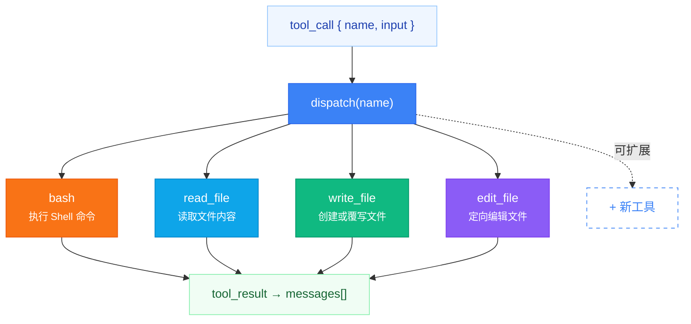

工具调用通过名称路由到对应的处理函数，新增工具只需在分发表中添加一个条目，主循环代码无需改动。

```mermaid
graph TD
    REQ["tool_call { name, input }"] --> DISPATCH["dispatch(name)"]
    DISPATCH --> BASH["bash<br/><small>执行 Shell 命令</small>"]
    DISPATCH --> READ["read_file<br/><small>读取文件内容</small>"]
    DISPATCH --> WRITE["write_file<br/><small>创建或覆写文件</small>"]
    DISPATCH --> EDIT["edit_file<br/><small>定向编辑文件</small>"]
    DISPATCH -.->|可扩展| MORE["+ 新工具"]
    BASH --> RES["tool_result → messages[]"]
    READ --> RES
    WRITE --> RES
    EDIT --> RES

    style DISPATCH fill:#3b82f6,stroke:#2563eb,color:#fff
    style BASH fill:#f97316,stroke:#ea580c,color:#fff
    style READ fill:#0ea5e9,stroke:#0284c7,color:#fff
    style WRITE fill:#10b981,stroke:#059669,color:#fff
    style EDIT fill:#8b5cf6,stroke:#7c3aed,color:#fff
    style MORE fill:none,stroke:#3b82f6,stroke-dasharray:5 5,color:#3b82f6
    style REQ fill:#eff6ff,stroke:#93c5fd,color:#1e40af
    style RES fill:#f0fdf4,stroke:#86efac,color:#166534
```
