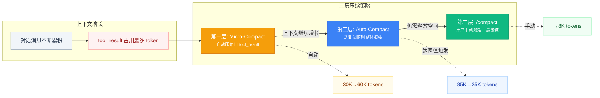

上下文窗口随对话增长不断填满，Claude Code 通过三层递进式压缩策略实现"无限会话"。

```mermaid
graph LR
    subgraph 上下文增长
        A["对话消息不断累积"] --> B["tool_result 占用最多 token"]
    end

    B --> S1

    subgraph 三层压缩策略
        S1["第一层: Micro-Compact<br/><small>自动压缩旧 tool_result</small>"]
        S1 -->|"上下文继续增长"| S2["第二层: Auto-Compact<br/><small>达到阈值时整体摘要</small>"]
        S2 -->|"仍需释放空间"| S3["第三层: /compact<br/><small>用户手动触发，最激进</small>"]
    end

    S1 -.->|"自动"| T1["30K→60K tokens"]
    S2 -.->|"达阈值触发"| T2["85K→25K tokens"]
    S3 -.->|"手动"| T3["→8K tokens"]

    style S1 fill:#f59e0b,stroke:#d97706,color:#fff
    style S2 fill:#3b82f6,stroke:#2563eb,color:#fff
    style S3 fill:#10b981,stroke:#059669,color:#fff
    style A fill:#f1f5f9,stroke:#94a3b8,color:#334155
    style B fill:#fef2f2,stroke:#fca5a5,color:#991b1b
    style T1 fill:#fffbeb,stroke:#fcd34d,color:#92400e
    style T2 fill:#eff6ff,stroke:#93c5fd,color:#1e40af
    style T3 fill:#f0fdf4,stroke:#86efac,color:#166534
```
