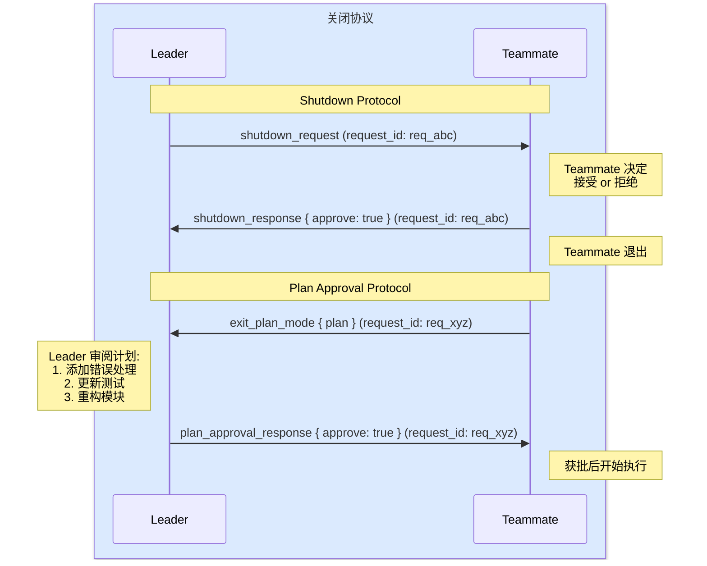

团队协议通过结构化消息交换实现 Leader 与 Teammate 之间的协调，每条消息通过 `request_id` 关联请求与响应。

```mermaid
sequenceDiagram
    box rgb(219,234,254) 关闭协议
    participant L as Leader
    participant T as Teammate
    end

    Note over L,T: Shutdown Protocol
    L->>T: shutdown_request (request_id: req_abc)
    Note right of T: Teammate 决定<br/>接受 or 拒绝
    T->>L: shutdown_response { approve: true } (request_id: req_abc)
    Note right of T: Teammate 退出

    Note over L,T: Plan Approval Protocol
    T->>L: exit_plan_mode { plan } (request_id: req_xyz)
    Note left of L: Leader 审阅计划:<br/>1. 添加错误处理<br/>2. 更新测试<br/>3. 重构模块
    L->>T: plan_approval_response { approve: true } (request_id: req_xyz)
    Note right of T: 获批后开始执行
```
