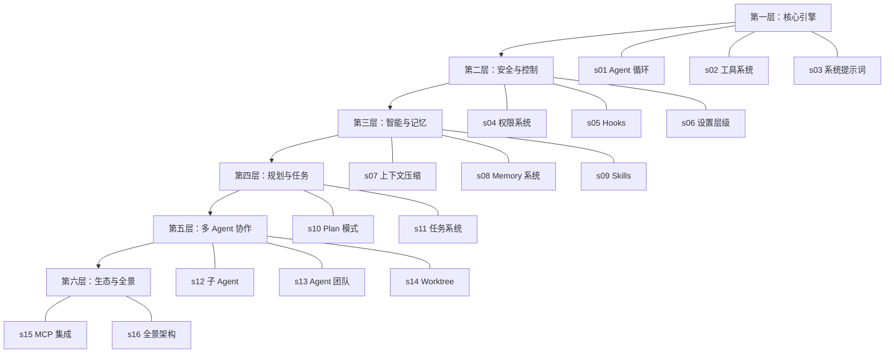

# 学习路径

> 从 Agent 循环到多 Agent 协作，每次只加一个机制

## 这是什么

这是一份基于 Claude Code v2.1.88 真实源码的架构解读教程。面向 **Agent 开发者**，帮助你理解当前第一梯队 AI Agent 的工程架构，并将这些设计思想用于自己的 agent 开发。

**不是使用教程**——不教你怎么用 Claude Code，而是教你它是怎么建的，以及为什么这样建。

## 教程特色

- **Python 伪代码**：每课附 Python 参考实现，无需 TypeScript 基础
- **源码映射**：每个概念标注真实源码路径，可自行深入
- **设计决策**：对比 OpenCode / Cursor 的不同工程选择，理解 trade-off
- **Harness 优势**：揭示同样模型下 Claude Code 表现更好的工程原因

## 六层架构

## 课程总览

| 课 | 标题 | Motto | 关键源码 |
|:---|:-----|:------|:---------|
| s01 | [Agent 循环](./s01-agent-loop) | One loop is all you need | `QueryEngine.ts`, `query.ts` |
| s02 | [工具系统](./s02-tools) | Tools are the hands of the agent | `src/tools/`, `commands.ts` |
| s03 | [系统提示词](./s03-system-prompt) | Every token has a price tag | `context.ts`, `claude.ts` |
| s04 | [权限系统](./s04-permissions) | Trust, but verify | `utils/permissions/` |
| s05 | [Hooks](./s05-hooks) | Don't just react, automate | `utils/hooks/` |
| s06 | [设置层级](./s06-settings) | Configuration is a contract | `utils/settings/` |
| s07 | [上下文压缩](./s07-compact) | Forget wisely, remember what matters | `services/compact/` |
| s08 | [Memory 系统](./s08-memory) | An agent without memory is a stranger | `memdir/` |
| s09 | [Skills](./s09-skills) | Know what's available; load how on demand | `skills/` |
| s10 | [Plan 模式](./s10-plan-mode) | Measure twice, cut once | `EnterPlanModeTool/` |
| s11 | [任务系统](./s11-tasks) | Plan the work, work the plan | `tasks/` |
| s12 | [子 Agent](./s12-subagents) | Clean context per subtask | `tools/AgentTool/` |
| s13 | [Agent 团队](./s13-teams) | More than the sum of its agents | `TeamCreateTool/` |
| s14 | [Worktree](./s14-worktree) | Tasks manage WHAT, worktrees manage WHERE | `utils/worktree.ts` |
| s15 | [MCP 集成](./s15-mcp) | Only as powerful as the tools it can reach | `services/mcp/` |
| s16 | [全景架构](./s16-architecture) | See the forest, then the trees | `cli.tsx`, `main.tsx` |

## 学习建议

1. **按层推进**：每层解决一类问题，层内的课程有内在联系
2. **先读伪代码**：Python 伪代码能快速建立心智模型，再看源码映射深入
3. **关注设计决策**：这是本教程最有价值的部分——不仅知道"怎么做"，更知道"为什么"
4. **动手试试**：每课末尾有练习建议，建议用 Python 实现一遍

## 前置知识

- Python 编程基础
- 了解 LLM API 调用（如 OpenAI/Anthropic API 的 messages 格式）
- 基本的 git 操作
- 不需要 TypeScript 基础（但能读更好）
