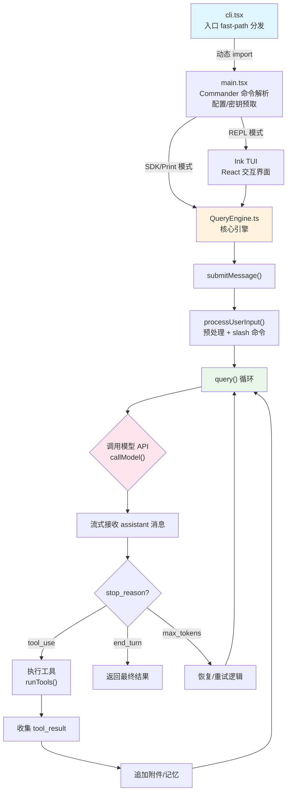

# s01 — Agent 循环：一切的起点

> "One loop is all you need"

::: info Key Takeaways
- **核心循环惊人地简单** — `while(true) { call_model() → if tool_use → execute → loop }` 不到 30 行
- **复杂度不在循环本身，而在循环之外** — 99% 的代码是 Harness（权限、压缩、持久化...）
- **双模式架构** — REPL（人类交互）和 SDK（程序集成）共享同一个 QueryEngine 核心
- **流式处理** — AsyncGenerator 实现从 API 到 UI 的全链路流式传输
:::

## 问题

一个 AI 编程助手的核心运转机制是什么？

当你在终端输入 `claude` 并开始与它对话时，背后发生了什么？Claude Code 不是一个简单的 "发送请求-接收回复" 的聊天工具。它是一个 **agent** -- 一个能自主决策、调用工具、持续行动直到任务完成的智能体。这一切的核心，是一个不断旋转的循环：发送消息给模型，模型决定调用工具还是回复用户，执行工具后把结果喂回模型，如此往复。

这节课我们将拆解这个循环的完整调用链：从 CLI 入口到消息循环的每一步，理解 Claude Code 如何在 30 行核心逻辑上构建出一个强大的编程助手。

## 架构图



## 核心机制

### 1. 入口调用链：从命令行到引擎

Claude Code 的启动路径经过精心设计，采用了 **fast-path 分发** 模式：

`cli.tsx` 是整个程序的入口。它不会一次性加载所有模块，而是根据命令行参数快速分流：

```
cli.tsx → 检查 --version → 立即返回（零模块加载）
cli.tsx → 检查 --bare → 设置简化模式
cli.tsx → 其他路径 → 动态 import main.tsx → cliMain()
```

**源码路径**: `src/entrypoints/cli.tsx`

这种设计让 `claude --version` 的响应时间接近零 -- 不需要加载 React、Ink、API 客户端等重量级依赖。所有 import 都是 `await import(...)` 动态导入。

`main.tsx` 负责 Commander 命令行解析、配置加载、密钥验证等初始化工作。它是一个 4600+ 行的大文件，但核心逻辑可以概括为：解析参数 → 初始化配置 → 获取工具列表 → 启动 REPL 或 Print 模式。

**源码路径**: `src/main.tsx`

### 2. 双模式架构：REPL vs SDK

Claude Code 有两种运行模式，共享同一个核心引擎：

**REPL 模式**（面向人类）：
- 使用 React + Ink 渲染终端 TUI（文本用户界面）
- 支持流式显示、语法高亮、进度指示器
- 用户可以中断操作、查看历史、切换上下文
- 消息列表完整保留用于 UI 滚动

**SDK/Print 模式**（面向集成）：
- 通过 `claude -p "prompt"` 或 JSON stream 调用
- 输出 JSON 格式的 SDKMessage 流
- 适用于 IDE 插件、CI/CD 管道、编程调用
- 内存优化：compact 后释放旧消息

两种模式都使用 `QueryEngine` 类作为核心引擎：

**源码路径**: `src/QueryEngine.ts`

```typescript
// QueryEngine 是 agent 循环的载体
export class QueryEngine {
  private mutableMessages: Message[]    // 消息列表 -- agent 的"记忆"
  private abortController: AbortController  // 中断控制
  private totalUsage: NonNullableUsage  // token 用量追踪
  
  async *submitMessage(prompt): AsyncGenerator<SDKMessage> {
    // 这是 agent 一轮对话的入口
  }
}
```

### 3. 消息循环：while(true) 的力量

真正的 agent 循环藏在 `query.ts` 的 `queryLoop()` 函数中。它是一个 `while(true)` 无限循环，每次迭代执行一个完整的 "思考-行动" 周期：

**源码路径**: `src/query.ts` -- `queryLoop()` 函数

```typescript
// 简化的核心循环结构
while (true) {
  // 1. 预处理：压缩历史、管理 token 预算
  messagesForQuery = applyToolResultBudget(messagesForQuery)
  
  // 2. 调用模型 API（流式）
  for await (const message of callModel({ messages, systemPrompt, tools })) {
    if (message.type === 'assistant') {
      // 收集助手消息和工具调用
      assistantMessages.push(message)
      if (hasToolUse(message)) needsFollowUp = true
    }
  }
  
  // 3. 判断是否需要继续
  if (!needsFollowUp) {
    // 没有工具调用 → 处理 stop hooks → 返回结果
    return { reason: 'completed' }
  }
  
  // 4. 执行工具并收集结果
  for await (const update of runTools(toolUseBlocks, ...)) {
    toolResults.push(update.message)
  }
  
  // 5. 追加附件（文件变更通知、记忆等）
  for await (const attachment of getAttachmentMessages(...)) {
    toolResults.push(attachment)
  }
  
  // 6. 组装下一轮消息，继续循环
  state.messages = [...messagesForQuery, ...assistantMessages, ...toolResults]
}
```

这个循环的退出条件有几种：
- **正常完成**：模型回复文本（无工具调用），`stop_reason === 'end_turn'`
- **达到最大轮数**：`maxTurns` 限制
- **预算耗尽**：`maxBudgetUsd` 限制
- **用户中断**：`abortController.signal.aborted`
- **API 错误**：不可恢复的错误

### 4. 启动优化：并发预取

Claude Code 在启动时大量使用并发来减少等待时间：

```typescript
// QueryEngine.submitMessage() 中的并发预取
const [defaultSystemPrompt, userContext, systemContext] = await Promise.all([
  getSystemPrompt(tools, mainLoopModel, ...),  // 构建系统提示词
  getUserContext(),                              // 加载 CLAUDE.md
  getSystemContext(),                            // 获取 git 状态
])

// context.ts 中 git 信息的并发获取
const [branch, mainBranch, status, log, userName] = await Promise.all([
  getBranch(),
  getDefaultBranch(),
  exec('git status --short'),
  exec('git log --oneline -n 5'),
  exec('git config user.name'),
])
```

**源码路径**: `src/context.ts` -- `getGitStatus()`, `getUserContext()`, `getSystemContext()`

### 5. 消息列表：Agent 的记忆

整个 agent 循环的状态通过一个 `Message[]` 数组维持。每条消息有明确的类型：

- `user` -- 用户输入或工具执行结果 (`tool_result`)
- `assistant` -- 模型的回复（可能包含文本、`tool_use`、`thinking`）
- `system` -- 系统消息（compact 边界、API 错误、警告）
- `attachment` -- 附件（文件变更、记忆、结构化输出）
- `progress` -- 工具执行进度

消息列表随循环不断累积。当上下文窗口接近容量限制时，自动压缩（auto-compact）机制会触发，将历史消息总结为简短摘要，释放 token 空间。

## Python 伪代码

```python
"""
Claude Code Agent Loop -- 最小可理解实现
真实代码在 src/QueryEngine.ts + src/query.ts
"""
import anthropic
from dataclasses import dataclass, field
from typing import Any, Generator

# --- 消息类型 ---
@dataclass
class Message:
    role: str           # "user" | "assistant" | "system"
    content: Any        # 文本或 content blocks
    tool_use_id: str = None
    tool_results: list = None

# --- QueryEngine: 核心引擎 ---
class QueryEngine:
    """
    一个 QueryEngine 实例对应一次会话。
    每次 submit_message() 启动一个新的 agent turn。
    状态（消息、用量）跨 turn 持久化。
    对应 src/QueryEngine.ts
    """
    def __init__(self, config: dict):
        self.client = anthropic.Anthropic()
        self.messages: list[Message] = []
        self.tools = config.get("tools", [])
        self.system_prompt = config.get("system_prompt", "")
        self.max_turns = config.get("max_turns", 10)
        self.total_usage = {"input_tokens": 0, "output_tokens": 0}
    
    def submit_message(self, prompt: str) -> Generator[dict, None, None]:
        """
        处理一次用户输入，驱动 agent 循环直到完成。
        对应 QueryEngine.submitMessage()
        """
        # 1. 预处理用户输入（slash 命令、附件等）
        user_messages = process_user_input(prompt)
        self.messages.extend(user_messages)
        
        # 2. 构建系统提示词（并发获取各部分）
        system_prompt = build_system_prompt(
            base_prompt=self.system_prompt,
            user_context=get_user_context(),    # CLAUDE.md
            system_context=get_system_context(), # git status
        )
        
        # 3. 进入 agent 循环
        yield from self._query_loop(system_prompt)
    
    def _query_loop(self, system_prompt: str) -> Generator[dict, None, None]:
        """
        核心循环：思考 → 行动 → 观察 → 重复
        对应 src/query.ts 的 queryLoop()
        """
        turn_count = 0
        
        while True:
            turn_count += 1
            
            # 检查轮次限制
            if turn_count > self.max_turns:
                yield {"type": "error", "reason": "max_turns_reached"}
                return
            
            # --- Step 1: 调用模型 ---
            messages_for_api = self._prepare_messages()
            
            response = self.client.messages.create(
                model="claude-sonnet-4-20250514",
                max_tokens=16384,
                system=system_prompt,
                messages=messages_for_api,
                tools=self._get_tool_schemas(),
                stream=True,  # 流式响应
            )
            
            # --- Step 2: 流式处理响应 ---
            assistant_content = []
            tool_use_blocks = []
            
            for event in response:
                if event.type == "content_block_delta":
                    # 流式输出文本
                    yield {"type": "stream", "content": event.delta}
                elif event.type == "content_block_stop":
                    block = event.content_block
                    assistant_content.append(block)
                    if block.type == "tool_use":
                        tool_use_blocks.append(block)
                elif event.type == "message_delta":
                    # 更新 usage
                    self.total_usage["input_tokens"] += event.usage.input_tokens
                    self.total_usage["output_tokens"] += event.usage.output_tokens
            
            # 保存助手消息
            assistant_msg = Message(role="assistant", content=assistant_content)
            self.messages.append(assistant_msg)
            yield {"type": "assistant", "message": assistant_msg}
            
            # --- Step 3: 判断是否需要执行工具 ---
            if not tool_use_blocks:
                # 没有工具调用 → agent 认为任务完成
                yield {"type": "result", "status": "success"}
                return
            
            # --- Step 4: 执行工具 ---
            tool_results = []
            for tool_block in tool_use_blocks:
                result = self._execute_tool(
                    name=tool_block.name,
                    input=tool_block.input,
                    tool_use_id=tool_block.id,
                )
                tool_results.append(result)
                yield {"type": "tool_result", "result": result}
            
            # 将工具结果作为 user 消息追加
            result_message = Message(
                role="user",
                content=[{
                    "type": "tool_result",
                    "tool_use_id": r["tool_use_id"],
                    "content": r["output"],
                } for r in tool_results],
            )
            self.messages.append(result_message)
            
            # --- Step 5: 追加上下文附件 ---
            attachments = get_attachment_messages(self.messages, tool_use_blocks)
            self.messages.extend(attachments)
            
            # 回到循环顶部，继续下一轮
    
    def _prepare_messages(self) -> list[dict]:
        """准备发送给 API 的消息列表"""
        # 检查是否需要自动压缩
        if self._should_auto_compact():
            self.messages = self._compact_messages()
        
        return [{"role": m.role, "content": m.content} for m in self.messages]
    
    def _execute_tool(self, name: str, input: dict, tool_use_id: str) -> dict:
        """分发并执行工具调用（详见 s02）"""
        tool = find_tool(self.tools, name)
        if tool is None:
            return {"tool_use_id": tool_use_id, "output": f"Tool {name} not found", "is_error": True}
        
        # 权限检查
        permission = tool.check_permissions(input)
        if not permission.allowed:
            return {"tool_use_id": tool_use_id, "output": permission.reason, "is_error": True}
        
        # 执行
        result = tool.call(input)
        return {"tool_use_id": tool_use_id, "output": result, "is_error": False}
    
    def _get_tool_schemas(self) -> list[dict]:
        """获取工具的 JSON Schema 描述"""
        return [t.schema for t in self.tools]
    
    def _should_auto_compact(self) -> bool:
        """检查是否需要自动压缩历史消息"""
        estimated_tokens = sum(len(str(m.content)) // 4 for m in self.messages)
        return estimated_tokens > 100_000  # 阈值
    
    def _compact_messages(self) -> list[Message]:
        """将历史消息压缩为摘要"""
        # 简化实现 -- 真实代码见 src/services/compact/
        summary = self.client.messages.create(
            model="claude-haiku-4-5-20251001",
            messages=[{"role": "user", "content": f"Summarize: {self.messages}"}],
        )
        return [Message(role="user", content=summary.content[0].text)]


# --- 辅助函数 ---
def process_user_input(prompt: str) -> list[Message]:
    """预处理用户输入：处理 slash 命令、文件附件等"""
    if prompt.startswith("/"):
        return handle_slash_command(prompt)
    return [Message(role="user", content=prompt)]

def get_user_context() -> str:
    """加载 CLAUDE.md 配置文件"""
    # 真实代码: src/context.ts getUserContext()
    return read_file_if_exists(".claude/CLAUDE.md") or ""

def get_system_context() -> str:
    """获取 git 状态等环境信息"""
    # 真实代码: src/context.ts getSystemContext()
    import subprocess
    branch = subprocess.check_output(["git", "branch", "--show-current"]).decode().strip()
    status = subprocess.check_output(["git", "status", "--short"]).decode().strip()
    return f"Branch: {branch}\nStatus:\n{status}"

def build_system_prompt(base_prompt: str, user_context: str, system_context: str) -> str:
    """组装完整系统提示词（详见 s03）"""
    parts = [base_prompt]
    if user_context:
        parts.append(f"# User Configuration\n{user_context}")
    if system_context:
        parts.append(f"# Environment\n{system_context}")
    return "\n\n".join(parts)


# --- 入口 ---
def main():
    """
    CLI 入口
    对应 src/entrypoints/cli.tsx → src/main.tsx
    """
    import sys
    
    # Fast-path: --version
    if "--version" in sys.argv:
        print("1.0.0 (Claude Code)")
        return
    
    # 获取用户输入
    prompt = " ".join(sys.argv[1:]) if len(sys.argv) > 1 else input("> ")
    
    # 创建引擎
    engine = QueryEngine({
        "tools": load_all_tools(),  # 详见 s02
        "system_prompt": "You are Claude Code, an AI programming assistant.",
        "max_turns": 10,
    })
    
    # 运行 agent 循环
    for event in engine.submit_message(prompt):
        if event["type"] == "stream":
            print(event["content"], end="", flush=True)
        elif event["type"] == "result":
            print(f"\n[Done: {event['status']}]")


if __name__ == "__main__":
    main()
```

## 源码映射

| 概念 | 真实源码路径 | 说明 |
|------|-------------|------|
| CLI 入口 | `src/entrypoints/cli.tsx` | fast-path 分发，动态 import 最小化启动时间 |
| 主函数 | `src/main.tsx` | Commander 参数解析、配置初始化、模式选择 |
| 核心引擎 | `src/QueryEngine.ts` | `QueryEngine` 类，管理会话状态和消息生命周期 |
| Agent 循环 | `src/query.ts` | `queryLoop()` -- while(true) 核心循环 |
| 用户输入处理 | `src/utils/processUserInput/` | slash 命令、附件、模型切换 |
| 上下文获取 | `src/context.ts` | `getUserContext()`, `getSystemContext()`, git 信息 |
| 系统提示词构建 | `src/utils/queryContext.ts` | `fetchSystemPromptParts()` 并发获取三大部分 |
| 工具执行 | `src/services/tools/toolOrchestration.ts` | `runTools()` 并发/串行执行 |
| 消息类型 | `src/types/message.ts` | `Message` 联合类型定义 |
| 自动压缩 | `src/services/compact/autoCompact.ts` | token 超限时自动触发 |
| 流式 API 调用 | `src/services/api/claude.ts` | 封装 Anthropic API 流式调用 |

## 设计决策

### 为什么 CLI 用 React (Ink)？

这是一个看似奇怪的选择 -- 终端程序为什么需要 React？答案是 **流式更新 + 并发状态管理**。

Agent 的 TUI 需要同时显示：流式输出的文本、工具执行进度、权限确认对话框、token 用量统计。这些 UI 元素在不同时机独立更新。React 的声明式渲染和状态管理完美匹配这个需求 -- Ink 只是把渲染目标从 DOM 换成了终端。

如果用传统的命令式终端输出（`console.log`），管理这些并发状态将是一场噩梦。

### 为什么分 REPL/SDK 两种模式？

这是为了 **IDE 嵌入和自动化**。VS Code 扩展、JetBrains 插件、CI 脚本都需要以编程方式调用 Claude Code。SDK 模式输出结构化的 JSON 流，让这些集成方可以精确解析每个事件。

`QueryEngine` 类的引入正是为了统一两种模式的核心逻辑，避免代码重复。

### Harness 优势："苦涩教训" 哲学

Claude Code 团队践行 Boris Cherny 提出的 "苦涩教训"（The Bitter Lesson）哲学：**每次新模型发布，删掉一半 prompt**。

这与 Cursor 等竞品形成鲜明对比：

- **Claude Code**: 主动推理（proactive reasoning）-- 给模型最少的指令，让它自己决定如何行动。核心循环极简，复杂性交给模型。
- **Cursor**: 被动 RAG 检索 -- 预先检索大量上下文塞给模型，用复杂的工程弥补模型能力。

这种哲学意味着 Claude Code 的 harness 代码（即 agent 框架代码）可以随着模型进步而简化，而非越来越复杂。当 Claude 5 发布时，可能又有一半的提示词可以删掉 -- 因为模型本身已经学会了那些行为。

### 为什么用 AsyncGenerator？

`query()` 和 `submitMessage()` 都返回 `AsyncGenerator`。这不是偶然 -- generator 模式让消费方可以：

1. **背压控制**：消费方按需拉取消息，不会被洪水般的事件淹没
2. **延迟计算**：只在需要时执行下一步，节省资源
3. **中断友好**：generator 可以随时通过 `.return()` 中止
4. **流式兼容**：完美配合 SSE、WebSocket 等流式传输协议

## 动手试试

### 练习 1：30 行最小 Agent Loop

用 Python 和 Anthropic SDK 实现一个最小的 agent loop。要求：
- 支持多轮工具调用（至少支持一个 "读文件" 工具）
- 当模型不再调用工具时自动停止
- 控制台输出每轮的 token 用量

```python
import anthropic

client = anthropic.Anthropic()
tools = [{
    "name": "read_file",
    "description": "Read contents of a file",
    "input_schema": {
        "type": "object",
        "properties": {"path": {"type": "string"}},
        "required": ["path"],
    },
}]

messages = [{"role": "user", "content": "Read and summarize pyproject.toml"}]

while True:
    resp = client.messages.create(
        model="claude-sonnet-4-20250514", max_tokens=4096,
        tools=tools, messages=messages,
    )
    print(f"[Tokens: in={resp.usage.input_tokens} out={resp.usage.output_tokens}]")
    messages.append({"role": "assistant", "content": resp.content})
    
    tool_uses = [b for b in resp.content if b.type == "tool_use"]
    if not tool_uses:
        # 打印最终文本
        print(next(b.text for b in resp.content if b.type == "text"))
        break
    
    # 执行工具并追加结果
    results = []
    for tu in tool_uses:
        try:
            content = open(tu.input["path"]).read()
        except Exception as e:
            content = str(e)
        results.append({"type": "tool_result", "tool_use_id": tu.id, "content": content})
    messages.append({"role": "user", "content": results})
```

### 练习 2：对比 REPL 和 SDK 输出

运行 Claude Code 的两种模式，观察输出差异：

```bash
# REPL 模式（交互）
claude

# SDK 模式（非交互，JSON 输出）
claude -p "What files are in this directory?" --output-format stream-json 2>/dev/null | head -20
```

对比 SDK 的 JSON 事件流与 REPL 的渲染输出，理解 `QueryEngine` 如何统一两种模式。

### 练习 3：追踪一次完整的 Agent Turn

在 Claude Code 中执行一个需要工具调用的任务（比如 "读取 package.json 并告诉我项目名称"），然后检查会话日志：

```bash
# 查看最近的会话记录
ls -la ~/.claude/projects/*/sessions/*.jsonl | tail -5

# 用 jq 解析消息类型
cat <session-file>.jsonl | jq -r '.type' | sort | uniq -c | sort -rn
```

观察 `user → assistant → user(tool_result) → assistant` 的消息交替模式，这就是 agent 循环的物证。

## 推荐阅读

- [The Unreasonable Effectiveness of an LLM Agent Loop](https://sketch.dev/blog/agent-loop) — 核心循环为什么如此简单却有效
- [AWS re:Invent: What Anthropic Learned Building AI Agents](https://dev.to/) — 构建 Agent 的大部分时间花在 context engineering 上
- [Stop Debugging Your Agent as One Loop. It's Three.](https://medium.com/) — Agent 实际是三层嵌套循环：规划/执行/工具调用
