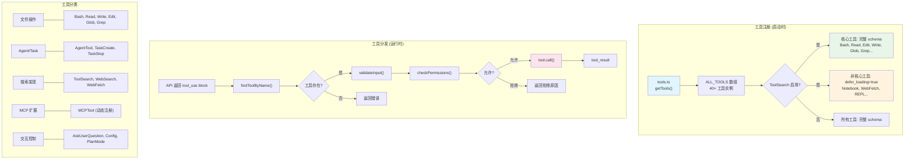

# s02 — 工具系统：注册、分发与执行

> "Tools are the hands of the agent" · 预计阅读 20 分钟

**核心洞察：6 个核心工具覆盖 90% 场景，其余 34 个按需加载——工具系统的设计哲学是"少即是多"。**

::: info Key Takeaways
- **最小可用工具集** — Bash + Read + Write + Edit + Grep + Glob 就能完成绝大多数编码任务
- **延迟加载** — 工具描述分两层注入：名称进 system prompt，完整描述按需加载，节省 token
- **并发安全标记** — 每个工具声明 `isConcurrencySafe()`，读操作可并行，写操作串行
- **fail-closed 原则** — 工具默认不可用，必须显式启用
:::

## 问题

40+ 工具如何注册、分发、执行？工具多了怎么省 token？

Agent 的能力完全取决于它能调用什么工具。Claude Code 内置了文件读写、shell 执行、代码搜索、Web 访问、MCP 扩展等 40+ 种工具。但问题来了：

- 每个工具的 schema 描述都要发送给 API，40+ 个工具的 schema 可能消耗数千 token
- 如何统一管理工具的权限检查、输入验证、并发控制？
- 如何让模型在需要时才 "看到" 非核心工具，而不是一开始就塞满上下文？

这节课我们拆解 Claude Code 的工具系统：从 `Tool` 接口到 `ToolSearch` 延迟加载，理解一个生产级 agent 如何在灵活性和效率之间取得平衡。

## 架构图




## 核心机制

### 1. Tool 接口：每个工具的契约

Claude Code 中每个工具都遵循统一的 `Tool` 接口。这个接口定义了工具的全部行为契约：

**源码路径**: `src/Tool.ts`

```typescript
export type Tool = {
  name: string                    // 工具名称，如 "Bash", "Read"
  description(input): string      // 动态描述（可以基于输入变化）
  inputSchema: ZodSchema          // Zod 输入验证 schema
  maxResultSizeChars: number      // 结果最大字符数
  
  // --- 行为控制 ---
  call(args, context): ToolResult         // 核心执行逻辑
  validateInput(input, context): boolean  // 输入合法性校验
  checkPermissions(input, context): PermissionResult  // 权限判定
  
  // --- 元信息 ---
  isEnabled(): boolean            // 是否启用
  isConcurrencySafe(input): boolean  // 是否可以并发执行
  isReadOnly(input): boolean      // 是否只读操作
  isDestructive(input): boolean   // 是否破坏性操作
  shouldDefer?: boolean           // 是否延迟加载（ToolSearch）
  
  // --- 可选 ---
  aliases?: string[]              // 别名（重命名时的向后兼容）
  searchHint?: string             // ToolSearch 搜索关键词
  interruptBehavior?(): 'cancel' | 'block'  // 用户中断时的行为
}
```

关键设计点：

- **`isConcurrencySafe()`**: 告诉框架这个工具是否可以与其他工具并发执行。文件读取通常安全，文件写入通常不安全（可能竞态）。
- **`isReadOnly()`**: 影响权限判定 -- 只读操作通常不需要用户确认。
- **`isDestructive()`**: 标记不可逆操作（删除、覆盖），需要更严格的权限控制。
- **`maxResultSizeChars`**: 防止工具返回巨大结果炸掉上下文。超限时结果被持久化到磁盘，模型只看到摘要。

### 2. buildTool：工厂函数与安全默认值

工具实例不是直接 new 出来的，而是通过 `buildTool()` 工厂函数创建。这个函数的核心价值是 **fail-closed 默认值**：

**源码路径**: `src/Tool.ts` -- `buildTool()`

```typescript
const TOOL_DEFAULTS = {
  isEnabled: () => true,
  isConcurrencySafe: () => false,   // 默认不安全 → 串行执行
  isReadOnly: () => false,           // 默认非只读 → 需要权限
  isDestructive: () => false,
  checkPermissions: (input) =>       // 默认允许 → 交给通用权限系统
    Promise.resolve({ behavior: 'allow', updatedInput: input }),
}

export function buildTool(def) {
  return { ...TOOL_DEFAULTS, userFacingName: () => def.name, ...def }
}
```

这意味着新写一个工具时，如果你忘记声明 `isConcurrencySafe`，默认行为是 **不允许并发** -- 这比默认允许然后出现竞态要安全得多。

### 3. 工具注册：中心化数组

Claude Code 的工具注册非常直白 -- 没有复杂的插件系统或依赖注入，就是一个数组：

**源码路径**: `src/tools.ts` -- `getTools()`

```typescript
// 所有内置工具导入并组成数组
import { BashTool } from './tools/BashTool/BashTool.js'
import { FileReadTool } from './tools/FileReadTool/FileReadTool.js'
import { FileWriteTool } from './tools/FileWriteTool/FileWriteTool.js'
import { FileEditTool } from './tools/FileEditTool/FileEditTool.js'
import { GlobTool } from './tools/GlobTool/GlobTool.js'
import { GrepTool } from './tools/GrepTool/GrepTool.js'
// ... 40+ 工具

export function getTools(permissionContext): Tools {
  const ALL_TOOLS = [
    BashTool, FileReadTool, FileWriteTool, FileEditTool,
    GlobTool, GrepTool, AgentTool, ToolSearchTool,
    // ... 更多工具
  ]
  return ALL_TOOLS.filter(t => t.isEnabled())
}
```

没有 registry pattern，没有 service locator -- 就是显式导入 + 数组过滤。简单、可追踪、IDE 友好。

工具的分发也同样简单 -- 通过名称查找：

```typescript
export function findToolByName(tools: Tools, name: string): Tool | undefined {
  return tools.find(t => toolMatchesName(t, name))
}

export function toolMatchesName(tool, name): boolean {
  return tool.name === name || (tool.aliases?.includes(name) ?? false)
}
```

### 4. ToolSearch：延迟加载的 Token 优化

40+ 个工具的 schema 描述可能消耗 2000-5000 token。但大多数对话中，用户只会用到 5-10 个工具。`ToolSearch` 机制解决了这个问题。

**源码路径**: `src/tools/ToolSearchTool/ToolSearchTool.ts` 和 `src/tools/ToolSearchTool/prompt.ts`

工作原理：

1. **启动时分类**：工具被分为 "核心工具" 和 "可延迟工具"
2. **核心工具**（Bash, Read, Write, Edit, Glob, Grep, Agent 等）总是包含完整 schema
3. **非核心工具**（Notebook, WebFetch, REPL 等）标记为 `defer_loading: true`，只发送名称和简短提示
4. **模型按需发现**：当模型需要某个延迟工具时，调用 `ToolSearch` 搜索，框架返回完整 schema

```typescript
// prompt.ts 中的延迟判定逻辑
export function isDeferredTool(tool: Tool): boolean {
  // 永不延迟 ToolSearch 本身 -- 模型需要它来加载其他工具
  if (tool.name === 'ToolSearch') return false
  // Agent 工具必须立即可用
  if (tool.name === 'Agent') return false
  // MCP 工具标记了 alwaysLoad 的不延迟
  if (tool.alwaysLoad) return false
  // 其他工具默认延迟
  return tool.shouldDefer ?? true
}
```

这个设计灵感来自 Vercel 的实验数据：**删掉 80% 的工具后，准确率从 80% 升到 100%，token 减少约 37%，速度快 3.5x**。工具越少，模型越专注。

### 5. 工具执行流水线

当 API 返回 `tool_use` 块后，工具执行经过一个完整的流水线：

**源码路径**: `src/services/tools/toolOrchestration.ts` -- `runTools()`

```
tool_use block
    ↓
findToolByName() -- 查找工具实例
    ↓
validateInput() -- 输入合法性校验（Zod schema）
    ↓
checkPermissions() -- 工具级权限（如 Bash 的命令白名单）
    ↓
canUseTool() -- 全局权限系统（auto/default/plan 模式）
    ↓
tool.call() -- 实际执行
    ↓
结果大小检查 -- 超过 maxResultSizeChars 则持久化到磁盘
    ↓
tool_result -- 返回给模型
```

并发执行方面，Claude Code 引入了 `StreamingToolExecutor`：

**源码路径**: `src/services/tools/StreamingToolExecutor.ts`

```typescript
// 在模型还在流式输出时就开始执行工具
// 前提：工具的 isConcurrencySafe() 返回 true
class StreamingToolExecutor {
  addTool(toolBlock, assistantMessage) {
    // 模型输出一个 tool_use 块就立即开始执行
    // 不等所有块输出完毕
  }
  
  getRemainingResults() {
    // 获取所有完成/待完成的结果
  }
}
```

这意味着如果模型同时调用了 Glob 和 Grep（都是只读的），它们可以并发执行，而不必等一个完成再启动下一个。

### 6. 工具分类与真实示例

以 BashTool 为例，看一个完整工具的结构：

**源码路径**: `src/tools/BashTool/BashTool.tsx`

```typescript
export const BashTool = buildTool({
  name: BASH_TOOL_NAME,  // "Bash"
  
  inputSchema: z.object({
    command: z.string(),
    timeout: z.number().optional(),
    description: z.string().optional(),
  }),
  
  maxResultSizeChars: 30_000,
  
  isConcurrencySafe: (input) => {
    // 只有只读命令才安全并发
    return isReadOnlyCommand(input.command)
  },
  
  isReadOnly: (input) => isReadOnlyCommand(input.command),
  
  async call(args, context) {
    const result = await exec(args.command, { timeout: args.timeout })
    return { data: formatResult(result) }
  },
  
  async checkPermissions(input, context) {
    // Bash 有自己的权限规则：命令白名单、路径限制等
    return bashToolHasPermission(input, context)
  },
})
```

Claude Code 的工具大致分为以下几类：

| 类别 | 工具 | 特点 |
|------|------|------|
| 文件操作 | Bash, Read, Write, Edit, Glob, Grep | 最常用，核心工具集 |
| Agent/Task | AgentTool, TaskCreate/Stop/Get | 子 agent 派发和任务管理 |
| 搜索发现 | ToolSearch, WebSearch, WebFetch | 延迟加载，按需发现 |
| 交互控制 | AskUserQuestion, Config, PlanMode | 用户交互和模式切换 |
| MCP 扩展 | MCPTool (动态) | 第三方工具协议 |
| Notebook | NotebookEdit | Jupyter notebook 编辑 |

## Python 伪代码

工具系统的核心设计可以浓缩为三步：

```python
# 工具系统核心逻辑（精简版）
class Tool:
    name: str                        # "Bash", "Read", "Edit"...
    def validate(self, input): ...   # 输入合法性
    def check_permissions(self): ... # deny-by-default
    def call(self, args): ...       # 执行逻辑
    def is_concurrency_safe(self): ...  # 读操作=True, 写操作=False

# 注册: 核心工具完整加载，非核心工具延迟加载
core_tools = [Bash, Read, Write, Edit, Glob, Grep]     # 完整 schema
deferred_tools = [WebFetch, Notebook, ...]              # 名称 only, 按需加载

# 执行: 查找 → 验证 → 权限 → 调用 → 裁剪
def execute(tool_use_block):
    tool = find_tool(tool_use_block.name)    # 1. 查找
    tool.validate(tool_use_block.input)       # 2. 验证
    tool.check_permissions()                  # 3. 权限 (deny-by-default)
    result = tool.call(tool_use_block.input)  # 4. 执行
    return apply_budget(result)               # 5. 结果裁剪 (micro-compact)
```

完整参考实现（含 ToolSearch、并发执行器、工具结果缓存）：

<details>
<summary>展开查看完整 Python 伪代码（471 行）</summary>

```python
"""
Claude Code 工具系统 -- 完整参考实现
真实代码在 src/Tool.ts + src/tools.ts + src/tools/*/
"""
import json
import subprocess
from abc import ABC, abstractmethod
from dataclasses import dataclass, field
from typing import Any, Optional, Callable


# ========== 工具接口 ==========

@dataclass
class PermissionResult:
    allowed: bool
    reason: str = ""
    updated_input: dict = None

@dataclass
class ToolResult:
    data: Any
    is_error: bool = False
    new_messages: list = field(default_factory=list)

class Tool(ABC):
    """
    工具基类 -- 对应 src/Tool.ts 的 Tool 接口
    每个工具必须实现 name, description, input_schema, call
    其余方法有安全的默认值（通过 buildTool 提供）
    """
    
    @property
    @abstractmethod
    def name(self) -> str:
        """工具名称"""
        pass
    
    @property
    @abstractmethod
    def input_schema(self) -> dict:
        """JSON Schema 格式的输入描述"""
        pass
    
    @property
    def max_result_size_chars(self) -> int:
        """结果最大字符数，超过则持久化到磁盘"""
        return 30_000
    
    @abstractmethod
    def description(self, input: dict = None) -> str:
        """工具描述，可以基于输入动态变化"""
        pass
    
    @abstractmethod
    def call(self, args: dict, context: dict = None) -> ToolResult:
        """核心执行逻辑"""
        pass
    
    # --- 默认行为（fail-closed） ---
    
    def is_enabled(self) -> bool:
        """是否启用"""
        return True
    
    def is_concurrency_safe(self, input: dict = None) -> bool:
        """是否可以并发执行。默认 False（安全优先）"""
        return False
    
    def is_read_only(self, input: dict = None) -> bool:
        """是否只读操作。默认 False（需要权限检查）"""
        return False
    
    def is_destructive(self, input: dict = None) -> bool:
        """是否破坏性操作"""
        return False
    
    def should_defer(self) -> bool:
        """是否延迟加载（需要 ToolSearch 发现）"""
        return False
    
    def search_hint(self) -> str:
        """ToolSearch 的搜索关键词"""
        return ""
    
    def validate_input(self, input: dict, context: dict = None) -> tuple[bool, str]:
        """输入验证"""
        return True, ""
    
    def check_permissions(self, input: dict, context: dict = None) -> PermissionResult:
        """权限检查。默认允许（交给通用权限系统）"""
        return PermissionResult(allowed=True, updated_input=input)


# ========== 内置工具实现 ==========

class BashTool(Tool):
    """
    Shell 命令执行工具
    对应 src/tools/BashTool/BashTool.tsx
    """
    
    READ_ONLY_COMMANDS = {"ls", "cat", "head", "tail", "grep", "find", "wc", "echo"}
    
    @property
    def name(self) -> str:
        return "Bash"
    
    @property
    def input_schema(self) -> dict:
        return {
            "type": "object",
            "properties": {
                "command": {"type": "string", "description": "Shell command to execute"},
                "timeout": {"type": "integer", "description": "Timeout in milliseconds"},
                "description": {"type": "string", "description": "What this command does"},
            },
            "required": ["command"],
        }
    
    def description(self, input=None) -> str:
        return "Execute a shell command in the terminal"
    
    def is_concurrency_safe(self, input=None) -> bool:
        if input and "command" in input:
            first_cmd = input["command"].split()[0] if input["command"] else ""
            return first_cmd in self.READ_ONLY_COMMANDS
        return False
    
    def is_read_only(self, input=None) -> bool:
        return self.is_concurrency_safe(input)
    
    def check_permissions(self, input, context=None) -> PermissionResult:
        """Bash 有自己的权限规则：命令白名单、路径限制"""
        command = input.get("command", "")
        # 简化 -- 真实代码有复杂的命令解析和白名单
        dangerous = any(cmd in command for cmd in ["rm -rf", "mkfs", "dd if="])
        if dangerous:
            return PermissionResult(allowed=False, reason=f"Dangerous command: {command}")
        return PermissionResult(allowed=True, updated_input=input)
    
    def call(self, args, context=None) -> ToolResult:
        try:
            timeout_s = (args.get("timeout") or 120_000) / 1000
            result = subprocess.run(
                args["command"], shell=True, capture_output=True,
                text=True, timeout=timeout_s,
            )
            output = result.stdout
            if result.stderr:
                output += f"\nSTDERR:\n{result.stderr}"
            # 截断超长输出
            if len(output) > self.max_result_size_chars:
                output = output[:self.max_result_size_chars] + "\n... (truncated)"
            return ToolResult(data=output)
        except subprocess.TimeoutExpired:
            return ToolResult(data="Command timed out", is_error=True)
        except Exception as e:
            return ToolResult(data=str(e), is_error=True)


class FileReadTool(Tool):
    """
    文件读取工具
    对应 src/tools/FileReadTool/FileReadTool.ts
    """
    
    @property
    def name(self) -> str:
        return "Read"
    
    @property
    def input_schema(self) -> dict:
        return {
            "type": "object",
            "properties": {
                "file_path": {"type": "string", "description": "Absolute path to file"},
                "offset": {"type": "integer", "description": "Line offset to start from"},
                "limit": {"type": "integer", "description": "Number of lines to read"},
            },
            "required": ["file_path"],
        }
    
    @property
    def max_result_size_chars(self) -> int:
        return float('inf')  # Read 工具不持久化（避免循环引用）
    
    def description(self, input=None) -> str:
        return "Read a file's contents"
    
    def is_concurrency_safe(self, input=None) -> bool:
        return True  # 读文件总是安全的
    
    def is_read_only(self, input=None) -> bool:
        return True
    
    def call(self, args, context=None) -> ToolResult:
        try:
            with open(args["file_path"], "r") as f:
                lines = f.readlines()
            offset = args.get("offset", 0)
            limit = args.get("limit", 2000)
            selected = lines[offset:offset + limit]
            # 添加行号（cat -n 格式）
            numbered = [f"{i + offset + 1}\t{line}" for i, line in enumerate(selected)]
            return ToolResult(data="".join(numbered))
        except FileNotFoundError:
            return ToolResult(data=f"File not found: {args['file_path']}", is_error=True)
        except Exception as e:
            return ToolResult(data=str(e), is_error=True)


class FileWriteTool(Tool):
    """文件写入工具 -- 对应 src/tools/FileWriteTool/FileWriteTool.ts"""
    
    @property
    def name(self) -> str:
        return "Write"
    
    @property
    def input_schema(self) -> dict:
        return {
            "type": "object",
            "properties": {
                "file_path": {"type": "string"},
                "content": {"type": "string"},
            },
            "required": ["file_path", "content"],
        }
    
    def description(self, input=None) -> str:
        return "Write content to a file (creates or overwrites)"
    
    def is_destructive(self, input=None) -> bool:
        return True  # 覆盖文件是破坏性操作
    
    def call(self, args, context=None) -> ToolResult:
        try:
            with open(args["file_path"], "w") as f:
                f.write(args["content"])
            return ToolResult(data=f"Wrote {len(args['content'])} chars to {args['file_path']}")
        except Exception as e:
            return ToolResult(data=str(e), is_error=True)


class FileEditTool(Tool):
    """文件编辑工具（精确替换） -- 对应 src/tools/FileEditTool/FileEditTool.ts"""
    
    @property
    def name(self) -> str:
        return "Edit"
    
    @property
    def input_schema(self) -> dict:
        return {
            "type": "object",
            "properties": {
                "file_path": {"type": "string"},
                "old_string": {"type": "string"},
                "new_string": {"type": "string"},
                "replace_all": {"type": "boolean", "default": False},
            },
            "required": ["file_path", "old_string", "new_string"],
        }
    
    def description(self, input=None) -> str:
        return "Make exact string replacements in files"
    
    def call(self, args, context=None) -> ToolResult:
        try:
            with open(args["file_path"], "r") as f:
                content = f.read()
            
            old = args["old_string"]
            if old not in content:
                return ToolResult(data=f"old_string not found in file", is_error=True)
            
            if not args.get("replace_all") and content.count(old) > 1:
                return ToolResult(data=f"old_string is not unique (found {content.count(old)} times)", is_error=True)
            
            if args.get("replace_all"):
                new_content = content.replace(old, args["new_string"])
            else:
                new_content = content.replace(old, args["new_string"], 1)
            
            with open(args["file_path"], "w") as f:
                f.write(new_content)
            
            return ToolResult(data=f"Edited {args['file_path']}")
        except Exception as e:
            return ToolResult(data=str(e), is_error=True)


# ========== 工具注册中心 ==========

class ToolRegistry:
    """
    工具注册和分发中心
    对应 src/tools.ts 的 getTools() + src/Tool.ts 的 findToolByName()
    """
    
    def __init__(self):
        self._tools: list[Tool] = []
    
    def register(self, tool: Tool):
        """注册一个工具"""
        self._tools.append(tool)
    
    def get_enabled_tools(self) -> list[Tool]:
        """获取所有启用的工具"""
        return [t for t in self._tools if t.is_enabled()]
    
    def find_by_name(self, name: str) -> Optional[Tool]:
        """按名称查找工具（支持别名）"""
        for tool in self._tools:
            if tool.name == name:
                return tool
        return None
    
    def get_tool_schemas(self, enable_tool_search: bool = False) -> list[dict]:
        """
        获取工具 schema 列表，供 API 使用。
        当 enable_tool_search=True 时，非核心工具只发送名称。
        """
        schemas = []
        for tool in self.get_enabled_tools():
            if enable_tool_search and tool.should_defer():
                # 延迟加载：只发送名称和提示
                schemas.append({
                    "name": tool.name,
                    "description": f"[Deferred] Use ToolSearch to load. Hint: {tool.search_hint()}",
                    "input_schema": {"type": "object"},
                    "defer_loading": True,
                })
            else:
                schemas.append({
                    "name": tool.name,
                    "description": tool.description(),
                    "input_schema": tool.input_schema,
                })
        return schemas


# ========== 工具执行引擎 ==========

class ToolExecutor:
    """
    工具执行引擎 -- 负责分发、权限检查、并发控制
    对应 src/services/tools/toolOrchestration.ts 的 runTools()
    """
    
    def __init__(self, registry: ToolRegistry):
        self.registry = registry
    
    def execute_tools(self, tool_use_blocks: list[dict]) -> list[dict]:
        """
        执行一批工具调用。
        并发安全的工具并行执行，不安全的串行执行。
        """
        # 分离并发安全和非安全工具
        safe_blocks = []
        unsafe_blocks = []
        
        for block in tool_use_blocks:
            tool = self.registry.find_by_name(block["name"])
            if tool and tool.is_concurrency_safe(block.get("input")):
                safe_blocks.append((block, tool))
            else:
                unsafe_blocks.append((block, tool))
        
        results = []
        
        # 并发安全的工具可以并行执行
        import concurrent.futures
        with concurrent.futures.ThreadPoolExecutor() as executor:
            futures = {
                executor.submit(self._execute_single, block, tool): block
                for block, tool in safe_blocks
            }
            for future in concurrent.futures.as_completed(futures):
                results.append(future.result())
        
        # 非安全的工具串行执行
        for block, tool in unsafe_blocks:
            results.append(self._execute_single(block, tool))
        
        return results
    
    def _execute_single(self, block: dict, tool: Optional[Tool]) -> dict:
        """执行单个工具调用 -- 完整的流水线"""
        tool_use_id = block["id"]
        tool_name = block["name"]
        input_data = block.get("input", {})
        
        # Step 1: 查找工具
        if tool is None:
            return self._error_result(tool_use_id, f"Tool '{tool_name}' not found")
        
        # Step 2: 输入验证
        valid, msg = tool.validate_input(input_data)
        if not valid:
            return self._error_result(tool_use_id, f"Invalid input: {msg}")
        
        # Step 3: 权限检查
        permission = tool.check_permissions(input_data)
        if not permission.allowed:
            return self._error_result(tool_use_id, f"Permission denied: {permission.reason}")
        
        # 使用可能被权限检查修改过的输入
        final_input = permission.updated_input or input_data
        
        # Step 4: 执行
        try:
            result = tool.call(final_input)
        except Exception as e:
            return self._error_result(tool_use_id, f"Execution error: {e}")
        
        # Step 5: 结果大小检查
        output = str(result.data)
        if len(output) > tool.max_result_size_chars:
            # 持久化到磁盘，返回摘要
            path = self._persist_large_result(output)
            output = f"Result too large ({len(output)} chars). Saved to {path}. Preview:\n{output[:500]}"
        
        return {
            "type": "tool_result",
            "tool_use_id": tool_use_id,
            "content": output,
            "is_error": result.is_error,
        }
    
    def _error_result(self, tool_use_id: str, message: str) -> dict:
        return {"type": "tool_result", "tool_use_id": tool_use_id, "content": message, "is_error": True}
    
    def _persist_large_result(self, content: str) -> str:
        """将大结果持久化到临时文件"""
        import tempfile
        f = tempfile.NamedTemporaryFile(mode="w", suffix=".txt", delete=False)
        f.write(content)
        f.close()
        return f.name


# ========== 组装 ==========

def create_default_registry() -> ToolRegistry:
    """创建并注册所有默认工具"""
    registry = ToolRegistry()
    registry.register(BashTool())
    registry.register(FileReadTool())
    registry.register(FileWriteTool())
    registry.register(FileEditTool())
    # 真实代码还会注册 Glob, Grep, Agent, ToolSearch, WebSearch 等 40+ 工具
    return registry


# ========== 使用示例 ==========

if __name__ == "__main__":
    registry = create_default_registry()
    executor = ToolExecutor(registry)
    
    # 模拟 API 返回的 tool_use blocks
    tool_calls = [
        {"id": "tu_1", "name": "Read", "input": {"file_path": "/etc/hostname"}},
        {"id": "tu_2", "name": "Bash", "input": {"command": "echo hello"}},
    ]
    
    results = executor.execute_tools(tool_calls)
    for r in results:
        print(f"[{r['tool_use_id']}] {'ERROR' if r['is_error'] else 'OK'}: {r['content'][:100]}")
```

</details>

## 源码映射

| 概念 | 真实源码路径 | 说明 |
|------|-------------|------|
| Tool 接口 | `src/Tool.ts` | `Tool` 类型定义，包含所有方法签名 |
| buildTool 工厂 | `src/Tool.ts` -- `buildTool()` | fail-closed 默认值，60+ 工具都通过此创建 |
| 工具注册 | `src/tools.ts` -- `getTools()` | 中心化数组，导入所有工具模块 |
| 工具查找 | `src/Tool.ts` -- `findToolByName()` | 按 name 或 alias 查找 |
| BashTool | `src/tools/BashTool/BashTool.tsx` | 最复杂的工具，含命令解析、安全检查、沙箱 |
| FileReadTool | `src/tools/FileReadTool/FileReadTool.ts` | 文件读取，支持 offset/limit |
| FileEditTool | `src/tools/FileEditTool/FileEditTool.ts` | 精确字符串替换 |
| ToolSearch | `src/tools/ToolSearchTool/ToolSearchTool.ts` | 延迟加载的工具发现 |
| 工具延迟判定 | `src/tools/ToolSearchTool/prompt.ts` | `isDeferredTool()` 决策逻辑 |
| 工具执行 | `src/services/tools/toolOrchestration.ts` | `runTools()` 并发/串行分发 |
| 流式执行器 | `src/services/tools/StreamingToolExecutor.ts` | 边流式接收边执行工具 |
| 大结果持久化 | `src/utils/toolResultStorage.ts` | 超限结果存磁盘 |

## 设计决策

### ToolSearch 为什么比全量注入好？

全量注入 40+ 工具 schema 的问题：

1. **Token 浪费**：大多数对话只用 5-10 个工具，其余 30+ 工具的 schema 白白占用上下文
2. **模型困惑**：工具越多，模型越容易选错。Vercel 的实验证实了这一点
3. **启动延迟**：所有工具 schema 都要序列化发送

ToolSearch 的做法是让模型 "先知道有什么可用，需要时再获取详情" -- 类似于一个搜索引擎，而非一本字典。

### isConcurrencySafe() 为什么需要？

考虑这个场景：模型同时调用了 `Edit(file_a)` 和 `Write(file_a)` -- 如果并发执行，最终文件内容取决于哪个先完成，这是经典的竞态条件。

`isConcurrencySafe()` 让每个工具自己声明是否安全。默认值是 `false`（不安全），这意味着：

- `Read` + `Read` → 并发（两个只读操作）
- `Read` + `Write` → 串行（Write 不安全）
- `Write` + `Write` → 串行（都不安全）

这是 fail-closed 设计：宁可慢一点（串行），也不冒竞态的风险。

### Harness 优势：最小工具集原则

Claude Code 的工具哲学与竞品形成鲜明对比：

**Claude Code**: 只提供基础原语（Bash, Read, Write, Edit, Grep, Glob），复杂操作由模型自己组合。比如 "重构所有导入" = Grep 找到所有文件 → Read 逐个读取 → Edit 逐个修改。

**竞品**: 提供高层抽象工具（"重构导入工具"、"代码搜索工具"等），每个操作一个专用工具。

Claude Code 的做法更 robust：

1. **不需要预测用例**：基础原语可以组合出无限种操作
2. **模型进步自动受益**：更聪明的模型能更好地组合基础工具
3. **grep > embedding 搜索**：Claude Code 只用 ripgrep，不用向量搜索。精确匹配比语义搜索更可靠，且零额外基础设施

Vercel 的实验数据是最好的佐证：**删 80% 工具，准确率从 80% 升到 100%**。少即是多。

## Why：设计决策与行业上下文

### Vercel 实验：删 80% 工具，效果反而更好

这是 2025 年最有说服力的工具设计案例。Vercel 团队花了数月构建内部 text-to-SQL agent，配备了专用工具、重度 prompt engineering 和精细的上下文管理。结果 "worked... kind of. But it was fragile, slow, and required constant maintenance." [R2-4]

然后他们做了一个激进决定——**删掉大部分工具，从 15 个精简为 2 个（bash + sandbox）**。结果令人震惊：成功率 80% → **100%**，token 消耗减少约 **37%**（步骤减少约 42%），速度提升 **3.5x** [R2-4][R2-5]。

"The agent got simpler and better at the same time. All by doing less." 这完美解释了为什么 Claude Code 的核心工具只有 6 个。

### Bash 是"皇冠上的宝石"

The New Stack 直接用了 "BASH Is All You Need" 作标题 [R2-6]。bash 提供了一个**完整的行动空间**——与其给模型 20 个专用工具让它选择，不如给一个 bash 让它自己用 `grep`、`cat`、`ls` 组合出解决方案。

但 sketch.dev 也发现少量额外工具能提升质量——**特别是文本编辑工具**，因为 "seeing the LLM struggle with sed one-liners re-affirms that visual editors are a marvel." [R2-1] 这正是 Claude Code 保留 Edit 工具的原因。

### "From the agent's perspective, it's all just tools"

Arcade.dev 揭示了一个被忽略的真相：**"Skills, toolkits, functions, MCP servers: they all end up as options presented to the model."** [R2-7] 对模型而言，skill 和 tool 的分类是给人看的——模型只关心工具描述是否清晰、行动空间是否完整。

### 工具遮蔽而非移除（Manus 的经验）

Manus AI 发现了一个关键优化：**用工具遮蔽（masking）替代工具移除**。动态移除工具会破坏 KV-cache 前缀，导致缓存命中率下降。而遮蔽只是将不可用工具标记为不可选，保持工具列表稳定，从而维持高缓存命中率 [R2-12]。这对 Claude Code 的 ToolSearch 延迟加载机制有直接启示。

> **参考来源：** Vercel [R2-4][R2-5]、sketch.dev [R2-1]、Arcade.dev [R2-7]、Manus [R2-12]。完整引用见 `docs/research/06-agent-architecture-deep-20260401.md`。

---

## 变化表

| 新增概念 | 说明 |
|----------|------|
| Tool 接口 | 工具的统一契约：name, description, call, checkPermissions, isConcurrencySafe 等 |
| buildTool() | 工厂函数，提供 fail-closed 默认值 |
| getTools() | 中心化工具注册，显式导入 + 数组 |
| findToolByName() | 名称/别名查找分发 |
| ToolSearch | 延迟加载机制，非核心工具 defer_loading |
| 工具执行流水线 | validateInput → checkPermissions → call → 结果大小检查 |
| StreamingToolExecutor | 边流式边执行，并发安全的工具并行 |
| maxResultSizeChars | 大结果持久化到磁盘，防止上下文爆炸 |

## 动手试试

### 练习 1：实现 4 个基础工具并集成到 Agent Loop

基于 s01 的 agent loop，实现 Bash、Read、Write、Edit 四个工具。要求：

- 每个工具有 `name`, `input_schema`, `call()` 方法
- 通过工具名称分发调用
- Bash 和 Read 可以并发，Write 和 Edit 必须串行

用上面伪代码中的 `ToolRegistry` + `ToolExecutor` 替换 s01 中简单的 `_execute_tool` 方法。

### 练习 2：实现 ToolSearch

在练习 1 的基础上，新增 3-5 个 "非核心" 工具（比如 WebFetch、NotebookEdit）。实现一个简单的 ToolSearch 机制：

- 初始 API 调用只发送核心工具 schema + 非核心工具的名称列表
- 新增一个 `ToolSearch` 工具，模型调用它时返回指定工具的完整 schema
- 对比全量注入 vs ToolSearch 的 token 消耗

### 练习 3：观察 Claude Code 的工具调用

在 Claude Code 中执行一个复杂任务，观察它如何组合基础工具：

```bash
# 让 Claude Code 做一个需要多工具协作的任务
claude -p "Find all Python files in this directory that import 'os', count them, and list their names"

# 观察它会调用：Bash(find/grep) 或 Glob + Grep + 可能的 Read
# 注意它如何用基础原语组合出复杂操作
```

然后尝试用 `--tools` 参数限制可用工具，看模型如何适应：

```bash
# 只给 Bash 工具
claude -p "Read package.json and tell me the project name" --tools "Bash"

# 只给 Read 工具
claude -p "Read package.json and tell me the project name" --tools "Read"
```

## 推荐阅读

- [Tool Use Patterns: Building Reliable Agent-Tool Interfaces](https://aiagentsblog.com/) — 工具 schema 设计与结果处理
