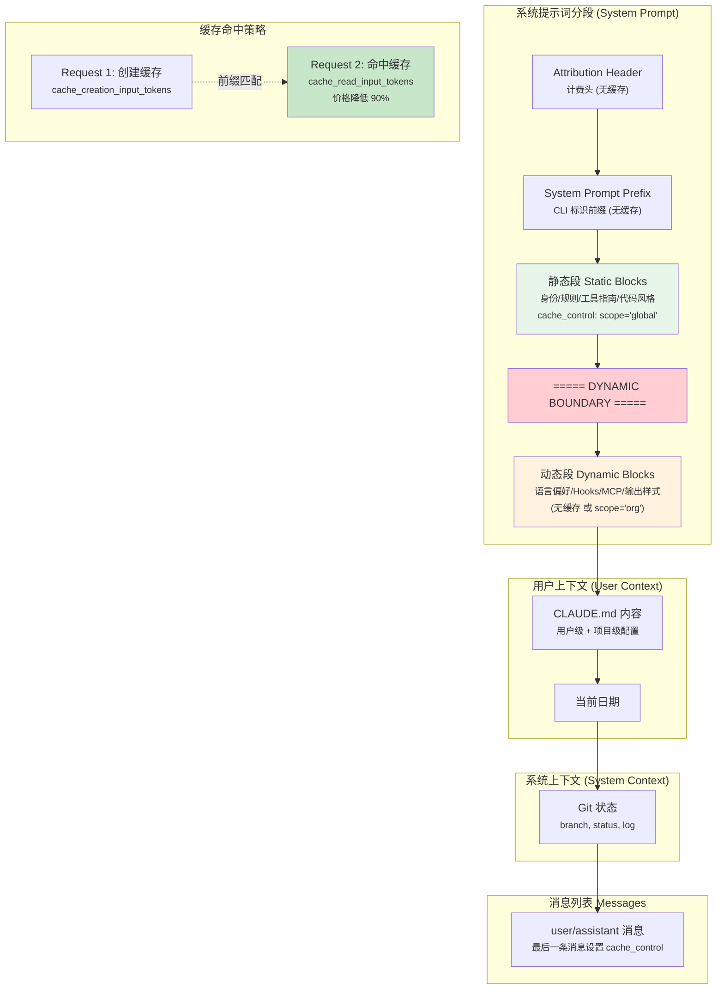

# s03 — 系统提示词组装：字节级的缓存博弈

> "Every token in the prompt has a price tag"

::: info Key Takeaways
- **四层提示词结构** — 静态前缀 → 工具描述 → 动态上下文 → 用户消息，顺序影响缓存命中率
- **Prompt Cache 是性能关键** — 90%+ 缓存命中率可将 token 成本降低 ~7 倍
- **Context Engineering = Select** — 系统提示词组装的核心是"选择放入什么"
- **splitSysPromptPrefix 边界** — 将提示词切为两部分，前半部分最大化缓存复用
:::

## 问题

Claude 每次回复前看到的完整提示词是怎么拼出来的？为什么顺序很重要？

每次 agent 循环调用 API 时，Claude 都会收到一份完整的系统提示词。这份提示词并不是一个简单的字符串 -- 它是由多个片段精心组装而成的，每个片段的位置、长度、缓存策略都经过深思熟虑。

为什么顺序很重要？因为 Anthropic 的 Prompt Cache 采用 **前缀匹配**机制：只有从头开始完全一致的内容才能命中缓存。如果你把一个每次请求都变化的内容（比如 git status）放在系统提示词的开头，那么整个提示词的缓存就永远无法命中。

这节课我们拆解 Claude Code 如何像下棋一样精心安排每一个 token 的位置，从而最大化缓存命中率，节省大量 API 成本。

## 架构图



## 核心机制

### 1. 系统提示词的四层结构

Claude Code 的系统提示词由四层组成，每层有不同的缓存策略：

**源码路径**: `src/constants/prompts.ts` -- `getSystemPrompt()`

```
Layer 1: 静态指令（所有用户相同）
  ├── 身份声明："You are Claude Code..."
  ├── 系统规则：工具使用指南、安全规则
  ├── 编码风格：代码规范、文件操作指南
  └── 工具使用说明
  
Layer 2: ═══ SYSTEM_PROMPT_DYNAMIC_BOUNDARY ═══

Layer 3: 动态指令（因用户/会话而异）
  ├── 语言偏好
  ├── 输出样式
  ├── Hooks 说明
  ├── MCP 服务器指令
  └── Token Budget 指令

Layer 4: 上下文注入
  ├── userContext: CLAUDE.md + 日期
  └── systemContext: Git 状态
```

关键在于 `SYSTEM_PROMPT_DYNAMIC_BOUNDARY` 这个分界线。它把系统提示词分为两半：

**源码路径**: `src/constants/prompts.ts`

```typescript
export const SYSTEM_PROMPT_DYNAMIC_BOUNDARY =
  '__SYSTEM_PROMPT_DYNAMIC_BOUNDARY__'

// 在 getSystemPrompt() 中的位置：
return [
  // --- 静态内容（可缓存） ---
  getSimpleIntroSection(),           // 身份声明
  getSimpleSystemSection(),          // 系统规则
  getSimpleDoingTasksSection(),      // 编码指南
  getActionsSection(),               // 行为规则
  getUsingYourToolsSection(tools),   // 工具使用
  getSimpleToneAndStyleSection(),    // 语调风格
  getOutputEfficiencySection(),      // 输出效率
  
  // === BOUNDARY MARKER - DO NOT MOVE OR REMOVE ===
  ...(shouldUseGlobalCacheScope() ? [SYSTEM_PROMPT_DYNAMIC_BOUNDARY] : []),
  
  // --- 动态内容 ---
  ...resolvedDynamicSections,  // 语言、Hooks、MCP 等
].filter(s => s !== null)
```

### 2. 前缀匹配：为什么顺序如此重要

Anthropic 的 Prompt Cache 工作原理：

1. 每次 API 请求，服务端对系统提示词 + 消息列表做 **前缀匹配**
2. 从头开始逐字节比较，找到最长的匹配前缀
3. 匹配部分从缓存读取（`cache_read_input_tokens`，价格约为原来的 10%）
4. 不匹配部分需要重新计算（`cache_creation_input_tokens`）

这意味着：

```
请求 1: [身份 + 规则 + 工具 + BOUNDARY + 语言 + git_status_v1]
请求 2: [身份 + 规则 + 工具 + BOUNDARY + 语言 + git_status_v2]
                                              ↑ 从这里开始不同
                                              ↑ 前面的全部命中缓存
```

如果把 git status 放在最前面：

```
请求 1: [git_status_v1 + 身份 + 规则 + 工具 + ...]
请求 2: [git_status_v2 + 身份 + 规则 + 工具 + ...]
         ↑ 第一个字节就不同！
         ↑ 整个提示词零缓存命中
```

所以 Claude Code 把 **最稳定的内容放在最前面，最易变的内容放在最后面**。

### 3. splitSysPromptPrefix：缓存分段逻辑

`splitSysPromptPrefix()` 函数负责把系统提示词切分为带不同缓存范围（`cacheScope`）的块：

**源码路径**: `src/utils/api.ts` -- `splitSysPromptPrefix()`

```typescript
export function splitSysPromptPrefix(
  systemPrompt: SystemPrompt,
  options?: { skipGlobalCacheForSystemPrompt?: boolean },
): SystemPromptBlock[] {
  // 模式 1: 有 MCP 工具（跳过全局缓存，用 org 级别）
  // 模式 2: 全局缓存模式（boundary 前用 global，后用 null）
  // 模式 3: 默认模式（全部用 org 级别）
}
```

三种模式的缓存分配：

```
模式 2（全局缓存，1P 专用）:
┌──────────────────────────────────┐
│ Attribution Header  → null      │  不缓存
│ CLI Prefix          → null      │  不缓存
│ 静态内容（boundary前）→ 'global' │  全局缓存（跨组织共享！）
│ 动态内容（boundary后）→ null     │  不缓存
└──────────────────────────────────┘

模式 3（默认/3P 提供商）:
┌──────────────────────────────────┐
│ Attribution Header  → null      │  不缓存
│ CLI Prefix          → 'org'     │  组织级缓存
│ 其余所有内容        → 'org'     │  组织级缓存
└──────────────────────────────────┘
```

全局缓存（`scope: 'global'`）意味着所有 Anthropic 用户共享同一份缓存 -- 因为系统提示词的静态部分对所有用户是完全相同的。这是 Claude Code 独有的优化：第一个用户创建缓存后，后续所有用户都能命中。

### 4. cache_control 标记：精确到消息级别

除了系统提示词，消息列表中也有缓存控制标记。`addCacheBreakpoints()` 函数负责在消息列表中设置缓存断点：

**源码路径**: `src/services/api/claude.ts` -- `addCacheBreakpoints()`

```typescript
export function addCacheBreakpoints(
  messages: Message[],
  enablePromptCaching: boolean,
): MessageParam[] {
  // 规则：每个请求只有一个消息级 cache_control 标记
  // 放在最后一条消息上
  const markerIndex = messages.length - 1
  
  return messages.map((msg, index) => {
    const addCache = index === markerIndex
    if (addCache && enablePromptCaching) {
      // 在最后一个 content block 上添加 cache_control
      return {
        ...msg,
        content: msg.content.map((block, i) => ({
          ...block,
          ...(i === msg.content.length - 1 
            ? { cache_control: { type: "ephemeral" } }
            : {}),
        })),
      }
    }
    return msg
  })
}
```

为什么只有一个标记？因为 Anthropic 的缓存系统（内部称为 Mycro）使用 KV 页面管理。多个标记会导致中间位置的 KV 页面被保护，即使没有请求会从那里恢复。一个标记 = 最高效的缓存利用。

### 5. 系统提示词的构建管道

`buildSystemPromptBlocks()` 是最终将分段转换为 API 参数的函数：

**源码路径**: `src/services/api/claude.ts` -- `buildSystemPromptBlocks()`

```typescript
export function buildSystemPromptBlocks(
  systemPrompt: SystemPrompt,
  enablePromptCaching: boolean,
): TextBlockParam[] {
  return splitSysPromptPrefix(systemPrompt).map(block => ({
    type: 'text',
    text: block.text,
    ...(enablePromptCaching && block.cacheScope !== null && {
      cache_control: getCacheControl({ scope: block.cacheScope }),
    }),
  }))
}
```

完整的构建管道：

```
getSystemPrompt()                    → string[] (提示词片段数组)
    ↓ + userContext + systemContext
fetchSystemPromptParts()             → { defaultSystemPrompt, userContext, systemContext }
    ↓
asSystemPrompt(parts)                → SystemPrompt (类型包装)
    ↓ + prependUserContext() + appendSystemContext()
buildSystemPromptBlocks()            → TextBlockParam[] (带 cache_control 的 API 参数)
    ↓
发送给 Anthropic API
```

### 6. CLAUDE.md 注入：用户配置的加载

CLAUDE.md 是 Claude Code 的核心配置机制。它通过 `getUserContext()` 加载并注入到 `userContext` 中：

**源码路径**: `src/context.ts` -- `getUserContext()`

```typescript
export const getUserContext = memoize(async () => {
  const claudeMd = shouldDisableClaudeMd
    ? null
    : getClaudeMds(filterInjectedMemoryFiles(await getMemoryFiles()))
  
  return {
    ...(claudeMd && { claudeMd }),
    currentDate: `Today's date is ${getLocalISODate()}.`,
  }
})
```

CLAUDE.md 文件有优先级层级：

```
~/.claude/CLAUDE.md              → 用户级（全局）
项目根目录/CLAUDE.md             → 项目级
项目根目录/.claude/CLAUDE.md     → 项目级（隐藏目录）
子目录/CLAUDE.md                 → 目录级（按需加载）
```

所有 CLAUDE.md 内容被拼接后作为 `userContext` 注入。注入位置在系统提示词之后、消息列表之前 -- 这确保了系统提示词的缓存不受用户配置变化的影响。

`userContext` 通过 `prependUserContext()` 被注入到消息列表的第一条用户消息中：

**源码路径**: `src/utils/api.ts` -- `prependUserContext()`

这个设计非常巧妙：把用户配置放在消息列表而不是系统提示词中，这样系统提示词的缓存可以跨用户共享。

## Python 伪代码

```python
"""
Claude Code 系统提示词组装 -- 完整参考实现
真实代码在 src/constants/prompts.ts + src/utils/api.ts + src/services/api/claude.ts
"""
from dataclasses import dataclass
from typing import Optional
import os
import subprocess
import hashlib
import json


# ========== 缓存控制类型 ==========

@dataclass
class CacheControl:
    """对应 Anthropic API 的 cache_control 参数"""
    type: str = "ephemeral"  # "ephemeral" 是当前唯一选项
    scope: Optional[str] = None  # "global" | "org" | None

@dataclass 
class SystemPromptBlock:
    """
    一个带缓存标记的系统提示词片段
    对应 src/utils/api.ts 的 SystemPromptBlock
    """
    text: str
    cache_scope: Optional[str] = None  # "global" | "org" | None


# ========== 分界线常量 ==========

SYSTEM_PROMPT_DYNAMIC_BOUNDARY = "__SYSTEM_PROMPT_DYNAMIC_BOUNDARY__"


# ========== 系统提示词构建 ==========

def get_system_prompt(tools: list, model: str) -> list[str]:
    """
    构建完整的系统提示词片段数组。
    对应 src/constants/prompts.ts 的 getSystemPrompt()
    
    关键：静态内容在 BOUNDARY 之前，动态内容在之后。
    """
    static_sections = [
        # --- 静态内容（所有用户相同，可全局缓存） ---
        get_intro_section(),           # 身份：You are Claude Code...
        get_system_rules_section(),    # 系统规则：安全、隐私
        get_coding_section(),          # 编码指南：文件操作规范
        get_actions_section(),         # 行为规则：搜索优先、确认破坏操作
        get_tools_section(tools),      # 工具使用说明
        get_tone_section(),            # 语调：简洁、专业
        get_efficiency_section(),      # 输出效率：少废话
    ]
    
    dynamic_sections = [
        # --- 动态内容（因用户/会话而异） ---
        get_language_section(),        # 语言偏好（可能为 None）
        get_hooks_section(),           # Hooks 说明
        get_mcp_section(),             # MCP 服务器指令
        get_output_style_section(),    # 输出样式
    ]
    
    # 过滤 None 值
    result = [s for s in static_sections if s is not None]
    
    # 插入分界线（仅在全局缓存模式下）
    if should_use_global_cache():
        result.append(SYSTEM_PROMPT_DYNAMIC_BOUNDARY)
    
    # 追加动态内容
    result.extend([s for s in dynamic_sections if s is not None])
    
    return result


def get_intro_section() -> str:
    return """You are Claude Code, an interactive CLI tool that helps users with 
software engineering tasks. You operate in the user's terminal and have access 
to tools for reading, writing, and executing code."""


def get_system_rules_section() -> str:
    return """# System Rules
- Always search for existing patterns before making changes
- Confirm before destructive operations  
- Use the appropriate tool for each task"""


def get_coding_section() -> str:
    return """# Coding Guidelines
- Read files before editing them
- Prefer Edit over Write for existing files
- Use Glob/Grep to find files, not Bash"""


def get_actions_section() -> str:
    return """# Actions
- Search first, then read, then modify
- Break complex tasks into smaller steps"""


def get_tools_section(tools: list) -> str:
    tool_names = ", ".join(t.name for t in tools)
    return f"# Available Tools\n{tool_names}"


def get_tone_section() -> str:
    return "# Tone\nBe concise. No filler words. No apologies."


def get_efficiency_section() -> str:
    return "# Efficiency\nKeep responses short unless detail is needed."


def get_language_section() -> Optional[str]:
    lang = os.environ.get("CLAUDE_CODE_LANGUAGE")
    if not lang:
        return None
    return f"# Language\nAlways respond in {lang}."


def get_hooks_section() -> str:
    return "Users may configure hooks that execute in response to events."


def get_mcp_section() -> Optional[str]:
    # 真实代码会检查 MCP 连接并获取指令
    return None


def get_output_style_section() -> Optional[str]:
    return None


def should_use_global_cache() -> bool:
    """是否启用全局缓存（1P 直连 Anthropic API 时启用）"""
    return os.environ.get("API_PROVIDER", "anthropic") == "anthropic"


# ========== 缓存分段逻辑 ==========

def split_sys_prompt_prefix(
    system_prompt: list[str],
    skip_global_cache: bool = False,
) -> list[SystemPromptBlock]:
    """
    将系统提示词切分为带缓存范围的块。
    对应 src/utils/api.ts 的 splitSysPromptPrefix()
    
    三种模式：
    1. 有 MCP 工具 → 全部用 org 级缓存
    2. 全局缓存模式 → boundary 前 global，后 null
    3. 默认模式 → 全部用 org 级缓存
    """
    use_global = should_use_global_cache()
    
    # 模式 1: MCP 工具存在，跳过全局缓存
    if use_global and skip_global_cache:
        blocks = [s for s in system_prompt 
                  if s and s != SYSTEM_PROMPT_DYNAMIC_BOUNDARY]
        return [SystemPromptBlock(text="\n\n".join(blocks), cache_scope="org")]
    
    # 模式 2: 全局缓存模式（1P）
    if use_global:
        boundary_idx = None
        for i, s in enumerate(system_prompt):
            if s == SYSTEM_PROMPT_DYNAMIC_BOUNDARY:
                boundary_idx = i
                break
        
        if boundary_idx is not None:
            static_blocks = []
            dynamic_blocks = []
            
            for i, block in enumerate(system_prompt):
                if not block or block == SYSTEM_PROMPT_DYNAMIC_BOUNDARY:
                    continue
                if i < boundary_idx:
                    static_blocks.append(block)
                else:
                    dynamic_blocks.append(block)
            
            result = []
            if static_blocks:
                result.append(SystemPromptBlock(
                    text="\n\n".join(static_blocks),
                    cache_scope="global",  # 全局缓存：跨所有用户共享！
                ))
            if dynamic_blocks:
                result.append(SystemPromptBlock(
                    text="\n\n".join(dynamic_blocks),
                    cache_scope=None,  # 不缓存：每次都可能变化
                ))
            return result
    
    # 模式 3: 默认（3P 或无 boundary）
    all_text = "\n\n".join(s for s in system_prompt if s)
    return [SystemPromptBlock(text=all_text, cache_scope="org")]


# ========== 上下文获取 ==========

def get_user_context() -> dict:
    """
    获取用户上下文：CLAUDE.md + 日期
    对应 src/context.ts 的 getUserContext()
    """
    claude_md = load_claude_md_files()
    
    context = {}
    if claude_md:
        context["claudeMd"] = claude_md
    context["currentDate"] = f"Today's date is {get_local_date()}."
    return context


def get_system_context() -> dict:
    """
    获取系统上下文：git 状态
    对应 src/context.ts 的 getSystemContext()
    """
    try:
        # 并发获取 git 信息（Python 用 subprocess）
        branch = run_git("branch", "--show-current")
        main_branch = run_git("rev-parse", "--abbrev-ref", "origin/HEAD").replace("origin/", "")
        status = run_git("status", "--short")
        log = run_git("log", "--oneline", "-n", "5")
        user_name = run_git("config", "user.name")
        
        # 截断过长状态
        MAX_STATUS_CHARS = 2000
        if len(status) > MAX_STATUS_CHARS:
            status = status[:MAX_STATUS_CHARS] + "\n... (truncated)"
        
        git_status = "\n\n".join([
            "Git status (snapshot, may be stale):",
            f"Current branch: {branch}",
            f"Main branch: {main_branch}",
            f"Git user: {user_name}",
            f"Status:\n{status or '(clean)'}",
            f"Recent commits:\n{log}",
        ])
        return {"gitStatus": git_status}
    except Exception:
        return {}


def load_claude_md_files() -> Optional[str]:
    """加载 CLAUDE.md 文件（按优先级层级）"""
    paths = [
        os.path.expanduser("~/.claude/CLAUDE.md"),      # 用户级
        os.path.join(os.getcwd(), "CLAUDE.md"),           # 项目级
        os.path.join(os.getcwd(), ".claude/CLAUDE.md"),   # 项目级（隐藏）
    ]
    
    contents = []
    for path in paths:
        if os.path.exists(path):
            with open(path) as f:
                contents.append(f.read())
    
    return "\n\n---\n\n".join(contents) if contents else None


# ========== API 请求构建 ==========

def build_system_prompt_blocks(
    system_prompt: list[str],
    enable_caching: bool = True,
    skip_global_cache: bool = False,
) -> list[dict]:
    """
    构建发送给 API 的系统提示词块。
    对应 src/services/api/claude.ts 的 buildSystemPromptBlocks()
    """
    blocks = split_sys_prompt_prefix(system_prompt, skip_global_cache)
    
    result = []
    for block in blocks:
        item = {"type": "text", "text": block.text}
        if enable_caching and block.cache_scope is not None:
            item["cache_control"] = {"type": "ephemeral"}
            # scope 参数告诉服务端缓存的共享范围
            # "global" = 跨所有组织共享
            # "org" = 仅在同一组织内共享
        result.append(item)
    
    return result


def add_cache_breakpoints(
    messages: list[dict],
    enable_caching: bool = True,
) -> list[dict]:
    """
    在消息列表中添加缓存断点。
    对应 src/services/api/claude.ts 的 addCacheBreakpoints()
    
    规则：每个请求只在最后一条消息上放一个 cache_control 标记。
    """
    if not enable_caching or not messages:
        return messages
    
    result = []
    marker_index = len(messages) - 1
    
    for i, msg in enumerate(messages):
        if i == marker_index:
            # 在最后一条消息的最后一个 content block 上添加标记
            new_msg = {**msg}
            if isinstance(msg.get("content"), str):
                new_msg["content"] = [{
                    "type": "text",
                    "text": msg["content"],
                    "cache_control": {"type": "ephemeral"},
                }]
            elif isinstance(msg.get("content"), list):
                new_content = list(msg["content"])
                if new_content:
                    last_block = {**new_content[-1]}
                    # 不在 thinking block 上加标记
                    if last_block.get("type") not in ("thinking", "redacted_thinking"):
                        last_block["cache_control"] = {"type": "ephemeral"}
                    new_content[-1] = last_block
                new_msg["content"] = new_content
            result.append(new_msg)
        else:
            result.append(msg)
    
    return result


def prepend_user_context(
    messages: list[dict],
    user_context: dict,
) -> list[dict]:
    """
    将用户上下文注入到第一条用户消息中。
    对应 src/utils/api.ts 的 prependUserContext()
    """
    if not user_context:
        return messages
    
    # 构建上下文文本
    context_parts = []
    for key, value in user_context.items():
        context_parts.append(f"<{key}>\n{value}\n</{key}>")
    context_text = "\n".join(context_parts)
    
    # 找到第一条 user 消息并注入
    result = list(messages)
    for i, msg in enumerate(result):
        if msg.get("role") == "user":
            original = msg.get("content", "")
            if isinstance(original, str):
                result[i] = {**msg, "content": f"{context_text}\n\n{original}"}
            break
    
    return result


# ========== 完整构建管道 ==========

def build_full_api_request(
    prompt: str,
    messages: list[dict],
    tools: list,
    user_context: dict,
    system_context: dict,
    enable_caching: bool = True,
) -> dict:
    """
    构建完整的 API 请求。
    展示整个提示词组装管道。
    
    对应 QueryEngine.submitMessage() + query.ts 中的组装逻辑
    """
    # Step 1: 构建系统提示词
    system_prompt_parts = get_system_prompt(tools, "claude-sonnet-4-20250514")
    
    # Step 2: 构建系统提示词块（带缓存控制）
    system_blocks = build_system_prompt_blocks(
        system_prompt_parts,
        enable_caching=enable_caching,
    )
    
    # Step 3: 注入用户上下文到消息列表
    messages_with_context = prepend_user_context(messages, user_context)
    
    # Step 4: 追加系统上下文到系统提示词
    if system_context:
        for key, value in system_context.items():
            system_blocks.append({
                "type": "text",
                "text": f"\n\n# {key}\n{value}",
            })
    
    # Step 5: 在消息上添加缓存断点
    cached_messages = add_cache_breakpoints(
        messages_with_context,
        enable_caching=enable_caching,
    )
    
    # Step 6: 组装最终请求
    return {
        "model": "claude-sonnet-4-20250514",
        "max_tokens": 16384,
        "system": system_blocks,
        "messages": cached_messages,
        "tools": [{"name": t.name, "description": t.description(), 
                    "input_schema": t.input_schema} for t in tools],
    }


# ========== 辅助函数 ==========

def run_git(*args) -> str:
    try:
        result = subprocess.run(
            ["git", "--no-optional-locks"] + list(args),
            capture_output=True, text=True, timeout=5,
        )
        return result.stdout.strip()
    except Exception:
        return ""


def get_local_date() -> str:
    from datetime import date
    return date.today().isoformat()


# ========== 演示 ==========

if __name__ == "__main__":
    # 模拟构建过程
    from s02_tools import create_default_registry
    
    registry = create_default_registry()
    tools = registry.get_enabled_tools()
    
    # 构建系统提示词
    system_parts = get_system_prompt(tools, "claude-sonnet-4-20250514")
    print(f"系统提示词片段数: {len(system_parts)}")
    
    # 缓存分段
    blocks = split_sys_prompt_prefix(system_parts)
    for i, block in enumerate(blocks):
        print(f"\n--- Block {i} (scope={block.cache_scope}) ---")
        print(f"  长度: {len(block.text)} chars")
        print(f"  预览: {block.text[:80]}...")
    
    # 构建完整请求
    request = build_full_api_request(
        prompt="Read and explain main.py",
        messages=[{"role": "user", "content": "Read and explain main.py"}],
        tools=tools,
        user_context=get_user_context(),
        system_context=get_system_context(),
    )
    
    system_tokens = sum(len(b["text"]) // 4 for b in request["system"])
    print(f"\n系统提示词估计 token 数: {system_tokens}")
    print(f"其中可缓存: {sum(len(b['text'])//4 for b in request['system'] if 'cache_control' in b)}")
```

## 源码映射

| 概念 | 真实源码路径 | 说明 |
|------|-------------|------|
| 系统提示词构建 | `src/constants/prompts.ts` -- `getSystemPrompt()` | 组装所有提示词片段，静态 + BOUNDARY + 动态 |
| 分界线常量 | `src/constants/prompts.ts` -- `SYSTEM_PROMPT_DYNAMIC_BOUNDARY` | 静态/动态内容的分界标记 |
| 缓存分段 | `src/utils/api.ts` -- `splitSysPromptPrefix()` | 按 boundary 切分，分配 cacheScope |
| 系统提示词块构建 | `src/services/api/claude.ts` -- `buildSystemPromptBlocks()` | 转换为 API 参数格式 |
| 消息缓存断点 | `src/services/api/claude.ts` -- `addCacheBreakpoints()` | 最后一条消息上放 cache_control |
| 用户上下文 | `src/context.ts` -- `getUserContext()` | CLAUDE.md + 日期 |
| 系统上下文 | `src/context.ts` -- `getSystemContext()` | git 状态（memoized） |
| 上下文注入 | `src/utils/api.ts` -- `prependUserContext()` | 注入到第一条 user 消息 |
| 提示词部件获取 | `src/utils/queryContext.ts` -- `fetchSystemPromptParts()` | 并发获取三大部分 |
| CLAUDE.md 加载 | `src/utils/claudemd.ts` | 层级文件发现和加载 |
| 缓存控制生成 | `src/services/api/claude.ts` -- `getCacheControl()` | 根据 scope 和 querySource 生成 |

## 设计决策

### 硬编码分界线 vs 动态计算

为什么用一个简单的字符串常量 `__SYSTEM_PROMPT_DYNAMIC_BOUNDARY__` 作为分界线，而不是动态计算哪些内容是 "静态的"？

**稳定性**。缓存的关键是 key 的稳定性。如果分界线是动态计算的（比如 "检测内容是否包含变量"），那么计算逻辑本身的变化就会导致缓存失效。一个硬编码的字符串是最稳定的分界 -- 除非你显式移动它，否则它永远在同一个位置。

代码中的注释也强调了这一点：

```typescript
// === BOUNDARY MARKER - DO NOT MOVE OR REMOVE ===
// WARNING: Do not remove or reorder this marker without updating cache logic in:
// - src/utils/api.ts (splitSysPromptPrefix)
// - src/services/api/claude.ts (buildSystemPromptBlocks)
```

### 为什么每个请求只放一个 cache_control 标记？

注释中解释得很清楚：

> "Exactly one message-level cache_control marker per request. Mycro's turn-to-turn eviction frees local-attention KV pages at any cached prefix position NOT in cache_store_int_token_boundaries. With two markers the second-to-last position is protected and its locals survive an extra turn even though nothing will ever resume from there."

翻译：Anthropic 的 KV 缓存系统在每个缓存断点位置保存 attention 页面。两个标记意味着中间位置的页面被多保留一轮，浪费缓存空间。一个标记 = 最优。

### Harness 优势：Prompt Cache 是 #1 工程差异化

**当前 AI 应用层开发的核心竞争力之一，就是贪婪且精细地压榨 API 缓存系统的价值。**

对比其他开源工具：

| 工具 | 缓存策略 | 复杂度 |
|------|----------|--------|
| **Claude Code** | 三层缓存（global/org/ephemeral）+ boundary 分段 + 单标记优化 + cache_reference | 极高 |
| **OpenCode** | 简单 2-part 数组（系统 + 用户） | 低 |
| **Aider** | 需要手动开启缓存，无分段优化 | 中 |
| **Cline** | 基础 prompt caching | 中 |

Claude Code 在这个维度上的投入远超竞品。看看 `claude.ts` 文件中关于缓存的代码量就知道了 -- 超过 500 行专门处理 `cache_control`、`cache_reference`、`cache_edits` 等参数。

这不仅是成本优化（缓存命中时 token 价格降低 90%），更是延迟优化 -- 缓存命中意味着服务端不需要重新计算那部分 attention，响应速度更快。

对于 Claude Code 这样的 agent，每个 turn 都是一次 API 调用，一个 10-turn 的任务意味着 10 次调用。如果系统提示词（约 5000 token）每次都命中缓存，10 次就节省了 45000 个 token 的重新计算 -- 以 Sonnet 的价格算，每个任务节省约 $0.013。看似不多，但乘以百万级用户和日均任务量，这就是一个巨大的数字。

### 为什么 userContext 注入到消息而不是系统提示词？

如果 CLAUDE.md 内容放在系统提示词中，那么每个用户的系统提示词都不同，全局缓存（`scope: 'global'`）就完全无法命中。

通过把用户特定的内容（CLAUDE.md、日期）放在消息列表中，系统提示词的静态段可以在所有用户间共享缓存。这就是为什么 `prependUserContext()` 存在 -- 它巧妙地把用户配置从系统提示词空间移到了消息空间。

## 变化表

| 新增概念 | 说明 |
|----------|------|
| 系统提示词分段 | 静态段（身份/规则）+ BOUNDARY + 动态段（语言/Hooks/MCP） |
| SYSTEM_PROMPT_DYNAMIC_BOUNDARY | 硬编码分界线，分隔可全局缓存和不可缓存的内容 |
| splitSysPromptPrefix() | 缓存分段逻辑：global / org / null 三种 scope |
| buildSystemPromptBlocks() | 转换为带 cache_control 的 API TextBlockParam |
| addCacheBreakpoints() | 消息级别缓存：每个请求只一个标记，放在最后一条消息 |
| getUserContext() | CLAUDE.md 层级加载 + 日期 |
| getSystemContext() | Git 状态（并发获取 5 个 git 命令） |
| prependUserContext() | 用户配置注入到消息而非系统提示词 |
| 全局缓存 (global scope) | 跨所有用户共享的缓存 -- Claude Code 独有优化 |

## 动手试试

### 练习 1：实现带缓存分段的 Prompt Builder

实现一个 `build_system_prompt()` 函数，返回带 `cache_control` 的分段列表。要求：

- 至少分为 "静态段" 和 "动态段" 两部分
- 静态段设置 `cache_control`，动态段不设置
- 用 Anthropic API 发送请求，观察 response 中的 `cache_creation_input_tokens` 和 `cache_read_input_tokens`

```python
import anthropic

client = anthropic.Anthropic()

system = [
    {
        "type": "text",
        "text": "You are a helpful assistant. Follow these rules: ...(长文本)...",
        "cache_control": {"type": "ephemeral"},  # 这段会被缓存
    },
    {
        "type": "text",
        "text": f"Today is 2026-04-01. Git branch: main",  # 这段不缓存
    },
]

# 第一次请求：创建缓存
r1 = client.messages.create(model="claude-sonnet-4-20250514", max_tokens=100,
    system=system, messages=[{"role": "user", "content": "Hi"}])
print(f"Request 1: cache_creation={r1.usage.cache_creation_input_tokens}")

# 第二次请求（相同系统提示词）：命中缓存
r2 = client.messages.create(model="claude-sonnet-4-20250514", max_tokens=100,
    system=system, messages=[{"role": "user", "content": "Hello"}])
print(f"Request 2: cache_read={r2.usage.cache_read_input_tokens}")
```

### 练习 2：测量缓存命中率

写一个脚本，模拟 agent 的多轮对话（5-10 轮），统计每轮的缓存命中率：

- 记录每轮的 `input_tokens`, `cache_creation_input_tokens`, `cache_read_input_tokens`
- 计算缓存命中率 = `cache_read / (cache_read + cache_creation + input)`
- 尝试改变系统提示词中动态内容的位置，观察命中率变化

### 练习 3：分析 Claude Code 的真实缓存行为

使用环境变量 `CLAUDE_CODE_DEBUG=1` 启动 Claude Code，观察日志中的缓存信息：

```bash
CLAUDE_CODE_DEBUG=1 claude -p "What is 1+1?" 2>debug.log

# 搜索缓存相关日志
grep -i "cache\|sysprompt" debug.log
```

或者直接查看 Claude Code 的系统提示词内容（如果你有 Anthropic 内部权限）：

```bash
# 导出系统提示词（需要源码构建）
claude --dump-system-prompt > system_prompt.txt
wc -l system_prompt.txt  # 查看行数
wc -c system_prompt.txt  # 查看字节数
```

## 推荐阅读

- [Context Engineering (Simon Willison)](https://simonwillison.net/) — "Context Engineering" 如何取代 "Prompt Engineering"
- [Context Management for Deep Agents (LangChain)](https://blog.langchain.com/) — Write/Select/Compress/Isolate 四策略
