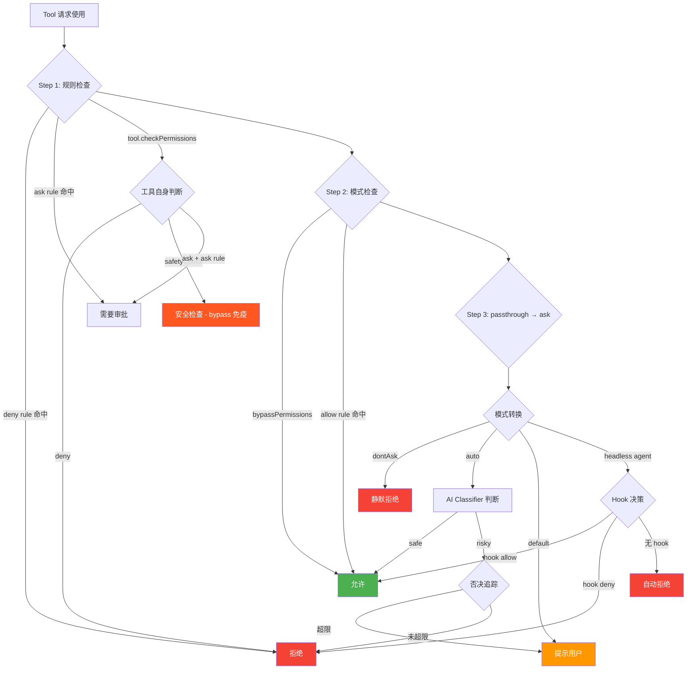

# s04 — 权限系统：5 种模式与风险分类

> "Trust, but verify" · 预计阅读 15 分钟

**核心洞察：即使你开了"上帝模式"（bypassPermissions），safetyCheck 仍然不可绕过——这是权限系统最精妙的设计。**

::: info Key Takeaways
- **五种权限模式** — default / acceptEdits / plan / bypassPermissions / dontAsk，状态机切换
- **六阶段评估流水线** — SDK bypass → Hooks → 本地规则 → 自动分类 → 全局规则 → 用户确认
- **deny-by-default** — 没有规则匹配时，默认拒绝，这是安全系统的黄金法则
- **危险模式库** — 内置 SQL 注入、路径穿越等模式检测
:::

## 问题

Claude Code 本质上是一个能调用工具（读写文件、执行 shell 命令、发起网络请求）的 AI agent。工具越强大，风险就越大——一条 `rm -rf /` 足以毁掉整个系统。那么问题来了：**如何在自主性和安全性之间找到平衡？**

如果每一步都需要人类确认，体验退化为"智能剪贴板"；如果完全放开，用户就是在玩俄罗斯轮盘。Claude Code 的权限系统要解决的核心矛盾就是：**让 agent 在安全范围内尽可能自主地工作**。

这一课拆解权限系统的四个关键子系统：权限模式（PermissionMode）、权限规则（PermissionRule）、权限评估引擎（hasPermissionsToUseTool）、以及否决追踪（DenialTracking）。

## 架构图




## 核心机制

### 1. 五种权限模式

Claude Code 定义了 5 种用户可见的权限模式，外加 2 种内部模式：

| 模式 | 行为 | 适用场景 |
|------|------|----------|
| `default` | 每次工具调用都需要用户确认 | 初次使用、高安全需求 |
| `acceptEdits` | 自动允许文件编辑，其他操作仍需确认 | 日常编码，信任文件写入 |
| `plan` | 只做规划不执行，进入"只读"模式 | 代码审查、学习探索 |
| `bypassPermissions` | 跳过所有权限检查（但 safetyCheck 和 ask rule 除外） | 完全信任的自动化场景 |
| `dontAsk` | 将所有 `ask` 转为 `deny`，绝不弹出提示 | CI/CD、headless 场景 |
| `auto`（内部） | 用 AI Classifier 自动判断是否安全 | Anthropic 内部测试 |
| `bubble`（内部） | 将权限请求向上冒泡至父级 UI 处理 | 嵌套 UI 场景（如子 agent 嵌入宿主应用） |

模式的设计思路是**渐进信任**：从最保守的 `default` 到最激进的 `bypassPermissions`，用户可以根据场景选择。

```
src/types/permissions.ts           -- PermissionMode 类型定义
src/utils/permissions/PermissionMode.ts -- 模式配置与工具函数
```

### 2. 权限规则三元组：allow / deny / ask

权限规则（PermissionRule）由三个字段组成：

- **source**：规则来自哪里（userSettings / projectSettings / localSettings / policySettings / cliArg / session）
- **ruleBehavior**：行为（allow / deny / ask）
- **ruleValue**：匹配什么（toolName + 可选的 ruleContent）

规则格式举例：
- `Bash` — 匹配整个 Bash 工具
- `Bash(npm publish:*)` — 匹配 Bash 中以 `npm publish` 开头的命令
- `mcp__server1` — 匹配某个 MCP server 的所有工具
- `Read(/etc/passwd)` — 匹配读取特定文件

规则按 source 优先级聚合：所有来源的 deny 规则在同一步检查，所有来源的 allow 规则在同一步检查。**deny 规则的优先级最高**——这是安全系统的金科玉律。

```
src/types/permissions.ts                    -- PermissionRule 类型
src/utils/permissions/permissionRuleParser.ts -- 规则解析
```

### 3. 危险模式匹配

`dangerousPatterns.ts` 维护了一个"危险命令前缀"列表，用于防止用户在 auto 模式下配置过于宽松的 allow 规则。

例如，如果用户配置了 `Bash(python:*)`，意味着所有 Python 命令都会被自动允许——这等于给了 agent 任意代码执行的能力。`DANGEROUS_BASH_PATTERNS` 列表就是用来检测这类规则并在 auto 模式入口处剥离它们。

危险模式覆盖三大类：
1. **解释器**：python, node, ruby, perl, php, lua 等
2. **包管理器的 run 命令**：npm run, yarn run, pnpm run 等
3. **Shell 和远程执行**：bash, sh, ssh, eval, exec, sudo 等

```
src/utils/permissions/dangerousPatterns.ts -- 危险模式列表
```

### 4. 权限评估引擎

`hasPermissionsToUseTool` 是整个权限系统的入口函数，它按严格的步骤顺序评估权限：

**Phase 1：规则检查（不受模式影响）**

1a. 整个工具被 deny rule 命中 → 直接拒绝
1b. 整个工具被 ask rule 命中 → 需要审批（sandbox 例外）
1c. 调用工具自身的 `checkPermissions`（如 Bash 的子命令规则匹配）
1d. 工具实现返回 deny → 拒绝
1e. 工具需要用户交互 → 保持 ask
1f. 内容级别的 ask rule → 保持 ask（即使 bypass 模式也要遵守）
1g. safetyCheck → 保持 ask（bypass 免疫——`.git/`, `.claude/` 等路径的安全检查）

**Phase 2：模式检查**

2a. `bypassPermissions` 模式 → 允许
2b. 工具整体被 allow rule 命中 → 允许

**Phase 3：兜底**

3. `passthrough` 转为 `ask`

然后进入模式转换层：`dontAsk` 模式将 ask 转 deny；`auto` 模式调用 AI Classifier；headless agent 运行 PermissionRequest hooks。

**关键设计：safetyCheck 是 bypass 免疫的**。即使在 `bypassPermissions` 模式下，对 `.git/` 目录、`.claude/` 目录、shell 配置文件等敏感路径的操作仍然需要用户确认。这是最后一道安全防线。

```
src/utils/permissions/permissions.ts -- 权限评估引擎
```

### 5. 否决追踪

`denialTracking.ts` 实现了一个简洁的"连续否决"和"总否决"计数器，用于 auto 模式下的降级策略：

- **连续否决阈值 = 3**：如果 AI Classifier 连续 3 次拒绝操作，降级到人工提示
- **总否决阈值 = 20**：如果一个 session 中总共被拒绝了 20 次，降级到人工提示

这解决了"AI 判断错误导致 agent 卡死"的问题——当 Classifier 连续否决时，让人类介入打破僵局。

```
src/utils/permissions/denialTracking.ts -- 否决追踪
```

## Python 伪代码

权限评估的核心是一条六阶段 if-else 链：

```python
# 权限评估流水线（精简版）
def has_permission(tool, input, mode, rules):
    # Stage 1: SDK 模式直接放行
    if mode == "sdk_bypass":
        return ALLOW

    # Stage 2: Hooks 可以拦截或放行
    hook_result = fire_hooks("PreToolUse", tool, input)
    if hook_result:
        return hook_result  # ALLOW or DENY

    # Stage 3: 本地规则检查（deny 优先）
    for rule in rules.local:
        if rule.matches(tool, input):
            return rule.behavior  # allow / deny / ask

    # Stage 4: 工具自身安全检查（bypass 免疫!）
    safety = tool.check_permissions(input)
    if safety == "safetyCheck":
        return ASK  # 即使 bypassPermissions 也无法跳过

    # Stage 5: 全局规则
    for rule in rules.global:
        if rule.matches(tool, input):
            return rule.behavior

    # Stage 6: 按模式决策
    if mode == "bypassPermissions":  return ALLOW
    if mode == "dontAsk":            return DENY
    if mode == "default":            return ASK   # 提示用户
    return DENY  # deny-by-default: 没有规则 = 不允许
```

完整参考实现（含否决追踪、危险模式库、AI Classifier）：

<details>
<summary>展开查看完整 Python 伪代码（346 行）</summary>

```python
"""
Claude Code 权限系统的 Python 参考实现
覆盖：权限模式、权限规则、评估引擎、否决追踪
"""
from enum import Enum
from dataclasses import dataclass, field
from typing import Optional, Dict, List, Set, Literal, Tuple

# ============================================================
# 1. 权限模式
# ============================================================

class PermissionMode(Enum):
    DEFAULT = "default"          # 每步都问
    ACCEPT_EDITS = "acceptEdits" # 自动允许文件编辑
    PLAN = "plan"                # 只规划不执行
    BYPASS = "bypassPermissions" # 跳过权限检查
    DONT_ASK = "dontAsk"         # 不问，直接拒绝
    AUTO = "auto"                # AI Classifier 自动判断（内部）

MODE_CONFIG = {
    PermissionMode.DEFAULT:      {"title": "Default",            "color": "text"},
    PermissionMode.ACCEPT_EDITS: {"title": "Accept edits",       "color": "autoAccept"},
    PermissionMode.PLAN:         {"title": "Plan Mode",          "color": "planMode"},
    PermissionMode.BYPASS:       {"title": "Bypass Permissions", "color": "error"},
    PermissionMode.DONT_ASK:     {"title": "Don't Ask",          "color": "error"},
    PermissionMode.AUTO:         {"title": "Auto mode",          "color": "warning"},
}

# ============================================================
# 2. 权限规则
# ============================================================

PermissionBehavior = Literal["allow", "deny", "ask"]
RuleSource = Literal[
    "userSettings", "projectSettings", "localSettings",
    "flagSettings", "policySettings", "cliArg", "command", "session"
]
# 共 8 种来源：5 种 SettingSource + cliArg（CLI 参数）+ command（命令行来源）+ session（会话临时）

@dataclass
class PermissionRuleValue:
    tool_name: str
    rule_content: Optional[str] = None  # e.g. "npm publish:*"

@dataclass
class PermissionRule:
    source: RuleSource
    behavior: PermissionBehavior
    value: PermissionRuleValue

# 规则来源优先级（从低到高），共 8 种
RULE_SOURCES: List[RuleSource] = [
    "userSettings", "projectSettings", "localSettings",
    "flagSettings", "policySettings", "cliArg", "command", "session"
]

# ============================================================
# 3. 危险模式库
# ============================================================

CROSS_PLATFORM_CODE_EXEC = [
    "python", "python3", "node", "deno", "tsx",
    "ruby", "perl", "php", "lua",
    "npx", "bunx", "npm run", "yarn run", "pnpm run", "bun run",
    "bash", "sh", "ssh",
]

DANGEROUS_BASH_PATTERNS = [
    *CROSS_PLATFORM_CODE_EXEC,
    "zsh", "fish", "eval", "exec", "env", "xargs", "sudo",
]

def is_dangerous_allow_rule(rule_content: str) -> bool:
    """检查一个 allow rule 是否过于危险（如 Bash(python:*)）"""
    for pattern in DANGEROUS_BASH_PATTERNS:
        if rule_content == pattern or rule_content.startswith(f"{pattern}:"):
            return True
    return False

# ============================================================
# 4. 权限上下文
# ============================================================

@dataclass
class ToolPermissionContext:
    mode: PermissionMode = PermissionMode.DEFAULT
    allow_rules: Dict[RuleSource, List[str]] = field(default_factory=dict)
    deny_rules: Dict[RuleSource, List[str]] = field(default_factory=dict)
    ask_rules: Dict[RuleSource, List[str]] = field(default_factory=dict)
    is_bypass_available: bool = False
    should_avoid_prompts: bool = False  # headless mode

def get_all_rules(
    rules_by_source: Dict[RuleSource, List[str]],
    behavior: PermissionBehavior,
) -> List[PermissionRule]:
    """聚合所有来源的规则"""
    result = []
    for source in RULE_SOURCES:
        for rule_str in rules_by_source.get(source, []):
            value = parse_rule_value(rule_str)
            result.append(PermissionRule(source, behavior, value))
    return result

def parse_rule_value(rule_str: str) -> PermissionRuleValue:
    """解析规则字符串，如 'Bash(npm publish:*)' -> PermissionRuleValue"""
    if "(" in rule_str and rule_str.endswith(")"):
        paren_idx = rule_str.index("(")
        tool_name = rule_str[:paren_idx]
        content = rule_str[paren_idx + 1 : -1]
        return PermissionRuleValue(tool_name, content)
    return PermissionRuleValue(rule_str)

# ============================================================
# 5. 否决追踪
# ============================================================

MAX_CONSECUTIVE_DENIALS = 3   # 教程简化命名；源码实际用 DENIAL_LIMITS.maxConsecutive
MAX_TOTAL_DENIALS = 20        # 源码实际用 DENIAL_LIMITS.maxTotal

@dataclass
class DenialTrackingState:
    consecutive_denials: int = 0
    total_denials: int = 0

def record_denial(state: DenialTrackingState) -> DenialTrackingState:
    return DenialTrackingState(
        consecutive_denials=state.consecutive_denials + 1,
        total_denials=state.total_denials + 1,
    )

def record_success(state: DenialTrackingState) -> DenialTrackingState:
    if state.consecutive_denials == 0:
        return state  # 无需拷贝
    return DenialTrackingState(
        consecutive_denials=0,
        total_denials=state.total_denials,
    )

def should_fallback_to_prompting(state: DenialTrackingState) -> bool:
    return (
        state.consecutive_denials >= MAX_CONSECUTIVE_DENIALS
        or state.total_denials >= MAX_TOTAL_DENIALS
    )

# ============================================================
# 6. 工具接口
# ============================================================

@dataclass
class PermissionResult:
    behavior: Literal["allow", "ask", "deny", "passthrough"]
    message: str = ""
    updated_input: Optional[dict] = None
    decision_reason: Optional[dict] = None
    suggestions: Optional[list] = None

class Tool:
    """工具基类"""
    def __init__(self, name: str):
        self.name = name

    def check_permissions(
        self, parsed_input: dict, context: "ToolUseContext"
    ) -> PermissionResult:
        """工具自身的权限检查（子类覆写）"""
        return PermissionResult(behavior="passthrough")

    def requires_user_interaction(self) -> bool:
        return False

# ============================================================
# 7. 权限评估引擎
# ============================================================

def tool_matches_rule(tool: Tool, rule: PermissionRule) -> bool:
    """检查工具是否匹配规则（仅匹配整个工具，不检查 content）"""
    if rule.value.rule_content is not None:
        return False
    return rule.value.tool_name == tool.name

def find_matching_rule(
    ctx: ToolPermissionContext,
    tool: Tool,
    behavior: PermissionBehavior,
) -> Optional[PermissionRule]:
    """查找匹配的规则"""
    rules_map = {
        "allow": ctx.allow_rules,
        "deny": ctx.deny_rules,
        "ask": ctx.ask_rules,
    }
    all_rules = get_all_rules(rules_map[behavior], behavior)
    for rule in all_rules:
        if tool_matches_rule(tool, rule):
            return rule
    return None

def has_permissions_to_use_tool(
    tool: Tool,
    input_data: dict,
    ctx: ToolPermissionContext,
    denial_state: DenialTrackingState,
) -> Tuple[PermissionResult, DenialTrackingState]:
    """
    权限评估引擎 —— 核心函数
    返回 (权限决策, 更新后的否决状态)
    """

    # ── Phase 1: 规则检查（不受模式影响）──

    # 1a. 整个工具被 deny
    deny_rule = find_matching_rule(ctx, tool, "deny")
    if deny_rule:
        return PermissionResult(
            behavior="deny",
            message=f"Permission to use {tool.name} has been denied.",
            decision_reason={"type": "rule", "rule": deny_rule},
        ), denial_state

    # 1b. 整个工具被 ask
    ask_rule = find_matching_rule(ctx, tool, "ask")
    if ask_rule:
        return PermissionResult(
            behavior="ask",
            message=f"Claude requested permissions to use {tool.name}.",
            decision_reason={"type": "rule", "rule": ask_rule},
        ), denial_state

    # 1c. 工具自身权限检查
    tool_result = tool.check_permissions(input_data, None)

    # 1d. 工具实现返回 deny
    if tool_result.behavior == "deny":
        return tool_result, denial_state

    # 1e. 需要用户交互
    if tool.requires_user_interaction() and tool_result.behavior == "ask":
        return tool_result, denial_state

    # 1f. 内容级别的 ask rule (bypass 免疫)
    if (
        tool_result.behavior == "ask"
        and tool_result.decision_reason
        and tool_result.decision_reason.get("type") == "rule"
    ):
        return tool_result, denial_state

    # 1g. safetyCheck (bypass 免疫)
    if (
        tool_result.behavior == "ask"
        and tool_result.decision_reason
        and tool_result.decision_reason.get("type") == "safetyCheck"
    ):
        return tool_result, denial_state

    # ── Phase 2: 模式检查 ──

    # 2a. bypass 模式
    should_bypass = (
        ctx.mode == PermissionMode.BYPASS
        or (ctx.mode == PermissionMode.PLAN and ctx.is_bypass_available)
    )
    if should_bypass:
        return PermissionResult(
            behavior="allow",
            updated_input=input_data,
            decision_reason={"type": "mode", "mode": ctx.mode.value},
        ), denial_state

    # 2b. 整个工具被 allow
    allow_rule = find_matching_rule(ctx, tool, "allow")
    if allow_rule:
        return PermissionResult(
            behavior="allow",
            updated_input=input_data,
            decision_reason={"type": "rule", "rule": allow_rule},
        ), denial_state

    # ── Phase 3: 兜底 ──

    # 3. passthrough → ask
    result = tool_result
    if result.behavior == "passthrough":
        result = PermissionResult(
            behavior="ask",
            message=f"Claude requested permissions to use {tool.name}.",
        )

    # ── 模式转换层 ──

    if result.behavior == "ask":
        # dontAsk 模式：ask → deny
        if ctx.mode == PermissionMode.DONT_ASK:
            return PermissionResult(
                behavior="deny",
                message=f"Permission denied for {tool.name} (dontAsk mode).",
                decision_reason={"type": "mode", "mode": "dontAsk"},
            ), denial_state

        # headless agent：自动拒绝
        if ctx.should_avoid_prompts:
            return PermissionResult(
                behavior="deny",
                message=f"Permission denied for {tool.name} (headless mode).",
                decision_reason={"type": "asyncAgent", "reason": "No prompts"},
            ), denial_state

    # 成功的工具使用重置连续否决计数
    if result.behavior == "allow":
        denial_state = record_success(denial_state)

    return result, denial_state


# ============================================================
# 使用示例
# ============================================================

if __name__ == "__main__":
    # 创建权限上下文
    ctx = ToolPermissionContext(
        mode=PermissionMode.DEFAULT,
        allow_rules={"userSettings": ["Read"]},
        deny_rules={"policySettings": ["Bash(rm -rf:*)"]},
    )

    tool = Tool("Bash")
    denial_state = DenialTrackingState()

    result, denial_state = has_permissions_to_use_tool(
        tool, {"command": "ls -la"}, ctx, denial_state
    )
    print(f"Decision: {result.behavior}")  # ask (default mode)

    # 切换到 bypass 模式
    ctx.mode = PermissionMode.BYPASS
    result, denial_state = has_permissions_to_use_tool(
        tool, {"command": "ls -la"}, ctx, denial_state
    )
    print(f"Decision: {result.behavior}")  # allow

    # 检测危险 allow 规则
    print(f"'python' is dangerous: {is_dangerous_allow_rule('python')}")   # True
    print(f"'git status' is dangerous: {is_dangerous_allow_rule('git status')}")  # False (外部用户)
```

</details>

## 源码映射

| 概念 | 真实源码路径 | 说明 |
|------|-------------|------|
| 权限模式枚举 | `src/types/permissions.ts` | `EXTERNAL_PERMISSION_MODES` 和 `INTERNAL_PERMISSION_MODES` 定义 |
| 模式配置 | `src/utils/permissions/PermissionMode.ts` | 每个模式的 title、symbol、color 映射 |
| 危险命令模式 | `src/utils/permissions/dangerousPatterns.ts` | `DANGEROUS_BASH_PATTERNS` 列表 |
| 权限评估主函数 | `src/utils/permissions/permissions.ts` | `hasPermissionsToUseTool` 和 `hasPermissionsToUseToolInner` |
| 规则匹配 | `src/utils/permissions/permissions.ts` | `toolMatchesRule`、`getAllowRules`、`getDenyRules`、`getAskRules` |
| 规则解析 | `src/utils/permissions/permissionRuleParser.ts` | `permissionRuleValueFromString` |
| 否决追踪 | `src/utils/permissions/denialTracking.ts` | `DenialTrackingState`、`recordDenial`、`shouldFallbackToPrompting` |
| 规则来源常量 | `src/utils/settings/constants.ts` | `SETTING_SOURCES` 定义 5 种设置来源 |
| Bash 分类器 | `src/utils/permissions/bashClassifier.ts` | 外部构建为 stub，内部使用 AI 分类 |
| 权限更新持久化 | `src/utils/permissions/PermissionUpdate.ts` | 规则的增删改查 |

## 设计决策

### 启发式模式匹配 vs. 结构化 AST 解析

Claude Code 的 Bash 命令分类使用**启发式前缀匹配** + 危险模式列表。这种方式简单、快速，但有局限性——复杂的 shell 语法（管道、子 shell、转义）可能绕过检查。

OpenCode 采用了不同的路径：使用 **tree-sitter 对 Bash 命令做 AST 解析**，配合 wildcard 匹配模式。这种方法更精确，能正确处理 `echo "rm -rf /" | cat`（不会误报为危险命令），但也更重，需要引入 tree-sitter 的 Bash grammar。

| 维度 | Claude Code | OpenCode |
|------|------------|---------|
| 解析方式 | 字符串前缀 + 正则 | tree-sitter AST |
| 精确度 | 中等（可能误报/漏报） | 高（结构化理解） |
| 性能 | 极快（字符串比较） | 较慢（需要 parse） |
| 维护成本 | 低（加前缀即可） | 中（需维护 grammar） |
| 绕过难度 | 中（shell 技巧可绕过） | 高（AST 难以欺骗） |

Claude Code 的选择反映了其设计哲学：**在快速迭代的产品中，简单可维护的方案优于"正确但复杂"的方案**。况且 Claude Code 还有 auto 模式的 AI Classifier 作为第二层防线，启发式匹配只需要挡住最明显的危险操作。

### 分层防御设计

权限系统的一个精妙之处在于**分层防御**：

1. **deny rule** — 硬性禁止，任何模式都无法绕过
2. **safetyCheck** — bypass 免疫，保护关键文件和目录
3. **ask rule** — 内容级别的 ask 规则，bypass 免疫
4. **模式检查** — 根据用户选择的信任级别决策
5. **AI Classifier**（auto 模式）— 上下文感知的智能判断
6. **否决追踪** — 防止 Classifier 错误导致 agent 卡死

任何单一层的失败不会导致系统完全失控。这是**纵深防御**（Defense in Depth）的经典实践。

### 应用层权限 vs 内核级沙箱

Claude Code 的权限系统属于应用层防线。2025-2026 年，`nono` 等工具使用 Linux Landlock 和 macOS Seatbelt 做内核级隔离，Cursor 2.0 也实现了基于 Seatbelt/Landlock 的本地沙箱。两层防线互补：应用层做细粒度策略控制，内核层做硬性隔离。

| 维度 | Claude Code | Cursor 2.0 | Codex CLI |
|------|------------|-----------|-----------|
| 权限粒度 | 工具级+内容级规则匹配 | sandbox.json 声明式 | 三级 sandbox_mode |
| 沙箱机制 | 应用层 | 内核级(Seatbelt/Landlock) | Docker 容器 |
| 企业策略 | MDM + managed-settings | 团队 admin | 无 |

### 为什么 dontAsk 不等于 deny all？

`dontAsk` 模式并不是简单的"拒绝一切"。它只把 `ask` 转为 `deny`——已有的 `allow` 规则仍然生效。这使得 CI/CD 场景下可以预先配置好一组 allow 规则，然后用 `dontAsk` 模式运行，不需要人工干预的同时也不会执行未授权的操作。

## Why：设计决策与行业上下文

### 为什么 deny-by-default 是唯一正确的选择

Dev.to 上的安全讨论总结得很清楚："Default-deny isn't paranoia; it's the minimum viable security for AI agents with real funds." [R2-18]

关键原因：**AI Agent 能快速测试数千种权限路径**——传统的 allow-by-default 模型在人类用户身上勉强可用，但面对 Agent 的速度和自动化能力完全不够 [R2-19]。一个 Agent 在几秒内能尝试的路径，人类需要几小时。

### 约束悖论：限制 Agent 反而让它更强

这是 2026 年最反直觉的发现。LangChain 用数据证明：**仅通过调整 harness（不换模型），编码 Agent 在 Terminal Bench 2.0 上从 52.8 提升到 66.5——纯靠 harness 工程提升了 13.7 个百分点** [R1-2]。他们总结 harness 上的三个关键调节旋钮：system prompt、tool choice 和 execution flow。

权限系统不是在"限制"Agent，而是通过**约束解空间**来提高可靠性。正如 Epsilla 所说："Constraining an agent's solution space with rules, feedback loops, and linters paradoxically increases its productivity." [R1-7]

### 自评估偏差：权限是质量特性，不是安全特性

LLM 领域存在已知的自我一致性偏差（self-consistency bias）：**当你让 Agent 评估自己的输出时，它几乎总是会批准** [R1-5]。Anthropic 在其 harness 设计实践中也强调了这一问题。

这意味着 Claude Code 的权限系统和 Hooks 机制不是可选的"安全特性"，而是**对抗模型固有偏差的质量必需品**。没有外部约束，Agent 会系统性地高估自己输出的质量。

### Hooks 作为可编程安全中间件

Claude Code 的 Hooks 机制允许用户在工具调用前后插入自定义脚本——本质上是一个**可编程的权限中间件** [R2-21]。这比静态规则更灵活：你可以用 hook 脚本在每次 bash 调用前检查命令是否包含危险操作，实现动态安全策略。

> **参考来源：** LangChain [R1-2]、Anthropic [R1-5]、Epsilla [R1-7]、Dev.to [R2-18]。完整引用见 `docs/research/05-harness-trends-deep-20260401.md` 和 `docs/research/06-agent-architecture-deep-20260401.md`。

---

## 变化表

| 层次 | 与上一课相比新增 |
|------|-----------------|
| 类型系统 | `PermissionMode`、`PermissionRule`、`PermissionDecision`、`PermissionResult` |
| 核心模块 | 权限评估引擎 `hasPermissionsToUseTool` |
| 安全机制 | 危险模式列表、safetyCheck bypass 免疫 |
| 降级策略 | 否决追踪 + 自动降级到人工提示 |
| 规则系统 | 多来源规则聚合（8 种来源 x 3 种行为） |

## 动手试试

### 练习 1：实现一个 Bash 命令分类器

写一个函数 `classify_bash(command: str) -> Literal["safe", "risky", "dangerous"]`，基于以下规则：
- `dangerous`：匹配 `DANGEROUS_BASH_PATTERNS` 中任意前缀
- `risky`：包含管道 `|`、重定向 `>`、或子 shell `$()`
- `safe`：其他

测试用例：
```python
assert classify_bash("ls -la") == "safe"
assert classify_bash("python3 script.py") == "dangerous"
assert classify_bash("cat file.txt | grep error") == "risky"
assert classify_bash("rm -rf /") == "safe"  # 注意：rm 不在外部用户的危险列表中！
```

思考：为什么 `rm` 不在外部用户的 `DANGEROUS_BASH_PATTERNS` 中？（提示：这个列表防的是"allow 规则过于宽松"，不是"命令本身危险"。`rm` 不像 `python` 那样能执行任意代码。）

### 练习 2：模拟权限评估流水线

使用上面的 Python 伪代码，构造以下场景并验证结果：
1. `default` 模式 + 无规则 → 应该返回 `ask`
2. `bypass` 模式 + deny rule 命中 → 应该返回 `deny`（deny 优先于 bypass）
3. `dontAsk` 模式 + allow rule 命中 → 应该返回 `allow`（allow 在 dontAsk 转换之前）
4. `dontAsk` 模式 + 无规则 → 应该返回 `deny`

### 练习 3：设计一个否决追踪的变体

当前的否决追踪只有"连续否决"和"总否决"两个维度。设计一个改进版本，加入**时间窗口**：如果在 5 分钟内否决超过 10 次，就降级。思考这个改进的利弊。

## 推荐阅读

- [Deep Dive into AI Agent Sandboxes](https://ubos.tech/) — macOS Seatbelt / Linux Landlock 沙箱对比
- [Practical Security Guidance for Sandboxing Agentic Workflows (NVIDIA)](https://developer.nvidia.com/) — 企业级 Agent 安全实践

---

## 模拟场景

<!--@include: ./_fragments/sim-s04.md-->

## 架构决策卡片

<!--@include: ./_fragments/ann-s04.md-->
