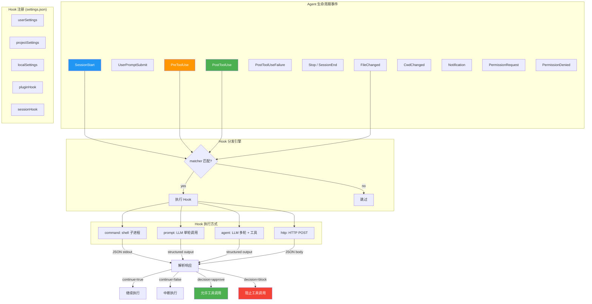

# s05 — Hooks：用户可编程的自动化钩子

> "Don't just react, automate"

::: info Key Takeaways
- **27 种生命周期钩子** — PreToolUse / PostToolUse / SessionStart / Stop / FileChanged 等
- **四种执行模式** — command (Shell) / prompt (AI) / agent (子 Agent) / http (Webhook)
- **Matcher 过滤** — 基于工具名和参数的精确匹配，避免不必要的钩子触发
- **Context Engineering = Select** — Hooks 决定哪些信息和行为被注入 Agent 工作流
:::

## 问题

上一课讲了权限系统如何控制 agent 的行为边界。但在实际使用中，用户往往需要的不仅是"允许/拒绝"的二元决策，而是**在 agent 工作流的关键节点注入自定义逻辑**。

举几个真实场景：
- 每次 agent 写完代码后自动跑 linter
- 在执行敏感命令前先写审计日志
- Session 启动时自动加载项目上下文
- 文件变更后自动触发测试
- 在 agent 提交代码前做安全扫描

这些需求的共同特征是：**事件驱动 + 可编程**。Claude Code 的 Hook 系统就是为此设计的——它在 agent 生命周期的关键事件上暴露钩子点，让用户用 shell 命令、LLM prompt 甚至 HTTP 回调来响应这些事件。

## 架构图



## 核心机制

### 1. Hook 事件类型

Claude Code 定义了丰富的生命周期事件，涵盖 agent 的完整工作流：

| 事件 | 触发时机 | 典型用途 |
|------|---------|---------|
| `SessionStart` | 会话开始 | 加载上下文、设置环境 |
| `SessionEnd` | 会话结束 | 清理资源、保存状态 |
| `UserPromptSubmit` | 用户提交 prompt | 注入额外上下文、prompt 改写 |
| `PreToolUse` | 工具调用前 | 审批、拦截、修改输入 |
| `PostToolUse` | 工具调用后 | 日志、lint、后处理 |
| `PostToolUseFailure` | 工具调用失败后 | 错误分析、重试策略 |
| `Stop` | agent 主循环结束 | 验证任务完成度 |
| `SubagentStart` / `SubagentStop` | 子 agent 启动/停止 | 子 agent 生命周期管理 |
| `PreCompact` / `PostCompact` | 上下文压缩前后 | 保留关键信息 |
| `PermissionRequest` | 权限请求（headless 模式） | 自动审批 |
| `PermissionDenied` | auto 模式拒绝后 | 重试策略 |
| `Notification` | 通知发送 | 外部集成（Slack/邮件） |
| `CwdChanged` | 工作目录变更 | 重新加载文件监听 |
| `FileChanged` | 文件变更（文件监听触发） | 自动测试、热重载 |
| `Setup` | 初始化阶段 | 环境检测 |
| `Elicitation` / `ElicitationResult` | 用户输入收集 | 表单自动化 |
| `WorktreeCreate` / `WorktreeRemove` | worktree 创建/移除 | VCS 集成 |

其中 `PreToolUse` 和 `PostToolUse` 支持 **matcher** 机制——可以用工具名过滤，只在特定工具的调用前/后触发。例如只在 `Bash` 工具调用后跑 lint。

```
src/entrypoints/sdk/coreTypes.ts  -- HOOK_EVENTS 完整列表
src/utils/hooks/hooksConfigManager.ts -- 每个事件的元数据
```

### 2. Hook 配置结构

Hook 在 `settings.json` 中配置，结构是三层嵌套：**事件 → matcher → hooks 数组**。

```json
{
  "hooks": {
    "PostToolUse": [
      {
        "matcher": "Bash",
        "hooks": [
          {
            "type": "command",
            "command": "eslint --fix $CHANGED_FILES"
          }
        ]
      }
    ],
    "SessionStart": [
      {
        "hooks": [
          {
            "type": "command",
            "command": "cat .claude/project-context.md"
          }
        ]
      }
    ]
  }
}
```

每个 hook 有四种执行类型：

| 类型 | 说明 | 输入 | 输出 |
|------|------|------|------|
| `command` | 执行 shell 命令 | JSON 通过 stdin | JSON 通过 stdout |
| `prompt` | 单轮 LLM 调用 | `$ARGUMENTS` 替换 | structured output |
| `agent` | 多轮 LLM + 工具调用 | `$ARGUMENTS` 替换 | structured output |
| `http` | HTTP POST 请求 | JSON body | JSON response |

此外还有两种内部类型 `callback`（代码回调）和 `function`（函数引用），用于内置 hook。

```
src/schemas/hooks.ts           -- HookCommandSchema 定义
src/utils/settings/types.ts    -- HooksSchema 定义
src/utils/hooks/hooksSettings.ts -- Hook 来源管理
```

### 3. Hook 分发与执行

当一个生命周期事件被触发时，分发流程如下：

1. **收集所有 hook**：从 userSettings、projectSettings、localSettings、pluginHook、sessionHook 等来源收集当前事件的所有 hook 配置
2. **matcher 过滤**：如果 hook 有 matcher（如 `"Bash"`），检查当前工具名是否匹配
3. **条件过滤**：如果 hook 有 `if` 条件（如 `"if": "Bash(git *)"`），检查条件是否满足
4. **逐个执行**：按优先级顺序执行匹配的 hook
5. **聚合结果**：合并所有 hook 的结果

对于 `command` 类型的 hook，执行方式是**启动子进程**，通过 stdin 传入 JSON 格式的 `HookInput`，从 stdout 读取 JSON 格式的响应。

`HookInput` 的结构因事件不同而异：
- `PreToolUse`：包含 `tool_name`、`tool_input`、`tool_use_id`
- `PostToolUse`：包含 `tool_name`、`tool_input` 和 `tool_response`
- `SessionStart`：包含 `session_id`、`cwd`
- `Notification`：包含 `message`、`notification_type`

```
src/utils/hooks/hookEvents.ts  -- 事件发射系统
src/utils/hooks/hooksSettings.ts -- getAllHooks / getHooksForEvent
```

### 4. Hook 响应协议

Hook 通过 JSON 输出控制 agent 行为。响应有两大类：

**同步响应（SyncHookJSONOutput）：**
```json
{
  "continue": true,
  "suppressOutput": false,
  "stopReason": "...",
  "decision": "approve",
  "reason": "...",
  "systemMessage": "...",
  "hookSpecificOutput": {
    "hookEventName": "PreToolUse",
    "permissionDecision": "allow",
    "updatedInput": { "command": "modified-command" },
    "additionalContext": "extra context for the model"
  }
}
```

**异步响应：**
```json
{
  "async": true,
  "asyncTimeout": 30
}
```

关键字段解析：
- `continue: false` — 中断 agent 执行，可配合 `stopReason` 说明原因
- `decision: "block"` — 阻止当前工具调用（只对 PreToolUse 有效）
- `hookSpecificOutput.updatedInput` — 修改工具的输入参数
- `hookSpecificOutput.additionalContext` — 注入额外上下文给模型
- `suppressOutput: true` — 隐藏 hook 的 stdout 输出

```
src/types/hooks.ts -- hookJSONOutputSchema / syncHookResponseSchema
```

### 5. Agent Hook：用 LLM 做复杂验证

`agent` 类型的 hook 是最强大的形式——它启动一个完整的 LLM agent 来执行验证逻辑。典型用例是 `Stop` 事件的验证 hook：在 agent 认为任务完成时，启动另一个 agent 来检查是否真的完成了。

Agent hook 的执行流程：
1. 创建一个新的 agent（使用 `query()` 函数）
2. 运行在 `dontAsk` 模式下（避免权限弹窗）
3. 可以使用大部分工具（排除 Agent 工具本身防止无限递归）
4. 最多执行 50 轮对话
5. 通过 `StructuredOutput` 工具返回 `{ok: true/false, reason?: string}`

```
src/utils/hooks/execAgentHook.ts -- agent hook 完整实现
```

### 6. 安全约束

Hook 系统有几个重要的安全约束：

1. **policySettings 中的 `allowManagedHooksOnly`**：如果企业策略开启此选项，只允许策略定义的 hook 运行，用户和项目级别的 hook 都被禁用
2. **session hook 隔离**：session hook 只在当前会话有效，不会持久化
3. **plugin hook 来源标记**：plugin 注册的 hook 会被标记为 `pluginHook` 来源
4. **超时控制**：每个 hook 都有超时设置（command 默认由 shell 控制，agent 默认 60 秒）
5. **去重**：相同的 hook（相同的 command + shell + if 条件）不会重复注册

```
src/utils/hooks/hooksSettings.ts -- isHookEqual / getAllHooks
```

## Python 伪代码

```python
"""
Claude Code Hook 系统的 Python 参考实现
覆盖：事件定义、Hook 注册、分发、执行、响应解析
"""
import json
import subprocess
from dataclasses import dataclass, field
from enum import Enum
from typing import Optional, Dict, List, Literal, Any

# ============================================================
# 1. Hook 事件类型
# ============================================================

class HookEvent(Enum):
    PRE_TOOL_USE = "PreToolUse"
    POST_TOOL_USE = "PostToolUse"
    POST_TOOL_USE_FAILURE = "PostToolUseFailure"
    NOTIFICATION = "Notification"
    USER_PROMPT_SUBMIT = "UserPromptSubmit"
    SESSION_START = "SessionStart"
    SESSION_END = "SessionEnd"
    STOP = "Stop"
    SUBAGENT_START = "SubagentStart"
    SUBAGENT_STOP = "SubagentStop"
    PRE_COMPACT = "PreCompact"
    POST_COMPACT = "PostCompact"
    PERMISSION_REQUEST = "PermissionRequest"
    PERMISSION_DENIED = "PermissionDenied"
    SETUP = "Setup"
    CWD_CHANGED = "CwdChanged"
    FILE_CHANGED = "FileChanged"
    ELICITATION = "Elicitation"
    ELICITATION_RESULT = "ElicitationResult"
    WORKTREE_CREATE = "WorktreeCreate"
    WORKTREE_REMOVE = "WorktreeRemove"

# 事件元数据
HOOK_EVENT_METADATA = {
    HookEvent.PRE_TOOL_USE: {
        "summary": "Before tool execution",
        "matcher_field": "tool_name",
    },
    HookEvent.POST_TOOL_USE: {
        "summary": "After tool execution",
        "matcher_field": "tool_name",
    },
    HookEvent.SESSION_START: {
        "summary": "When session starts",
        "matcher_field": None,
    },
    HookEvent.STOP: {
        "summary": "When agent loop ends",
        "matcher_field": None,
    },
}

# ============================================================
# 2. Hook 配置结构
# ============================================================

HookType = Literal["command", "prompt", "agent", "http"]
HookSource = Literal[
    "userSettings", "projectSettings", "localSettings",
    "policySettings", "pluginHook", "sessionHook", "builtinHook"
]

@dataclass
class HookCommand:
    """command 类型的 hook"""
    type: Literal["command"] = "command"
    command: str = ""
    shell: str = "bash"
    timeout: Optional[int] = None
    if_condition: Optional[str] = None  # matcher 条件

@dataclass
class PromptHook:
    """prompt 类型的 hook（单轮 LLM）"""
    type: Literal["prompt"] = "prompt"
    prompt: str = ""
    timeout: Optional[int] = None
    if_condition: Optional[str] = None

@dataclass
class AgentHook:
    """agent 类型的 hook（多轮 LLM + 工具）"""
    type: Literal["agent"] = "agent"
    prompt: str = ""
    model: Optional[str] = None
    timeout: Optional[int] = None
    if_condition: Optional[str] = None

@dataclass
class HttpHook:
    """http 类型的 hook"""
    type: Literal["http"] = "http"
    url: str = ""
    timeout: Optional[int] = None
    if_condition: Optional[str] = None

# Union type
HookConfig = HookCommand | PromptHook | AgentHook | HttpHook

@dataclass
class HookMatcher:
    """带 matcher 的 hook 组"""
    matcher: Optional[str] = None  # e.g. "Bash", "Write"
    hooks: List[HookConfig] = field(default_factory=list)

@dataclass
class IndividualHookConfig:
    """注册后的完整 hook 配置"""
    event: HookEvent
    config: HookConfig
    matcher: Optional[str] = None
    source: HookSource = "userSettings"
    plugin_name: Optional[str] = None

# ============================================================
# 3. Hook 输入输出协议
# ============================================================

@dataclass
class HookInput:
    """传递给 hook 的输入数据"""
    hook_event: str
    tool_name: Optional[str] = None
    tool_input: Optional[dict] = None
    tool_use_id: Optional[str] = None
    tool_response: Optional[str] = None
    session_id: Optional[str] = None
    cwd: Optional[str] = None

@dataclass
class HookSpecificOutput:
    """Hook 事件特定的输出"""
    hook_event_name: str
    permission_decision: Optional[str] = None  # "allow" | "deny" | "ask"
    updated_input: Optional[dict] = None
    additional_context: Optional[str] = None

@dataclass
class SyncHookResponse:
    """同步 hook 的响应"""
    continue_execution: bool = True
    suppress_output: bool = False
    stop_reason: Optional[str] = None
    decision: Optional[str] = None  # "approve" | "block"
    reason: Optional[str] = None
    system_message: Optional[str] = None
    hook_specific_output: Optional[HookSpecificOutput] = None

@dataclass
class AsyncHookResponse:
    """异步 hook 的响应"""
    is_async: bool = True
    async_timeout: int = 30

@dataclass
class HookResult:
    """Hook 执行结果"""
    outcome: Literal["success", "blocking", "non_blocking_error", "cancelled"]
    prevent_continuation: bool = False
    stop_reason: Optional[str] = None
    permission_behavior: Optional[str] = None
    additional_context: Optional[str] = None
    updated_input: Optional[dict] = None

# ============================================================
# 4. Hook 注册表
# ============================================================

class HookRegistry:
    """Hook 注册和查询"""

    def __init__(self):
        self._hooks: List[IndividualHookConfig] = []

    def register_from_settings(
        self,
        settings: dict,
        source: HookSource,
    ) -> None:
        """从 settings.json 的 hooks 字段注册 hook"""
        hooks_config = settings.get("hooks", {})
        for event_name, matchers in hooks_config.items():
            try:
                event = HookEvent(event_name)
            except ValueError:
                continue  # 跳过未知事件

            for matcher_config in matchers:
                matcher_str = matcher_config.get("matcher")
                for hook_def in matcher_config.get("hooks", []):
                    config = self._parse_hook_config(hook_def)
                    if config:
                        self._hooks.append(IndividualHookConfig(
                            event=event,
                            config=config,
                            matcher=matcher_str,
                            source=source,
                        ))

    def _parse_hook_config(self, hook_def: dict) -> Optional[HookConfig]:
        """解析单个 hook 配置"""
        hook_type = hook_def.get("type")
        if hook_type == "command":
            return HookCommand(
                command=hook_def.get("command", ""),
                shell=hook_def.get("shell", "bash"),
                timeout=hook_def.get("timeout"),
                if_condition=hook_def.get("if"),
            )
        elif hook_type == "prompt":
            return PromptHook(
                prompt=hook_def.get("prompt", ""),
                timeout=hook_def.get("timeout"),
                if_condition=hook_def.get("if"),
            )
        elif hook_type == "agent":
            return AgentHook(
                prompt=hook_def.get("prompt", ""),
                model=hook_def.get("model"),
                timeout=hook_def.get("timeout"),
                if_condition=hook_def.get("if"),
            )
        elif hook_type == "http":
            return HttpHook(
                url=hook_def.get("url", ""),
                timeout=hook_def.get("timeout"),
                if_condition=hook_def.get("if"),
            )
        return None

    def get_hooks_for_event(
        self,
        event: HookEvent,
        tool_name: Optional[str] = None,
        restrict_to_managed: bool = False,
    ) -> List[IndividualHookConfig]:
        """获取某个事件的所有匹配 hook"""
        result = []
        for hook in self._hooks:
            if hook.event != event:
                continue

            # 如果限制为 managed only，跳过非策略来源
            if restrict_to_managed and hook.source not in (
                "policySettings", "builtinHook"
            ):
                continue

            # matcher 过滤
            if hook.matcher and tool_name:
                if hook.matcher != tool_name:
                    continue
            elif hook.matcher and not tool_name:
                continue  # 有 matcher 但没有 tool_name，跳过

            result.append(hook)
        return result

    def is_hook_equal(self, a: HookConfig, b: HookConfig) -> bool:
        """判断两个 hook 是否相同（用于去重）"""
        if type(a) != type(b):
            return False
        if isinstance(a, HookCommand) and isinstance(b, HookCommand):
            return (
                a.command == b.command
                and a.shell == b.shell
                and (a.if_condition or "") == (b.if_condition or "")
            )
        if isinstance(a, PromptHook) and isinstance(b, PromptHook):
            return a.prompt == b.prompt and (a.if_condition or "") == (b.if_condition or "")
        if isinstance(a, AgentHook) and isinstance(b, AgentHook):
            return a.prompt == b.prompt and (a.if_condition or "") == (b.if_condition or "")
        if isinstance(a, HttpHook) and isinstance(b, HttpHook):
            return a.url == b.url and (a.if_condition or "") == (b.if_condition or "")
        return False

# ============================================================
# 5. Hook 执行引擎
# ============================================================

class HookExecutor:
    """执行各类型 hook"""

    def execute_command_hook(
        self,
        hook: HookCommand,
        hook_input: HookInput,
        timeout_sec: int = 60,
    ) -> HookResult:
        """执行 command 类型的 hook"""
        input_json = json.dumps({
            "hook_event": hook_input.hook_event,
            "tool_name": hook_input.tool_name,
            "tool_input": hook_input.tool_input,
            "tool_use_id": hook_input.tool_use_id,
        })

        try:
            proc = subprocess.run(
                [hook.shell, "-c", hook.command],
                input=input_json,
                capture_output=True,
                text=True,
                timeout=hook.timeout or timeout_sec,
            )

            # 解析 stdout 中的 JSON 响应
            response = self._parse_response(proc.stdout)

            if proc.returncode == 0:
                return self._build_result_from_response(response)
            elif proc.returncode == 2:
                # exit code 2 = blocking error
                return HookResult(
                    outcome="blocking",
                    prevent_continuation=True,
                    stop_reason=proc.stderr or "Hook blocked execution",
                )
            else:
                # 其他退出码 = non-blocking error
                return HookResult(outcome="non_blocking_error")

        except subprocess.TimeoutExpired:
            return HookResult(outcome="cancelled")
        except Exception as e:
            return HookResult(outcome="non_blocking_error")

    def _parse_response(self, stdout: str) -> Optional[SyncHookResponse]:
        """解析 hook 的 JSON 输出"""
        if not stdout.strip():
            return None
        try:
            data = json.loads(stdout)

            # 检查是否是异步响应
            if data.get("async") is True:
                return None  # 异步处理

            response = SyncHookResponse(
                continue_execution=data.get("continue", True),
                suppress_output=data.get("suppressOutput", False),
                stop_reason=data.get("stopReason"),
                decision=data.get("decision"),
                reason=data.get("reason"),
                system_message=data.get("systemMessage"),
            )

            # 解析 hookSpecificOutput
            specific = data.get("hookSpecificOutput")
            if specific:
                response.hook_specific_output = HookSpecificOutput(
                    hook_event_name=specific.get("hookEventName", ""),
                    permission_decision=specific.get("permissionDecision"),
                    updated_input=specific.get("updatedInput"),
                    additional_context=specific.get("additionalContext"),
                )

            return response
        except json.JSONDecodeError:
            return None

    def _build_result_from_response(
        self,
        response: Optional[SyncHookResponse],
    ) -> HookResult:
        """从 hook 响应构建结果"""
        if response is None:
            return HookResult(outcome="success")

        result = HookResult(outcome="success")

        if not response.continue_execution:
            result.prevent_continuation = True
            result.stop_reason = response.stop_reason

        if response.decision == "block":
            result.outcome = "blocking"
            result.prevent_continuation = True

        if response.hook_specific_output:
            specific = response.hook_specific_output
            result.permission_behavior = specific.permission_decision
            result.additional_context = specific.additional_context
            result.updated_input = specific.updated_input

        return result

# ============================================================
# 6. Hook 分发（fire）
# ============================================================

class HookSystem:
    """完整的 Hook 系统"""

    def __init__(self):
        self.registry = HookRegistry()
        self.executor = HookExecutor()
        self.allow_managed_only = False

    def fire(
        self,
        event: HookEvent,
        hook_input: HookInput,
        tool_name: Optional[str] = None,
    ) -> List[HookResult]:
        """触发事件，执行所有匹配的 hook"""
        hooks = self.registry.get_hooks_for_event(
            event,
            tool_name=tool_name,
            restrict_to_managed=self.allow_managed_only,
        )

        results = []
        for hook_config in hooks:
            config = hook_config.config

            # 根据类型分发执行
            if isinstance(config, HookCommand):
                result = self.executor.execute_command_hook(config, hook_input)
            elif isinstance(config, PromptHook):
                result = self._execute_prompt_hook(config, hook_input)
            elif isinstance(config, AgentHook):
                result = self._execute_agent_hook(config, hook_input)
            elif isinstance(config, HttpHook):
                result = self._execute_http_hook(config, hook_input)
            else:
                continue

            results.append(result)

            # 如果某个 hook 要求中断，立即停止
            if result.prevent_continuation:
                break

        return results

    def _execute_prompt_hook(
        self, hook: PromptHook, hook_input: HookInput
    ) -> HookResult:
        """执行 prompt 类型 hook（单轮 LLM）"""
        # 替换 $ARGUMENTS
        prompt = hook.prompt.replace(
            "$ARGUMENTS",
            json.dumps(hook_input.__dict__),
        )
        # 实际实现会调用 LLM API
        return HookResult(outcome="success")

    def _execute_agent_hook(
        self, hook: AgentHook, hook_input: HookInput
    ) -> HookResult:
        """
        执行 agent 类型 hook（多轮 LLM + 工具）
        
        关键细节：
        1. 创建新的 agent，运行在 dontAsk 模式
        2. 可使用大部分工具（排除 Agent 防递归）
        3. 最多 50 轮
        4. 通过 StructuredOutput 工具返回结果
        """
        prompt = hook.prompt.replace(
            "$ARGUMENTS",
            json.dumps(hook_input.__dict__),
        )
        # 实际实现调用 query() 启动多轮对话
        # 这里简化为返回成功
        return HookResult(outcome="success")

    def _execute_http_hook(
        self, hook: HttpHook, hook_input: HookInput
    ) -> HookResult:
        """执行 http 类型 hook"""
        # 实际实现会发送 HTTP POST
        return HookResult(outcome="success")

    def aggregate_results(self, results: List[HookResult]) -> dict:
        """聚合多个 hook 的结果"""
        aggregated = {
            "prevent_continuation": False,
            "additional_contexts": [],
            "updated_input": None,
            "permission_behavior": None,
        }

        for result in results:
            if result.prevent_continuation:
                aggregated["prevent_continuation"] = True
                aggregated["stop_reason"] = result.stop_reason
            if result.additional_context:
                aggregated["additional_contexts"].append(
                    result.additional_context
                )
            if result.updated_input:
                aggregated["updated_input"] = result.updated_input
            if result.permission_behavior:
                aggregated["permission_behavior"] = result.permission_behavior

        return aggregated


# ============================================================
# 使用示例
# ============================================================

if __name__ == "__main__":
    system = HookSystem()

    # 注册 hooks
    settings = {
        "hooks": {
            "PostToolUse": [
                {
                    "matcher": "Bash",
                    "hooks": [
                        {
                            "type": "command",
                            "command": "echo '{\"continue\": true, "
                            "\"hookSpecificOutput\": {"
                            "\"hookEventName\": \"PostToolUse\", "
                            "\"additionalContext\": \"Lint passed\"}}'",
                        }
                    ],
                }
            ],
            "SessionStart": [
                {
                    "hooks": [
                        {
                            "type": "command",
                            "command": "cat .claude/context.md",
                        }
                    ],
                }
            ],
        }
    }
    system.registry.register_from_settings(settings, "userSettings")

    # 触发 PostToolUse 事件
    hook_input = HookInput(
        hook_event="PostToolUse",
        tool_name="Bash",
        tool_input={"command": "npm test"},
    )
    results = system.fire(
        HookEvent.POST_TOOL_USE,
        hook_input,
        tool_name="Bash",
    )
    print(f"PostToolUse results: {len(results)} hooks fired")

    # 触发 SessionStart 事件
    hook_input = HookInput(
        hook_event="SessionStart",
        session_id="sess_123",
        cwd="/home/user/project",
    )
    results = system.fire(HookEvent.SESSION_START, hook_input)
    print(f"SessionStart results: {len(results)} hooks fired")
```

## 源码映射

| 概念 | 真实源码路径 | 说明 |
|------|-------------|------|
| Hook 事件列表 | `src/entrypoints/sdk/coreTypes.ts` | `HOOK_EVENTS` 常量，27 种事件 |
| Hook 类型定义 | `src/types/hooks.ts` | `HookJSONOutput`、`SyncHookJSONOutput`、`HookResult` |
| Hook Schema | `src/schemas/hooks.ts` | `HookCommandSchema`、`HookMatcherSchema`、`HooksSchema` |
| Hook 设置管理 | `src/utils/hooks/hooksSettings.ts` | `getAllHooks`、`getHooksForEvent`、`isHookEqual` |
| Hook 事件元数据 | `src/utils/hooks/hooksConfigManager.ts` | 每个事件的 summary、description、matcher 元数据 |
| Hook 事件发射 | `src/utils/hooks/hookEvents.ts` | `emitHookStarted`、`emitHookResponse` |
| Agent Hook 执行 | `src/utils/hooks/execAgentHook.ts` | `execAgentHook` 完整实现 |
| Prompt Hook 执行 | `src/utils/hooks/execPromptHook.ts` | prompt 类型 hook 的执行 |
| HTTP Hook 执行 | `src/utils/hooks/execHttpHook.ts` | HTTP POST 类型 hook 的执行 |
| Session Hooks | `src/utils/hooks/sessionHooks.ts` | 会话级别的临时 hook 管理 |
| Hook 配置快照 | `src/utils/hooks/hooksConfigSnapshot.ts` | 配置变更检测 |
| 文件变更监听 | `src/utils/hooks/fileChangedWatcher.ts` | FileChanged 事件的文件系统监听器 |
| SSRF 防护 | `src/utils/hooks/ssrfGuard.ts` | HTTP hook 的 SSRF 防护 |
| Skill/Frontmatter Hook | `src/utils/hooks/registerSkillHooks.ts` | Skill 系统的 hook 注册 |

## 设计决策

### 轻量 Shell Hook vs. 插件系统

Claude Code 选择了**轻量的 shell hook** 方案，而非 npm 插件系统。两者的对比：

| 维度 | Claude Code (Shell Hook) | 插件系统方案 |
|------|------------------------|-------------|
| 上手门槛 | 极低（写 shell 脚本即可） | 需要了解 API、打包、发布 |
| 开发语言 | 任意（只要能输出 JSON） | 通常绑定 JS/TS |
| 隔离性 | 进程级隔离 | 共享内存空间（安全风险） |
| 能力上限 | 中等（受限于 stdin/stdout） | 高（直接访问 agent 内部状态） |
| 调试难度 | 低（直接在终端测试） | 高（需要 agent 环境） |
| 安全性 | 好（独立进程，超时控制） | 中（恶意插件可访问全部 API） |

Claude Code 的选择很务实：**大多数自动化需求用 shell 脚本就够了**。对于需要更复杂逻辑的场景，`agent` 类型的 hook 提供了 LLM 驱动的多轮交互能力，弥补了 shell 的局限性。

### 四种 Hook 类型的演进

Hook 系统并非一开始就有四种类型。从源码结构和文件命名可以推断演进路径：

1. **command**（最初）：最基础的 shell 命令执行
2. **prompt**（后加）：引入 LLM 单轮能力，用于需要"理解"的场景
3. **agent**（再后）：多轮 + 工具，用于复杂验证场景（如 Stop 条件检查）
4. **http**（最新）：支持远程集成，适用于企业级工作流

这种渐进式设计保证了向后兼容——最简单的 `command` hook 始终可用，更高级的类型按需启用。

### 退出码语义

`command` hook 的退出码语义设计得很巧妙：
- **0**：成功，stdout/stderr 不展示给用户（静默）
- **2**：阻止操作，stderr 展示给模型
- **其他**：非阻止性错误，stderr 只展示给用户

选择 2 而非 1 作为"阻止"码，是因为 1 在 Unix 中通常表示"一般性错误"（命令执行失败），而 2 表示"misuse of shell builtins"。这里赋予了它新的语义——"有意的阻止"。

## 变化表

| 层次 | 与上一课相比新增 |
|------|-----------------|
| 事件系统 | 27 种生命周期事件 + 事件发射/订阅机制 |
| 配置结构 | settings.json 中的 hooks 三层嵌套（事件 → matcher → hooks） |
| 执行方式 | 4 种 hook 类型（command/prompt/agent/http） |
| 响应协议 | JSON I/O 协议（同步/异步两种模式） |
| 安全机制 | `allowManagedHooksOnly`、超时、去重、SSRF 防护 |
| 与权限集成 | PreToolUse hook 可返回 permissionDecision 影响权限判断 |

## 动手试试

### 练习 1：写一个 PostToolUse hook 自动 lint

在 `~/.claude/settings.json` 中配置一个 hook：每次 `Write` 或 `Edit` 工具执行后，自动对修改的文件运行 ESLint。

提示：
- 事件：`PostToolUse`
- matcher：可以不设（对所有工具生效）或设为特定工具
- PostToolUse 的输入 JSON 包含 `tool_name` 和 `inputs`（工具参数）
- 从 `inputs` 中提取文件路径，然后运行 `eslint --fix <path>`
- 通过 `hookSpecificOutput.additionalContext` 把 lint 结果告诉模型

```bash
#!/bin/bash
# post-lint.sh - PostToolUse hook 示例
INPUT=$(cat)
TOOL_NAME=$(echo "$INPUT" | jq -r '.tool_name')

if [ "$TOOL_NAME" = "Write" ] || [ "$TOOL_NAME" = "Edit" ]; then
    FILE_PATH=$(echo "$INPUT" | jq -r '.inputs.file_path // .inputs.filePath // empty')
    if [ -n "$FILE_PATH" ] && [[ "$FILE_PATH" == *.js || "$FILE_PATH" == *.ts ]]; then
        LINT_RESULT=$(eslint "$FILE_PATH" 2>&1)
        echo "{\"hookSpecificOutput\":{\"hookEventName\":\"PostToolUse\",\"additionalContext\":\"Lint result: $LINT_RESULT\"}}"
    fi
fi
```

### 练习 2：实现 Hook 注册表的 matcher 匹配

扩展上面的 Python 伪代码，实现更复杂的 matcher 逻辑：
- 支持通配符匹配（如 `Bash(git *)` 匹配所有 git 子命令）
- 支持 MCP 工具名匹配（如 `mcp__server1__*` 匹配某服务器的所有工具）
- 编写测试验证匹配逻辑

### 练习 3：设计一个 Hook 调试工具

设计一个命令行工具 `claude-hook-debug`，功能包括：
- 列出当前所有注册的 hook（来源、事件、matcher）
- 模拟触发某个事件，观察哪些 hook 会被执行
- 显示每个 hook 的执行结果和耗时

思考：这个工具在实际开发中如何帮助用户调试 hook 配置问题？

## 推荐阅读

- [Effective harnesses for long-running agents (Anthropic)](https://www.anthropic.com/engineering/) — 官方 harness 设计中的 Hook 模式
