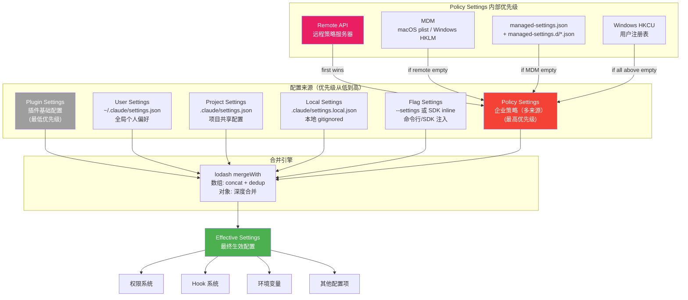

# s06 — 设置层级：从全局到策略的配置链

> "Configuration is a contract between user and system" · 预计阅读 18 分钟

**核心洞察：六层配置从企业 MDM 到项目 CLAUDE.md，低层覆盖高层但安全策略只能收紧不能放松。**

::: info Key Takeaways
- **六层配置层级** — plugin → user → project → local → flag → policy，越往下优先级越高
- **Policy Settings** — 企业通过 MDM 强制下发安全策略，first-wins 不可覆盖
- **数组合并定制器** — 配置合并时数组拼接而非覆盖，支持多层叠加
- **Context Engineering = Write** — 设置持久化到磁盘，跨会话生效
:::

## 问题

一个工程师在公司用 Claude Code 写代码。他有自己的全局偏好（比如用 Vim 键位），项目有共享配置（比如 lint 规则），他本地还有一些不想提交的个人设置（比如 API key），公司的安全团队通过策略强制禁用了 `bypassPermissions` 模式。

问题来了：**这四层配置如何合并？冲突时谁说了算？企业策略如何保证无法被个人设置覆盖？**

这不仅仅是"后面的覆盖前面的"这么简单。Claude Code 的设置系统需要在灵活性和控制力之间取得平衡：个人用户希望自由定制，团队希望共享统一配置，企业管理员需要强制执行安全策略。

## 架构图



## 核心机制

### 1. 六层配置源

Claude Code 的配置按优先级从低到高排列：

| 优先级 | 来源 | 文件路径 | 说明 |
|--------|------|---------|------|
| 0 (最低) | Plugin Settings | 插件目录 | 插件提供的基础配置 |
| 1 | userSettings | `~/.claude/settings.json` | 用户全局偏好 |
| 2 | projectSettings | `.claude/settings.json` | 项目共享配置（提交到 git） |
| 3 | localSettings | `.claude/settings.local.json` | 本地配置（自动加入 .gitignore） |
| 4 | flagSettings | `--settings` 参数或 SDK inline | 命令行注入 |
| 5 (最高) | policySettings | 企业策略（多来源） | 管理员强制策略 |

合并顺序是"后面覆盖前面"——`policySettings` 总是最终裁决者。

```
src/utils/settings/constants.ts -- SETTING_SOURCES 定义（5 种显式来源）
```

> **注意**：`SETTING_SOURCES` 常量只定义了 5 种来源（user / project / local / flag / policy）。Plugin Settings 不在此常量中，而是在 `loadSettingsFromDisk` 中作为最低优先级的隐式基础层单独加载。因此，实际加载层级为 6 层。

### 2. 合并策略

配置合并使用 lodash 的 `mergeWith`，有一个关键的自定义逻辑：

- **数组字段**：拼接 + 去重（`uniq([...target, ...source])`）
- **对象字段**：递归深度合并
- **标量字段**：直接覆盖

这意味着权限规则、hook 列表等数组字段是**累加的**——项目的 allow 规则会和用户的 allow 规则合并，而非替换。这是一个重要的设计决策。

特殊处理：`updateSettingsForSource` 中使用了不同的合并策略——数组字段是**替换**而非拼接。这是因为更新操作（如用户通过 UI 修改设置）应该是"设置为这个值"的语义，而非"追加这些值"。

```python
# 配置合并的自定义器
def settings_merge_customizer(obj_value, src_value):
    if isinstance(obj_value, list) and isinstance(src_value, list):
        # 数组：拼接 + 去重
        return list(dict.fromkeys(obj_value + src_value))
    # 其他：让 lodash 处理默认行为
    return None
```

```
src/utils/settings/settings.ts -- settingsMergeCustomizer
```

### 3. Policy Settings：企业策略的多来源体系

Policy Settings 是最高优先级的配置源，它本身有 4 个子来源，按**first-wins（第一个有效的就生效）**策略选择：

| 优先级 | 子来源 | 说明 | 平台 |
|--------|-------|------|------|
| 1 (最高) | Remote API | 从远程策略服务器同步 | 全平台 |
| 2 | MDM | macOS plist / Windows HKLM 注册表 | macOS + Windows |
| 3 | managed-settings.json | 文件系统（需要管理员权限写入） | 全平台 |
| 4 (最低) | HKCU | Windows 用户级注册表 | Windows |

注意：这里是 **first-wins** 而非 merge。如果远程策略存在，就忽略其他所有子来源。这简化了优先级判断——管理员不需要担心本地文件覆盖远程策略。

`managed-settings.json` 还支持 **drop-in 目录**（`managed-settings.d/*.json`），类似 systemd 的配置方式。多个团队可以独立部署配置文件（如 `10-security.json`、`20-otel.json`），按文件名字母序合并。这避免了多团队编辑同一文件的冲突。

```
src/utils/settings/settings.ts -- loadManagedFileSettings / getSettingsForSourceUncached
src/utils/settings/mdm/settings.ts -- getMdmSettings / getHkcuSettings
```

### 4. 安全关键配置的来源限制

并非所有配置项都允许从所有来源设置。Claude Code 对安全关键的配置项实施了**来源限制**：

**`skipDangerousModePermissionPrompt`**——跳过 bypass 模式的确认弹窗：
- 允许来源：userSettings, localSettings, flagSettings, policySettings
- **不允许**：projectSettings（防止恶意项目自动进入 bypass 模式 = RCE 风险）

**`skipAutoPermissionPrompt`**——跳过 auto 模式的确认弹窗：
- 同上，排除 projectSettings

**`allowManagedHooksOnly`** / **`allowManagedPermissionRulesOnly`**：
- 只在 policySettings 中生效
- 开启后禁用所有非策略来源的 hooks/规则

这些限制体现了**最小信任原则**：项目配置（可能来自不可信的 git 仓库）不应该能够降低安全等级。

```
src/utils/settings/settings.ts -- hasSkipDangerousModePermissionPrompt / hasAutoModeOptIn
```

### 5. 配置缓存与失效

设置系统使用三层缓存：

1. **文件级缓存**（`getCachedParsedFile`）：同一文件只解析一次
2. **来源级缓存**（`getCachedSettingsForSource`）：每个来源的合并结果缓存
3. **会话级缓存**（`getSessionSettingsCache`）：最终合并结果缓存

缓存通过 `resetSettingsCache()` 统一失效，触发时机包括：
- 设置文件变更（文件系统监听）
- 手动调用 `updateSettingsForSource`
- `getSettingsWithSources` 强制重新读取

**克隆防护**：从缓存返回的对象会被 `clone()` 深拷贝，防止调用方修改缓存数据。这是一个容易被忽视但非常重要的细节——`mergeWith` 会就地修改目标对象，如果直接返回缓存引用，后续的合并操作会污染缓存。

```
src/utils/settings/settingsCache.ts -- 缓存管理
src/utils/settings/settings.ts -- parseSettingsFile / getSettingsWithErrors
```

### 6. 配置验证

每个配置文件在加载时都会经过 Zod schema 验证。验证流程：

1. 读取文件内容
2. JSON 解析
3. 过滤无效的权限规则（`filterInvalidPermissionRules`）——单条规则无效不影响其他规则
4. Zod schema 校验（`SettingsSchema`）
5. 收集验证错误但尽量降级使用

关键设计：**单个配置项的无效不会导致整个文件被拒绝**。无效的权限规则会被过滤掉，其他有效的配置仍然生效。验证错误会被收集并在 UI 中展示给用户。

```
src/utils/settings/validation.ts -- filterInvalidPermissionRules / formatZodError
src/utils/settings/types.ts -- SettingsSchema
```

## Python 伪代码

<details>
<summary>展开查看完整 Python 伪代码（558 行）</summary>

```python
"""
Claude Code 设置层级系统的 Python 参考实现
覆盖：多层配置加载、合并策略、策略子来源、缓存
"""
import json
import os
from copy import deepcopy
from dataclasses import dataclass, field
from pathlib import Path
from typing import Optional, Dict, List, Any, Literal

# ============================================================
# 1. 配置来源定义
# ============================================================

SettingSource = Literal[
    "userSettings",
    "projectSettings",
    "localSettings",
    "flagSettings",
    "policySettings",
]

# 优先级从低到高
SETTING_SOURCES: List[SettingSource] = [
    "userSettings",
    "projectSettings",
    "localSettings",
    "flagSettings",
    "policySettings",
]

# 可编辑的来源（排除只读的 policy 和 flag）
EditableSource = Literal["userSettings", "projectSettings", "localSettings"]

# ============================================================
# 2. 配置 Schema（简化版）
# ============================================================

@dataclass
class PermissionsConfig:
    allow: List[str] = field(default_factory=list)
    deny: List[str] = field(default_factory=list)
    ask: List[str] = field(default_factory=list)
    default_mode: Optional[str] = None
    disable_bypass: Optional[str] = None
    additional_directories: List[str] = field(default_factory=list)

@dataclass
class HookCommand:
    type: str = "command"
    command: str = ""
    shell: str = "bash"
    timeout: Optional[int] = None

@dataclass
class HookMatcher:
    matcher: Optional[str] = None
    hooks: List[HookCommand] = field(default_factory=list)

@dataclass
class SettingsJson:
    """settings.json 的结构（简化版）"""
    permissions: Optional[PermissionsConfig] = None
    hooks: Optional[Dict[str, List[dict]]] = None
    env: Optional[Dict[str, str]] = None
    system_prompt: Optional[str] = None
    model: Optional[str] = None
    # 安全关键配置
    skip_dangerous_mode_prompt: Optional[bool] = None
    skip_auto_permission_prompt: Optional[bool] = None
    allow_managed_hooks_only: Optional[bool] = None
    allow_managed_permission_rules_only: Optional[bool] = None

# ============================================================
# 3. 合并策略
# ============================================================

def merge_settings(base: dict, override: dict) -> dict:
    """
    深度合并两个配置字典
    
    规则：
    - 数组：拼接 + 去重
    - 对象：递归合并
    - 标量：直接覆盖
    """
    result = deepcopy(base)

    for key, src_value in override.items():
        if key not in result:
            result[key] = deepcopy(src_value)
            continue

        obj_value = result[key]

        # 数组：拼接去重
        if isinstance(obj_value, list) and isinstance(src_value, list):
            seen = set()
            merged = []
            for item in obj_value + src_value:
                # 对于简单类型直接去重，复杂类型用 JSON 序列化
                key_repr = json.dumps(item, sort_keys=True) if isinstance(item, dict) else str(item)
                if key_repr not in seen:
                    seen.add(key_repr)
                    merged.append(item)
            result[key] = merged
        # 对象：递归合并
        elif isinstance(obj_value, dict) and isinstance(src_value, dict):
            result[key] = merge_settings(obj_value, src_value)
        # 标量：覆盖
        else:
            result[key] = deepcopy(src_value)

    return result

def update_merge_customizer(base: dict, update: dict) -> dict:
    """
    更新操作的合并策略（数组是替换，不是拼接）
    用于 updateSettingsForSource
    """
    result = deepcopy(base)

    for key, src_value in update.items():
        # undefined 表示删除
        if src_value is None:
            result.pop(key, None)
            continue

        # 数组：替换（不是拼接）
        if isinstance(src_value, list):
            result[key] = deepcopy(src_value)
        # 对象：递归
        elif isinstance(src_value, dict):
            if isinstance(result.get(key), dict):
                result[key] = update_merge_customizer(result[key], src_value)
            else:
                result[key] = deepcopy(src_value)
        else:
            result[key] = src_value

    return result

# ============================================================
# 4. 配置文件路径
# ============================================================

def get_claude_config_home() -> Path:
    """获取 Claude 配置主目录"""
    env_home = os.environ.get("CLAUDE_CONFIG_DIR")
    if env_home:
        return Path(env_home)
    return Path.home() / ".claude"

def get_settings_file_path(source: SettingSource, cwd: Path) -> Optional[Path]:
    """获取配置文件路径"""
    if source == "userSettings":
        return get_claude_config_home() / "settings.json"
    elif source == "projectSettings":
        return cwd / ".claude" / "settings.json"
    elif source == "localSettings":
        return cwd / ".claude" / "settings.local.json"
    elif source == "flagSettings":
        # 由 --settings 参数指定
        flag_path = os.environ.get("CLAUDE_SETTINGS_PATH")
        return Path(flag_path) if flag_path else None
    elif source == "policySettings":
        return get_managed_settings_path()
    return None

def get_managed_settings_path() -> Path:
    """获取企业策略配置路径"""
    import platform
    system = platform.system()
    if system == "Darwin":
        return Path("/Library/Application Support/ClaudeCode/managed-settings.json")
    elif system == "Windows":
        return Path(os.environ.get("PROGRAMDATA", "C:\\ProgramData")) / "ClaudeCode" / "managed-settings.json"
    else:
        return Path("/etc/claude-code/managed-settings.json")

# ============================================================
# 5. 配置缓存
# ============================================================

class SettingsCache:
    """三层缓存"""

    def __init__(self):
        self._file_cache: Dict[str, Optional[dict]] = {}
        self._source_cache: Dict[str, Optional[dict]] = {}
        self._session_cache: Optional[dict] = None

    def get_parsed_file(self, path: str) -> Optional[dict]:
        if path in self._file_cache:
            # 返回深拷贝防止缓存污染
            cached = self._file_cache[path]
            return deepcopy(cached) if cached else None
        return None  # cache miss

    def set_parsed_file(self, path: str, data: Optional[dict]):
        self._file_cache[path] = data

    def reset(self):
        """重置所有缓存"""
        self._file_cache.clear()
        self._source_cache.clear()
        self._session_cache = None

# 全局缓存实例
_cache = SettingsCache()

# ============================================================
# 6. Policy Settings 多来源加载
# ============================================================

def load_policy_settings() -> Optional[dict]:
    """
    企业策略加载（first-wins 策略）
    优先级：remote > MDM > file > HKCU
    """
    # 1. Remote（最高优先级）
    remote = load_remote_managed_settings()
    if remote:
        return remote

    # 2. MDM (macOS plist / Windows HKLM)
    mdm = load_mdm_settings()
    if mdm:
        return mdm

    # 3. 文件系统（managed-settings.json + drop-in 目录）
    file_settings = load_managed_file_settings()
    if file_settings:
        return file_settings

    # 4. HKCU（最低，Windows only）
    hkcu = load_hkcu_settings()
    if hkcu:
        return hkcu

    return None

def load_remote_managed_settings() -> Optional[dict]:
    """从远程策略服务器加载"""
    # 实际实现从缓存中读取，由后台同步任务定期更新
    return None

def load_mdm_settings() -> Optional[dict]:
    """从 MDM 加载（macOS plist / Windows HKLM）"""
    import platform
    if platform.system() == "Darwin":
        # 读取 /Library/Preferences/com.anthropic.claudecode.plist
        pass
    elif platform.system() == "Windows":
        # 读取 HKLM\SOFTWARE\Anthropic\ClaudeCode
        pass
    return None

def load_managed_file_settings() -> Optional[dict]:
    """
    加载 managed-settings.json + managed-settings.d/ drop-in 文件
    
    base 文件先加载（最低优先级），然后 drop-in 按字母序合并。
    类似 systemd 的 drop-in 目录设计。
    """
    base_path = get_managed_settings_path()
    merged = {}
    found = False

    # 1. 加载 base 文件
    base = parse_settings_file(str(base_path))
    if base:
        merged = merge_settings(merged, base)
        found = True

    # 2. 加载 drop-in 目录
    drop_in_dir = base_path.parent / "managed-settings.d"
    if drop_in_dir.is_dir():
        for json_file in sorted(drop_in_dir.glob("*.json")):
            if json_file.name.startswith("."):
                continue
            settings = parse_settings_file(str(json_file))
            if settings:
                merged = merge_settings(merged, settings)
                found = True

    return merged if found else None

def load_hkcu_settings() -> Optional[dict]:
    """从 Windows HKCU 注册表加载"""
    return None

# ============================================================
# 7. 配置文件解析
# ============================================================

def parse_settings_file(path: str) -> Optional[dict]:
    """解析配置文件"""
    # 检查缓存
    cached = _cache.get_parsed_file(path)
    if cached is not None:
        return cached

    try:
        content = Path(path).read_text()
        if not content.strip():
            _cache.set_parsed_file(path, {})
            return {}

        data = json.loads(content)

        # 过滤无效的权限规则（单条无效不影响其他规则）
        filter_invalid_permission_rules(data)

        # Schema 验证（简化版）
        if not isinstance(data, dict):
            _cache.set_parsed_file(path, None)
            return None

        _cache.set_parsed_file(path, data)
        return deepcopy(data)

    except FileNotFoundError:
        return None
    except json.JSONDecodeError as e:
        print(f"Warning: Invalid JSON in {path}: {e}")
        return None

def filter_invalid_permission_rules(data: dict) -> List[str]:
    """过滤无效的权限规则，返回警告信息"""
    warnings = []
    permissions = data.get("permissions", {})
    for behavior in ("allow", "deny", "ask"):
        rules = permissions.get(behavior, [])
        if not isinstance(rules, list):
            continue
        valid_rules = []
        for rule in rules:
            if isinstance(rule, str) and len(rule.strip()) > 0:
                valid_rules.append(rule)
            else:
                warnings.append(f"Invalid rule in {behavior}: {rule}")
        permissions[behavior] = valid_rules
    return warnings

# ============================================================
# 8. 核心加载函数
# ============================================================

def load_settings(
    cwd: Path,
    allowed_sources: Optional[List[SettingSource]] = None,
    flag_settings_path: Optional[str] = None,
    flag_settings_inline: Optional[dict] = None,
) -> dict:
    """
    加载并合并所有配置源
    
    这是设置系统的核心入口。
    按优先级从低到高合并：plugin → user → project → local → flag → policy
    """
    merged: dict = {}
    seen_files: set = set()

    # 确定启用的来源
    enabled_sources = allowed_sources or list(SETTING_SOURCES)
    # policy 和 flag 总是启用
    if "policySettings" not in enabled_sources:
        enabled_sources.append("policySettings")
    if "flagSettings" not in enabled_sources:
        enabled_sources.append("flagSettings")

    for source in enabled_sources:
        # Policy 特殊处理（first-wins 内部优先级）
        if source == "policySettings":
            policy = load_policy_settings()
            if policy:
                merged = merge_settings(merged, policy)
            continue

        # 获取文件路径
        file_path = get_settings_file_path(source, cwd)
        if not file_path:
            continue

        resolved = str(file_path.resolve())

        # 去重（避免 home 目录下 user 和 project 指向同一文件）
        if resolved in seen_files:
            continue
        seen_files.add(resolved)

        # 解析并合并
        settings = parse_settings_file(str(file_path))
        if settings:
            merged = merge_settings(merged, settings)

        # flag 来源还需要合并 inline 设置
        if source == "flagSettings" and flag_settings_inline:
            merged = merge_settings(merged, flag_settings_inline)

    return merged

# ============================================================
# 9. 设置更新
# ============================================================

def update_settings(
    source: EditableSource,
    updates: dict,
    cwd: Path,
) -> Optional[str]:
    """
    更新指定来源的配置文件
    
    注意：更新操作中数组是替换语义，不是拼接。
    这与 load_settings 中的合并策略不同。
    """
    if source not in ("userSettings", "projectSettings", "localSettings"):
        return "Cannot update read-only settings source"

    file_path = get_settings_file_path(source, cwd)
    if not file_path:
        return "No file path for source"

    # 读取现有配置
    existing = parse_settings_file(str(file_path)) or {}

    # 使用替换语义合并
    updated = update_merge_customizer(existing, updates)

    # 写入文件
    try:
        file_path.parent.mkdir(parents=True, exist_ok=True)
        file_path.write_text(json.dumps(updated, indent=2) + "\n")
    except Exception as e:
        return f"Failed to write settings: {e}"

    # 重置缓存
    _cache.reset()

    # local 设置自动加入 .gitignore
    if source == "localSettings":
        add_to_gitignore(cwd, ".claude/settings.local.json")

    return None  # 成功

def add_to_gitignore(cwd: Path, pattern: str):
    """将配置文件路径添加到 .gitignore"""
    gitignore = cwd / ".gitignore"
    if gitignore.exists():
        content = gitignore.read_text()
        if pattern not in content:
            with open(gitignore, "a") as f:
                f.write(f"\n{pattern}\n")
    else:
        gitignore.write_text(f"{pattern}\n")

# ============================================================
# 10. 安全配置的来源限制
# ============================================================

def has_skip_dangerous_mode_prompt(cwd: Path) -> bool:
    """
    检查是否跳过 bypass 模式确认弹窗
    
    关键安全限制：projectSettings 被排除！
    因为恶意项目可以通过 .claude/settings.json 自动进入 bypass 模式。
    """
    TRUSTED_SOURCES: List[SettingSource] = [
        "userSettings", "localSettings", "flagSettings", "policySettings"
    ]
    for source in TRUSTED_SOURCES:
        file_path = get_settings_file_path(source, cwd)
        if file_path:
            settings = parse_settings_file(str(file_path))
            if settings and settings.get("skipDangerousModePermissionPrompt"):
                return True
    return False

def should_allow_managed_only(setting_key: str, cwd: Path) -> bool:
    """
    检查是否只允许策略级别的配置
    (allowManagedHooksOnly / allowManagedPermissionRulesOnly)
    """
    policy = load_policy_settings()
    if policy:
        return policy.get(setting_key, False) is True
    return False

# ============================================================
# 11. 配置来源溯源
# ============================================================

@dataclass
class SettingsWithSources:
    """配置及其来源信息"""
    effective: dict  # 最终合并结果
    sources: List[dict]  # 每层的原始配置

def get_settings_with_sources(cwd: Path) -> SettingsWithSources:
    """
    获取最终配置及每层来源，用于 /status 命令展示。
    强制从磁盘重新读取以保证一致性。
    """
    _cache.reset()

    sources = []
    for source in SETTING_SOURCES:
        if source == "policySettings":
            settings = load_policy_settings()
        else:
            file_path = get_settings_file_path(source, cwd)
            settings = parse_settings_file(str(file_path)) if file_path else None

        if settings and len(settings) > 0:
            sources.append({"source": source, "settings": settings})

    effective = load_settings(cwd)
    return SettingsWithSources(effective=effective, sources=sources)


# ============================================================
# 使用示例
# ============================================================

if __name__ == "__main__":
    cwd = Path.cwd()

    # 合并策略演示
    user = {"permissions": {"allow": ["Read"], "deny": ["Bash(rm:*)"]}}
    project = {"permissions": {"allow": ["Write"], "deny": []}, "model": "claude-sonnet"}
    local = {"env": {"DEBUG": "1"}}
    policy = {"permissions": {"deny": ["Bash(curl:*)"]}, "permissions.disableBypassPermissionsMode": "disable"}

    # 逐层合并
    merged = merge_settings({}, user)
    merged = merge_settings(merged, project)
    merged = merge_settings(merged, local)
    merged = merge_settings(merged, policy)

    print("Effective permissions.allow:", merged.get("permissions", {}).get("allow"))
    # -> ["Read", "Write"]  (拼接去重)

    print("Effective permissions.deny:", merged.get("permissions", {}).get("deny"))
    # -> ["Bash(rm:*)", "Bash(curl:*)"]  (拼接去重)

    print("Effective model:", merged.get("model"))
    # -> "claude-sonnet"  (标量覆盖)

    # 更新语义演示（数组替换）
    base = {"permissions": {"allow": ["Read", "Write"]}}
    update = {"permissions": {"allow": ["Read"]}}  # 只保留 Read
    result = update_merge_customizer(base, update)
    print("After update:", result.get("permissions", {}).get("allow"))
    # -> ["Read"]  (替换，不是拼接)
```

</details>

## 源码映射

| 概念 | 真实源码路径 | 说明 |
|------|-------------|------|
| 配置来源定义 | `src/utils/settings/constants.ts` | `SETTING_SOURCES` 数组 + `SettingSource` 类型 |
| 来源优先级 | `src/utils/settings/constants.ts` | `getEnabledSettingSources` 函数 |
| 合并引擎 | `src/utils/settings/settings.ts` | `loadSettingsFromDisk` + `settingsMergeCustomizer` |
| 来源级加载 | `src/utils/settings/settings.ts` | `getSettingsForSource` / `getSettingsForSourceUncached` |
| 文件解析 | `src/utils/settings/settings.ts` | `parseSettingsFile` / `parseSettingsFileUncached` |
| 配置更新 | `src/utils/settings/settings.ts` | `updateSettingsForSource` |
| 来源路径映射 | `src/utils/settings/settings.ts` | `getSettingsFilePathForSource` |
| 策略子来源 | `src/utils/settings/settings.ts` | `getPolicySettingsOrigin`（remote > plist > file > hkcu） |
| managed 文件加载 | `src/utils/settings/settings.ts` | `loadManagedFileSettings` (base + drop-in) |
| MDM 加载 | `src/utils/settings/mdm/settings.ts` | `getMdmSettings` / `getHkcuSettings` |
| managed 路径 | `src/utils/settings/managedPath.ts` | `getManagedFilePath` / `getManagedSettingsDropInDir` |
| 缓存管理 | `src/utils/settings/settingsCache.ts` | 三层缓存 + `resetSettingsCache` |
| 配置 Schema | `src/utils/settings/types.ts` | `SettingsSchema`、`PermissionsSchema`、`HooksSchema` |
| 验证与过滤 | `src/utils/settings/validation.ts` | `filterInvalidPermissionRules` / `formatZodError` |
| 安全配置限制 | `src/utils/settings/settings.ts` | `hasSkipDangerousModePermissionPrompt` / `hasAutoModeOptIn` |
| 内部写入标记 | `src/utils/settings/internalWrites.ts` | `markInternalWrite` 防止文件变更触发多余的重载 |

## 设计决策

### 合并型配置 vs. 覆盖型配置

Claude Code 选择了**合并型**配置——数组拼接去重，对象深度合并。这与许多工具采用的"后面完全覆盖前面"策略不同。

合并型的优势在于**可组合性**：项目可以在用户配置基础上*增加*规则，而非替换。管理员可以在任何层级*追加*限制，而不需要重复定义基础规则。

但这也带来了一个微妙的问题：**你无法在高优先级层删除低优先级层的规则**。如果 userSettings 中允许了 `Read`，projectSettings 无法"取消"这个允许——只能另外添加一条 deny 规则。Claude Code 通过 deny 优先级高于 allow 来处理这个问题。

对比 OpenCode 的方式：OpenCode 使用 system managed config 目录，配置文件按命名空间隔离，不做跨文件合并。这更简单但灵活性较低——每个配置文件是自包含的，无法继承和叠加。

| 维度 | Claude Code | OpenCode |
|------|------------|---------|
| 合并方式 | 深度合并 + 数组拼接 | 文件级隔离 |
| 继承关系 | 低优先级被高优先级增强 | 独立配置不继承 |
| 删除能力 | 需要用反向规则（deny） | 直接在文件中删除 |
| 企业策略 | 最高优先级 + first-wins | 管理员目录 |
| 冲突处理 | 规则级别（deny > allow） | 无冲突（隔离） |

### 为什么 projectSettings 是"不可信"的？

Claude Code 明确将 `projectSettings`（`.claude/settings.json`）视为**部分不可信**来源。安全敏感的配置项（如跳过权限确认弹窗）不允许从项目配置中设置。

原因很简单：**项目配置来自 git 仓库**。一个恶意的 PR 可以在 `.claude/settings.json` 中加入 `"skipDangerousModePermissionPrompt": true`，导致下一个 clone 这个仓库的开发者自动进入 bypass 模式。这是一个经典的**供应链攻击向量**。

通过来源限制，即使恶意配置被合并进来，安全关键的配置项也会被忽略。

### drop-in 目录的 systemd 式设计

`managed-settings.d/` 的 drop-in 目录设计借鉴了 systemd 和 sudoers 的经验：

1. **多团队无冲突**：安全团队维护 `10-security.json`，可观测团队维护 `20-otel.json`，互不干扰
2. **可预测的合并顺序**：按文件名字母序，数字前缀控制优先级
3. **base 文件可选**：`managed-settings.json` 提供默认值，drop-in 文件覆盖

这在大型组织中非常实用，避免了"所有策略挤在一个文件里，合并冲突频繁"的问题。

## Why：设计决策与行业上下文

### 为什么需要四层配置而非一个配置文件

Claude Code 的设置系统（全局 → 项目 → 本地 → 远程策略）是 Harness Engineering 的经典模式 [R1-1][R1-5]。每一层都能覆盖上一层，同时保留最高层的安全底线。

这种分层设计解决了一个核心矛盾：**个人灵活性 vs 组织安全性**。开发者可以在本地自由配置偏好（不提交 git），企业可以通过远程策略锁定安全选项（MDM 推送），两者互不冲突。

### 配置链与 Harness 三个旋钮

LangChain 总结了 harness 上的三个关键调节旋钮 [R1-2]：system prompt、tool choice 和 execution flow。Claude Code 的设置系统是这三个旋钮的**持久化载体**——它决定了哪些工具可用（allowedTools/disallowedTools）、权限模式如何运作（permissions）、以及 Agent 的行为基线（memory/skills 开关）。

> **参考来源：** Philschmid [R1-1]、LangChain [R1-2]、Anthropic [R1-5]。完整引用见 `docs/research/05-harness-trends-deep-20260401.md`。

## 变化表

| 层次 | 与上一课相比新增 |
|------|-----------------|
| 配置来源 | 6 层配置源（plugin → user → project → local → flag → policy） |
| 合并引擎 | lodash mergeWith + 自定义合并器（数组拼接、对象深度合并） |
| 策略体系 | Policy Settings 的 4 级 first-wins 子来源 |
| 安全约束 | 配置项的来源限制（projectSettings 排除安全敏感项） |
| 缓存系统 | 三层缓存（文件级 → 来源级 → 会话级）+ 克隆防护 |
| 验证机制 | Zod schema 验证 + 无效规则过滤 + 渐进降级 |

## 动手试试

### 练习 1：实现多层配置加载器

基于上面的 Python 伪代码，创建一个完整的配置加载器，要求：
1. 支持至少 3 层配置（user / project / policy）
2. 数组字段拼接去重
3. 对象字段深度合并
4. 标量字段覆盖

测试用例：
```python
user = {"permissions": {"allow": ["Read"]}, "model": "sonnet"}
project = {"permissions": {"allow": ["Write"]}, "model": "opus"}
policy = {"permissions": {"deny": ["Bash(rm:*)"]}}

result = load_all([user, project, policy])
assert result["permissions"]["allow"] == ["Read", "Write"]
assert result["permissions"]["deny"] == ["Bash(rm:*)"]
assert result["model"] == "opus"  # 标量被覆盖
```

### 练习 2：实现 first-wins 策略加载

实现 Policy Settings 的 first-wins 逻辑。创建 4 个模拟的策略来源（remote / mdm / file / hkcu），验证只有第一个非空来源生效。

考虑边界情况：
- 所有来源都为空
- remote 存在但内容为空字典 `{}`
- 多个来源都有内容，但应该只用第一个

### 练习 3：设计"配置审计"功能

企业管理员需要知道最终生效的配置中，每个字段来自哪个来源。设计一个 `audit_settings()` 函数，返回类似这样的结果：

```python
{
    "permissions.allow[0]='Read'": "userSettings",
    "permissions.allow[1]='Write'": "projectSettings",
    "permissions.deny[0]='Bash(rm:*)'": "policySettings",
    "model='opus'": "projectSettings",  # 虽然 user 也设了，但被 project 覆盖
}
```

思考：对于数组字段的拼接合并，如何追踪每个元素的来源？这比标量覆盖要复杂得多。

### 综合练习：端到端安全策略配置（s04-s06 三课综合）

1. 在 `~/.claude/settings.json` 中添加 deny 规则禁止 `rm -rf`
2. 配置一个 PreToolUse hook 记录所有 Bash 命令到 `/tmp/claude-audit.log`
3. 分别用 `default` 和 `bypassPermissions` 模式测试，观察行为差异
4. 思考：`bypassPermissions` 模式下 deny 规则是否仍然生效？（提示：查看 safetyCheck 的免疫设计——deny 规则在 Phase 1 检查，优先级高于任何模式，所以 bypass 也无法绕过 deny rule。）

## 推荐阅读

- [Claude Code CLAUDE.md Best Practices](https://uxplanet.org/) — CLAUDE.md 配置的 10 个推荐章节

---

## 模拟场景

<!--@include: ./_fragments/sim-s06.md-->

## 架构决策卡片

<!--@include: ./_fragments/ann-s06.md-->
