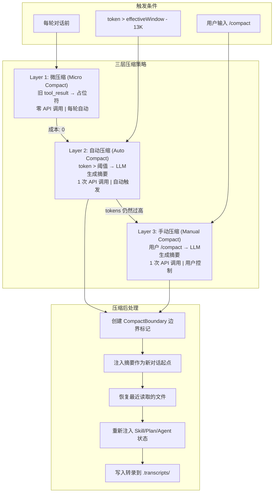

# s07 — 上下文压缩：无限对话的秘密

> "Forget wisely, remember what matters"

::: info Key Takeaways
- **三层压缩策略** — micro-compact (工具结果裁剪) → auto-compact (阈值触发摘要) → manual-compact (手动)
- **LLM 做摘要** — 用一次额外的 API 调用将旧消息压缩为摘要，保留关键信息
- **compact_boundary 标记** — 分隔"已压缩"和"完整保留"的消息边界
- **Context Engineering = Compress** — 这是四策略中最直接的压缩实现
:::

## 问题

对话越来越长，上下文窗口装不下了怎么办？

LLM 有固定的上下文窗口（比如 200K tokens）。一次对话中，用户的每条消息、每次工具调用的输入和输出、模型的每次回复，全部累积在上下文里。当你让 agent 读 10 个文件、运行 5 次命令后，token 用量可能已经超过 100K。

如果什么都不做，最终 API 会返回 `prompt_too_long` 错误，对话直接中断。用户只能开新会话，从零开始——之前的讨论、修改的文件、发现的 bug，全部丢失。

Claude Code 用**三层渐进式压缩**解决这个问题：从最廉价的局部替换，到中等成本的自动摘要，再到用户主动触发的手动压缩。三层各有触发条件，层层递进，确保对话可以无限进行下去。

## 架构图



## 核心机制

### Layer 1: 微压缩 (Micro Compact)

微压缩是成本最低的压缩策略——不调用任何 API，只是把旧的 `tool_result` 内容替换为占位符字符串 `[Old tool result content cleared]`。

具体来说，Claude Code 维护了一个"可压缩工具"列表：

```
Read, Bash, Grep, Glob, WebSearch, WebFetch, Edit, Write
```

这些工具的历史输出往往很大（比如一次 `grep` 可能返回几百行），但对后续对话的价值递减——模型早已处理过了。微压缩会保留最近 N 个工具结果，清除更早的。

微压缩有两种触发方式：

**计数触发**（Cached Micro Compact）：当可压缩的 tool_result 数量超过阈值时触发。这种方式利用 API 的 `cache_edits` 能力，在不破坏 prompt cache 的前提下删除旧的工具结果——这意味着不仅省了上下文空间，连 cache 都不用重建。

**时间触发**（Time-based Micro Compact）：当距离上次助手回复超过一定时间（比如 1 小时）时触发。此时 server 端缓存已经过期了，不需要保留缓存兼容性，直接修改消息内容即可。

### Layer 2: 自动压缩 (Auto Compact)

当微压缩不够用，token 用量逼近上下文窗口极限时，自动压缩介入。

**触发条件**：

```
tokenCount >= effectiveContextWindow - AUTOCOMPACT_BUFFER_TOKENS (13,000)
```

其中 `effectiveContextWindow = contextWindow - maxOutputTokens`（要给模型留输出空间）。

自动压缩的流程：

1. 先尝试 **Session Memory Compaction**——一种更轻量的压缩，保留最近的消息，只压缩更早的部分
2. 如果不适用，执行完整的 **LLM 摘要压缩**：把整个对话发给模型，要求生成结构化摘要

摘要 prompt 要求模型输出 9 个部分：Primary Request、Key Technical Concepts、Files and Code、Errors and Fixes、Problem Solving、All User Messages、Pending Tasks、Current Work、Optional Next Step。

关键设计：摘要 prompt 中有一个 `<analysis>` scratchpad，让模型先做分析再写摘要，提高摘要质量。最终注入上下文时，`<analysis>` 部分会被 `formatCompactSummary()` 去掉，只保留 `<summary>`。

**熔断器**：如果连续自动压缩失败超过 3 次，停止重试，避免无限循环浪费 API 调用。

### Layer 3: 手动压缩 (Manual Compact)

用户通过 `/compact` 命令主动触发。与自动压缩的核心逻辑相同，但有几个区别：

1. 可以附加自定义指令（比如 "压缩时重点保留测试相关的代码"）
2. 支持**局部压缩**（Partial Compact）：用户可以选择一条消息作为分界点，只压缩该消息之前或之后的内容
3. 不抑制后续问题——自动压缩会告诉模型"不要问问题直接继续"，手动压缩不会

### 压缩后恢复

压缩不是简单地丢掉旧消息。Claude Code 会在压缩后做一系列恢复工作：

1. **文件恢复**：把最近读取的 5 个文件重新注入上下文（token budget 50K），这样模型不需要重新读取
2. **Skill 恢复**：把已调用的 Skill 内容重新注入（每个 Skill 最多 5K tokens，总共 25K budget）
3. **Plan 恢复**：如果存在 Plan 文件，重新注入
4. **Agent 状态恢复**：如果有异步子 Agent 在运行，重新通知模型
5. **工具声明恢复**：重新声明 deferred tools 和 MCP 工具
6. **Hook 执行**：运行 pre_compact / post_compact / session_start hooks

### 转录持久化

压缩前的完整对话被写入 `.transcripts/` 目录。摘要消息中会包含转录路径，告诉模型："如果你需要压缩前的具体细节（代码片段、错误信息等），可以读取转录文件"。

这是一个精妙的设计——摘要提供概览，转录提供精确回溯能力。模型可以按需回到转录里查找任何细节。

## Python 伪代码

```python
"""
Claude Code 三层压缩引擎的 Python 参考实现。

三层策略：
  Layer 1 - 微压缩：替换旧 tool_result，零 API 调用
  Layer 2 - 自动压缩：token 超阈值，LLM 生成摘要
  Layer 3 - 手动压缩：用户 /compact 触发
"""

from dataclasses import dataclass, field
from typing import Optional
from enum import Enum


# ─── 常量 ──────────────────────────────────────────────

AUTOCOMPACT_BUFFER_TOKENS = 13_000
MAX_OUTPUT_TOKENS_FOR_SUMMARY = 20_000
POST_COMPACT_MAX_FILES = 5
POST_COMPACT_TOKEN_BUDGET = 50_000
POST_COMPACT_SKILLS_TOKEN_BUDGET = 25_000
MAX_CONSECUTIVE_FAILURES = 3
CLEARED_MESSAGE = "[Old tool result content cleared]"

COMPACTABLE_TOOLS = {
    "Read", "Bash", "Grep", "Glob",
    "WebSearch", "WebFetch", "Edit", "Write",
}


class CompactTrigger(Enum):
    AUTO = "auto"
    MANUAL = "manual"


@dataclass
class Message:
    role: str                    # "user" | "assistant" | "system"
    content: list                # 消息内容块列表
    uuid: str = ""
    timestamp: float = 0.0
    is_compact_summary: bool = False
    tool_use_id: str = ""       # tool_result 的引用 ID
    tool_name: str = ""         # tool_use 的工具名


@dataclass
class CompactBoundary:
    """压缩边界标记——标识压缩发生的位置"""
    trigger: CompactTrigger
    pre_compact_tokens: int
    previous_message_uuid: str = ""
    pre_compact_discovered_tools: list = field(default_factory=list)


@dataclass
class CompactionResult:
    boundary: CompactBoundary
    summary_messages: list[Message]
    attachments: list[Message]    # 文件恢复、Skill 恢复等
    messages_to_keep: list[Message] = field(default_factory=list)
    pre_compact_tokens: int = 0
    post_compact_tokens: int = 0


# ─── Layer 1: 微压缩 ────────────────────────────────────

@dataclass
class MicroCompactState:
    """跟踪已注册的 tool_result，决定哪些可以清除"""
    tool_order: list[str] = field(default_factory=list)      # 按出现顺序
    registered_tools: set[str] = field(default_factory=set)   # 已注册的 tool_use_id
    deleted_refs: set[str] = field(default_factory=set)       # 已通过 cache_edits 删除的

    # 配置
    trigger_threshold: int = 20   # 超过此数量触发
    keep_recent: int = 5          # 保留最近 N 个


class MicroCompactEngine:
    """Layer 1: 零成本微压缩"""

    def __init__(self):
        self.state = MicroCompactState()

    def collect_compactable_tool_ids(self, messages: list[Message]) -> list[str]:
        """收集所有可压缩工具的 tool_use_id"""
        ids = []
        for msg in messages:
            if msg.role == "assistant":
                for block in msg.content:
                    if (block.get("type") == "tool_use"
                            and block.get("name") in COMPACTABLE_TOOLS):
                        ids.append(block["id"])
        return ids

    def time_based_compact(
        self,
        messages: list[Message],
        gap_minutes: float,
        gap_threshold: float = 60.0,
        keep_recent: int = 5,
    ) -> Optional[list[Message]]:
        """
        时间触发微压缩：距上次助手回复超过阈值时，
        清除旧 tool_result 内容。缓存已过期，直接改内容。
        """
        if gap_minutes < gap_threshold:
            return None

        compactable_ids = self.collect_compactable_tool_ids(messages)
        keep_recent = max(1, keep_recent)
        keep_set = set(compactable_ids[-keep_recent:])
        clear_set = set(id for id in compactable_ids if id not in keep_set)

        if not clear_set:
            return None

        result = []
        for msg in messages:
            if msg.role != "user":
                result.append(msg)
                continue

            new_content = []
            touched = False
            for block in msg.content:
                if (block.get("type") == "tool_result"
                        and block.get("tool_use_id") in clear_set
                        and block.get("content") != CLEARED_MESSAGE):
                    new_content.append({
                        **block,
                        "content": CLEARED_MESSAGE,
                    })
                    touched = True
                else:
                    new_content.append(block)

            if touched:
                result.append(Message(
                    role=msg.role,
                    content=new_content,
                    uuid=msg.uuid,
                    timestamp=msg.timestamp,
                ))
            else:
                result.append(msg)

        return result

    def cached_compact(
        self,
        messages: list[Message],
    ) -> Optional[dict]:
        """
        计数触发微压缩：通过 cache_edits API 删除旧 tool_result，
        不破坏 prompt cache。返回 cache_edits 指令而非修改消息。
        """
        compactable_ids = set(self.collect_compactable_tool_ids(messages))

        # 注册新的 tool_result
        for msg in messages:
            if msg.role == "user":
                for block in msg.content:
                    if (block.get("type") == "tool_result"
                            and block.get("tool_use_id") in compactable_ids
                            and block["tool_use_id"] not in self.state.registered_tools):
                        self.state.registered_tools.add(block["tool_use_id"])
                        self.state.tool_order.append(block["tool_use_id"])

        # 检查是否需要压缩
        active_count = len(self.state.tool_order) - len(self.state.deleted_refs)
        if active_count <= self.state.trigger_threshold:
            return None

        # 计算要删除的 tool_result
        active_tools = [
            tid for tid in self.state.tool_order
            if tid not in self.state.deleted_refs
        ]
        to_delete = active_tools[:-self.state.keep_recent]

        if not to_delete:
            return None

        # 标记为已删除
        self.state.deleted_refs.update(to_delete)

        # 返回 cache_edits 指令（API 层处理）
        return {
            "type": "cache_edits",
            "edits": [
                {"type": "delete", "tool_use_id": tid}
                for tid in to_delete
            ],
        }


def micro_compact(
    messages: list[Message],
    gap_minutes: float = 0.0,
) -> tuple[list[Message], Optional[dict]]:
    """
    微压缩入口：先尝试时间触发，再尝试缓存编辑。
    返回 (可能修改的消息列表, 可能的 cache_edits 指令)。
    """
    engine = MicroCompactEngine()

    # 时间触发优先（cache 已过期，直接改内容）
    time_result = engine.time_based_compact(messages, gap_minutes)
    if time_result is not None:
        return time_result, None

    # 缓存编辑（保持 cache 热度）
    cache_edits = engine.cached_compact(messages)
    return messages, cache_edits


# ─── Layer 2 & 3: LLM 摘要压缩 ──────────────────────────

COMPACT_PROMPT_TEMPLATE = """Your task is to create a detailed summary of the conversation so far.

Before providing your final summary, wrap your analysis in <analysis> tags.
In your analysis:
1. Chronologically analyze each section of the conversation
2. Identify: user requests, approach, key decisions, code patterns,
   file names, code snippets, errors and fixes
3. Pay special attention to user feedback

Your summary should include these sections:
1. Primary Request and Intent
2. Key Technical Concepts
3. Files and Code Sections (with snippets)
4. Errors and fixes
5. Problem Solving
6. All user messages (non-tool-result)
7. Pending Tasks
8. Current Work
9. Optional Next Step

{custom_instructions}
"""


def format_compact_summary(raw_summary: str) -> str:
    """去掉 <analysis> scratchpad，只保留 <summary> 内容"""
    import re

    # 移除 analysis 部分
    result = re.sub(r"<analysis>[\s\S]*?</analysis>", "", raw_summary)

    # 提取 summary 内容
    match = re.search(r"<summary>([\s\S]*?)</summary>", result)
    if match:
        content = match.group(1).strip()
        result = result.replace(match.group(0), f"Summary:\n{content}")

    # 清理多余空行
    result = re.sub(r"\n\n+", "\n\n", result)
    return result.strip()


def get_effective_context_window(model: str) -> int:
    """计算有效上下文窗口大小"""
    context_window = get_context_window_for_model(model)  # e.g., 200_000
    max_output = get_max_output_tokens(model)              # e.g., 16_384
    reserved = min(max_output, MAX_OUTPUT_TOKENS_FOR_SUMMARY)
    return context_window - reserved


def should_auto_compact(messages: list[Message], model: str) -> bool:
    """判断是否需要自动压缩"""
    effective_window = get_effective_context_window(model)
    threshold = effective_window - AUTOCOMPACT_BUFFER_TOKENS
    token_count = estimate_token_count(messages)
    return token_count >= threshold


class CompactionEngine:
    """三层压缩引擎"""

    def __init__(self, model: str = "claude-sonnet-4-20250514"):
        self.model = model
        self.micro_engine = MicroCompactEngine()
        self.consecutive_failures = 0
        self.transcript_path = ".transcripts/"

    # ── Layer 2: 自动压缩 ──

    async def auto_compact_if_needed(
        self,
        messages: list[Message],
    ) -> Optional[CompactionResult]:
        """自动压缩：token 超阈值时触发"""

        # 熔断器：连续失败过多则跳过
        if self.consecutive_failures >= MAX_CONSECUTIVE_FAILURES:
            return None

        if not should_auto_compact(messages, self.model):
            return None

        try:
            result = await self._compact_conversation(
                messages=messages,
                is_auto=True,
                suppress_questions=True,
            )
            self.consecutive_failures = 0
            return result
        except Exception:
            self.consecutive_failures += 1
            return None

    # ── Layer 3: 手动压缩 ──

    async def manual_compact(
        self,
        messages: list[Message],
        custom_instructions: str = "",
    ) -> CompactionResult:
        """手动压缩：用户 /compact 触发"""
        return await self._compact_conversation(
            messages=messages,
            is_auto=False,
            suppress_questions=False,
            custom_instructions=custom_instructions,
        )

    async def partial_compact(
        self,
        messages: list[Message],
        pivot_index: int,
        direction: str = "from",    # "from" 或 "up_to"
        user_feedback: str = "",
    ) -> CompactionResult:
        """
        局部压缩：用户选择一条消息作为分界点。
        - direction='from': 压缩 pivot 之后的消息，保留之前的（保持缓存）
        - direction='up_to': 压缩 pivot 之前的消息，保留之后的
        """
        if direction == "up_to":
            to_summarize = messages[:pivot_index]
            to_keep = messages[pivot_index:]
        else:
            to_summarize = messages[pivot_index:]
            to_keep = messages[:pivot_index]

        summary = await self._generate_summary(
            to_summarize, direction=direction
        )
        return self._build_result(
            messages, summary,
            is_auto=False,
            messages_to_keep=to_keep,
        )

    # ── 内部实现 ──

    async def _compact_conversation(
        self,
        messages: list[Message],
        is_auto: bool,
        suppress_questions: bool,
        custom_instructions: str = "",
    ) -> CompactionResult:
        """执行完整的 LLM 摘要压缩"""

        pre_compact_tokens = estimate_token_count(messages)

        # 1. 执行 pre_compact hooks
        hook_instructions = await execute_pre_compact_hooks(
            trigger="auto" if is_auto else "manual"
        )
        if hook_instructions:
            custom_instructions = f"{custom_instructions}\n\n{hook_instructions}"

        # 2. 准备压缩 prompt
        prompt = COMPACT_PROMPT_TEMPLATE.format(
            custom_instructions=custom_instructions or ""
        )

        # 3. 预处理：去除图片、去除会被重新注入的附件
        clean_messages = self._strip_images(messages)
        clean_messages = self._strip_reinjected_attachments(clean_messages)

        # 4. 调用 LLM 生成摘要（支持 prompt-too-long 重试）
        summary = await self._generate_summary_with_retry(
            clean_messages, prompt, pre_compact_tokens
        )

        # 5. 构建结果
        return self._build_result(
            messages, summary,
            is_auto=is_auto,
            suppress_questions=suppress_questions,
        )

    async def _generate_summary_with_retry(
        self,
        messages: list[Message],
        prompt: str,
        pre_compact_tokens: int,
        max_retries: int = 3,
    ) -> str:
        """
        生成摘要，如果遇到 prompt_too_long 错误，
        截断最老的 API 轮次后重试。
        """
        current_messages = messages

        for attempt in range(max_retries + 1):
            summary = await self._call_llm_for_summary(
                current_messages, prompt
            )

            if not summary.startswith("prompt_too_long"):
                return format_compact_summary(summary)

            # 按 API 轮次分组，丢弃最老的组
            groups = group_messages_by_api_round(current_messages)
            if len(groups) < 2:
                raise Exception("Conversation too long, cannot compact")

            drop_count = max(1, int(len(groups) * 0.2))
            drop_count = min(drop_count, len(groups) - 1)
            current_messages = [
                msg for group in groups[drop_count:] for msg in group
            ]

        raise Exception("Failed to compact after retries")

    async def _generate_summary(
        self,
        messages: list[Message],
        direction: str = "full",
    ) -> str:
        """调用 LLM 生成摘要"""
        summary = await self._call_llm_for_summary(messages, "")
        return format_compact_summary(summary)

    async def _call_llm_for_summary(
        self,
        messages: list[Message],
        prompt: str,
    ) -> str:
        """实际的 LLM API 调用（mock）"""
        # 实际实现中调用 queryModelWithStreaming
        return "<analysis>...</analysis><summary>...</summary>"

    def _build_result(
        self,
        original_messages: list[Message],
        summary: str,
        is_auto: bool,
        suppress_questions: bool = False,
        messages_to_keep: list[Message] | None = None,
    ) -> CompactionResult:
        """构建压缩结果，包括所有恢复附件"""

        pre_compact_tokens = estimate_token_count(original_messages)

        # 1. 创建边界标记
        boundary = CompactBoundary(
            trigger=CompactTrigger.AUTO if is_auto else CompactTrigger.MANUAL,
            pre_compact_tokens=pre_compact_tokens,
            previous_message_uuid=original_messages[-1].uuid if original_messages else "",
        )

        # 2. 创建摘要消息
        summary_text = self._format_summary_message(
            summary, suppress_questions
        )
        summary_msg = Message(
            role="user",
            content=[{"type": "text", "text": summary_text}],
            is_compact_summary=True,
        )

        # 3. 收集恢复附件
        attachments = []
        attachments.extend(self._restore_recent_files())
        attachments.extend(self._restore_skills())
        attachments.extend(self._restore_plan())
        attachments.extend(self._restore_agent_status())
        attachments.extend(self._restore_tool_declarations())

        return CompactionResult(
            boundary=boundary,
            summary_messages=[summary_msg],
            attachments=attachments,
            messages_to_keep=messages_to_keep or [],
            pre_compact_tokens=pre_compact_tokens,
        )

    def _format_summary_message(
        self,
        summary: str,
        suppress_questions: bool,
    ) -> str:
        """格式化摘要消息，注入转录路径"""
        base = (
            "This session is being continued from a previous conversation "
            "that ran out of context. The summary below covers the earlier "
            f"portion of the conversation.\n\n{summary}"
        )

        base += (
            f"\n\nIf you need specific details from before compaction, "
            f"read the full transcript at: {self.transcript_path}"
        )

        if suppress_questions:
            base += (
                "\nContinue the conversation from where it left off "
                "without asking the user any further questions."
            )

        return base

    # ── 恢复方法 ──

    def _restore_recent_files(self) -> list[Message]:
        """恢复最近读取的文件（最多 5 个，总共 50K tokens）"""
        # 按时间倒序，逐个加入直到 budget 用完
        return []  # 实际从 readFileState cache 读取

    def _restore_skills(self) -> list[Message]:
        """恢复已调用的 Skills（每个最多 5K tokens）"""
        return []  # 实际从 invokedSkills 读取

    def _restore_plan(self) -> list[Message]:
        """恢复 Plan 文件"""
        return []  # 实际从 Plan 文件读取

    def _restore_agent_status(self) -> list[Message]:
        """恢复异步 Agent 状态"""
        return []  # 实际从 tasks 状态读取

    def _restore_tool_declarations(self) -> list[Message]:
        """重新声明 deferred tools 和 MCP 工具"""
        return []

    def _strip_images(self, messages: list[Message]) -> list[Message]:
        """移除消息中的图片块，替换为 [image] 占位符"""
        result = []
        for msg in messages:
            if msg.role != "user":
                result.append(msg)
                continue
            new_content = []
            for block in msg.content:
                if block.get("type") == "image":
                    new_content.append({"type": "text", "text": "[image]"})
                else:
                    new_content.append(block)
            result.append(Message(role=msg.role, content=new_content, uuid=msg.uuid))
        return result

    def _strip_reinjected_attachments(
        self, messages: list[Message]
    ) -> list[Message]:
        """移除压缩后会被重新注入的附件（如 skill_listing）"""
        return [
            msg for msg in messages
            if not (hasattr(msg, 'attachment_type')
                    and msg.attachment_type in ('skill_discovery', 'skill_listing'))
        ]


# ─── 辅助函数 ──────────────────────────────────────────

def group_messages_by_api_round(messages: list[Message]) -> list[list[Message]]:
    """
    按 API 轮次分组消息。每次新的 assistant 回复（不同 message.id）
    开始一个新组。这比按"用户消息"分组更细粒度——
    一次用户消息可能触发多轮 agent 循环。
    """
    groups: list[list[Message]] = []
    current: list[Message] = []
    last_assistant_id = None

    for msg in messages:
        if (msg.role == "assistant"
                and msg.uuid != last_assistant_id
                and current):
            groups.append(current)
            current = [msg]
        else:
            current.append(msg)
        if msg.role == "assistant":
            last_assistant_id = msg.uuid

    if current:
        groups.append(current)
    return groups


def estimate_token_count(messages: list[Message]) -> int:
    """粗略估算 token 数量（~4 字符/token，乘以 4/3 保守系数）"""
    total = 0
    for msg in messages:
        for block in msg.content:
            if block.get("type") == "text":
                total += len(block["text"]) // 4
            elif block.get("type") in ("image", "document"):
                total += 2000
            elif block.get("type") == "tool_result":
                content = block.get("content", "")
                if isinstance(content, str):
                    total += len(content) // 4
    return int(total * 4 / 3)


# ─── 使用示例 ──────────────────────────────────────────

async def main():
    engine = CompactionEngine(model="claude-sonnet-4-20250514")

    messages = [
        # ... 很长的对话历史 ...
    ]

    # Layer 1: 微压缩（每轮自动）
    messages, cache_edits = micro_compact(messages, gap_minutes=5.0)

    # Layer 2: 自动压缩（token 超阈值）
    result = await engine.auto_compact_if_needed(messages)
    if result:
        messages = [
            result.boundary,   # 边界标记
            *result.summary_messages,   # 摘要
            *result.messages_to_keep,   # 保留的消息
            *result.attachments,        # 恢复的上下文
        ]

    # Layer 3: 手动压缩
    result = await engine.manual_compact(
        messages,
        custom_instructions="重点保留测试代码和错误修复"
    )
```

## 源码映射

| 概念 | 真实源码路径 | 说明 |
|------|-------------|------|
| 微压缩主逻辑 | `src/services/compact/microCompact.ts` | `microcompactMessages()` 入口，含时间触发和缓存编辑两种路径 |
| 可压缩工具列表 | `src/services/compact/microCompact.ts:41-50` | `COMPACTABLE_TOOLS` 常量 |
| 时间触发判断 | `src/services/compact/microCompact.ts:422-444` | `evaluateTimeBasedTrigger()` 检查距上次助手回复的时间间隔 |
| 清除占位符 | `src/services/compact/microCompact.ts:32` | `TIME_BASED_MC_CLEARED_MESSAGE = '[Old tool result content cleared]'` |
| 自动压缩触发 | `src/services/compact/autoCompact.ts` | `shouldAutoCompact()` + `autoCompactIfNeeded()` |
| 阈值计算 | `src/services/compact/autoCompact.ts:73-91` | `getAutoCompactThreshold()` = effectiveWindow - 13K |
| 熔断器 | `src/services/compact/autoCompact.ts:69-70` | `MAX_CONSECUTIVE_AUTOCOMPACT_FAILURES = 3` |
| 完整压缩流程 | `src/services/compact/compact.ts:387-763` | `compactConversation()` 核心函数 |
| 局部压缩 | `src/services/compact/compact.ts:772-1106` | `partialCompactConversation()` |
| 压缩 prompt | `src/services/compact/prompt.ts` | `BASE_COMPACT_PROMPT` + `<analysis>` scratchpad 设计 |
| 摘要格式化 | `src/services/compact/prompt.ts:311-335` | `formatCompactSummary()` 去除 analysis、提取 summary |
| prompt-too-long 重试 | `src/services/compact/compact.ts:243-291` | `truncateHeadForPTLRetry()` 按轮次丢弃最老的消息 |
| API 轮次分组 | `src/services/compact/grouping.ts` | `groupMessagesByApiRound()` |
| 文件恢复 | `src/services/compact/compact.ts:1415-1464` | `createPostCompactFileAttachments()` 恢复最近读取的文件 |
| Skill 恢复 | `src/services/compact/compact.ts:1494-1534` | `createSkillAttachmentIfNeeded()` 恢复已调用 Skill |
| Session Memory Compact | `src/services/compact/sessionMemoryCompact.ts` | 轻量级替代方案，保留最近消息 |
| API 层微压缩 | `src/services/compact/apiMicrocompact.ts` | `getAPIContextManagement()` 使用 API 原生 context_management |
| 图片剥离 | `src/services/compact/compact.ts:145-200` | `stripImagesFromMessages()` |

## 设计决策

### 三层压缩 vs OpenCode 两层

| 维度 | Claude Code | OpenCode |
|------|-------------|----------|
| 策略层数 | 三层（微压缩 + 自动 + 手动） | 两层（剪枝 + 压缩） |
| 最低成本操作 | 微压缩：零 API 调用，替换旧 tool_result | 剪枝：移除旧消息（也是零成本） |
| 缓存感知 | 是：cached micro compact 通过 cache_edits 保持缓存热度 | 否 |
| 摘要结构 | 9 个固定 section + analysis scratchpad | 简单摘要 |
| 压缩后恢复 | 完整恢复体系（文件/Skill/Plan/Agent/Tool） | 较少 |

Claude Code 多出的微压缩层是关键差异。它让系统在不调用 API 的情况下就能释放大量上下文空间——一个 grep 结果可能有几千 tokens，替换为占位符只需要 10 个 tokens。这种"渐进式压缩"让自动压缩的触发频率大大降低，节省了 API 成本。

### 为什么摘要要用 `<analysis>` + `<summary>` 双标签？

这是一种 "chain of thought in summarization" 技巧。让模型先在 `<analysis>` 里整理思路（哪些内容重要、哪些可以省略），再在 `<summary>` 里写正式摘要。最终 `<analysis>` 被丢弃，不占上下文空间。

如果直接让模型写摘要，它容易遗漏关键细节或在不重要的内容上花太多篇幅。这个技巧显著提升了摘要质量。

### 为什么压缩后要恢复文件？

压缩把旧消息替换成了摘要，但摘要不包含文件的完整内容。如果模型接下来需要编辑某个文件，它就得重新 Read——这浪费一个工具调用轮次。通过在压缩后主动恢复最近读取的文件，agent 可以无缝继续工作。

token budget 的设计也很讲究：最多 5 个文件，每个最多 5K tokens，总共 50K tokens。这是在"恢复多少上下文"和"压缩后上下文有多小"之间的平衡。

### prompt-too-long 重试策略

当压缩请求本身也超过上下文限制时（对话太长连摘要请求都放不下），Claude Code 会按 API 轮次分组丢弃最老的消息，然后重试，最多 3 次。这是一个"有损但不卡死"的兜底策略——总比让用户看到错误好。

## 变化表

| 对比 s06 | s07 新增 |
|----------|---------|
| 设置层级决定了配置如何合并 | 上下文压缩引擎（三层策略） |
| — | 微压缩：零成本 tool_result 替换 |
| — | 自动压缩：token 阈值触发 LLM 摘要 |
| — | 手动压缩：用户 /compact 触发 |
| — | 压缩后恢复体系（文件/Skill/Plan/Agent） |
| — | 转录持久化 (.transcripts/) |
| — | CompactBoundary 边界标记机制 |
| — | prompt-too-long 重试策略 |

## 动手试试

### 练习 1：实现三层微压缩

实现 `MicroCompactEngine`，支持：
- 按工具类型过滤可压缩的 tool_result
- 时间触发路径：超过阈值后替换旧内容为占位符
- 计数触发路径：超过数量阈值后生成 cache_edits 指令
- 验证：保留最近 N 个 tool_result 不被压缩

### 练习 2：实现 LLM 摘要压缩

实现 `CompactionEngine._compact_conversation()`，支持：
- 图片剥离（替换为 `[image]` 占位符）
- 调用 LLM 生成摘要（使用 `<analysis>` + `<summary>` 双标签）
- `formatCompactSummary()` 去除 analysis、提取 summary
- prompt-too-long 时按 API 轮次分组丢弃最老消息并重试

### 练习 3：实现压缩后恢复

实现 `_build_result()` 的完整恢复逻辑：
- 文件恢复：从 `readFileState` 缓存中取最近 5 个文件，每个限 5K tokens，总共限 50K tokens
- Skill 恢复：每个 Skill 限 5K tokens，总共限 25K tokens，按最近使用排序
- 构建完整的 `CompactionResult` 包含 boundary + summary + attachments

## 推荐阅读

- [Building an internal agent: Context window compaction (Will Larson)](https://lethain.com/) — 实际工程中的上下文压缩实践
- [Context Compaction Research: Claude Code vs Codex](https://gist.github.com/) — 跨工具压缩策略对比
- [Context rot research (Chroma)](https://blog.langchain.com/) — "上下文腐化"：长会话中信息质量如何衰减
