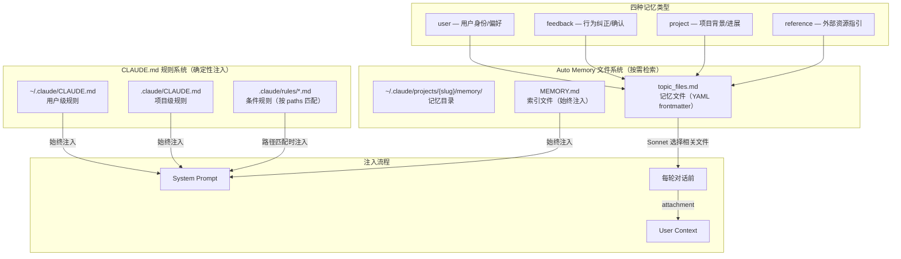

# s08 — Memory 系统：CLAUDE.md 与自动记忆

> "An agent without memory starts every conversation as a stranger" · 预计阅读 18 分钟

**核心洞察：CLAUDE.md 是 Agent 的"团队 wiki"——项目约定写一次，每次对话自动加载，不需要反复交代。**

::: info Key Takeaways
- **双轨记忆** — CLAUDE.md (规则型，用户手写) + Auto Memory (文件型，AI 自动沉淀)
- **四种记忆类型** — user / feedback / project / reference，各有不同的触发和使用时机
- **200 行 / 25KB 限制** — MEMORY.md 索引有上限，防止记忆膨胀
- **Context Engineering = Write** — 记忆是"持久化到窗口之外"的经典实现
:::

::: warning 安全提示
Memory 系统存在 **Memory Poisoning** 攻击面：恶意 prompt injection 可污染跨会话记忆，实现持久化攻击。Claude Code 通过 caveat 注入和验证检查来缓解此风险。
:::

## 问题

如何让 agent 跨对话保持记忆？

每次对话结束后，LLM 的上下文就被清空了。下一次对话，agent 不知道用户是谁、之前做过什么、犯过什么错、用户纠正过什么。用户不得不反复重复"我是数据工程师""不要用 npm 用 bun""测试要用真数据库不要 mock"。

更深层的问题是：agent 不仅需要记住"事实"，还需要区分不同类型的记忆。用户偏好、行为纠正、项目背景、外部资源指引——这些信息的用途和生命周期完全不同。

Claude Code 用**双轨记忆系统**解决这个问题：

1. **CLAUDE.md 规则系统**——用户/项目级配置，注入 system prompt，每次对话自动生效
2. **Auto Memory 文件系统**——结构化的文件目录，按类型分类存储，支持智能检索

两套系统互补：CLAUDE.md 是"规则"（确定性注入），Auto Memory 是"记忆"（按需检索）。

## 架构图



## 核心机制

### CLAUDE.md 规则系统

CLAUDE.md 是 Claude Code 的"硬编码记忆"——每次对话都会被注入到 system prompt 中。它的层级结构反映了配置的信任链：

1. **用户级** `~/.claude/CLAUDE.md`：个人偏好，跨所有项目生效
2. **项目级** `.claude/CLAUDE.md`：团队共享的规则，提交到 git
3. **条件规则** `.claude/rules/*.md`：带 `paths` frontmatter 的规则，只在操作匹配文件时注入

CLAUDE.md 的内容不需要 agent 做任何判断——只要文件存在就注入。这是记忆系统中最简单、最可靠的部分。

### Auto Memory 文件系统

Auto Memory 是 Claude Code 的结构化记忆系统。它的核心是一个文件目录：

```
~/.claude/projects/{sanitized-git-root}/memory/
├── MEMORY.md              # 索引文件（始终注入上下文）
├── user_role.md           # 用户身份记忆
├── feedback_testing.md    # 测试偏好记忆
├── project_deadline.md    # 项目背景记忆
└── reference_dashboards.md # 外部资源记忆
```

每个记忆文件都有 YAML frontmatter：

```markdown
---
name: user role
description: User is a data scientist focused on observability
type: user
---

User is a data scientist working on logging infrastructure.
They prefer SQL-first approaches and want explanations
framed in terms of data pipelines.
```

**四种记忆类型**是系统的核心分类学：

| 类型 | 含义 | 典型内容 | 生命周期 |
|------|------|---------|---------|
| `user` | 用户身份/偏好 | "用户是高级 Go 工程师，React 新手" | 长期稳定 |
| `feedback` | 行为纠正/确认 | "不要在测试中 mock 数据库" | 中长期 |
| `project` | 项目背景/进展 | "周四开始 merge freeze" | 短期（会过时） |
| `reference` | 外部资源指引 | "pipeline bugs 在 Linear INGEST 项目跟踪" | 中期 |

### MEMORY.md 索引

MEMORY.md 是记忆目录的索引文件。它**始终被注入到上下文中**（通过 system prompt），但有严格的大小限制：

- 最多 200 行
- 最多 25KB
- 超过限制会被截断并附加警告

索引的每一行应该是一个指针：`- [Title](file.md) -- one-line hook`。详细内容存在各个记忆文件中。这个设计让 agent 知道"我记住了什么"，但不需要把所有细节都放在上下文里。

### 智能记忆检索

每轮对话前，Claude Code 会运行一个轻量级的 Sonnet 模型来判断哪些记忆文件与当前查询相关：

1. 扫描记忆目录，读取所有 `.md` 文件的 frontmatter（文件名 + description + type）
2. 把文件清单和用户查询发给 Sonnet，要求它选择最多 5 个最相关的文件
3. 读取选中文件的完整内容，作为 attachment 注入到上下文中

这是典型的"先索引后检索"模式——MEMORY.md 提供全局索引（廉价、始终可见），Sonnet 做相关性判断（中等成本、按需），完整内容按需加载（昂贵、精确）。

### 记忆新鲜度管理

记忆会过时。Claude Code 有显式的新鲜度机制：

- 超过 1 天的记忆会附加 staleness caveat："This memory is N days old. Claims about code behavior may be outdated. Verify against current code before asserting as fact."
- prompt 中明确要求模型在推荐基于记忆的内容前先验证："If the memory names a file path: check the file exists. If the memory names a function: grep for it."
- 记忆按 mtime 排序，最新的优先

### 什么不应该存为记忆

系统 prompt 中有明确的排除列表：

- 代码模式、架构、文件路径——可以通过读代码获得
- Git 历史——`git log` 是权威来源
- 调试方案——修复已经在代码里了
- CLAUDE.md 中已有的内容
- 临时任务状态

这些排除规则确保记忆系统不会变成代码状态的过时快照。记忆应该存储**不可从项目当前状态推导出来的信息**。

### 记忆存储的两步流程

保存记忆是一个两步流程：

1. **写文件**：创建带 frontmatter 的 `.md` 文件到记忆目录
2. **更新索引**：在 `MEMORY.md` 中添加一行指针

这个设计的关键是索引与内容分离。MEMORY.md 始终在上下文中，但只占用很少的 token。完整内容通过智能检索按需加载。

## Python 伪代码

<details>
<summary>展开查看完整 Python 伪代码（669 行）</summary>

```python
"""
Claude Code Memory 系统的 Python 参考实现。

双轨记忆：
  1. CLAUDE.md 规则系统 — 确定性注入 system prompt
  2. Auto Memory 文件系统 — 结构化存储 + 智能检索
"""

import os
import re
import time
from dataclasses import dataclass, field
from enum import Enum
from pathlib import Path
from typing import Optional


# ─── 常量 ──────────────────────────────────────────────

MAX_ENTRYPOINT_LINES = 200
MAX_ENTRYPOINT_BYTES = 25_000
MAX_MEMORY_FILES = 200
MAX_RELEVANT_MEMORIES = 5
FRONTMATTER_MAX_LINES = 30
ENTRYPOINT_NAME = "MEMORY.md"


# ─── 记忆类型 ──────────────────────────────────────────

class MemoryType(Enum):
    USER = "user"          # 用户身份/偏好
    FEEDBACK = "feedback"  # 行为纠正/确认
    PROJECT = "project"    # 项目背景/进展
    REFERENCE = "reference"  # 外部资源指引


MEMORY_TYPE_DESCRIPTIONS = {
    MemoryType.USER: (
        "Information about the user's role, goals, responsibilities. "
        "Helps tailor behavior to the user's perspective."
    ),
    MemoryType.FEEDBACK: (
        "Guidance from the user about how to approach work — "
        "both what to avoid and what to keep doing."
    ),
    MemoryType.PROJECT: (
        "Information about ongoing work, goals, bugs, incidents "
        "NOT derivable from code or git history."
    ),
    MemoryType.REFERENCE: (
        "Pointers to where information can be found in external systems."
    ),
}


# ─── 数据结构 ──────────────────────────────────────────

@dataclass
class MemoryFrontmatter:
    name: str
    description: str
    type: Optional[MemoryType] = None


@dataclass
class MemoryHeader:
    """记忆文件的头部信息（用于索引和检索）"""
    filename: str
    file_path: str
    mtime_ms: float
    description: Optional[str] = None
    type: Optional[MemoryType] = None


@dataclass
class Memory:
    """完整的记忆条目"""
    header: MemoryHeader
    content: str
    frontmatter: MemoryFrontmatter


@dataclass
class RelevantMemory:
    """检索到的相关记忆"""
    path: str
    mtime_ms: float


@dataclass
class EntrypointTruncation:
    content: str
    line_count: int
    byte_count: int
    was_line_truncated: bool
    was_byte_truncated: bool


# ─── Frontmatter 解析 ─────────────────────────────────

def parse_frontmatter(content: str) -> tuple[MemoryFrontmatter, str]:
    """解析 YAML frontmatter，返回 (frontmatter, markdown_body)"""
    if not content.startswith("---"):
        return MemoryFrontmatter(name="", description=""), content

    end = content.find("---", 3)
    if end == -1:
        return MemoryFrontmatter(name="", description=""), content

    yaml_block = content[3:end].strip()
    body = content[end + 3:].strip()

    # 简单的 YAML 解析
    data = {}
    for line in yaml_block.split("\n"):
        if ":" in line:
            key, value = line.split(":", 1)
            data[key.strip()] = value.strip()

    mem_type = None
    raw_type = data.get("type")
    if raw_type:
        try:
            mem_type = MemoryType(raw_type)
        except ValueError:
            pass

    return (
        MemoryFrontmatter(
            name=data.get("name", ""),
            description=data.get("description", ""),
            type=mem_type,
        ),
        body,
    )


# ─── MEMORY.md 索引管理 ──────────────────────────────

def truncate_entrypoint_content(raw: str) -> EntrypointTruncation:
    """
    截断 MEMORY.md 内容到行数和字节限制。
    超过限制时附加警告信息。
    """
    trimmed = raw.strip()
    lines = trimmed.split("\n")
    line_count = len(lines)
    byte_count = len(trimmed)

    was_line_truncated = line_count > MAX_ENTRYPOINT_LINES
    was_byte_truncated = byte_count > MAX_ENTRYPOINT_BYTES

    if not was_line_truncated and not was_byte_truncated:
        return EntrypointTruncation(
            content=trimmed,
            line_count=line_count,
            byte_count=byte_count,
            was_line_truncated=False,
            was_byte_truncated=False,
        )

    # 先按行截断
    truncated = (
        "\n".join(lines[:MAX_ENTRYPOINT_LINES])
        if was_line_truncated else trimmed
    )

    # 再按字节截断（在最后一个换行处切割，不截断半行）
    if len(truncated) > MAX_ENTRYPOINT_BYTES:
        cut_at = truncated.rfind("\n", 0, MAX_ENTRYPOINT_BYTES)
        truncated = truncated[:cut_at if cut_at > 0 else MAX_ENTRYPOINT_BYTES]

    # 构建警告信息
    if was_byte_truncated and not was_line_truncated:
        reason = f"{byte_count} bytes (limit: {MAX_ENTRYPOINT_BYTES})"
    elif was_line_truncated and not was_byte_truncated:
        reason = f"{line_count} lines (limit: {MAX_ENTRYPOINT_LINES})"
    else:
        reason = f"{line_count} lines and {byte_count} bytes"

    truncated += (
        f"\n\n> WARNING: {ENTRYPOINT_NAME} is {reason}. "
        "Only part of it was loaded. Keep index entries to one line "
        "under ~200 chars; move detail into topic files."
    )

    return EntrypointTruncation(
        content=truncated,
        line_count=line_count,
        byte_count=byte_count,
        was_line_truncated=was_line_truncated,
        was_byte_truncated=was_byte_truncated,
    )


# ─── 记忆目录扫描 ─────────────────────────────────────

def scan_memory_files(memory_dir: str) -> list[MemoryHeader]:
    """
    扫描记忆目录，读取所有 .md 文件的 frontmatter。
    单 pass：读文件同时获取 mtime，按 mtime 降序排列。
    最多返回 MAX_MEMORY_FILES 个文件。
    """
    headers = []
    memory_path = Path(memory_dir)

    if not memory_path.exists():
        return []

    for md_file in memory_path.rglob("*.md"):
        if md_file.name == ENTRYPOINT_NAME:
            continue

        try:
            # 只读前 30 行来解析 frontmatter
            with open(md_file, "r") as f:
                head_lines = []
                for i, line in enumerate(f):
                    if i >= FRONTMATTER_MAX_LINES:
                        break
                    head_lines.append(line)
                head_content = "".join(head_lines)

            stat = md_file.stat()
            frontmatter, _ = parse_frontmatter(head_content)

            relative_path = str(md_file.relative_to(memory_path))
            headers.append(MemoryHeader(
                filename=relative_path,
                file_path=str(md_file),
                mtime_ms=stat.st_mtime * 1000,
                description=frontmatter.description or None,
                type=frontmatter.type,
            ))
        except (OSError, ValueError):
            continue

    # 按修改时间降序，最新的在前
    headers.sort(key=lambda h: h.mtime_ms, reverse=True)
    return headers[:MAX_MEMORY_FILES]


def format_memory_manifest(memories: list[MemoryHeader]) -> str:
    """
    格式化记忆头信息为文本清单。
    每行格式：- [type] filename (timestamp): description
    """
    lines = []
    for m in memories:
        tag = f"[{m.type.value}] " if m.type else ""
        ts = time.strftime(
            "%Y-%m-%dT%H:%M:%S", time.gmtime(m.mtime_ms / 1000)
        )
        if m.description:
            lines.append(f"- {tag}{m.filename} ({ts}): {m.description}")
        else:
            lines.append(f"- {tag}{m.filename} ({ts})")
    return "\n".join(lines)


# ─── 记忆新鲜度 ─────────────────────────────────────

def memory_age_days(mtime_ms: float) -> int:
    """计算记忆的天数（0 = 今天，1 = 昨天）"""
    return max(0, int((time.time() * 1000 - mtime_ms) / 86_400_000))


def memory_age_text(mtime_ms: float) -> str:
    """人类可读的记忆年龄"""
    days = memory_age_days(mtime_ms)
    if days == 0:
        return "today"
    if days == 1:
        return "yesterday"
    return f"{days} days ago"


def memory_freshness_caveat(mtime_ms: float) -> str:
    """
    对超过 1 天的记忆生成新鲜度警告。
    避免模型把过时记忆当作当前事实。
    """
    days = memory_age_days(mtime_ms)
    if days <= 1:
        return ""
    return (
        f"This memory is {days} days old. "
        "Memories are point-in-time observations, not live state — "
        "claims about code behavior or file:line citations may be outdated. "
        "Verify against current code before asserting as fact."
    )


# ─── 智能记忆检索 ──────────────────────────────────────

SELECT_MEMORIES_SYSTEM_PROMPT = """You are selecting memories that will be useful to Claude Code.
Return a list of filenames for the most relevant memories (up to 5).
Only include memories you are certain will be helpful.
If unsure, return an empty list.
"""


async def find_relevant_memories(
    query: str,
    memory_dir: str,
    recent_tools: list[str] | None = None,
    already_surfaced: set[str] | None = None,
) -> list[RelevantMemory]:
    """
    查找与当前查询相关的记忆文件。

    流程：
    1. 扫描记忆目录，获取所有文件的 frontmatter
    2. 过滤掉已经展示过的文件
    3. 把文件清单 + 查询发给 Sonnet，选择最相关的
    4. 返回选中文件的路径和 mtime
    """
    already_surfaced = already_surfaced or set()

    # 扫描并过滤
    all_memories = scan_memory_files(memory_dir)
    candidates = [
        m for m in all_memories
        if m.file_path not in already_surfaced
    ]

    if not candidates:
        return []

    # 格式化清单
    manifest = format_memory_manifest(candidates)

    # 工具过滤：如果正在使用某个工具，不要选该工具的参考文档
    tools_section = ""
    if recent_tools:
        tools_section = f"\n\nRecently used tools: {', '.join(recent_tools)}"

    # 调用 Sonnet 选择相关记忆
    selected_filenames = await _call_sonnet_for_selection(
        query=query,
        manifest=manifest,
        tools_section=tools_section,
    )

    # 映射回 MemoryHeader
    by_filename = {m.filename: m for m in candidates}
    result = []
    for filename in selected_filenames:
        if filename in by_filename:
            m = by_filename[filename]
            result.append(RelevantMemory(
                path=m.file_path,
                mtime_ms=m.mtime_ms,
            ))

    return result


async def _call_sonnet_for_selection(
    query: str,
    manifest: str,
    tools_section: str,
) -> list[str]:
    """
    调用 Sonnet 模型选择相关记忆文件。
    使用 JSON schema 输出格式确保结构化返回。
    """
    # 实际实现调用 sideQuery API
    # output_format: json_schema { selected_memories: string[] }
    return []  # mock


# ─── 记忆系统主类 ──────────────────────────────────────

class MemorySystem:
    """
    Claude Code 记忆系统的完整实现。

    管理两条记忆轨道：
    1. CLAUDE.md 规则 — 确定性注入到 system prompt
    2. Auto Memory — 结构化文件 + 智能检索
    """

    def __init__(self, project_root: str, user_home: str = "~"):
        self.project_root = project_root
        self.user_home = os.path.expanduser(user_home)

        # 记忆目录路径
        self.memory_dir = self._compute_memory_dir()

    def _compute_memory_dir(self) -> str:
        """
        计算记忆目录路径。
        路径结构：~/.claude/projects/{sanitized-path}/memory/

        Git worktree 使用 canonical git root，确保同一仓库的
        不同 worktree 共享记忆。
        """
        # sanitize: / 替换为 -，移除不安全字符
        sanitized = self.project_root.replace("/", "-").strip("-")
        return os.path.join(
            self.user_home, ".claude", "projects", sanitized, "memory"
        )

    # ── 规则注入 ──

    def get_claude_md_rules(self) -> list[str]:
        """
        收集所有 CLAUDE.md 规则，按优先级排列。
        返回要注入 system prompt 的内容列表。
        """
        rules = []

        # 用户级
        user_claude_md = os.path.join(self.user_home, ".claude", "CLAUDE.md")
        if os.path.exists(user_claude_md):
            rules.append(self._read_file(user_claude_md))

        # 项目级
        project_claude_md = os.path.join(self.project_root, ".claude", "CLAUDE.md")
        if os.path.exists(project_claude_md):
            rules.append(self._read_file(project_claude_md))

        return rules

    def get_conditional_rules(self, active_files: list[str]) -> list[str]:
        """
        收集路径匹配的条件规则。
        .claude/rules/*.md 中带 paths frontmatter 的文件。
        """
        rules_dir = os.path.join(self.project_root, ".claude", "rules")
        if not os.path.exists(rules_dir):
            return []

        matched = []
        for md_file in Path(rules_dir).glob("*.md"):
            content = self._read_file(str(md_file))
            frontmatter, body = parse_frontmatter(content)
            # 检查 paths 匹配（使用 gitignore 风格）
            # 实际使用 `ignore` 库做匹配
            matched.append(body)

        return matched

    # ── 记忆存储 ──

    def save_memory(
        self,
        filename: str,
        name: str,
        description: str,
        memory_type: MemoryType,
        content: str,
    ) -> str:
        """
        保存一条记忆（两步流程的第一步：写文件）。
        返回文件路径。
        """
        os.makedirs(self.memory_dir, exist_ok=True)

        frontmatter = (
            f"---\n"
            f"name: {name}\n"
            f"description: {description}\n"
            f"type: {memory_type.value}\n"
            f"---\n\n"
            f"{content}\n"
        )

        file_path = os.path.join(self.memory_dir, filename)
        with open(file_path, "w") as f:
            f.write(frontmatter)

        return file_path

    def update_index(self, title: str, filename: str, hook: str):
        """
        更新 MEMORY.md 索引（两步流程的第二步）。
        每条索引一行，格式：- [Title](file.md) -- one-line hook
        """
        index_path = os.path.join(self.memory_dir, ENTRYPOINT_NAME)

        entry = f"- [{title}]({filename}) -- {hook}\n"

        # 追加到索引文件
        with open(index_path, "a") as f:
            f.write(entry)

    def forget_memory(self, filename: str):
        """删除一条记忆：移除文件并更新索引"""
        file_path = os.path.join(self.memory_dir, filename)
        if os.path.exists(file_path):
            os.remove(file_path)

        # 从索引中移除对应行
        index_path = os.path.join(self.memory_dir, ENTRYPOINT_NAME)
        if os.path.exists(index_path):
            with open(index_path, "r") as f:
                lines = f.readlines()
            with open(index_path, "w") as f:
                for line in lines:
                    if filename not in line:
                        f.write(line)

    # ── 记忆注入 ──

    def build_memory_prompt(self) -> str:
        """
        构建记忆 prompt，注入到 system prompt 中。
        包含：行为指导 + MEMORY.md 内容。
        """
        lines = [
            "# auto memory",
            "",
            f"You have a persistent, file-based memory system at "
            f"`{self.memory_dir}`. This directory already exists.",
            "",
            "## Types of memory",
            "",
        ]

        # 添加四种类型的描述
        for mem_type in MemoryType:
            lines.append(f"### {mem_type.value}")
            lines.append(MEMORY_TYPE_DESCRIPTIONS[mem_type])
            lines.append("")

        # 添加排除规则
        lines.extend([
            "## What NOT to save in memory",
            "- Code patterns, conventions, architecture, file paths",
            "- Git history, recent changes",
            "- Debugging solutions or fix recipes",
            "- Anything already documented in CLAUDE.md files",
            "- Ephemeral task details",
            "",
        ])

        # 添加存储指导
        lines.extend([
            "## How to save memories",
            "Saving a memory is a two-step process:",
            "1. Write the memory to its own file with YAML frontmatter",
            f"2. Add a pointer to {ENTRYPOINT_NAME}",
            "",
        ])

        # 添加检索指导
        lines.extend([
            "## When to access memories",
            "- When memories seem relevant to the current query",
            "- When the user explicitly asks to recall or remember",
            "- If the user says to ignore memory: proceed as if "
            "MEMORY.md were empty",
            "",
        ])

        # 添加 MEMORY.md 内容
        index_path = os.path.join(self.memory_dir, ENTRYPOINT_NAME)
        if os.path.exists(index_path):
            content = self._read_file(index_path)
            truncated = truncate_entrypoint_content(content)
            lines.extend([
                f"## {ENTRYPOINT_NAME}",
                "",
                truncated.content,
            ])
        else:
            lines.extend([
                f"## {ENTRYPOINT_NAME}",
                "",
                "Your MEMORY.md is currently empty.",
            ])

        return "\n".join(lines)

    async def inject_relevant_memories(
        self,
        query: str,
        recent_tools: list[str] | None = None,
        already_surfaced: set[str] | None = None,
    ) -> list[dict]:
        """
        为当前查询注入相关记忆。
        返回 attachment 消息列表。
        """
        relevant = await find_relevant_memories(
            query=query,
            memory_dir=self.memory_dir,
            recent_tools=recent_tools,
            already_surfaced=already_surfaced,
        )

        attachments = []
        for mem in relevant:
            content = self._read_file(mem.path)
            age_text = memory_age_text(mem.mtime_ms)
            freshness = memory_freshness_caveat(mem.mtime_ms)

            attachment = {
                "type": "relevant_memory",
                "path": mem.path,
                "content": content,
                "age": age_text,
            }
            if freshness:
                attachment["freshness_caveat"] = freshness

            attachments.append(attachment)

        return attachments

    # ── 辅助方法 ──

    def _read_file(self, path: str) -> str:
        try:
            with open(path, "r") as f:
                return f.read()
        except OSError:
            return ""


# ─── 使用示例 ──────────────────────────────────────────

async def main():
    # 初始化记忆系统
    mem = MemorySystem(
        project_root="/home/user/my-project",
        user_home="/home/user",
    )

    # 1. 注入 CLAUDE.md 规则到 system prompt
    rules = mem.get_claude_md_rules()
    for rule in rules:
        print(f"[system prompt] {rule[:50]}...")

    # 2. 注入记忆 prompt 到 system prompt
    memory_prompt = mem.build_memory_prompt()
    print(f"[system prompt] memory: {len(memory_prompt)} chars")

    # 3. 每轮对话前，检索相关记忆
    user_query = "帮我修改数据库连接池配置"
    attachments = await mem.inject_relevant_memories(user_query)
    for att in attachments:
        print(f"[attachment] {att['path']} ({att['age']})")

    # 4. 保存新记忆
    mem.save_memory(
        filename="feedback_db_testing.md",
        name="database testing policy",
        description="Integration tests must use real database, not mocks",
        memory_type=MemoryType.FEEDBACK,
        content=(
            "Always use real database in integration tests.\n\n"
            "**Why:** Last quarter, mocked tests passed but prod migration "
            "failed due to mock/prod divergence.\n\n"
            "**How to apply:** When writing or reviewing test code that "
            "interacts with the database."
        ),
    )
    mem.update_index(
        title="DB testing policy",
        filename="feedback_db_testing.md",
        hook="integration tests must hit real DB, not mocks",
    )

    # 5. 忘记一条记忆
    mem.forget_memory("project_old_deadline.md")
```

</details>

## 源码映射

| 概念 | 真实源码路径 | 说明 |
|------|-------------|------|
| 记忆目录主逻辑 | `src/memdir/memdir.ts` | `loadMemoryPrompt()`, `buildMemoryLines()`, `buildMemoryPrompt()` |
| 记忆类型定义 | `src/memdir/memoryTypes.ts` | `MEMORY_TYPES = ['user', 'feedback', 'project', 'reference']` |
| 类型描述（个人模式） | `src/memdir/memoryTypes.ts:113-178` | `TYPES_SECTION_INDIVIDUAL` |
| 类型描述（团队模式） | `src/memdir/memoryTypes.ts:37-106` | `TYPES_SECTION_COMBINED` 含 `<scope>` 标签 |
| 排除列表 | `src/memdir/memoryTypes.ts:183-195` | `WHAT_NOT_TO_SAVE_SECTION` |
| 新鲜度管理 | `src/memdir/memoryAge.ts` | `memoryAgeDays()`, `memoryAge()`, `memoryFreshnessText()` |
| 记忆目录路径 | `src/memdir/paths.ts` | `getAutoMemPath()` — 含 sanitize、worktree、override |
| 路径安全校验 | `src/memdir/paths.ts:109-150` | `validateMemoryPath()` 防止路径穿越 |
| 目录扫描 | `src/memdir/memoryScan.ts` | `scanMemoryFiles()` — 单 pass 读取 frontmatter + mtime |
| 清单格式化 | `src/memdir/memoryScan.ts:84-94` | `formatMemoryManifest()` |
| 智能检索 | `src/memdir/findRelevantMemories.ts` | `findRelevantMemories()` — Sonnet 选择相关文件 |
| 检索 prompt | `src/memdir/findRelevantMemories.ts:18-24` | `SELECT_MEMORIES_SYSTEM_PROMPT` |
| 索引截断 | `src/memdir/memdir.ts:57-103` | `truncateEntrypointContent()` — 200 行 + 25KB 限制 |
| 目录创建 | `src/memdir/memdir.ts:129-147` | `ensureMemoryDirExists()` — 确保模型可以直接写入 |
| 验证记忆准确性 | `src/memdir/memoryTypes.ts:240-256` | `TRUSTING_RECALL_SECTION` — 推荐前先 grep 验证 |
| 团队记忆路径 | `src/memdir/teamMemPaths.ts` | `getTeamMemPath()` — 团队共享记忆目录 |

## 设计决策

### 文件系统 vs 数据库

| 维度 | Claude Code (文件系统) | 传统方案 (向量数据库) |
|------|----------------------|---------------------|
| 存储 | Markdown 文件 + YAML frontmatter | 嵌入向量 + 元数据 |
| 检索 | Sonnet 判断相关性 + 文件名/描述匹配 | 余弦相似度 |
| 可审计性 | 用户可以直接读/编辑/删除文件 | 不透明 |
| 依赖 | 零（文件系统） | 需要向量数据库服务 |
| 版本控制 | 可以 git 管理 | 不友好 |

Claude Code 选择文件系统的理由：**透明性和可控性**。用户随时可以 `cat`、`vim`、`rm` 自己的记忆文件。这对信任建立至关重要——用户需要知道 agent 记住了什么，也需要能修改或删除不准确的记忆。

### 四类型分类 vs 自由标签

Claude Code 没有使用自由标签，而是约束为四种固定类型。好处：

1. **排除噪音**：明确什么不应该存（代码模式、git 历史等），防止记忆变成代码状态的过时快照
2. **差异化处理**：不同类型有不同的写入指导（feedback 要记录 Why + How to apply，project 要用绝对日期）
3. **检索精度**：类型标签帮助 Sonnet 更准确地判断相关性

### MEMORY.md 索引 vs 全量扫描

MEMORY.md 始终在上下文中（通过 system prompt），但限制在 200 行 / 25KB。这是一个精心设计的 trade-off：

- **太大**：浪费 prompt token，每次对话都付出成本
- **太小**：agent 不知道自己有哪些记忆，无法主动使用
- **200 行**：足够索引 ~200 条记忆的一行摘要

详细内容通过 Sonnet 智能检索按需加载，每次最多 5 个文件。这是 Claude Code 一贯的"两层注入"模式的体现（s09 Skills 也用了相同模式）。

### 记忆 vs 计划 vs 任务的职责区分

Claude Code 的 prompt 中明确区分了三种持久化机制：

| 机制 | 用途 | 生命周期 |
|------|------|---------|
| Memory | 跨对话的知识和偏好 | 长期 |
| Plan | 当前任务的实现方案 | 当前对话 |
| Task | 当前工作的离散步骤和进度 | 当前对话 |

如果要开始一个复杂任务，应该用 Plan；如果要跟踪进度，应该用 Task；如果学到了未来对话也有用的信息，才用 Memory。这个区分避免了记忆系统被短期信息淹没。

## Why：设计决策与行业上下文

### 状态外化到文件系统：Anthropic 双体架构的核心洞察

Anthropic 在长运行 Agent 设计中发现：**与其试图让一个 Agent 记住一切，不如将状态外化到文件系统** [R1-5]。他们的双体架构（Initializer Agent + Coding Agent）中，Initializer 在首次运行时将项目结构、功能列表、进度写入文件系统，后续 Coding Agent 通过读取这些文件恢复上下文。

Claude Code 的 Memory 系统正是这一理念的实现：MEMORY.md 索引 + 按需加载的记忆文件，将跨会话知识外化为文件系统上的结构化数据。

### Write 策略：Context Engineering 的第一个策略

LangChain 四策略框架的第一个就是 **Write**——将信息持久化到上下文窗口之外 [R1-3]。Memory 系统是 Write 策略的核心载体：用户偏好、项目知识、行为纠正都写入磁盘，确保跨会话可用而不占用宝贵的上下文空间。

### Durability 问题的对策

Philschmid 指出模型在 50 步之后会出现指令遵循衰减 [R1-1]。Memory 系统是对抗 durability 衰减的关键工具——即使上下文被压缩，关键指令仍能通过 MEMORY.md 被重新加载进入新的上下文窗口。

> **参考来源：** Anthropic [R1-5]、LangChain [R1-3]、Philschmid [R1-1]。完整引用见 `docs/research/05-harness-trends-deep-20260401.md`。

## 变化表

| 对比 s07 | s08 新增 |
|----------|---------|
| 上下文压缩引擎管理对话内的 token | 跨对话的持久化记忆系统 |
| — | CLAUDE.md 规则系统（确定性注入） |
| — | Auto Memory 文件系统（四种类型） |
| — | MEMORY.md 索引机制（200 行 / 25KB） |
| — | Sonnet 智能记忆检索 |
| — | 记忆新鲜度管理（staleness caveat） |
| — | 记忆安全校验（路径穿越防护） |
| — | 记忆 vs 计划 vs 任务的职责边界 |

## 动手试试

### 练习 1：实现记忆存储系统

实现 `MemorySystem` 的存储部分：
- `save_memory()`：写带 YAML frontmatter 的 `.md` 文件
- `update_index()`：在 MEMORY.md 中追加一行指针
- `forget_memory()`：删除文件并从索引移除
- 验证：四种类型的 frontmatter 解析正确

### 练习 2：实现智能记忆检索

实现 `find_relevant_memories()`：
- `scan_memory_files()`：扫描目录，只读 frontmatter 前 30 行
- `format_memory_manifest()`：格式化为 `[type] filename (timestamp): description`
- 调用 Sonnet（或 mock）选择最多 5 个相关文件
- 添加 `memory_freshness_caveat()`：超过 1 天的记忆附加警告

### 练习 3：实现完整的注入流程

把存储和检索串起来：
- `build_memory_prompt()`：构建包含行为指导 + MEMORY.md 内容的 prompt
- `inject_relevant_memories()`：每轮对话前检索并注入相关记忆
- `truncate_entrypoint_content()`：MEMORY.md 超限时截断并附加警告
- 集成到 agent 循环中：system prompt 注入 + 每轮 attachment 注入

## 推荐阅读

- [Memory poisoning in AI agents (christian-schneider.net)](https://christian-schneider.net/) — Memory Poisoning 攻击面分析
