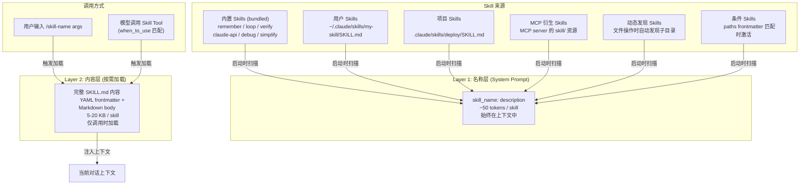

# s09 — Skills：两层知识注入

> "Know what's available; load how on demand"

## 问题

如何让 agent 拥有可扩展的领域知识？

Agent 的 system prompt 里不可能塞下所有领域的知识。如果你的 agent 需要知道怎么用 Claude API、怎么创建 PR、怎么做代码审查、怎么循环执行任务，把这些知识全部硬编码在 prompt 里会导致 token 爆炸——每次对话都要为不相关的知识付费。

但如果什么都不放，agent 就不知道自己"会"什么。用户问"帮我做个代码审查"，agent 可能自己临时编一套流程，而不是使用经过验证的最佳实践。

Claude Code 用**两层注入**解决这个问题：

1. **Layer 1 — 名称层**：所有 Skill 的名称 + 描述放入 system prompt，让模型知道"我有哪些能力"。成本低（每个 Skill 只占 ~50 tokens）。
2. **Layer 2 — 内容层**：只有当 Skill 被调用时，才加载完整的 `SKILL.md` 内容。成本高（一个 Skill 可能 5-20KB），但按需付费。

这种设计让 Claude Code 可以注册几十个 Skill，而系统 prompt 只增加几百个 token。

## 架构图



## 核心机制

### Skill 的结构

每个 Skill 是一个目录，包含一个 `SKILL.md` 文件：

```
my-skill/
└── SKILL.md
```

`SKILL.md` 使用 YAML frontmatter + Markdown 正文：

```markdown
---
name: Deploy Helper
description: Guides deployment to staging and production environments
when_to_use: >
  Use when the user asks to deploy, release, or push to staging/prod.
  Also trigger when discussing CI/CD pipeline configuration.
allowed-tools: Bash, Read, Write
model: claude-sonnet-4-20250514
argument-hint: "<environment> [--dry-run]"
user-invocable: true
---

# Deploy Helper

When deploying, follow these steps:
1. Run pre-deploy checks...
2. ...
```

关键的 frontmatter 字段：

| 字段 | 用途 | 默认值 |
|------|------|--------|
| `name` | 显示名称 | 目录名 |
| `description` | Layer 1 显示的描述 | 从 Markdown 正文提取 |
| `when_to_use` | 模型自动调用的触发条件 | 无（仅用户 `/skill` 调用） |
| `allowed-tools` | 执行时可用的工具白名单 | 全部工具 |
| `model` | 执行时使用的模型 | 继承主模型 |
| `user-invocable` | 用户是否可以通过 `/skill` 调用 | `true` |
| `paths` | 条件激活的文件路径模式 | 无（始终加载） |
| `context` | 执行上下文：`inline`（默认）或 `fork` | `inline` |
| `hooks` | Skill 自带的 hooks 配置 | 无 |

### Layer 1: 名称层注入

启动时，Claude Code 从多个来源扫描所有 Skill：

1. **Policy Skills**：`<managed-path>/.claude/skills/` — 企业策略 Skill
2. **用户 Skills**：`~/.claude/skills/` — 个人 Skill
3. **项目 Skills**：`.claude/skills/`（从当前目录向上遍历到 home）
4. **内置 Skills**：编译进二进制的 Skill（`src/skills/bundled/`）
5. **MCP Skills**：从 MCP server 的 `skill/` 资源发现

扫描结果去重后，每个 Skill 的 **名称 + description + when_to_use** 被注入到 system prompt 中。这就是 Layer 1——让模型知道"我有哪些 Skill 可用"。

Layer 1 的 token 成本很低。`estimateSkillFrontmatterTokens()` 只估算 `name + description + whenToUse` 的 token 数，通常每个 Skill 不超过 50-100 tokens。即使注册了 30 个 Skill，也只增加 ~3000 tokens。

### Layer 2: 内容层加载

当 Skill 被调用时（用户输入 `/skill-name` 或模型通过 SkillTool 调用），才加载完整的 `SKILL.md` 内容。加载流程：

1. 读取 `SKILL.md` 全文
2. 如果有 `baseDir`（Skill 所在目录），在内容前面加上 `Base directory for this skill: <dir>`
3. 替换参数占位符（`${1}`, `${CLAUDE_SKILL_DIR}`, `${CLAUDE_SESSION_ID}`）
4. 执行内联 shell 命令（`!` 前缀的代码块）——**注意：MCP Skill 跳过此步骤，安全考虑**
5. 注入到当前对话上下文

### 内置 Skills

Claude Code 预装了一批核心 Skill，编译进二进制：

| Skill | 功能 | 源码 |
|-------|------|------|
| `remember` | 保存/检索记忆 | `bundled/remember.ts` |
| `loop` | 定时循环执行命令 | `bundled/loop.ts` |
| `verify` | 验证工作是否完成 | `bundled/verify.ts` |
| `claude-api` | Claude API / SDK 使用指南 | `bundled/claudeApi.ts` |
| `debug` | 系统化调试流程 | `bundled/debug.ts` |
| `simplify` | 审查代码质量和复用 | `bundled/simplify.ts` |
| `update-config` | 配置 settings.json | `bundled/updateConfig.ts` |

内置 Skill 通过 `registerBundledSkill()` 注册。它们也支持 `files` 字段——额外的参考文件会在首次调用时解压到磁盘（`getBundledSkillExtractDir()`），模型可以按需 Read。

### 动态 Skill 发现

当模型读取或编辑文件时，Claude Code 会检查文件所在目录链上是否有 `.claude/skills/` 目录。如果有，自动加载其中的 Skill：

```
# 用户编辑 src/services/deploy/handler.ts
# Claude Code 检查：
#   src/services/deploy/.claude/skills/  → 发现并加载
#   src/services/.claude/skills/         → 检查
#   src/.claude/skills/                  → 检查
# 注意：项目根目录的 .claude/skills/ 在启动时已加载，不重复
```

这让 monorepo 中的不同子项目可以有自己的 Skill 集合。

### 条件 Skill（Paths Frontmatter）

Skill 可以声明 `paths` frontmatter，只在操作匹配文件时激活：

```yaml
---
name: React Component Guide
description: Best practices for React component development
paths: src/components/**
---
```

激活使用 `ignore` 库（gitignore 风格的匹配）。一旦激活，Skill 在整个会话中保持可用。

### MCP 衍生 Skill

MCP server 可以通过 `skill/` 资源前缀暴露 Skill。Claude Code 从 MCP server 发现这些资源，用与本地 Skill 相同的 `createSkillCommand()` + `parseSkillFrontmatterFields()` 创建 Skill 命令。

关键安全限制：MCP Skill 的 Markdown 正文中的内联 shell 命令（`!`...`）**不会被执行**——`loadedFrom !== 'mcp'` 检查确保远程内容无法在本地执行任意命令。

### Skill 在压缩中的保留

从 s07 我们知道，压缩会清除旧的上下文。但已调用的 Skill 不应该丢失——用户可能在压缩后继续使用同一个 Skill。

`createSkillAttachmentIfNeeded()` 在压缩后重新注入已调用 Skill 的内容：
- 按最近使用排序
- 每个 Skill 最多 5K tokens（截断保留头部——使用说明通常在开头）
- 总共最多 25K tokens

## Python 伪代码

```python
"""
Claude Code Skills 系统的 Python 参考实现。

两层注入：
  Layer 1 — 名称层：skill 名称 + 描述注入 system prompt
  Layer 2 — 内容层：调用时按需加载完整 SKILL.md
"""

import os
import re
from dataclasses import dataclass, field
from pathlib import Path
from typing import Optional, Callable, Awaitable


# ─── 常量 ──────────────────────────────────────────────

SKILL_FILENAME = "SKILL.md"
POST_COMPACT_MAX_TOKENS_PER_SKILL = 5_000
POST_COMPACT_SKILLS_TOKEN_BUDGET = 25_000


# ─── 数据结构 ──────────────────────────────────────────

@dataclass
class SkillFrontmatter:
    """SKILL.md 的 YAML frontmatter 解析结果"""
    name: Optional[str] = None
    description: str = ""
    when_to_use: Optional[str] = None
    allowed_tools: list[str] = field(default_factory=list)
    argument_hint: Optional[str] = None
    model: Optional[str] = None
    user_invocable: bool = True
    disable_model_invocation: bool = False
    paths: Optional[list[str]] = None
    context: Optional[str] = None  # "inline" | "fork"
    version: Optional[str] = None


@dataclass
class Skill:
    """一个完整的 Skill 定义"""
    name: str                    # 技能名（用户通过 /name 调用）
    description: str             # Layer 1 显示的描述
    when_to_use: Optional[str]   # 模型自动调用的触发条件
    content: str                 # 完整的 Markdown 内容
    content_length: int          # 内容长度（用于 token 估算）
    source: str                  # "bundled" | "userSettings" | "projectSettings"
    loaded_from: str             # "bundled" | "skills" | "mcp" | "commands_DEPRECATED"
    base_dir: Optional[str]      # Skill 目录路径
    frontmatter: SkillFrontmatter = field(default_factory=SkillFrontmatter)

    # Layer 1 token 估算
    @property
    def frontmatter_tokens(self) -> int:
        """估算名称层占用的 tokens"""
        text = " ".join(filter(None, [
            self.name,
            self.description,
            self.when_to_use,
        ]))
        return len(text) // 4  # ~4 chars/token

    # Layer 2 加载
    async def get_prompt(self, args: str = "") -> str:
        """
        加载完整的 Skill 内容（Layer 2）。
        包括参数替换、目录前缀、shell 命令执行。
        """
        content = self.content

        # 添加 base directory 前缀
        if self.base_dir:
            content = f"Base directory for this skill: {self.base_dir}\n\n{content}"

        # 参数替换
        if args:
            content = substitute_arguments(content, args)

        # 替换内置变量
        if self.base_dir:
            content = content.replace("${CLAUDE_SKILL_DIR}", self.base_dir)

        # MCP Skill 不执行 shell 命令（安全限制）
        if self.loaded_from != "mcp":
            content = await execute_shell_in_prompt(content)

        return content


@dataclass
class InvokedSkill:
    """已调用的 Skill 记录（用于压缩后恢复）"""
    skill_name: str
    skill_path: str
    content: str
    invoked_at: float  # timestamp


# ─── Frontmatter 解析 ──────────────────────────────────

def parse_skill_frontmatter(content: str) -> tuple[SkillFrontmatter, str]:
    """解析 SKILL.md 的 YAML frontmatter"""
    if not content.startswith("---"):
        return SkillFrontmatter(), content

    end = content.find("---", 3)
    if end == -1:
        return SkillFrontmatter(), content

    yaml_block = content[3:end].strip()
    body = content[end + 3:].strip()

    # 简化的 YAML 解析
    data = {}
    for line in yaml_block.split("\n"):
        if ":" in line:
            key, value = line.split(":", 1)
            data[key.strip()] = value.strip()

    # 解析 allowed-tools
    allowed_tools = []
    raw_tools = data.get("allowed-tools", "")
    if raw_tools:
        allowed_tools = [t.strip() for t in raw_tools.split(",")]

    # 解析 paths
    paths = None
    raw_paths = data.get("paths")
    if raw_paths:
        patterns = [p.strip() for p in raw_paths.split(",")]
        # 去除 /** 后缀，ignore 库会自动匹配子路径
        patterns = [
            p[:-3] if p.endswith("/**") else p
            for p in patterns
        ]
        if patterns and not all(p == "**" for p in patterns):
            paths = patterns

    return (
        SkillFrontmatter(
            name=data.get("name"),
            description=data.get("description", ""),
            when_to_use=data.get("when_to_use"),
            allowed_tools=allowed_tools,
            argument_hint=data.get("argument-hint"),
            model=data.get("model"),
            user_invocable=data.get("user-invocable", "true").lower() != "false",
            paths=paths,
            context=data.get("context"),
        ),
        body,
    )


# ─── Skill 加载器 ──────────────────────────────────────

async def load_skills_from_dir(
    skills_dir: str,
    source: str = "projectSettings",
) -> list[Skill]:
    """
    从 /skills/ 目录加载所有 Skill。
    只支持目录格式：skill-name/SKILL.md
    """
    skills_path = Path(skills_dir)
    if not skills_path.exists():
        return []

    skills = []
    for entry in skills_path.iterdir():
        if not entry.is_dir():
            continue

        skill_file = entry / SKILL_FILENAME
        if not skill_file.exists():
            continue

        try:
            content = skill_file.read_text()
            frontmatter, markdown_content = parse_skill_frontmatter(content)

            skill = Skill(
                name=entry.name,
                description=(
                    frontmatter.description
                    or extract_description_from_markdown(markdown_content)
                ),
                when_to_use=frontmatter.when_to_use,
                content=markdown_content,
                content_length=len(markdown_content),
                source=source,
                loaded_from="skills",
                base_dir=str(entry),
                frontmatter=frontmatter,
            )
            skills.append(skill)
        except Exception:
            continue

    return skills


def extract_description_from_markdown(content: str) -> str:
    """从 Markdown 正文的第一段提取描述"""
    lines = content.strip().split("\n")
    for line in lines:
        line = line.strip()
        if line and not line.startswith("#"):
            return line[:200]
    return "Skill"


# ─── 内置 Skill 注册 ───────────────────────────────────

class BundledSkillRegistry:
    """内置 Skill 注册表"""

    def __init__(self):
        self._skills: list[Skill] = []

    def register(
        self,
        name: str,
        description: str,
        get_prompt: Callable[[str], Awaitable[str]],
        when_to_use: Optional[str] = None,
        allowed_tools: list[str] | None = None,
        user_invocable: bool = True,
        files: dict[str, str] | None = None,
    ):
        """
        注册一个内置 Skill。

        files: 额外的参考文件，首次调用时解压到磁盘。
        """
        skill = Skill(
            name=name,
            description=description,
            when_to_use=when_to_use,
            content="",  # 内置 Skill 通过 get_prompt 动态生成
            content_length=0,
            source="bundled",
            loaded_from="bundled",
            base_dir=None,
            frontmatter=SkillFrontmatter(
                allowed_tools=allowed_tools or [],
                user_invocable=user_invocable,
            ),
        )
        self._skills.append(skill)

    def get_all(self) -> list[Skill]:
        return list(self._skills)


# ─── MCP Skill 发现 ────────────────────────────────────

async def discover_mcp_skills(mcp_client) -> list[Skill]:
    """
    从 MCP server 发现 Skill。
    查找 skill/ 前缀的资源，使用相同的 frontmatter 解析逻辑。
    """
    skills = []

    try:
        resources = await mcp_client.list_resources()
        for resource in resources:
            if not resource.uri.startswith("skill/"):
                continue

            content = await mcp_client.read_resource(resource.uri)
            frontmatter, markdown_content = parse_skill_frontmatter(content)

            skill = Skill(
                name=resource.name,
                description=frontmatter.description or resource.description,
                when_to_use=frontmatter.when_to_use,
                content=markdown_content,
                content_length=len(markdown_content),
                source="mcp",
                loaded_from="mcp",  # 标记为 MCP 来源
                base_dir=None,
                frontmatter=frontmatter,
            )
            skills.append(skill)
    except Exception:
        pass

    return skills


# ─── 动态 Skill 发现 ───────────────────────────────────

class DynamicSkillDiscovery:
    """
    动态发现子目录中的 Skill。
    当模型操作文件时，检查文件所在目录链上是否有 .claude/skills/。
    """

    def __init__(self, project_root: str):
        self.project_root = project_root
        self.discovered_dirs: set[str] = set()
        self.dynamic_skills: dict[str, Skill] = {}

    async def discover_for_paths(
        self,
        file_paths: list[str],
    ) -> list[str]:
        """
        为文件路径发现新的 Skill 目录。
        从文件所在目录向上遍历到 project_root（不含）。
        返回新发现的目录列表。
        """
        new_dirs = []

        for file_path in file_paths:
            current = os.path.dirname(file_path)

            while current.startswith(self.project_root + os.sep):
                skill_dir = os.path.join(current, ".claude", "skills")

                if skill_dir not in self.discovered_dirs:
                    self.discovered_dirs.add(skill_dir)
                    if os.path.isdir(skill_dir):
                        # 检查是否被 .gitignore 忽略
                        if not is_gitignored(current, self.project_root):
                            new_dirs.append(skill_dir)

                parent = os.path.dirname(current)
                if parent == current:
                    break
                current = parent

        # 按深度排序（最深的优先，离文件近的覆盖远的）
        new_dirs.sort(key=lambda d: d.count(os.sep), reverse=True)
        return new_dirs

    async def load_discovered_skills(self, dirs: list[str]):
        """加载新发现的 Skill"""
        for skill_dir in dirs:
            skills = await load_skills_from_dir(skill_dir)
            for skill in skills:
                self.dynamic_skills[skill.name] = skill


# ─── 条件 Skill 激活 ───────────────────────────────────

class ConditionalSkillManager:
    """
    管理带 paths frontmatter 的条件 Skill。
    只在操作匹配文件时激活。
    """

    def __init__(self):
        self.pending: dict[str, Skill] = {}   # 待激活
        self.activated: set[str] = set()       # 已激活名称

    def register(self, skill: Skill):
        """注册一个条件 Skill"""
        if skill.frontmatter.paths and skill.name not in self.activated:
            self.pending[skill.name] = skill

    def activate_for_paths(
        self,
        file_paths: list[str],
        cwd: str,
    ) -> list[str]:
        """
        检查文件路径是否匹配任何待激活 Skill 的 paths 模式。
        使用 gitignore 风格的匹配。返回新激活的 Skill 名称。
        """
        activated = []

        for name, skill in list(self.pending.items()):
            if not skill.frontmatter.paths:
                continue

            for file_path in file_paths:
                rel_path = os.path.relpath(file_path, cwd)
                if self._matches_pattern(rel_path, skill.frontmatter.paths):
                    self.activated.add(name)
                    del self.pending[name]
                    activated.append(name)
                    break

        return activated

    def _matches_pattern(
        self, path: str, patterns: list[str]
    ) -> bool:
        """gitignore 风格的路径匹配"""
        import fnmatch
        return any(fnmatch.fnmatch(path, p) for p in patterns)


# ─── Skill 系统主类 ────────────────────────────────────

class SkillSystem:
    """
    Claude Code Skills 系统。

    两层注入：
      Layer 1: 名称 + 描述 → system prompt（始终）
      Layer 2: 完整内容 → 调用时加载（按需）
    """

    def __init__(self, project_root: str, user_home: str = "~"):
        self.project_root = project_root
        self.user_home = os.path.expanduser(user_home)

        self.skills: dict[str, Skill] = {}
        self.invoked_skills: dict[str, InvokedSkill] = {}

        self.bundled_registry = BundledSkillRegistry()
        self.dynamic_discovery = DynamicSkillDiscovery(project_root)
        self.conditional_manager = ConditionalSkillManager()

    async def initialize(self):
        """
        启动时加载所有 Skill。
        优先级：managed > user > project > bundled > mcp
        """
        all_skills = []

        # 1. 用户 Skills
        user_skills_dir = os.path.join(
            self.user_home, ".claude", "skills"
        )
        all_skills.extend(
            await load_skills_from_dir(user_skills_dir, "userSettings")
        )

        # 2. 项目 Skills（从 cwd 向上遍历）
        current = self.project_root
        while True:
            project_skills_dir = os.path.join(current, ".claude", "skills")
            all_skills.extend(
                await load_skills_from_dir(project_skills_dir, "projectSettings")
            )
            parent = os.path.dirname(current)
            if parent == current or parent == self.user_home:
                break
            current = parent

        # 3. 内置 Skills
        all_skills.extend(self.bundled_registry.get_all())

        # 4. 去重（通过 realpath 检测同一文件的不同路径）
        seen_paths = set()
        for skill in all_skills:
            if skill.base_dir:
                real = os.path.realpath(
                    os.path.join(skill.base_dir, SKILL_FILENAME)
                )
                if real in seen_paths:
                    continue
                seen_paths.add(real)

            # 分离条件 Skill
            if skill.frontmatter.paths:
                self.conditional_manager.register(skill)
            else:
                self.skills[skill.name] = skill

    # ── Layer 1: 名称层注入 ──

    def inject_layer1(self) -> str:
        """
        生成 Layer 1 的 system prompt 片段。
        每个 Skill 一行：名称 + 描述 + 触发条件。
        """
        lines = ["Available skills:"]

        for name, skill in sorted(self.skills.items()):
            if not skill.frontmatter.user_invocable:
                continue

            entry = f"- {name}: {skill.description}"
            if skill.when_to_use:
                entry += f"\n  TRIGGER: {skill.when_to_use}"
            lines.append(entry)

        total_tokens = sum(s.frontmatter_tokens for s in self.skills.values())
        lines.append(f"\n(Layer 1 total: ~{total_tokens} tokens)")

        return "\n".join(lines)

    # ── Layer 2: 内容层加载 ──

    async def invoke_skill(
        self,
        skill_name: str,
        args: str = "",
    ) -> Optional[str]:
        """
        调用一个 Skill（Layer 2 加载）。
        记录调用信息用于压缩后恢复。
        """
        skill = self.skills.get(skill_name)
        if not skill:
            # 检查动态发现的 Skill
            skill = self.dynamic_discovery.dynamic_skills.get(skill_name)
        if not skill:
            return None

        # 加载完整内容
        prompt = await skill.get_prompt(args)

        # 记录调用（用于压缩后恢复）
        import time
        self.invoked_skills[skill_name] = InvokedSkill(
            skill_name=skill_name,
            skill_path=os.path.join(
                skill.base_dir or "", SKILL_FILENAME
            ),
            content=prompt,
            invoked_at=time.time(),
        )

        return prompt

    # ── 动态发现 ──

    async def on_file_operation(self, file_paths: list[str]):
        """
        文件操作时触发动态 Skill 发现和条件激活。
        """
        # 发现新的 Skill 目录
        new_dirs = await self.dynamic_discovery.discover_for_paths(
            file_paths
        )
        if new_dirs:
            await self.dynamic_discovery.load_discovered_skills(new_dirs)

        # 激活条件 Skill
        activated = self.conditional_manager.activate_for_paths(
            file_paths, self.project_root
        )
        for name in activated:
            if name in self.conditional_manager.activated:
                # 从 pending 中取出（已被删除），从 dynamic 或原始列表恢复
                pass

    # ── 压缩后恢复 ──

    def create_compact_skill_attachment(self) -> Optional[dict]:
        """
        创建压缩后的 Skill 恢复附件。
        按最近使用排序，每个限 5K tokens，总共限 25K tokens。
        """
        if not self.invoked_skills:
            return None

        # 按最近使用排序
        sorted_skills = sorted(
            self.invoked_skills.values(),
            key=lambda s: s.invoked_at,
            reverse=True,
        )

        used_tokens = 0
        skills_to_restore = []

        for skill in sorted_skills:
            # 截断到 per-skill token limit
            truncated = truncate_to_tokens(
                skill.content,
                POST_COMPACT_MAX_TOKENS_PER_SKILL,
            )
            tokens = len(truncated) // 4

            if used_tokens + tokens > POST_COMPACT_SKILLS_TOKEN_BUDGET:
                break

            skills_to_restore.append({
                "name": skill.skill_name,
                "path": skill.skill_path,
                "content": truncated,
            })
            used_tokens += tokens

        if not skills_to_restore:
            return None

        return {
            "type": "invoked_skills",
            "skills": skills_to_restore,
        }


# ─── 辅助函数 ──────────────────────────────────────────

def truncate_to_tokens(content: str, max_tokens: int) -> str:
    """
    截断内容到 max_tokens（~4 chars/token）。
    保留头部（使用说明通常在开头），尾部附加截断标记。
    """
    if len(content) // 4 <= max_tokens:
        return content

    marker = (
        "\n\n[... skill content truncated for compaction; "
        "use Read on the skill path if you need the full text]"
    )
    char_budget = max_tokens * 4 - len(marker)
    return content[:char_budget] + marker


def substitute_arguments(content: str, args: str) -> str:
    """替换参数占位符 ${1}, ${2}, ..."""
    parts = args.split() if args else []
    for i, part in enumerate(parts, 1):
        content = content.replace(f"${{{i}}}", part)
    return content


async def execute_shell_in_prompt(content: str) -> str:
    """执行内联 shell 命令（!`...` 或 ```! ... ```）"""
    # 安全：仅本地 Skill 执行，MCP Skill 跳过
    return content  # mock


def is_gitignored(path: str, cwd: str) -> bool:
    """检查路径是否被 .gitignore 忽略"""
    return False  # mock


# ─── 使用示例 ──────────────────────────────────────────

async def main():
    system = SkillSystem(
        project_root="/home/user/my-project",
        user_home="/home/user",
    )

    # 1. 注册内置 Skill
    system.bundled_registry.register(
        name="verify",
        description="Verify work is complete and correct",
        when_to_use="Use after completing a task to verify correctness",
        get_prompt=lambda args: "Run tests, check linting...",
    )

    # 2. 初始化：扫描所有来源
    await system.initialize()

    # 3. Layer 1: 注入名称层到 system prompt
    layer1 = system.inject_layer1()
    print(f"[system prompt]\n{layer1}")
    # Available skills:
    # - verify: Verify work is complete and correct
    #   TRIGGER: Use after completing a task to verify correctness
    # - deploy: Guides deployment to staging and production
    # (Layer 1 total: ~150 tokens)

    # 4. Layer 2: 用户调用时加载完整内容
    content = await system.invoke_skill("verify")
    print(f"[loaded] verify: {len(content)} chars")

    # 5. 文件操作时触发动态发现
    await system.on_file_operation([
        "/home/user/my-project/packages/api/src/handler.ts"
    ])

    # 6. 压缩后恢复
    attachment = system.create_compact_skill_attachment()
    if attachment:
        print(f"[compact] restoring {len(attachment['skills'])} skills")
```

## 源码映射

| 概念 | 真实源码路径 | 说明 |
|------|-------------|------|
| Skill 加载主逻辑 | `src/skills/loadSkillsDir.ts` | `getSkillDirCommands()` — 从所有来源加载并去重 |
| 目录扫描 | `src/skills/loadSkillsDir.ts:407-480` | `loadSkillsFromSkillsDir()` — 只支持 `skill-name/SKILL.md` 格式 |
| Frontmatter 解析 | `src/skills/loadSkillsDir.ts:185-265` | `parseSkillFrontmatterFields()` — 共享解析逻辑 |
| Skill 命令创建 | `src/skills/loadSkillsDir.ts:270-401` | `createSkillCommand()` — 含参数替换和 shell 执行 |
| Skill 路径配置 | `src/skills/loadSkillsDir.ts:78-94` | `getSkillsPath()` — 各来源的目录路径 |
| Token 估算 | `src/skills/loadSkillsDir.ts:100-105` | `estimateSkillFrontmatterTokens()` — 仅估算 frontmatter |
| 内置 Skill 注册 | `src/skills/bundledSkills.ts` | `registerBundledSkill()` + `getBundledSkills()` |
| 内置 Skill 文件解压 | `src/skills/bundledSkills.ts:131-145` | `extractBundledSkillFiles()` — 首次调用时解压 |
| MCP Skill 桥接 | `src/skills/mcpSkillBuilders.ts` | 写入式注册，避免循环依赖 |
| 动态发现 | `src/skills/loadSkillsDir.ts:861-915` | `discoverSkillDirsForPaths()` — 文件操作时向上遍历 |
| 动态加载 | `src/skills/loadSkillsDir.ts:923-975` | `addSkillDirectories()` — 加载并合并到动态 Skill 表 |
| 条件激活 | `src/skills/loadSkillsDir.ts:997-1058` | `activateConditionalSkillsForPaths()` — gitignore 风格匹配 |
| 路径解析 | `src/skills/loadSkillsDir.ts:159-178` | `parseSkillPaths()` — 去除 `/**` 后缀 |
| 去重 | `src/skills/loadSkillsDir.ts:728-769` | 通过 `realpath` 检测同一文件的不同路径 |
| 压缩后恢复 | `src/services/compact/compact.ts:1494-1534` | `createSkillAttachmentIfNeeded()` |
| 内置 Skill 列表 | `src/skills/bundled/` | verify, loop, remember, claudeApi, debug, simplify 等 |

## 设计决策

### 两层注入 vs OpenCode 单层

| 维度 | Claude Code (两层) | OpenCode (单层) |
|------|-------------------|----------------|
| Layer 1 (始终可见) | 名称 + 描述 (~50 tok/skill) | 名称 + 完整描述 |
| Layer 2 (按需加载) | 完整 SKILL.md (5-20 KB) | 按需加载 |
| 30 个 Skill 的固定成本 | ~1,500 tokens | 更高 |
| 模型判断依据 | name + description + when_to_use | 完整描述 |

Claude Code 的两层设计更省 token。关键 insight 是：模型只需要知道 Skill 的**存在和触发条件**就够了，不需要看到完整内容来决定是否调用。`when_to_use` 字段提供了足够的触发判断依据。

### SKILL.md 目录格式 vs 单文件格式

新的 `/skills/` 目录只支持 `skill-name/SKILL.md` 格式，不支持单 `.md` 文件。好处：

1. **可扩展**：Skill 目录可以放额外的参考文件、测试、脚本
2. **命名清晰**：目录名就是 Skill 名，避免命名冲突
3. **`${CLAUDE_SKILL_DIR}` 变量**：Skill 可以引用自己目录下的其他文件

旧的 `/commands/` 目录仍然支持单文件格式（向后兼容），但不推荐。

### MCP Skill 的安全边界

MCP Skill 来自远程 server，属于不受信任的内容。Claude Code 做了一个关键的安全决策：**MCP Skill 的 Markdown 正文中的内联 shell 命令不会被执行**。

```typescript
// loadSkillsDir.ts:373-375
if (loadedFrom !== 'mcp') {
    finalContent = await executeShellCommandsInPrompt(finalContent, ...)
}
```

这防止了一种攻击场景：恶意 MCP server 在 Skill 内容中嵌入 `!rm -rf /` 这样的命令。

### 条件激活 vs 始终加载

`paths` frontmatter 让 Skill 只在相关文件被操作时才出现在模型视野中。这解决了大型 monorepo 的问题——前端组件指南不应该在后端代码操作时出现。

使用 `ignore` 库（gitignore 风格）做匹配是精心选择的——开发者已经习惯了 gitignore 的模式语法，学习成本为零。

### 压缩后 Skill 恢复的截断策略

Skill 可能很大（verify=18.7KB, claude-api=20.1KB）。压缩后全量恢复太贵。Claude Code 的策略是：

- 每个 Skill 限 5K tokens
- **保留头部**，截断尾部——Skill 的使用说明和关键规则通常在开头
- 附加截断标记告诉模型可以 Read 完整文件
- 总共限 25K tokens，最近使用的优先

这比简单地丢弃整个 Skill 好得多——头部通常包含了最关键的指导信息。

## 变化表

| 对比 s08 | s09 新增 |
|----------|---------|
| Memory 系统存储跨对话的记忆 | Skill 系统提供可扩展的领域知识 |
| — | 两层注入架构（名称层 + 内容层） |
| — | SKILL.md 格式（YAML frontmatter + Markdown） |
| — | 多来源加载（bundled / user / project / MCP） |
| — | 动态发现（文件操作触发子目录扫描） |
| — | 条件激活（paths frontmatter + gitignore 匹配） |
| — | MCP Skill 安全边界（禁止执行 shell 命令） |
| — | 压缩后 Skill 恢复（截断保留头部） |

## 动手试试

### 练习 1：实现两层 Skill 注入

实现 `SkillSystem` 的核心两层架构：
- `initialize()`：从 `~/.claude/skills/` 和 `.claude/skills/` 加载所有 Skill
- `inject_layer1()`：生成 system prompt 片段（名称 + 描述 + when_to_use）
- `invoke_skill()`：加载完整 SKILL.md 内容，执行参数替换
- 验证：Layer 1 的 token 占用远小于 Layer 2 的完整加载

### 练习 2：实现动态发现和条件激活

实现文件操作触发的 Skill 发现：
- `discover_for_paths()`：从文件路径向上遍历，发现 `.claude/skills/` 目录
- `activate_for_paths()`：检查 paths frontmatter 匹配，激活条件 Skill
- 去重逻辑：通过 realpath 检测同一文件的不同路径
- 验证：被 .gitignore 忽略的目录中的 Skill 不被加载

### 练习 3：实现压缩后 Skill 恢复

实现 `create_compact_skill_attachment()`：
- 按 `invoked_at` 降序排列已调用 Skill
- 每个 Skill 截断到 5K tokens（保留头部）
- 总共不超过 25K tokens
- 截断时附加标记告知模型可以 Read 完整文件
- 验证：最近使用的 Skill 优先恢复
