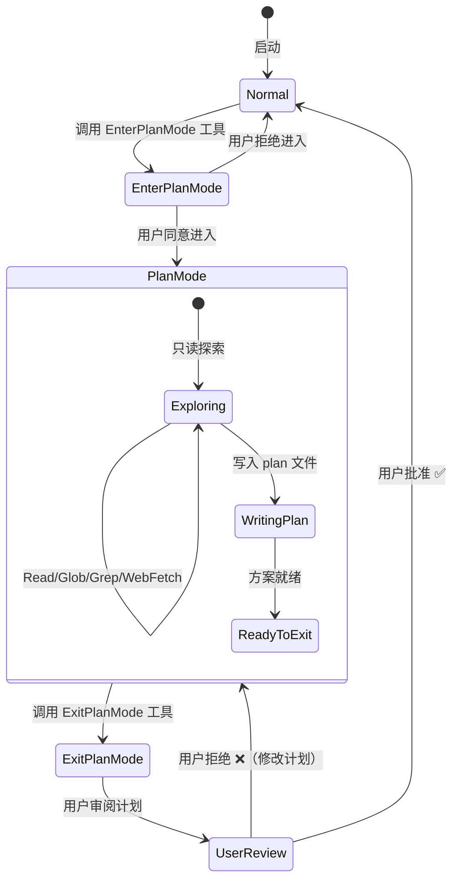
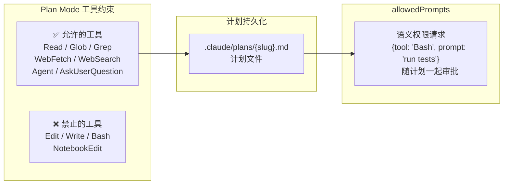

# s10 — Plan 模式：先想后做

> "Measure twice, cut once" · 预计阅读 15 分钟

**核心洞察：Plan 模式通过状态机限制工具权限——"只读不写"，让 Agent 在动手前先和用户对齐方案。**

::: info Key Takeaways
- **状态机设计** — Plan 模式是权限模式切换，不是工具集切换，保护 Prompt Cache 不失效
- **EnterPlanMode / ExitPlanMode** — 两个工具控制进入和退出，ExitPlanMode 携带权限批处理
- **语义权限批处理** — 退出 Plan 时可批量授权一组操作，减少后续权限确认弹窗
- **Cache 友好** — 不改变工具列表，不改变 system prompt，最大化缓存复用
:::

## 问题

如何让 agent 在动手之前先对齐方案？

LLM agent 最常见的失败模式不是"做错了"，而是"做的不是用户想要的"。一个 agent 花了 20 分钟重构了认证系统，结果用户只是想加个退出按钮。问题不在执行能力，而在**方案对齐**——agent 和用户对"做什么"以及"怎么做"没有达成共识就开始干活了。

Claude Code 用 **Plan Mode** 解决这个问题：一个显式的"只读规划阶段"，让 agent 先探索代码库、设计方案、获得用户审批，然后才开始写代码。Plan Mode 的核心设计是一个**状态机**——通过模式切换限制 agent 的行为，让它在规划阶段只能读不能写。

更有意思的是实现方式：Plan Mode 没有切换工具集（不移除 Edit/Write/Bash），而是用**权限模式**来约束行为。这是一个缓存感知的设计决策——切换工具集会导致 system prompt 变化，破坏 Prompt Cache 的前缀匹配。

## 架构图





## 核心机制

### 状态机：权限模式切换

Plan Mode 的核心是 `toolPermissionContext.mode` 的状态切换。当 agent 调用 `EnterPlanMode` 工具时：

1. **用户确认**：工具的 `shouldDefer: true` 触发权限请求，用户必须同意进入计划模式
2. **模式切换**：`prepareContextForPlanMode()` 将 mode 设为 `'plan'`，并保存 `prePlanMode` 以便退出时恢复
3. **行为约束**：在 `'plan'` 模式下，权限系统自动拒绝写入类工具的执行

关键代码路径在 `EnterPlanModeTool.call()` 中：

```typescript
// 保存当前模式，切换到 plan
context.setAppState(prev => ({
  ...prev,
  toolPermissionContext: applyPermissionUpdate(
    prepareContextForPlanMode(prev.toolPermissionContext),
    { type: 'setMode', mode: 'plan', destination: 'session' },
  ),
}))
```

注意这里不是"移除 Edit/Write 工具"，而是"切换权限模式"。工具列表保持不变，但权限系统在 `'plan'` 模式下会拒绝写入操作。这个设计保护了 system prompt 的前缀稳定性。

### EnterPlanMode：规划触发条件

EnterPlanMode 的 prompt 定义了何时应该进入计划模式（源码路径：`src/tools/EnterPlanModeTool/prompt.ts`）。它区分了两种用户类型：

**外部用户**（偏保守）：任何非平凡任务都建议进入计划模式，包括新功能实现、多种可行方案、代码修改、架构决策、多文件变更、需求不明确等场景。

**Ant 用户**（偏积极）：只在有真正架构歧义时才进入计划模式。简单任务即使涉及多文件也直接开始。

这个区分反映了一个设计哲学：对于内部用户（更了解工具），减少不必要的计划开销；对于外部用户（可能期望更多确认），多做方案对齐。

```typescript
export function getEnterPlanModeToolPrompt(): string {
  return process.env.USER_TYPE === 'ant'
    ? getEnterPlanModeToolPromptAnt()
    : getEnterPlanModeToolPromptExternal()
}
```

### ExitPlanMode：计划审批循环

ExitPlanMode 是计划模式的出口。它的核心是一个**审批循环**：

1. Agent 将计划写入 `.claude/plans/{slug}.md` 文件
2. 调用 ExitPlanMode 工具（`shouldDefer: true` 触发用户审批）
3. 用户可以：
   - **批准**：模式恢复为 `prePlanMode`，开始实施
   - **编辑后批准**：CCR Web UI 或 Ctrl+G 编辑计划，标记 `planWasEdited`
   - **拒绝**：返回计划模式继续修改

批准时的状态恢复逻辑（源码路径：`src/tools/ExitPlanModeTool/ExitPlanModeV2Tool.ts`）：

```typescript
context.setAppState(prev => {
  // 恢复到进入 plan 前的模式
  let restoreMode = prev.toolPermissionContext.prePlanMode ?? 'default'
  // ...auto mode gate 检查...
  return {
    ...prev,
    toolPermissionContext: {
      ...baseContext,
      mode: restoreMode,
      prePlanMode: undefined,  // 清除保存的模式
    },
  }
})
```

### allowedPrompts：语义权限请求

ExitPlanMode 支持一个精妙的功能——`allowedPrompts`。Agent 可以在退出计划模式时，随计划一起提交语义级别的权限请求：

```typescript
const allowedPromptSchema = z.object({
  tool: z.enum(['Bash']),
  prompt: z.string().describe(
    'Semantic description of the action, e.g. "run tests", "install dependencies"'
  ),
})
```

这意味着 agent 可以在计划中说"我需要运行测试"和"我需要安装依赖"，用户批准计划的同时也批准了这些操作权限。这避免了实施阶段的反复确认。

### 计划文件持久化

计划文件存储在 `.claude/plans/` 目录下，文件名使用 word slug（如 `brave-fox.md`）。这个设计有几个考量（源码路径：`src/utils/plans.ts`）：

1. **可读性**：word slug 比 UUID 更容易在文件系统中识别
2. **持久性**：文件存储意味着计划在 session resume 后仍然可用
3. **可配置**：`settings.plansDirectory` 允许自定义计划目录
4. **远程恢复**：CCR 环境通过 `persistFileSnapshotIfRemote()` 将计划快照写入 transcript，支持跨会话恢复

```typescript
export function getPlanFilePath(agentId?: AgentId): string {
  const planSlug = getPlanSlug(getSessionId())
  if (!agentId) {
    return join(getPlansDirectory(), `${planSlug}.md`)
  }
  // 子 agent 的计划文件带 agent ID 后缀
  return join(getPlansDirectory(), `${planSlug}-agent-${agentId}.md`)
}
```

### Teammate 场景：团队审批

当 Plan Mode 用于团队协作时（Agent Swarms），审批流程不同：

- **有 `isPlanModeRequired()` 的 teammate**：计划通过 mailbox 发送给 team lead 审批
- **自愿进入计划模式的 teammate**：直接退出，无需 leader 审批

teammate 的计划审批是异步的——teammate 发送 `plan_approval_request`，然后等待 inbox 中的批准/拒绝消息：

```typescript
if (isTeammate() && isPlanModeRequired()) {
  const approvalRequest = {
    type: 'plan_approval_request',
    from: agentName,
    planFilePath: filePath,
    planContent: plan,
    requestId,
  }
  await writeToMailbox('team-lead', { ... }, teamName)
  return { data: { awaitingLeaderApproval: true, requestId } }
}
```

### 通道限制：安全阀

当 `--channels` 参数激活时（用户通过 Telegram/Discord 等外部渠道交互），Plan Mode 被完全禁用。因为 ExitPlanMode 的审批对话框需要终端交互，如果用户不在终端前，审批就会挂起。所以 EnterPlanMode 和 ExitPlanMode 的 `isEnabled()` 都会在检测到 channels 时返回 false：

```typescript
isEnabled() {
  if ((feature('KAIROS') || feature('KAIROS_CHANNELS')) 
      && getAllowedChannels().length > 0) {
    return false  // 防止 plan mode 变成"陷阱"
  }
  return true
}
```

## Python 伪代码

<details>
<summary>展开查看完整 Python 伪代码（326 行）</summary>

```python
"""Plan Mode 状态机——用权限模式实现只读规划阶段"""

from enum import Enum
from dataclasses import dataclass, field
from typing import Optional
import os
import json
from pathlib import Path


class PermissionMode(Enum):
    DEFAULT = "default"
    PLAN = "plan"
    AUTO = "auto"


@dataclass
class AllowedPrompt:
    """语义级权限请求，随计划一起审批"""
    tool: str  # 目前只支持 "Bash"
    prompt: str  # 如 "run tests", "install dependencies"


@dataclass
class ToolPermissionContext:
    mode: PermissionMode = PermissionMode.DEFAULT
    pre_plan_mode: Optional[PermissionMode] = None  # 进入 plan 前的模式


@dataclass
class PlanModeManager:
    """Plan Mode 状态机管理器"""
    
    permission_context: ToolPermissionContext = field(
        default_factory=ToolPermissionContext
    )
    plans_directory: str = ".claude/plans"
    plan_slug: Optional[str] = None
    has_exited_plan_mode: bool = False
    
    # 只读工具白名单
    READONLY_TOOLS = {
        "Read", "Glob", "Grep", 
        "WebFetch", "WebSearch", 
        "Agent", "AskUserQuestion",
    }
    
    # 写入类工具（在 plan mode 中被阻止）
    WRITE_TOOLS = {
        "Edit", "Write", "Bash", 
        "NotebookEdit",
    }
    
    # ── 进入计划模式 ──────────────────────────────
    
    def enter_plan_mode(self, user_approved: bool = False) -> dict:
        """
        EnterPlanMode 工具的核心逻辑。
        
        注意：不切换工具集，只切换权限模式。
        这保护了 system prompt 的前缀稳定性（Prompt Cache）。
        """
        if not user_approved:
            return {"behavior": "ask", "message": "Enter plan mode?"}
        
        # 保存当前模式，以便退出时恢复
        self.permission_context.pre_plan_mode = self.permission_context.mode
        self.permission_context.mode = PermissionMode.PLAN
        
        return {
            "message": "Entered plan mode. Focus on exploring "
                       "the codebase and designing an approach."
        }
    
    # ── 工具权限检查 ────────────────────────────────
    
    def check_tool_allowed(self, tool_name: str) -> bool:
        """
        在 plan mode 下检查工具是否允许执行。
        
        不是移除工具，而是在权限层拒绝。
        工具列表不变 → system prompt 不变 → Cache 命中。
        """
        if self.permission_context.mode != PermissionMode.PLAN:
            return True  # 非 plan mode，不限制
        
        if tool_name in self.WRITE_TOOLS:
            return False  # plan mode 禁止写入
        
        return True  # 读取类工具允许
    
    # ── 计划文件管理 ────────────────────────────────
    
    def get_plan_file_path(self, agent_id: Optional[str] = None) -> str:
        """
        获取计划文件路径。
        
        主会话: {slug}.md
        子agent: {slug}-agent-{agent_id}.md
        """
        if self.plan_slug is None:
            self.plan_slug = self._generate_word_slug()
        
        os.makedirs(self.plans_directory, exist_ok=True)
        
        if agent_id:
            return os.path.join(
                self.plans_directory, 
                f"{self.plan_slug}-agent-{agent_id}.md"
            )
        return os.path.join(
            self.plans_directory, 
            f"{self.plan_slug}.md"
        )
    
    def get_plan(self, agent_id: Optional[str] = None) -> Optional[str]:
        """从磁盘读取计划内容"""
        path = self.get_plan_file_path(agent_id)
        try:
            return Path(path).read_text(encoding="utf-8")
        except FileNotFoundError:
            return None
    
    # ── 退出计划模式 ────────────────────────────────
    
    def exit_plan_mode(
        self,
        user_approved: bool = False,
        user_edited_plan: Optional[str] = None,
        allowed_prompts: Optional[list[AllowedPrompt]] = None,
        agent_id: Optional[str] = None,
    ) -> dict:
        """
        ExitPlanMode 工具的核心逻辑。
        
        审批循环：用户可以批准、编辑后批准、或拒绝。
        """
        if self.permission_context.mode != PermissionMode.PLAN:
            raise ValueError(
                "Not in plan mode. This tool is only for "
                "exiting plan mode after writing a plan."
            )
        
        # 读取计划内容
        plan = user_edited_plan or self.get_plan(agent_id)
        file_path = self.get_plan_file_path(agent_id)
        
        # 如果用户编辑了计划，写回磁盘
        if user_edited_plan is not None:
            Path(file_path).write_text(user_edited_plan, encoding="utf-8")
        
        if not user_approved:
            return {
                "behavior": "ask",
                "message": "Exit plan mode?",
                "plan": plan,
            }
        
        # ── 批准：恢复模式 ──
        restore_mode = (
            self.permission_context.pre_plan_mode 
            or PermissionMode.DEFAULT
        )
        
        self.permission_context.mode = restore_mode
        self.permission_context.pre_plan_mode = None
        self.has_exited_plan_mode = True
        
        # 处理 allowedPrompts（语义权限）
        granted_prompts = []
        if allowed_prompts:
            for ap in allowed_prompts:
                granted_prompts.append(
                    f"{ap.tool}: {ap.prompt}"
                )
        
        return {
            "plan": plan,
            "file_path": file_path,
            "plan_was_edited": user_edited_plan is not None,
            "granted_prompts": granted_prompts,
            "message": (
                f"Plan approved. Saved to: {file_path}. "
                "You can now start coding."
            ),
        }
    
    # ── Teammate 审批（异步） ─────────────────────
    
    def exit_plan_mode_teammate(
        self,
        agent_name: str,
        team_name: str,
        plan_required: bool = True,
    ) -> dict:
        """
        Teammate 的 ExitPlanMode：
        - plan_mode_required: 发送给 team lead 审批
        - 自愿 plan mode: 直接退出
        """
        plan = self.get_plan()
        file_path = self.get_plan_file_path()
        
        if plan_required:
            if not plan:
                raise ValueError(
                    f"No plan file found at {file_path}. "
                    "Write your plan before calling ExitPlanMode."
                )
            
            # 发送审批请求到 team lead 的 mailbox
            request_id = f"plan_approval_{agent_name}_{team_name}"
            approval_request = {
                "type": "plan_approval_request",
                "from": agent_name,
                "plan_file_path": file_path,
                "plan_content": plan,
                "request_id": request_id,
            }
            self._write_to_mailbox(
                "team-lead", approval_request, team_name
            )
            
            return {
                "awaiting_leader_approval": True,
                "request_id": request_id,
                "message": "Plan submitted to team lead for approval.",
            }
        else:
            # 自愿 plan mode，直接退出
            self.permission_context.mode = (
                self.permission_context.pre_plan_mode 
                or PermissionMode.DEFAULT
            )
            self.permission_context.pre_plan_mode = None
            return {"plan": plan, "file_path": file_path}
    
    # ── 辅助方法 ────────────────────────────────────
    
    @staticmethod
    def should_enter_plan_mode(task_description: str) -> bool:
        """
        判断是否应该进入计划模式的启发式规则。
        
        源码中这部分逻辑在 prompt 中用自然语言描述，
        由模型自行判断。这里用代码示意。
        """
        # 简单任务不需要计划
        simple_indicators = ["fix typo", "add console.log", "rename"]
        if any(s in task_description.lower() for s in simple_indicators):
            return False
        
        # 复杂任务需要计划
        complex_indicators = [
            "implement", "refactor", "redesign",
            "migrate", "add feature", "authentication",
        ]
        return any(
            s in task_description.lower() 
            for s in complex_indicators
        )
    
    def _generate_word_slug(self) -> str:
        """生成可读的 word slug（如 brave-fox）"""
        import random
        adjectives = ["brave", "calm", "dark", "eager", "fair"]
        nouns = ["fox", "owl", "elm", "bay", "oak"]
        return f"{random.choice(adjectives)}-{random.choice(nouns)}"
    
    def _write_to_mailbox(
        self, recipient: str, message: dict, team_name: str
    ) -> None:
        """写入 teammate mailbox（简化）"""
        mailbox_dir = Path(f".claude/teams/{team_name}/mailboxes/{recipient}")
        mailbox_dir.mkdir(parents=True, exist_ok=True)
        msg_file = mailbox_dir / f"{message.get('request_id', 'msg')}.json"
        msg_file.write_text(json.dumps(message), encoding="utf-8")


# ── 使用示例 ────────────────────────────────────

def demo_plan_mode():
    """演示 Plan Mode 完整流程"""
    pm = PlanModeManager()
    
    # 1. Agent 判断需要计划
    assert pm.should_enter_plan_mode("Implement user authentication")
    
    # 2. 进入计划模式（需要用户同意）
    result = pm.enter_plan_mode(user_approved=True)
    assert pm.permission_context.mode == PermissionMode.PLAN
    print(f"[Enter] {result['message']}")
    
    # 3. 在计划模式中，写入工具被阻止
    assert pm.check_tool_allowed("Read") == True
    assert pm.check_tool_allowed("Grep") == True
    assert pm.check_tool_allowed("Edit") == False  # 被阻止！
    assert pm.check_tool_allowed("Bash") == False  # 被阻止！
    
    # 4. Agent 写入计划文件（通过 Write 工具写 plan 文件是特殊允许的）
    plan_path = pm.get_plan_file_path()
    Path(plan_path).parent.mkdir(parents=True, exist_ok=True)
    Path(plan_path).write_text(
        "# Authentication Plan\n"
        "1. Add JWT middleware\n"
        "2. Create login endpoint\n"
        "3. Add route guards\n",
        encoding="utf-8"
    )
    
    # 5. 退出计划模式（用户审批）
    result = pm.exit_plan_mode(
        user_approved=True,
        allowed_prompts=[
            AllowedPrompt(tool="Bash", prompt="run tests"),
            AllowedPrompt(tool="Bash", prompt="install jsonwebtoken"),
        ],
    )
    assert pm.permission_context.mode == PermissionMode.DEFAULT
    print(f"[Exit] {result['message']}")
    print(f"[Exit] Granted: {result['granted_prompts']}")


if __name__ == "__main__":
    demo_plan_mode()
```

</details>

## 源码映射

| 概念 | 真实源码路径 | 说明 |
|------|-------------|------|
| 进入计划模式 | `src/tools/EnterPlanModeTool/EnterPlanModeTool.ts` | 状态切换 + 权限模式设置 |
| 进入时机 prompt | `src/tools/EnterPlanModeTool/prompt.ts` | 区分 ant/external 用户的触发条件 |
| 退出计划模式 | `src/tools/ExitPlanModeTool/ExitPlanModeV2Tool.ts` | 审批循环 + 模式恢复 + teammate 审批 |
| 退出 prompt | `src/tools/ExitPlanModeTool/prompt.ts` | 退出条件定义 |
| allowedPrompts schema | `src/tools/ExitPlanModeTool/ExitPlanModeV2Tool.ts:64-73` | 语义权限请求结构 |
| 计划文件管理 | `src/utils/plans.ts` | slug 生成、文件读写、远程快照 |
| 计划模式配置 | `src/utils/planModeV2.ts` | interview phase、agent 数量、实验变量 |
| 状态转换 | `src/bootstrap/state.ts:handlePlanModeTransition` | plan mode 进入/退出的附件管理 |
| 权限模式准备 | `src/utils/permissions/permissionSetup.ts:prepareContextForPlanMode` | 模式切换 + auto mode 处理 |
| 退出 UI | `src/tools/ExitPlanModeTool/UI.tsx` | 批准/拒绝/teammate 等待的渲染 |
| 进入 UI | `src/tools/EnterPlanModeTool/UI.tsx` | 进入/拒绝进入的渲染 |

## 设计决策

### 为什么不切换工具集？

最直觉的实现是：进入 plan mode 时移除 Edit/Write/Bash 工具，退出时加回来。但 Claude Code 选择了保留工具集、只切换权限模式。原因是 **Prompt Cache**：

- Claude API 的 Prompt Cache 基于 system prompt + 前缀的精确匹配
- 工具定义是 system prompt 的一部分
- 切换工具集 = system prompt 变化 = Cache Miss
- 在长对话中，一次 Cache Miss 可能意味着数万 token 的重新计算

这是一个"缓存感知"的架构决策：用行为约束（权限模式）替代结构约束（工具集变更），以保护运行时性能。

### Plan Mode vs AskUserQuestion

为什么不让 agent 用 AskUserQuestion 逐个问题地对齐方案？Plan Mode 的优势在于：

1. **结构化输出**：计划是一个完整文档，而不是散落在对话中的问答
2. **可编辑**：用户可以直接编辑计划文件（Ctrl+G 或 Web UI）
3. **可持久化**：计划保存在文件中，跨 session 可用
4. **批量权限**：`allowedPrompts` 让用户一次性授权多个操作

prompt 中也明确说了："If you would use AskUserQuestion to clarify the approach, use EnterPlanMode instead."

### 竞品对比

| 特性 | Claude Code Plan Mode | Cursor Composer | Aider Architect |
|------|---------------------|-----------------|-----------------|
| 显式状态机 | 是 | 否（始终可规划） | 是（architect/coder 分离） |
| 工具约束 | 权限模式（Cache 友好） | 无约束 | 模型分离 |
| 计划持久化 | 文件存储 | 内存 | 对话历史 |
| 用户编辑 | 支持（Ctrl+G / Web UI） | 有限 | 否 |
| 语义权限请求 | allowedPrompts | 无 | 无 |
| 团队审批 | 支持（mailbox） | 不支持 | 不支持 |

### Interview Phase 实验

Claude Code 还在实验一个更结构化的计划流程——"Interview Phase"。启用后，Plan Mode 的 workflow 指令不在工具 prompt 中，而是通过 attachment 注入更详细的多阶段指引。这是一个正在进行的 A/B 测试，目标是找到计划详细程度和实施效率的最佳平衡点。

## Why：设计决策与行业上下文

### Routing 策略：Context Engineering 的第六策略

Plan Mode 是 **Routing**（路由）策略的实现 [R1-11]——根据任务类型选择不同的执行策略，将查询导向正确的处理路径。在 Plan 模式下，Agent 只做分析和规划，不执行修改操作，这本质上是将"规划"和"执行"路由到不同的行为模式。

### 约束提升质量

Plan Mode 也是"约束悖论"的体现 [R1-7]：通过限制 Agent 只能思考不能行动，反而让规划质量更高。这与 LangChain 在 Terminal Bench 2.0 上的发现一致——harness 层的约束是提升 Agent 可靠性的关键 [R1-2]。

> **参考来源：** LangChain [R1-2]、Epsilla [R1-7]。完整引用见 `docs/research/05-harness-trends-deep-20260401.md`。

## 变化表

与 s08（Memory 系统）相比，本课新增了以下概念：

| 新增概念 | 说明 |
|---------|------|
| Plan Mode 状态机 | Normal ↔ Plan 的模式切换 |
| 权限模式约束 | 通过 mode 而非工具集变更实现只读 |
| 计划审批循环 | 用户批准/编辑/拒绝的交互流程 |
| allowedPrompts | 语义级权限请求，随计划一起审批 |
| 计划文件持久化 | `.claude/plans/{slug}.md` |
| Teammate 异步审批 | 通过 mailbox 发送给 team lead |
| 缓存感知设计 | 不改变工具集以保护 Prompt Cache |

## 动手试试

### 练习 1：模拟 Plan Mode 状态机

基于本课的伪代码，扩展 `PlanModeManager`：
- 添加一个 `rejected_count` 计数器，跟踪用户拒绝计划的次数
- 当拒绝次数超过 3 时，自动建议 agent 使用 `AskUserQuestion` 先澄清需求
- 测试完整流程：进入 → 被拒绝 2 次 → 修改计划 → 批准

### 练习 2：计划质量评估器

实现一个 `PlanQualityChecker`：
- 检查计划文件是否包含必要元素（目标、步骤、风险）
- 统计计划长度，与 Claude Code 的实验数据对比（p50 ~4906 chars, p90 ~11617 chars）
- 如果计划太短（<500 chars）或太长（>15000 chars），给出警告
- 参考 `src/utils/planModeV2.ts` 中的 `getPewterLedgerVariant()` 了解 Claude Code 如何实验计划长度优化

### 练习 3：Cache 影响分析

编写一个脚本模拟两种 Plan Mode 实现的 Cache 行为：
- **方案 A**：切换工具集（移除 Edit/Write/Bash）
- **方案 B**：保持工具集不变，用权限模式约束（Claude Code 的做法）
- 假设 system prompt 为 10000 tokens，工具定义占 3000 tokens
- 计算在一次计划会话（进入 + 5 轮探索 + 退出）中，两种方案的 Cache 命中率差异

## 推荐阅读

- [Harness design for long-running application development (Anthropic)](https://www.anthropic.com/engineering/) — 长时运行 Agent 的质量控制
