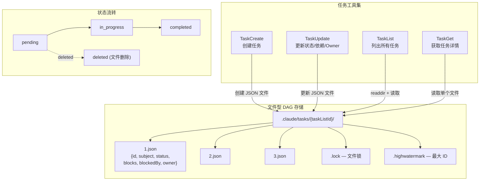
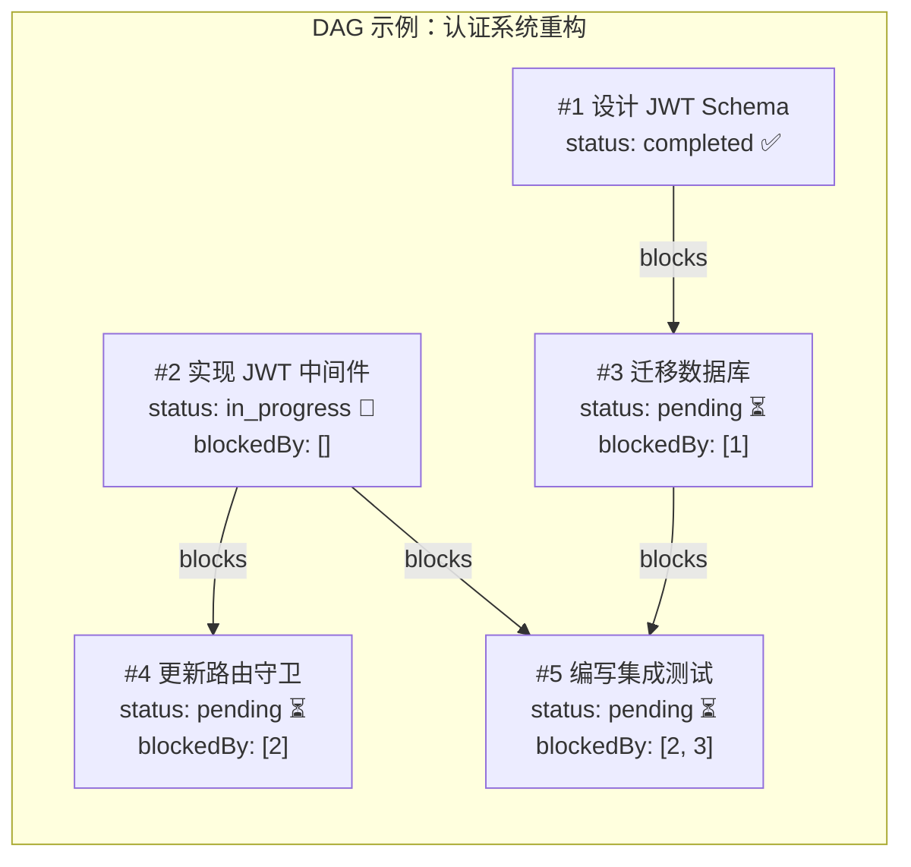

# s11 — 任务系统：DAG 依赖与进度追踪

> "Plan the work, work the plan" · 预计阅读 15 分钟

**核心洞察：任务系统用文件 DAG 管理依赖——每个任务一个 JSON 文件，blocks/blockedBy 字段构成有向无环图。**

::: info Key Takeaways
- **文件 DAG** — 每个 Task 一个 JSON 文件，双向链接 blocks/blockedBy 实现依赖图
- **高水位 ID** — 递增 ID 保证并发安全，即使删除也不复用
- **proper-lockfile** — 文件锁实现多 Agent 并发安全访问
- **Context Engineering = Write** — 任务状态持久化到磁盘，跨 Agent、跨会话
:::

Plan Mode（s10）输出的计划如何转化为可执行的任务？典型工作流是：Plan Mode 输出计划 → 用户批准 → Agent 根据计划调用 TaskCreate 逐条创建任务 → 建立 DAG 依赖 → 按序执行。Tasks 是 Plan 的执行载体。

## 问题

复杂任务如何拆解、追踪依赖、管理进度？

当用户说"重构认证系统"时，这不是一个任务——这是十几个任务。解耦 session 管理、创建新的 JWT 中间件、迁移数据库 schema、更新路由守卫、修改测试......这些任务之间还有依赖关系：路由守卫依赖 JWT 中间件，测试依赖所有实现完成。

没有任务管理系统的 agent 会陷入两个困境：

1. **迷失方向**：做到第 5 步忘了还有哪些没做，或者重复做了已经完成的工作
2. **依赖违反**：先做了依赖后续步骤的任务，导致返工

Claude Code 的任务系统用**文件型 DAG**（有向无环图）解决这个问题。每个任务是一个 JSON 文件，存储在 `.claude/tasks/{team}/` 目录下。任务之间通过 `blocks` 和 `blockedBy` 字段建立依赖关系，状态通过 `pending → in_progress → completed` 流转。

这套系统还服务于 Agent Swarms（多 agent 协作），多个 agent 可以并行领取和执行不相互阻塞的任务。

## 架构图





## 核心机制

### 文件型 DAG：每个任务一个 JSON 文件

Claude Code 的任务系统采用最朴素的持久化方案——每个任务是一个独立的 JSON 文件。任务目录结构如下：

```
~/.claude/tasks/
└── {taskListId}/           # 通常是 team name 或 session ID
    ├── .lock               # 文件锁（防止并发冲突）
    ├── .highwatermark      # 最大已分配 ID（防止 ID 重用）
    ├── 1.json              # 任务 #1
    ├── 2.json              # 任务 #2
    └── 3.json              # 任务 #3
```

每个任务文件的 Schema（源码路径：`src/utils/tasks.ts`）：

```typescript
const TaskSchema = z.object({
  id: z.string(),
  subject: z.string(),           // 任务标题
  description: z.string(),       // 详细描述
  activeForm: z.string().optional(), // spinner 显示文本
  owner: z.string().optional(),  // agent 名称
  status: z.enum(['pending', 'in_progress', 'completed']),
  blocks: z.array(z.string()),   // 本任务阻塞的任务 ID
  blockedBy: z.array(z.string()), // 阻塞本任务的任务 ID
  metadata: z.record(z.string(), z.unknown()).optional(),
})
```

`taskListId` 的解析优先级反映了系统的多层使用场景：
1. `CLAUDE_CODE_TASK_LIST_ID` 环境变量——显式指定
2. In-process teammate 的 team name——共享 leader 的任务列表
3. `CLAUDE_CODE_TEAM_NAME`——进程级 teammate
4. Leader 创建团队时设置的 team name
5. Session ID——独立会话的回退

### 任务 CRUD：四个工具的分工

任务系统由四个工具组成，各司其职：

**TaskCreate**（源码路径：`src/tools/TaskCreateTool/TaskCreateTool.ts`）：
- 输入：`subject`、`description`、`activeForm`（可选）、`metadata`（可选）
- 自动分配递增 ID（基于 high water mark）
- 新任务初始状态为 `pending`，无 owner
- 创建后自动展开 UI 的任务列表视图
- 触发 `TaskCreated` hooks

**TaskUpdate**（源码路径：`src/tools/TaskUpdateTool/TaskUpdateTool.ts`）：
- 支持更新：status、subject、description、activeForm、owner、metadata
- 支持设置依赖：`addBlocks`、`addBlockedBy`
- 特殊状态 `deleted` 会删除任务文件并清理所有引用
- 标记 `completed` 时触发 `TaskCompleted` hooks
- Agent Swarms 模式下，设置 `in_progress` 时自动分配 owner

**TaskList**（源码路径：`src/tools/TaskListTool/TaskListTool.ts`）：
- 无参数，返回所有任务的摘要
- 过滤掉 `metadata._internal` 为 true 的内部任务
- 自动过滤已完成任务的 blockedBy 引用（完成的依赖不再阻塞）
- 输出格式：`#1 [pending] Fix auth bug (agent-1) [blocked by #2, #3]`

**TaskGet**（源码路径：`src/tools/TaskGetTool/TaskGetTool.ts`）：
- 输入：`taskId`
- 返回完整任务详情，包含 description、blocks、blockedBy

### 依赖关系：双向链接

依赖关系通过 `blockTask()` 函数建立，它维护双向链接（源码路径：`src/utils/tasks.ts`）：

```typescript
export async function blockTask(
  taskListId: string,
  fromTaskId: string,  // 阻塞者
  toTaskId: string,    // 被阻塞者
): Promise<boolean> {
  // 更新阻塞者：A blocks B
  if (!fromTask.blocks.includes(toTaskId)) {
    await updateTask(taskListId, fromTaskId, {
      blocks: [...fromTask.blocks, toTaskId],
    })
  }
  // 更新被阻塞者：B is blockedBy A
  if (!toTask.blockedBy.includes(fromTaskId)) {
    await updateTask(taskListId, toTaskId, {
      blockedBy: [...toTask.blockedBy, fromTaskId],
    })
  }
  return true
}
```

当一个任务被删除时，系统会清理所有引用它的 blocks 和 blockedBy 字段：

```typescript
// 删除后清理引用
const allTasks = await listTasks(taskListId)
for (const task of allTasks) {
  const newBlocks = task.blocks.filter(id => id !== taskId)
  const newBlockedBy = task.blockedBy.filter(id => id !== taskId)
  if (newBlocks.length !== task.blocks.length 
      || newBlockedBy.length !== task.blockedBy.length) {
    await updateTask(taskListId, task.id, {
      blocks: newBlocks, blockedBy: newBlockedBy,
    })
  }
}
```

注意：依赖解析在 TaskList 的输出层面也做了优化——已完成任务的 ID 会从 blockedBy 列表中过滤掉，这样 agent 看到的是"还有哪些未完成的依赖"，而不是"原始依赖列表"。

> :warning: **当前实现不做环路检测**。如果建立 A→B→C→A 的循环依赖，所有任务将永远无法执行。Agent Swarms 中多个 agent 并发建立依赖时这个风险更高。遇到任务卡住时，检查 `blockedBy` 字段是否形成环路。

### 并发安全：文件锁

多个 agent 同时操作任务列表时，必须防止竞态条件。Claude Code 使用 `proper-lockfile` 库实现文件级锁定：

```typescript
const LOCK_OPTIONS = {
  retries: {
    retries: 30,      // 最多重试 30 次
    minTimeout: 5,     // 最小等待 5ms
    maxTimeout: 100,   // 最大等待 100ms
  },
}
```

锁定策略分两个层级：

1. **任务列表级锁**（`.lock` 文件）：用于 `createTask`（分配 ID）和 `claimTask`（原子领取），确保 ID 不重复、一个任务不被两个 agent 同时领取
2. **任务文件级锁**（`{id}.json` 文件）：用于 `updateTask`，确保并发更新不会互相覆盖

这个设计针对"10+ 个并发 swarm agent"场景优化，每个临界区大约 50-100ms（readdir + N x readFile + writeFile），30 次重试给出约 2.6 秒的总等待预算。

**忙碌检测**：`claimTaskWithBusyCheck()` 在领取任务前检查当前 agent 是否已有 `in_progress` 任务——防止贪心 agent 同时领取多个任务，避免资源饥饿。

### ID 管理：High Water Mark

任务 ID 是递增的整数。为了防止删除或重置后 ID 重用，系统维护一个 `.highwatermark` 文件：

```typescript
async function findHighestTaskId(taskListId: string): Promise<number> {
  const [fromFiles, fromMark] = await Promise.all([
    findHighestTaskIdFromFiles(taskListId),  // 扫描现有文件
    readHighWaterMark(taskListId),            // 读取 high water mark
  ])
  return Math.max(fromFiles, fromMark)
}
```

当任务被删除或任务列表被重置时，当前最高 ID 被写入 high water mark。下次创建任务时，新 ID = max(文件中最高 ID, high water mark) + 1。这保证了即使所有任务都被删除，新任务的 ID 也不会与之前的冲突。

### Agent Swarms 集成

任务系统是 Agent Swarms 的核心协调机制。几个关键行为：

**自动 Owner 分配**：当 teammate 标记任务为 `in_progress` 但没有设置 owner 时，系统自动将 owner 设为 teammate 的名称：

```typescript
if (isAgentSwarmsEnabled() && status === 'in_progress' 
    && owner === undefined && !existingTask.owner) {
  const agentName = getAgentName()
  if (agentName) {
    updates.owner = agentName
  }
}
```

**Mailbox 通知**：当 owner 变更时，系统通过 mailbox 通知新 owner：

```typescript
if (updates.owner && isAgentSwarmsEnabled()) {
  const assignmentMessage = JSON.stringify({
    type: 'task_assignment',
    taskId,
    subject: existingTask.subject,
    assignedBy: senderName,
  })
  await writeToMailbox(updates.owner, { ... }, taskListId)
}
```

**任务完成提醒**：teammate 完成任务后，tool result 会提醒它调用 TaskList 寻找下一个可用任务。

**验证提醒**：当所有 3+ 个任务都完成且没有验证步骤时，系统会提醒 agent spawn 一个 verification agent。

### 任务退出与清理

当 teammate 被终止或正常退出时，`unassignTeammateTasks()` 会清理其未完成任务（源码路径：`src/utils/tasks.ts`）：

- 将 teammate 拥有的所有未完成任务的 owner 清空
- 将状态重置为 `pending`
- 生成通知消息，告知 team lead 哪些任务需要重新分配

## Python 伪代码

<details>
<summary>展开查看完整 Python 伪代码（248 行）</summary>

```python
"""任务系统——文件型 DAG 依赖管理"""

import json, os, threading
from dataclasses import dataclass, field
from enum import Enum
from pathlib import Path
from typing import Optional


class TaskStatus(Enum):
    PENDING = "pending"
    IN_PROGRESS = "in_progress"
    COMPLETED = "completed"


@dataclass
class Task:
    id: str
    subject: str
    description: str
    status: TaskStatus = TaskStatus.PENDING
    owner: Optional[str] = None
    blocks: list[str] = field(default_factory=list)      # 本任务阻塞谁
    blocked_by: list[str] = field(default_factory=list)   # 谁阻塞本任务
    active_form: Optional[str] = None
    metadata: dict = field(default_factory=dict)

    def to_dict(self) -> dict:
        return {
            "id": self.id, "subject": self.subject,
            "description": self.description,
            "status": self.status.value, "owner": self.owner,
            "blocks": self.blocks, "blockedBy": self.blocked_by,
            "activeForm": self.active_form, "metadata": self.metadata,
        }

    @classmethod
    def from_dict(cls, data: dict) -> "Task":
        return cls(
            id=data["id"], subject=data["subject"],
            description=data["description"],
            status=TaskStatus(data["status"]),
            owner=data.get("owner"),
            blocks=data.get("blocks", []),
            blocked_by=data.get("blockedBy", []),
            active_form=data.get("activeForm"),
            metadata=data.get("metadata", {}),
        )


class TaskManager:
    """文件型 DAG 任务管理器，每个任务一个 JSON 文件。"""

    def __init__(self, base_dir: str = ".claude/tasks"):
        self.base_dir = base_dir
        self._lock = threading.Lock()  # 简化：用内存锁代替文件锁

    def _task_path(self, list_id: str, task_id: str) -> str:
        return os.path.join(self.base_dir, list_id, f"{task_id}.json")

    def _hwm_path(self, list_id: str) -> str:
        return os.path.join(self.base_dir, list_id, ".highwatermark")

    # ── 创建任务 ──────────────────────────────────

    def create(self, list_id: str, subject: str, desc: str) -> str:
        """创建任务，原子分配递增 ID（对应 TaskCreate）"""
        os.makedirs(os.path.join(self.base_dir, list_id), exist_ok=True)
        with self._lock:
            highest = self._find_highest_id(list_id)
            new_id = str(highest + 1)
            task = Task(id=new_id, subject=subject, description=desc)
            Path(self._task_path(list_id, new_id)).write_text(
                json.dumps(task.to_dict(), indent=2)
            )
        return new_id

    def _find_highest_id(self, list_id: str) -> int:
        """max(文件中最高 ID, high water mark)"""
        d = os.path.join(self.base_dir, list_id)
        from_files = 0
        try:
            for f in os.listdir(d):
                if f.endswith(".json"):
                    try: from_files = max(from_files, int(f[:-5]))
                    except ValueError: pass
        except FileNotFoundError: pass
        # High water mark 防止删除后 ID 重用
        try: hwm = int(Path(self._hwm_path(list_id)).read_text().strip())
        except (FileNotFoundError, ValueError): hwm = 0
        return max(from_files, hwm)

    # ── 读取 ──────────────────────────────────────

    def get(self, list_id: str, task_id: str) -> Optional[Task]:
        """读取单个任务（对应 TaskGet）"""
        try:
            data = json.loads(Path(self._task_path(list_id, task_id)).read_text())
            return Task.from_dict(data)
        except FileNotFoundError:
            return None

    def list_all(self, list_id: str) -> list[Task]:
        """列出所有任务，过滤已完成依赖（对应 TaskList）"""
        d = os.path.join(self.base_dir, list_id)
        tasks = []
        try:
            for f in sorted(os.listdir(d)):
                if f.endswith(".json"):
                    t = self.get(list_id, f[:-5])
                    if t and not t.metadata.get("_internal"):
                        tasks.append(t)
        except FileNotFoundError: pass
        # 从 blockedBy 中移除已完成任务
        done = {t.id for t in tasks if t.status == TaskStatus.COMPLETED}
        for t in tasks:
            t.blocked_by = [b for b in t.blocked_by if b not in done]
        return tasks

    # ── 更新 ──────────────────────────────────────

    def update(self, list_id: str, task_id: str, **kwargs) -> Optional[Task]:
        """更新任务字段（对应 TaskUpdate）"""
        with self._lock:
            task = self.get(list_id, task_id)
            if not task: return None
            for k, v in kwargs.items():
                if hasattr(task, k) and v is not None:
                    setattr(task, k, v)
            Path(self._task_path(list_id, task_id)).write_text(
                json.dumps(task.to_dict(), indent=2)
            )
        return task

    def delete(self, list_id: str, task_id: str) -> bool:
        """删除任务 + 更新 HWM + 清理引用"""
        try:
            n = int(task_id)
            try: hwm = int(Path(self._hwm_path(list_id)).read_text().strip())
            except: hwm = 0
            if n > hwm: Path(self._hwm_path(list_id)).write_text(str(n))
        except ValueError: pass
        try: os.unlink(self._task_path(list_id, task_id))
        except FileNotFoundError: return False
        # 清理其他任务的 blocks/blockedBy 引用
        for t in self.list_all(list_id):
            nb = [b for b in t.blocks if b != task_id]
            nbb = [b for b in t.blocked_by if b != task_id]
            if len(nb) != len(t.blocks) or len(nbb) != len(t.blocked_by):
                t.blocks, t.blocked_by = nb, nbb
                Path(self._task_path(list_id, t.id)).write_text(
                    json.dumps(t.to_dict(), indent=2)
                )
        return True

    # ── 依赖管理 ──────────────────────────────────

    def add_dependency(self, list_id: str, blocker: str, blocked: str) -> bool:
        """建立双向依赖：blocker blocks blocked"""
        a, b = self.get(list_id, blocker), self.get(list_id, blocked)
        if not a or not b: return False
        if blocked not in a.blocks:
            a.blocks.append(blocked)
            Path(self._task_path(list_id, blocker)).write_text(
                json.dumps(a.to_dict(), indent=2))
        if blocker not in b.blocked_by:
            b.blocked_by.append(blocker)
            Path(self._task_path(list_id, blocked)).write_text(
                json.dumps(b.to_dict(), indent=2))
        return True

    def get_available(self, list_id: str) -> list[Task]:
        """获取可执行任务：pending + 无 owner + 无未完成依赖"""
        tasks = self.list_all(list_id)
        done = {t.id for t in tasks if t.status == TaskStatus.COMPLETED}
        avail = [
            t for t in tasks
            if t.status == TaskStatus.PENDING
            and not t.owner
            and all(b in done for b in t.blocked_by)
        ]
        return sorted(avail, key=lambda t: int(t.id))  # 低 ID 优先

    def complete(self, list_id: str, task_id: str) -> list[str]:
        """完成任务，返回新解锁的任务 ID"""
        task = self.get(list_id, task_id)
        if not task: return []
        self.update(list_id, task_id, status=TaskStatus.COMPLETED)
        # 检查下游是否全部依赖已满足
        all_tasks = self.list_all(list_id)
        done = {t.id for t in all_tasks if t.status == TaskStatus.COMPLETED}
        return [
            did for did in task.blocks
            if (d := self.get(list_id, did))
            and d.status == TaskStatus.PENDING
            and all(b in done for b in d.blocked_by)
        ]

    def claim(self, list_id: str, task_id: str, agent: str) -> dict:
        """原子领取任务（Agent Swarms 场景）"""
        with self._lock:
            t = self.get(list_id, task_id)
            if not t: return {"ok": False, "reason": "not_found"}
            if t.owner and t.owner != agent:
                return {"ok": False, "reason": "already_claimed"}
            if t.status == TaskStatus.COMPLETED:
                return {"ok": False, "reason": "completed"}
            done = {x.id for x in self.list_all(list_id)
                    if x.status == TaskStatus.COMPLETED}
            if any(b not in done for b in t.blocked_by):
                return {"ok": False, "reason": "blocked"}
            t.owner = agent
            Path(self._task_path(list_id, task_id)).write_text(
                json.dumps(t.to_dict(), indent=2))
        return {"ok": True}


# ── 使用示例 ────────────────────────────────────

def demo():
    import tempfile
    with tempfile.TemporaryDirectory() as tmp:
        tm = TaskManager(os.path.join(tmp, "tasks"))
        team = "auth-refactor"

        # 创建 DAG
        t1 = tm.create(team, "设计 JWT Schema", "定义 token 结构")
        t2 = tm.create(team, "实现 JWT 中间件", "创建验证中间件")
        t3 = tm.create(team, "迁移数据库", "添加 refresh_token 表")
        t5 = tm.create(team, "编写集成测试", "端到端认证测试")
        tm.add_dependency(team, t1, t3)   # Schema → DB
        tm.add_dependency(team, t2, t5)   # 中间件 → 测试
        tm.add_dependency(team, t3, t5)   # DB → 测试

        print("可用:", [f"#{t.id}" for t in tm.get_available(team)])
        # → ['#1', '#2']

        unlocked = tm.complete(team, t1)
        print(f"完成 #{t1}，解锁: {unlocked}")  # → ['3']

        tm.update(team, t2, status=TaskStatus.COMPLETED)
        tm.update(team, t3, status=TaskStatus.COMPLETED)
        print("可用:", [f"#{t.id}" for t in tm.get_available(team)])
        # → ['4']  (测试的所有依赖已完成)

if __name__ == "__main__":
    demo()
```

</details>

## 源码映射

| 概念 | 真实源码路径 | 说明 |
|------|-------------|------|
| Task Schema | `src/utils/tasks.ts:TaskSchema` | 任务数据结构定义 |
| 任务目录解析 | `src/utils/tasks.ts:getTaskListId` | 5 级优先级解析 taskListId |
| 创建任务 | `src/tools/TaskCreateTool/TaskCreateTool.ts` | 分配 ID + 写入 JSON |
| 更新任务 | `src/tools/TaskUpdateTool/TaskUpdateTool.ts` | 状态/依赖/Owner 更新 |
| 任务列表 | `src/tools/TaskListTool/TaskListTool.ts` | 摘要视图 + 过滤已完成依赖 |
| 任务详情 | `src/tools/TaskGetTool/TaskGetTool.ts` | 完整详情 + blocks/blockedBy |
| 依赖建立 | `src/utils/tasks.ts:blockTask` | 双向链接维护 |
| 任务删除 | `src/utils/tasks.ts:deleteTask` | 删除文件 + 清理引用 + HWM |
| 原子领取 | `src/utils/tasks.ts:claimTask` | 文件锁 + 阻塞检查 |
| 带忙碌检查的领取 | `src/utils/tasks.ts:claimTaskWithBusyCheck` | 列表级锁 + agent 忙碌检查（见下文） |
| Teammate 清理 | `src/utils/tasks.ts:unassignTeammateTasks` | 退出时任务回收 |
| High Water Mark | `src/utils/tasks.ts:readHighWaterMark` | 防止 ID 重用 |
| 验证提醒 | `src/tools/TaskUpdateTool/TaskUpdateTool.ts:329-349` | 完成 3+ 任务后的验证 nudge |
| TaskCreate prompt | `src/tools/TaskCreateTool/prompt.ts` | 创建时机和字段说明 |
| TaskUpdate prompt | `src/tools/TaskUpdateTool/prompt.ts` | 状态流转和依赖设置说明 |
| TaskList prompt | `src/tools/TaskListTool/prompt.ts` | Teammate workflow 指引 |
| TaskGet prompt | `src/tools/TaskGetTool/prompt.ts` | 开始工作前获取完整需求 |

## 设计决策

### 文件型 DAG vs SQLite 持久化

Claude Code 选择了最简单的持久化方案——每个任务一个 JSON 文件。这与 OpenCode 等使用 SQLite 的竞品形成鲜明对比。

**文件型的优势：**
- **可读性**：用 `cat` 或任何编辑器直接查看和修改任务
- **Git 友好**：可以 commit 任务列表，团队成员看到进度
- **调试简单**：出问题时直接看文件，不需要 SQLite 客户端
- **零依赖**：不需要 SQLite 运行时
- **并发友好**：不同任务的更新天然不冲突（不同文件）

**文件型的代价：**
- **listTasks 性能**：需要 readdir + N 次 readFile，而不是一个 SQL 查询
- **事务性**：跨文件的原子操作需要文件锁
- **查询能力**：无法做复杂查询（按 owner 过滤、按状态排序等需要全量加载）

Claude Code 的选择反映了一个判断：**任务数量通常很小**（几十个量级），文件型的缺点不会成为瓶颈，但其简单性和可读性在调试和协作中价值很大。

### 为什么依赖是双向链接？

`blocks` 和 `blockedBy` 存储了冗余信息——知道 A blocks B，就能推导出 B blockedBy A。但 Claude Code 选择双向存储：

1. **查询效率**：判断"任务 B 能否开始"只需看 B 的 `blockedBy`，不需要扫描所有任务
2. **Agent 友好**：模型看到 `blockedBy: ["1", "3"]` 就知道该等什么，不需要自己推理
3. **删除简单**：删除任务时从两个方向清理引用，不会遗漏

代价是写入时的额外 I/O（两次 writeFile），但对于任务这种低频操作完全可接受。

### 竞品对比

| 特性 | Claude Code Tasks | OpenCode SQLite | Aider TodoList |
|------|------------------|-----------------|----------------|
| 存储方式 | JSON 文件/任务 | SQLite 数据库 | 内存 |
| 依赖管理 | DAG (blocks/blockedBy) | 无 | 无 |
| 并发安全 | 文件锁 | 数据库锁 | N/A（单进程） |
| Git 可追踪 | 是 | 不方便 | 否 |
| Agent Swarms | 原生支持 | 不支持 | 不支持 |
| 查询能力 | 全量加载 | SQL 查询 | 遍历 |
| ID 管理 | High Water Mark | 自增主键 | 数组索引 |
| Teammate 清理 | unassignTeammateTasks | N/A | N/A |

### 验证提醒机制

一个值得注意的细节：当所有 3+ 个任务都完成且没有包含"verification"相关的任务时，TaskUpdate 会在 tool result 中插入一段提醒，建议 agent spawn 一个 verification agent。这是对 agent 倾向于"做完就跑"行为的结构性干预——不是依赖 prompt 来提醒（可能被忽略），而是在任务完成的关键时刻强制插入验证步骤。

## Why：设计决策与行业上下文

### 文件型 DAG vs 数据库：为什么选文件系统

Claude Code 的任务系统用文件而非数据库存储任务，每个任务一个 JSON 文件，`blockedBy`/`blocks` 表达依赖关系。这个选择与 Anthropic 的"状态外化到文件系统"理念一致 [R1-5]：

- **简单**：无需额外基础设施（数据库、ORM）
- **可读**：人类可以直接查看和编辑任务文件
- **Git 友好**：任务变更自然纳入版本控制
- **Agent 友好**：Agent 可以用基础文件操作（Read/Write）直接管理任务

### Write 策略的又一个实例

任务系统是 Context Engineering **Write** 策略的另一个实例 [R1-3]：将任务进度和依赖关系持久化到文件系统，而非保留在上下文窗口中。这让多个 Agent 可以通过共享文件系统协调工作，不需要在上下文中维护任务状态。

> **参考来源：** Anthropic [R1-5]、LangChain [R1-3]。完整引用见 `docs/research/05-harness-trends-deep-20260401.md`。

## 变化表

与 s10（Plan Mode）相比，本课新增了以下概念：

| 新增概念 | 说明 |
|---------|------|
| 文件型 DAG | 每个任务一个 JSON 文件，通过 blocks/blockedBy 建立依赖 |
| Task 数据结构 | id/subject/description/status/owner/blocks/blockedBy |
| 四个任务工具 | TaskCreate / TaskUpdate / TaskList / TaskGet |
| 状态流转 | pending → in_progress → completed（+ deleted） |
| High Water Mark | 防止任务 ID 重用 |
| 文件锁 | 任务级 + 列表级锁，支持 10+ 并发 agent |
| 原子领取 (claimTask) | 防止多个 agent 同时领取同一任务 |
| Teammate 任务清理 | 退出时自动回收未完成任务 |
| 验证提醒 | 完成 3+ 任务后检查是否有验证步骤 |

## 动手试试

### 练习 1：实现 DAG 环路检测

上面的伪代码没有检查依赖环路。添加一个 `detect_cycle()` 方法：
- 遍历所有任务，用 DFS 检测 blocks 关系中的环路
- 如果 `add_dependency()` 会导致环路，拒绝并返回错误
- 测试用例：A blocks B, B blocks C, C blocks A（应该检测到环路）

### 练习 2：实现关键路径分析

在 TaskManager 中添加 `critical_path()` 方法：
- 假设每个任务需要 1 个时间单位
- 计算从当前状态到所有任务完成的最长路径（关键路径）
- 标记关键路径上的任务，帮助 agent 优先处理
- 对比：有 2 个并行 agent 时关键路径会如何变化？

### 练习 3：实现 Swarm 调度模拟器

模拟 3 个 agent 并行执行任务 DAG：
- 每个 agent 在完成当前任务后调用 `get_available_tasks()` 获取下一个
- 模拟任务执行时间（1-3 个时间单位随机）
- 跟踪总完成时间和每个 agent 的利用率
- 对比贪心策略（选 ID 最小的）和最短路径策略（选阻塞最多下游的）哪个更高效

### Skills → Plan → Tasks：从知识到执行的链路

```
Skills（知道什么）→ Plan Mode（怎么做）→ Tasks（做什么）
    ↓                    ↓                    ↓
注入领域知识        生成结构化计划        分解为可调度单元
```

Skills 提供领域知识和操作模板，Plan Mode 利用这些知识制定计划，Tasks 将计划分解为可并行调度的原子单元。

## 推荐阅读

- [10 Learnings After A Year Of Building AI Agents (Monte Carlo)](https://montecarlodata.com/) — 生产环境 Agent 的经验教训

---

## 模拟场景

<!--@include: ./_fragments/sim-s11.md-->

## 架构决策卡片

<!--@include: ./_fragments/ann-s11.md-->
