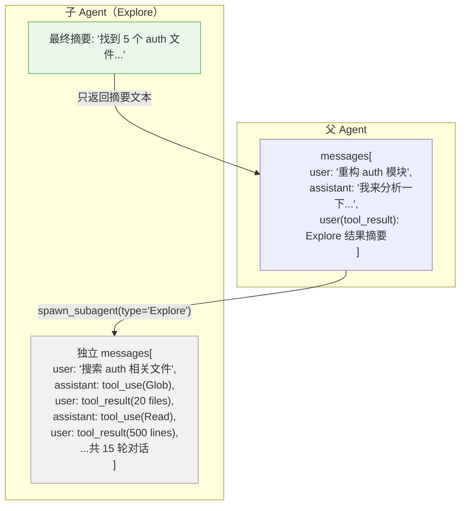
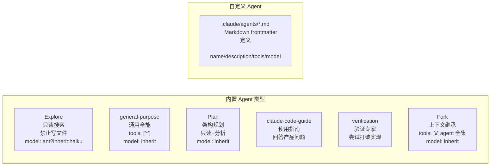

# s12 — 子 Agent：干净上下文的委派

> "Clean context per subtask" · 预计阅读 15 分钟

**核心洞察：子 Agent 继承工具集（复用 Prompt Cache）但隔离消息历史——用 fork 而非 copy 获得干净上下文。**

::: info Key Takeaways
- **完整上下文隔离** — 子 Agent 获得全新 messages[]，不继承父 Agent 的对话历史
- **六种 Agent 类型** — Explore (只读) / general-purpose (全能力) / Plan (规划) / claude-code-guide (使用指南) / verification (验证专家) / 自定义 (.claude/agents/*.md)
- **工具白名单/黑名单** — 每种 Agent 类型有不同的工具集限制
- **Context Engineering = Isolate** — 子 Agent 是"给子任务独立上下文空间"的核心实现
:::

## 问题

父 agent 对话越来越长，工具结果堆积怎么办？

假设用户让 agent 完成一个复杂任务：先搜索代码、再读取多个文件、然后修改、再测试。每一步都会产生大量工具调用和返回结果，这些中间结果堆积在 `messages[]` 数组里。几轮之后，上下文窗口已经被搜索结果和文件内容填满了，真正重要的任务描述反而被淹没。

更根本的问题是**上下文污染**。一次文件搜索返回了 500 行代码，但只有 3 行是有用的。那 497 行无关代码不仅浪费 tokens，还会干扰模型的注意力分配。Claude Code 的 Compact 机制（s07）可以压缩旧消息，但它是被动的——等上下文满了才触发，而且压缩也有信息损失。

真正的解决方案是**主动隔离**：把子任务扔给一个全新的 agent，让它在一个干净的 `messages=[]` 上执行，执行完只返回一段摘要。父 agent 的上下文从头到尾只看到"发出任务→收到摘要"，中间的搜索、读取、试错过程全部被丢弃。

## 架构图





## 核心机制

### 子 Agent 的独立上下文

子 agent 的核心设计是**上下文隔离**。当父 agent 调用 `AgentTool` 时，系统创建一个全新的执行环境：

- **独立 `messages[]`**：子 agent 从空消息列表开始（或从 fork 继承的上下文开始）
- **独立 `abortController`**：异步子 agent 有自己的取消控制器，不受父 agent 取消影响
- **独立 `readFileState`**：文件状态缓存被克隆（fork 模式）或新建（普通模式）
- **独立 `systemPrompt`**：每种 agent 类型有自己的 system prompt

关键代码在 `runAgent.ts` 中：

```typescript
// runAgent.ts — 创建隔离的子 agent 上下文
const agentToolUseContext = createSubagentContext(toolUseContext, {
  options: agentOptions,
  agentId,
  messages: initialMessages,        // 独立消息列表
  readFileState: agentReadFileState, // 独立文件缓存
  abortController: agentAbortController, // 独立取消控制
  getAppState: agentGetAppState,     // 覆盖权限模式
})
```

真实路径：`src/tools/AgentTool/runAgent.ts`

### Agent 类型体系

Claude Code 定义了六种内置 agent 类型，每种针对不同场景优化：

**Explore（探索型）**——只读搜索专家。禁止所有文件写入工具（`FileEdit`、`FileWrite`、`NotebookEdit`），也禁止嵌套派发子 agent。特殊优化：`omitClaudeMd: true` 不注入 CLAUDE.md 规则（只读 agent 不需要提交规范）。

Explore Agent 的模型选择：`process.env.USER_TYPE === 'ant' ? 'inherit' : 'haiku'`——Anthropic 内部员工使用继承模型（更强），外部用户使用 Haiku。这是 Claude Code 内外差异化策略的典型案例。

```typescript
// built-in/exploreAgent.ts
export const EXPLORE_AGENT: BuiltInAgentDefinition = {
  agentType: 'Explore',
  disallowedTools: [AGENT_TOOL_NAME, FILE_EDIT_TOOL_NAME, FILE_WRITE_TOOL_NAME, ...],
  // Ants get inherit to use the main agent's model; external users get haiku for speed
  model: process.env.USER_TYPE === 'ant' ? 'inherit' : 'haiku',
  omitClaudeMd: true,
  // ...
}
```

**general-purpose（通用型）**——拥有全部工具（`tools: ['*']`），用于执行复杂多步任务。不指定 model，使用默认子 agent 模型。

**Plan（规划型）**——软件架构专家，只读模式。与 Explore 共享工具限制，但使用 `model: 'inherit'` 继承父 agent 模型以获得更强推理能力。输出结构化的实现计划。

**claude-code-guide（使用指南型）**——当用户询问 Claude Code 功能、Claude Agent SDK 或 Claude API 使用方法时自动派发。专门回答"Can Claude..."、"How do I..."类问题，避免主 agent 处理产品文档查询。

**verification（验证型）**——验证专家，专门尝试"打破"实现。其 system prompt 明确要求不能只读代码就判定通过——必须实际运行命令验证。设计哲学是"前 80% 是容易的部分，你的全部价值在于发现最后 20%"。测试套件结果只是上下文，不是证据。

**Fork（分叉型）**——实验性功能。不是独立的 agent 类型，而是"分叉自己"。继承父 agent 的完整对话上下文和 system prompt，使用 `tools: ['*']` 和 `permissionMode: 'bubble'`。设计目标是**最大化 prompt cache 命中**——所有 fork 子 agent 共享相同的 API 请求前缀。

**Cache 命中的成本影响**：Prompt cache 命中成本是完整处理的 1/10。对于 50K token 的 system prompt，fork 子 agent 每次调用可节省约 $0.15（Opus）或 $0.015（Sonnet）。没有 cache 命中，多 agent 并行的 API 成本会翻倍——Fork 不是设计品味，而是成本工程。

真实路径：`src/tools/AgentTool/built-in/`

### 自定义 Agent

除了内置类型，用户可以在 `.claude/agents/` 目录下用 Markdown 文件定义自定义 agent：

```markdown
---
name: test-runner
description: 执行测试套件并报告结果
tools: [Bash, Read]
model: haiku
permissionMode: bypassPermissions
maxTurns: 10
---

你是一个测试执行专家。运行测试并汇报结果...
```

`loadAgentsDir.ts` 负责解析这些文件。前置 YAML frontmatter 定义元数据，Markdown body 就是 system prompt。支持的配置项包括：

| 字段 | 作用 |
|------|------|
| `name` | Agent 类型名（唯一标识） |
| `description` | 描述何时使用此 agent |
| `tools` | 可用工具白名单 |
| `disallowedTools` | 禁止使用的工具 |
| `model` | 模型选择（haiku/sonnet/opus/inherit） |
| `permissionMode` | 权限模式 |
| `maxTurns` | 最大对话轮数 |
| `isolation` | 隔离模式（worktree） |
| `memory` | 持久记忆范围 |
| `hooks` | agent 生命周期钩子 |
| `skills` | 预加载的 skill 列表 |

真实路径：`src/tools/AgentTool/loadAgentsDir.ts`

### 防递归控制

子 agent 需要防止无限递归——一个子 agent 不停地派发新的子 agent。Claude Code 用两种机制控制：

**工具限制**：Explore 和 Plan agent 在 `disallowedTools` 中禁止了 `Agent` 工具，从根本上阻止了嵌套派发。

**Fork 防递归**：Fork 模式更微妙。Fork 子 agent 保留了 `Agent` 工具（为了和父 agent 保持完全相同的工具定义，确保 prompt cache 命中），但在运行时检测上下文中是否存在 fork 标记：

```typescript
// forkSubagent.ts
export function isInForkChild(messages: MessageType[]): boolean {
  return messages.some(m => {
    if (m.type !== 'user') return false
    return content.some(
      block => block.type === 'text' &&
        block.text.includes(`<${FORK_BOILERPLATE_TAG}>`),
    )
  })
}
```

如果检测到当前已经在 fork 子 agent 中，拒绝再次 fork。

**maxTurns 保护**：子 agent 默认 200 轮上限。即使没有递归，一个"死循环"的 agent 也会在 200 轮后强制停止。这是防止成本失控的最后一道防线，与工具限制互补。

真实路径：`src/tools/AgentTool/forkSubagent.ts`

### 同步 vs 异步执行

子 agent 有两种运行模式：

**同步（前台）**：父 agent 阻塞等待子 agent 完成，获取完整结果后继续。适合父 agent 需要子 agent 结果才能继续的场景。

**异步（后台）**：子 agent 在后台运行，父 agent 立即收到 `async_launched` 状态和一个 `outputFile` 路径。子 agent 完成后通过通知机制告知父 agent。关键区别：

- 异步 agent 有独立的 `AbortController`（不随父 agent 取消）
- 异步 agent 设置 `shouldAvoidPermissionPrompts: true`（不弹权限对话框）
- 异步 agent 的 `isNonInteractiveSession` 设为 `true`

```typescript
// runAgent.ts — 异步 vs 同步的差异
const agentAbortController = isAsync
  ? new AbortController()           // 异步：独立控制器
  : toolUseContext.abortController   // 同步：共享父控制器
```

### Worktree 隔离

子 agent 可以通过 `isolation: "worktree"` 在独立的 git worktree 中运行，获得完全隔离的文件系统。这在 s14 中详细讨论。当启用 worktree 隔离时，会注入一个 worktree 通知，告诉子 agent 当前在隔离环境中：

```typescript
// forkSubagent.ts
export function buildWorktreeNotice(parentCwd: string, worktreeCwd: string): string {
  return `You've inherited the conversation context above from a parent agent
    working in ${parentCwd}. You are operating in an isolated git worktree
    at ${worktreeCwd}...`
}
```

真实路径：`src/tools/AgentTool/AgentTool.tsx`, `src/utils/worktree.ts`

## Python 伪代码

<details>
<summary>展开查看完整 Python 伪代码（339 行）</summary>

```python
"""
子 Agent 派发系统 —— 干净上下文隔离
"""
from dataclasses import dataclass, field
from typing import Optional, Generator
from enum import Enum


class AgentSource(Enum):
    BUILT_IN = "built-in"
    USER = "userSettings"
    PROJECT = "projectSettings"
    PLUGIN = "plugin"


@dataclass
class AgentDefinition:
    """Agent 类型定义"""
    agent_type: str
    when_to_use: str              # 描述何时使用
    tools: list[str] | None = None          # 工具白名单 (None=全部)
    disallowed_tools: list[str] | None = None  # 工具黑名单
    model: str | None = None      # 模型选择
    permission_mode: str | None = None
    max_turns: int = 200
    omit_claude_md: bool = False   # 是否省略 CLAUDE.md
    source: AgentSource = AgentSource.BUILT_IN
    isolation: str | None = None   # "worktree" / None

    def get_system_prompt(self) -> str:
        raise NotImplementedError


class ExploreAgent(AgentDefinition):
    """只读搜索 agent —— 禁止写文件，使用快速模型"""
    def __init__(self):
        super().__init__(
            agent_type="Explore",
            when_to_use="Fast agent for exploring codebases",
            disallowed_tools=["Agent", "FileEdit", "FileWrite", "NotebookEdit"],
            model="haiku",
            omit_claude_md=True,
        )

    def get_system_prompt(self) -> str:
        return "You are a file search specialist... READ-ONLY MODE..."


class GeneralPurposeAgent(AgentDefinition):
    """通用全能 agent —— 拥有全部工具"""
    def __init__(self):
        super().__init__(
            agent_type="general-purpose",
            when_to_use="General-purpose agent for complex tasks",
            tools=["*"],
        )

    def get_system_prompt(self) -> str:
        return "You are an agent for Claude Code..."


class PlanAgent(AgentDefinition):
    """规划 agent —— 只读，继承父模型"""
    def __init__(self):
        super().__init__(
            agent_type="Plan",
            when_to_use="Software architect for designing plans",
            disallowed_tools=["Agent", "FileEdit", "FileWrite", "NotebookEdit"],
            model="inherit",
            omit_claude_md=True,
        )

    def get_system_prompt(self) -> str:
        return "You are a software architect..."


# ──────── 内置 agent 注册表 ────────

BUILT_IN_AGENTS: list[AgentDefinition] = [
    GeneralPurposeAgent(),
    ExploreAgent(),
    PlanAgent(),
]


def get_built_in_agents() -> list[AgentDefinition]:
    return BUILT_IN_AGENTS.copy()


# ──────── 自定义 agent 加载 ────────

def load_custom_agents(agents_dir: str) -> list[AgentDefinition]:
    """从 .claude/agents/*.md 加载自定义 agent 定义"""
    agents = []
    import os, yaml

    for filename in os.listdir(agents_dir):
        if not filename.endswith('.md'):
            continue

        with open(os.path.join(agents_dir, filename)) as f:
            content = f.read()

        # 解析 YAML frontmatter
        if content.startswith('---'):
            parts = content.split('---', 2)
            frontmatter = yaml.safe_load(parts[1])
            body = parts[2].strip()
        else:
            continue

        name = frontmatter.get('name')
        description = frontmatter.get('description')
        if not name or not description:
            continue

        agent = AgentDefinition(
            agent_type=name,
            when_to_use=description,
            tools=frontmatter.get('tools'),
            disallowed_tools=frontmatter.get('disallowedTools'),
            model=frontmatter.get('model'),
            permission_mode=frontmatter.get('permissionMode'),
            max_turns=frontmatter.get('maxTurns', 200),
            source=AgentSource.USER,
        )
        # 闭包绑定 system prompt
        agent.get_system_prompt = lambda body=body: body
        agents.append(agent)

    return agents


# ──────── 子 Agent 上下文 ────────

@dataclass
class SubagentContext:
    """子 agent 的隔离执行上下文"""
    agent_id: str
    messages: list[dict]           # 独立消息列表
    system_prompt: str
    tools: list[str]               # 可用工具
    model: str
    abort_controller: object       # 独立取消控制
    read_file_state: dict          # 独立文件缓存
    is_async: bool = False
    worktree_path: str | None = None


# ──────── 防递归检测 ────────

FORK_BOILERPLATE_TAG = "fork-boilerplate"


def is_in_fork_child(messages: list[dict]) -> bool:
    """检测当前是否已在 fork 子 agent 中 —— 防止无限递归"""
    for msg in messages:
        if msg.get("type") != "user":
            continue
        content = msg.get("content", [])
        if isinstance(content, list):
            for block in content:
                if (block.get("type") == "text" and
                    f"<{FORK_BOILERPLATE_TAG}>" in block.get("text", "")):
                    return True
    return False


# ──────── 核心：派发子 Agent ────────

def spawn_subagent(
    agent_type: str,
    prompt: str,
    parent_context: dict,
    is_async: bool = False,
    model_override: str | None = None,
    isolation: str | None = None,
) -> Generator[dict, None, dict]:
    """
    派发一个子 agent：
    1. 查找 agent 定义
    2. 创建隔离上下文
    3. 运行 agent 循环
    4. 返回摘要结果
    """

    # ── Step 1: 查找 agent 定义 ──
    all_agents = get_built_in_agents() + load_custom_agents(".claude/agents/")
    agent_def = next(
        (a for a in all_agents if a.agent_type == agent_type),
        GeneralPurposeAgent()  # 默认回退到通用 agent
    )

    # ── Step 2: 解析模型 ──
    if model_override:
        resolved_model = model_override
    elif agent_def.model == "inherit":
        resolved_model = parent_context.get("model", "sonnet")
    elif agent_def.model:
        resolved_model = agent_def.model
    else:
        resolved_model = "sonnet"  # 默认子 agent 模型

    # ── Step 3: 解析工具集 ──
    all_tools = parent_context.get("available_tools", [])
    if agent_def.tools and agent_def.tools != ["*"]:
        resolved_tools = [t for t in all_tools if t in agent_def.tools]
    else:
        resolved_tools = all_tools
    # 移除禁止工具
    if agent_def.disallowed_tools:
        deny_set = set(agent_def.disallowed_tools)
        resolved_tools = [t for t in resolved_tools if t not in deny_set]

    # ── Step 4: 构建 system prompt ──
    system_prompt = agent_def.get_system_prompt()
    if agent_def.omit_claude_md:
        user_context = {k: v for k, v in parent_context["user_context"].items()
                       if k != "claudeMd"}
    else:
        user_context = parent_context["user_context"]

    # ── Step 5: 创建隔离的 worktree（可选）──
    worktree_path = None
    if isolation == "worktree":
        worktree_path = create_agent_worktree(agent_type)

    # ── Step 6: 构建初始消息 ──
    initial_messages = [
        {"role": "user", "content": prompt}
    ]

    # ── Step 7: 创建子 agent 上下文 ──
    import uuid
    agent_id = str(uuid.uuid4())[:8]

    ctx = SubagentContext(
        agent_id=agent_id,
        messages=initial_messages,
        system_prompt=system_prompt,
        tools=resolved_tools,
        model=resolved_model,
        abort_controller=object(),  # 异步 agent 独立控制器
        read_file_state={},         # 空文件缓存
        is_async=is_async,
        worktree_path=worktree_path,
    )

    # ── Step 8: 运行 agent 循环 ──
    final_result = None
    for message in run_agent_loop(ctx, max_turns=agent_def.max_turns):
        yield message  # 向外部流式输出（供 UI 展示进度）
        if message.get("type") == "assistant":
            final_result = message

    # ── Step 9: Worktree 清理 ──
    if worktree_path:
        if not has_worktree_changes(worktree_path):
            remove_agent_worktree(worktree_path)

    # ── Step 10: 提取摘要返回给父 agent ──
    summary = extract_text_content(final_result) if final_result else "No result"
    return {
        "status": "completed",
        "result": summary,
        "agent_type": agent_type,
        "agent_id": agent_id,
    }


def run_agent_loop(ctx: SubagentContext, max_turns: int) -> Generator:
    """子 agent 的主循环 —— 与父 agent 完全隔离"""
    turn = 0
    while turn < max_turns:
        # 调用 LLM
        response = call_llm(
            messages=ctx.messages,
            system_prompt=ctx.system_prompt,
            model=ctx.model,
            tools=ctx.tools,
        )

        ctx.messages.append({"role": "assistant", "content": response})
        yield {"type": "assistant", "content": response}

        # 检查是否需要执行工具
        tool_uses = extract_tool_uses(response)
        if not tool_uses:
            break  # 没有工具调用 = agent 完成

        # 执行工具并收集结果
        tool_results = []
        for tool_use in tool_uses:
            result = execute_tool(tool_use, ctx)
            tool_results.append(result)

        ctx.messages.append({"role": "user", "content": tool_results})
        turn += 1


def create_agent_worktree(agent_type: str) -> str:
    """为子 agent 创建独立 worktree"""
    import uuid
    slug = f"agent-{uuid.uuid4().hex[:8]}"
    # git worktree add -B worktree-{slug} .claude/worktrees/{slug} origin/main
    return f".claude/worktrees/{slug}"


def has_worktree_changes(worktree_path: str) -> bool:
    """检查 worktree 是否有修改"""
    # git -C {worktree_path} status --porcelain
    return False


def remove_agent_worktree(worktree_path: str):
    """清理无修改的 worktree"""
    # git worktree remove --force {worktree_path}
    pass


def extract_text_content(message: dict) -> str:
    """从 assistant 消息中提取文本内容"""
    return str(message.get("content", ""))


def call_llm(**kwargs) -> dict:
    """调用 LLM API（占位符）"""
    return {}


def extract_tool_uses(response: dict) -> list:
    """提取工具调用（占位符）"""
    return []


def execute_tool(tool_use: dict, ctx: SubagentContext) -> dict:
    """执行工具（占位符）"""
    return {}
```

</details>

## 源码映射

| 概念 | 真实源码路径 | 说明 |
|------|-------------|------|
| AgentTool 入口 | `src/tools/AgentTool/AgentTool.tsx` | 工具定义、schema、call() 路由逻辑 |
| Agent 运行器 | `src/tools/AgentTool/runAgent.ts` | 创建隔离上下文、运行 query 循环 |
| Fork 子 agent | `src/tools/AgentTool/forkSubagent.ts` | fork 模式：上下文继承、防递归、worktree 通知 |
| 内置 agent 注册 | `src/tools/AgentTool/builtInAgents.ts` | getBuiltInAgents() 返回内置类型列表 |
| Explore agent | `src/tools/AgentTool/built-in/exploreAgent.ts` | 只读搜索专家定义 |
| general-purpose agent | `src/tools/AgentTool/built-in/generalPurposeAgent.ts` | 通用全能 agent 定义 |
| Plan agent | `src/tools/AgentTool/built-in/planAgent.ts` | 架构规划 agent 定义 |
| claude-code-guide agent | `src/tools/AgentTool/built-in/claudeCodeGuideAgent.ts` | 产品使用指南 agent 定义 |
| verification agent | `src/tools/AgentTool/built-in/verificationAgent.ts` | 验证专家 agent 定义 |
| 自定义 agent 加载 | `src/tools/AgentTool/loadAgentsDir.ts` | 解析 .claude/agents/*.md 文件 |
| Agent prompt | `src/tools/AgentTool/prompt.ts` | Agent 工具描述、使用示例 |
| Agent 工具解析 | `src/tools/AgentTool/agentToolUtils.ts` | 工具集解析、结果 schema |
| Agent 常量 | `src/tools/AgentTool/constants.ts` | 工具名、单次执行类型集合 |

## 设计决策

### 为什么丢弃子 agent 完整历史只保留摘要？

**Trade-off**：信息完整性 vs 上下文效率。

子 agent 执行 10 轮搜索可能产生 50,000 tokens 的中间结果，但有用信息只有最后 200 tokens 的摘要。如果把完整历史返回给父 agent：
- 父 agent 上下文迅速膨胀，触发 Compact（有信息损失）
- 无关信息干扰模型注意力
- API 成本急剧增加

Claude Code 选择**极端的隔离策略**——子 agent 的完整对话被丢弃，只有最后一条 assistant 消息的文本内容返回给父 agent。这是一个清晰的"摘要边界"。

**竞品对比**：

| 系统 | 子任务上下文策略 |
|------|---------------|
| Claude Code | 子 agent 独立 messages[]，只返回摘要 |
| Cursor | 内联工具调用，无子 agent 隔离；Background Agents（2026）远程沙箱独立运行 |
| Devin | 持久化子任务上下文到外部存储 |
| AutoGPT | 递归子 agent，共享部分上下文 |
| GitHub Copilot | Agent Mode + Coding Agent 后台 PR |
| Gemini CLI | 支持 sub-agent，共享 session context |

Claude Code 的方案是最激进的隔离——代价是子 agent 无法访问父 agent 的上下文（fork 模式除外），好处是上下文永远干净。

### 为什么 Explore 省略 CLAUDE.md？

一个微妙但影响巨大的优化。Explore agent 每周被调用 3400 万次以上。CLAUDE.md 包含提交规范、PR 模板等信息，但 Explore 是只读的——它永远不会提交代码。注释中记录了这个优化节省了约 5-15 Gtok/周。

### 为什么 Fork 保留 Agent 工具？

Fork 的设计目标是**最大化 prompt cache 命中**。所有 fork 子 agent 必须和父 agent 有完全相同的工具定义（字节级一致），否则工具 schema 变化会导致 prompt cache 失效。因此 fork 子 agent 保留了 `Agent` 工具，但在运行时通过检测 `FORK_BOILERPLATE_TAG` 来拒绝递归 fork。

## Why：设计决策与行业上下文

### 上下文隔离：Isolate 策略的核心实现

子 Agent 拥有独立的 messages 列表，执行完只返回摘要给父 Agent。这是 Context Engineering **Isolate** 策略的核心实现 [R1-3]——给子任务独立的上下文空间，避免主对话被无关信息污染。

### Anthropic 双体架构的启示

Anthropic 的长运行 Agent 解决方案采用 Initializer Agent + Coding Agent 的双体架构 [R1-5]。核心洞察：**与其试图让一个 Agent 记住一切，不如将任务分解给专门的子 Agent**。Initializer 负责环境搭建，Coding Agent 负责增量进展。每个 Agent 只需要关注自己的上下文。

### Agent 类型分级的设计哲学

Claude Code 按能力将 Agent 分为只读型（Explore）、全能型（general-purpose）和规划型（Plan）。这种分级反映了"苦涩教训"的实践：**给不同任务恰好够用的能力**，而非给所有 Agent 最大权限。只读型 Agent 可以用更便宜的模型运行，降低成本的同时避免误操作。

> **参考来源：** LangChain [R1-3]、Anthropic [R1-5]。完整引用见 `docs/research/05-harness-trends-deep-20260401.md`。

## 变化表

| 维度 | s11 之前 | s12 新增 |
|------|---------|---------|
| 执行模式 | 单 agent 线性执行 | 父→子委派，独立上下文 |
| 上下文管理 | Compact 被动压缩 | 子 agent 主动隔离 |
| 工具可用性 | 全局统一工具集 | 按 agent 类型定制工具集 |
| 模型选择 | 全局单一模型 | 每种 agent 可指定不同模型 |
| 权限模式 | 全局权限模式 | 子 agent 可覆盖权限模式 |
| 自定义扩展 | 无 | .claude/agents/*.md 自定义 agent |

## 动手试试

1. **观察子 agent 上下文隔离**：在一次对话中让 Claude Code 搜索一个复杂主题（如"找出所有和权限相关的文件并分析架构"）。观察它是否派发了 Explore 子 agent，以及返回的结果是完整搜索历史还是一段摘要。然后问它搜索过程中的中间细节——它应该无法回答，因为中间过程被丢弃了。

2. **创建自定义 Agent**：在项目的 `.claude/agents/` 目录下创建一个 `lint-checker.md` 文件，定义一个只读的 lint 检查 agent，工具限制为 `[Bash, Read]`，model 设为 `haiku`。然后在对话中请求 Claude Code 检查代码风格，观察它是否使用了你定义的 agent。

3. **对比同步和异步执行**：请求 Claude Code 同时执行两个独立任务（如搜索代码和运行测试）。观察它是否将其中一个设为 `run_in_background: true`，以及异步 agent 完成后通知是如何送达的。

## 推荐阅读

- [Reverse-Engineering Claude Code Sub Agents (sabrina.dev)](https://sabrina.dev/) — 社区对子 Agent 机制的逆向分析

---

## 模拟场景

<!--@include: ./_fragments/sim-s12.md-->

## 架构决策卡片

<!--@include: ./_fragments/ann-s12.md-->
