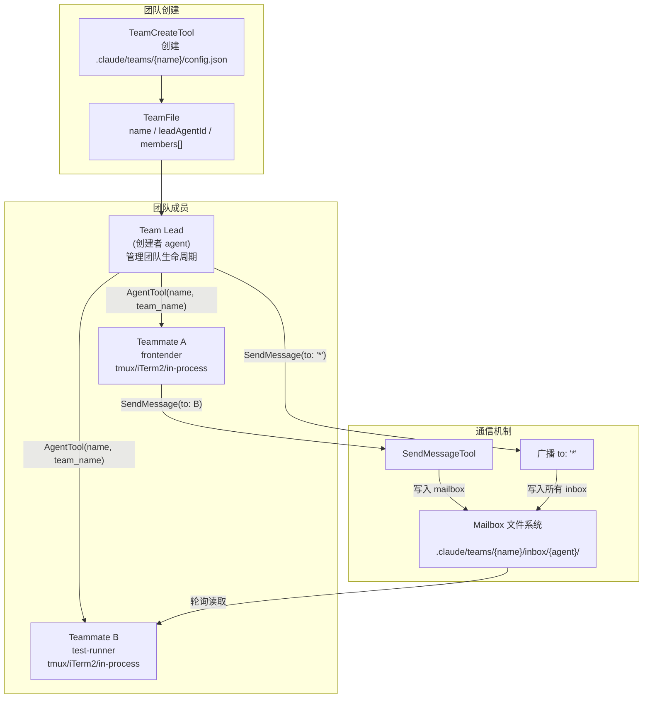
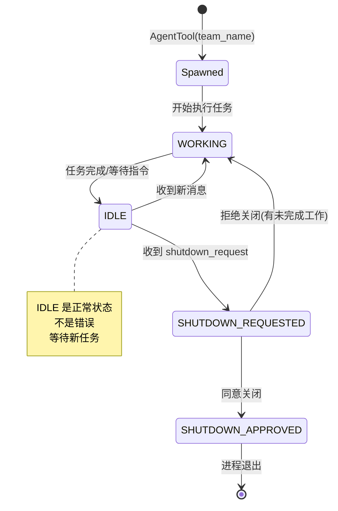

# s13 — Agent 团队：生命周期与协议

> "A team is more than the sum of its agents" · 预计阅读 20 分钟

**核心洞察：Agent 团队用文件系统邮箱实现异步通信——不需要消息队列，一个目录就是一个 inbox。**

::: info Key Takeaways
- **团队生命周期** — Spawned → WORKING → IDLE → SHUTDOWN_REQUESTED → SHUTDOWN_APPROVED
- **邮箱消息机制** — 异步消息投递，支持广播 (to: '*')，IDLE 时自动通知
- **多运行时后端** — 支持 tmux / iTerm2 / in-process 三种运行方式
- **Context Engineering = Isolate** — 每个队友独立上下文，通过消息和任务板协调
:::

## 问题

多个 agent 如何组成团队、分工协作？

s12 的子 agent 模式是"一次性委派"——父 agent 派发任务，子 agent 执行完返回摘要，整个交互就结束了。但很多真实场景需要**持续协作**：

- 一个 agent 负责前端，另一个负责后端，它们需要对齐 API 接口
- 一个 agent 完成了代码修改，需要通知另一个 agent 运行测试
- Team lead 需要审批某个 agent 的实现计划后才允许它继续

这些场景的共同点是：agent 之间需要**双向通信**，而不是简单的"派发-返回"。它们需要共享状态、协调生命周期、传递结构化消息。

Claude Code 的 Agent Swarms 系统解决了这个问题。它引入了团队（Team）概念、生命周期状态机、基于 mailbox 的消息传递协议，以及结构化的协调指令。

## 架构图






## 核心机制

### 团队创建与 TeamFile

团队通过 `TeamCreateTool` 创建。核心操作是写入一个团队配置文件并初始化状态：

```typescript
// TeamCreateTool.ts — 创建团队
const teamFile: TeamFile = {
  name: finalTeamName,
  description: _description,
  createdAt: Date.now(),
  leadAgentId,
  leadSessionId: getSessionId(),
  members: [{
    agentId: leadAgentId,
    name: TEAM_LEAD_NAME,     // "team-lead"
    agentType: leadAgentType,
    model: leadModel,
    joinedAt: Date.now(),
    tmuxPaneId: '',
    cwd: getCwd(),
    subscriptions: [],
  }],
}
await writeTeamFileAsync(finalTeamName, teamFile)
```

团队文件存储在 `.claude/teams/{name}/config.json`，包含团队元数据和成员列表。创建团队时：

1. 检查是否已在团队中（一个 leader 只能管理一个团队）
2. 如果同名团队存在，自动生成唯一名称
3. 创建对应的 TaskList 目录（`resetTaskList`）
4. 在 AppState 中注册 teamContext
5. 注册会话结束时的清理钩子

真实路径：`src/tools/TeamCreateTool/TeamCreateTool.ts`

### 成员生命周期

团队成员通过 `AgentTool` 的 `team_name` 参数派发：

```
AgentTool({
  name: "frontender",
  team_name: "my-team",
  prompt: "...",
  subagent_type: "general-purpose",
  mode: "plan"   // 可选：要求 plan 审批
})
```

成员的生命周期状态机：

| 状态 | 含义 | 触发条件 |
|------|------|---------|
| Spawned | 刚被创建 | AgentTool 调用 |
| WORKING | 正在执行任务 | 开始工具调用 |
| IDLE | 空闲等待 | 任务完成 / 等待消息 |
| SHUTDOWN_REQUESTED | 收到关闭请求 | SendMessage(shutdown_request) |
| SHUTDOWN_APPROVED | 同意关闭 | SendMessage(shutdown_response, approve=true) |

**关键设计**：IDLE 是正常状态，不是错误。Agent 完成当前任务后进入 IDLE，等待新消息或关闭指令。这与 s12 的子 agent 模式不同——子 agent 完成就立即退出并返回结果。

成员可以运行在不同后端：
- **tmux**：每个成员在独立的 tmux pane 中运行
- **iTerm2**：利用 iTerm2 的原生标签页
- **in-process**：在同一进程内运行（轻量，共享终端）

**后端选择指南**：

| 场景 | 推荐后端 | 原因 |
|------|---------|------|
| I/O 密集（API 调用、文件读写） | In-process | 无 IPC 开销 |
| CPU 密集或需要完全隔离 | Tmux | 独立进程，不阻塞主事件循环 |
| 需要可视化调试 | Tmux | 可 attach 查看实时输出 |

真实路径：`src/tools/AgentTool/AgentTool.tsx`（`spawnTeammate` 调用）

### 消息传递：SendMessageTool

团队成员之间通过 `SendMessageTool` 通信。消息系统基于**文件系统 mailbox**——每个成员有一个 inbox 目录，发送消息就是往目标成员的 inbox 写入文件：

```typescript
// SendMessageTool.ts — 发送消息
await writeToMailbox(
  recipientName,
  {
    from: senderName,
    text: content,
    summary,
    timestamp: new Date().toISOString(),
    color: senderColor,
  },
  teamName,
)
```

消息传递支持三种模式：

**点对点**：`to: "frontender"` —— 写入目标成员的 inbox。

**广播**：`to: "*"` —— 遍历团队所有成员（除发送者），写入每个人的 inbox。

**跨 agent 路由**：当 `to` 指向一个在 `agentNameRegistry` 中注册的 in-process agent 时，直接通过 `queuePendingMessage` 投递到内存队列。如果 agent 已停止，自动通过 `resumeAgentBackground` 恢复它。

```typescript
// SendMessageTool.ts — in-process agent 路由
const task = appState.tasks[agentId]
if (isLocalAgentTask(task) && !isMainSessionTask(task)) {
  if (task.status === 'running') {
    queuePendingMessage(agentId, input.message, context.setAppState)
    return { data: { success: true, message: `Message queued...` } }
  }
  // task exists but stopped — auto-resume
  const result = await resumeAgentBackground({ agentId, prompt: input.message, ... })
}
```

真实路径：`src/tools/SendMessageTool/SendMessageTool.ts`

### 结构化协议：Shutdown 与 Plan Approval

除了普通文本消息，团队协议定义了结构化消息类型，用于生命周期协调：

```typescript
// SendMessageTool.ts — 结构化消息 schema
const StructuredMessage = z.discriminatedUnion('type', [
  z.object({
    type: z.literal('shutdown_request'),
    reason: z.string().optional(),
  }),
  z.object({
    type: z.literal('shutdown_response'),
    request_id: z.string(),
    approve: semanticBoolean(),
    reason: z.string().optional(),
  }),
  z.object({
    type: z.literal('plan_approval_response'),
    request_id: z.string(),
    approve: semanticBoolean(),
    feedback: z.string().optional(),
  }),
])
```

**Shutdown 协议**——优雅关闭成员：

1. Team lead 发送 `shutdown_request` 给成员，附带 `request_id`
2. 成员检查自己是否有未完成工作
3. 同意：发送 `shutdown_response(approve=true)`，然后自行终止
4. 拒绝：发送 `shutdown_response(approve=false, reason="...")` 并继续工作

```typescript
// 关闭审批流程
async function handleShutdownApproval(requestId, context) {
  // 写确认消息到 team-lead 的 inbox
  await writeToMailbox(TEAM_LEAD_NAME, {
    from: agentName,
    text: JSON.stringify(createShutdownApprovedMessage({ requestId, from: agentName })),
    ...
  }, teamName)

  // 对 in-process teammate，中止其 abort controller
  if (backendType === 'in-process') {
    const task = findTeammateTaskByAgentId(agentId, appState.tasks)
    task?.abortController?.abort()
  } else {
    // 对 tmux/iTerm2 teammate，直接退出进程
    setImmediate(() => gracefulShutdown(0, 'other'))
  }
}
```

**Plan Approval 协议**——计划审批：

当成员以 `mode: "plan"` 模式运行时，它必须先提交计划，等 team lead 审批后才能执行：

1. 成员发送 `plan_approval_request`（内含计划内容和 `request_id`）
2. Team lead 审查计划
3. 批准：`plan_approval_response(approve=true)` —— 同时传递权限模式
4. 拒绝：`plan_approval_response(approve=false, feedback="...")` —— 成员修改后重新提交

```typescript
// 计划审批 —— 批准时传递权限
async function handlePlanApproval(recipientName, requestId, context) {
  const leaderMode = appState.toolPermissionContext.mode
  // plan 模式的 leader 批准后降级为 default
  const modeToInherit = leaderMode === 'plan' ? 'default' : leaderMode

  const approvalResponse = {
    type: 'plan_approval_response',
    requestId,
    approved: true,
    permissionMode: modeToInherit,
  }
  await writeToMailbox(recipientName, { ... }, teamName)
}
```

真实路径：`src/tools/SendMessageTool/SendMessageTool.ts`

### 团队删除与清理

`TeamDeleteTool` 负责解散团队：

1. 检查是否有活跃的非 lead 成员（如有，要求先 shutdown）
2. 清理团队目录（`.claude/teams/{name}/`）
3. 清理任务目录
4. 重置 AppState 中的 teamContext
5. 释放成员颜色分配

团队也注册了会话结束时的自动清理（`registerTeamForSessionCleanup`），防止进程被杀死时团队文件泄漏。

真实路径：`src/tools/TeamDeleteTool/TeamDeleteTool.ts`

### 任务板协作

团队共享一个 TaskList，存储在 `.claude/tasks/{teamName}/` 目录中。团队创建时调用 `resetTaskList` 和 `ensureTasksDir` 初始化任务目录。成员可以通过 `TodoWrite` 工具写入任务，通过 `TodoRead` 读取任务列表，实现任务的分配和认领。

团队名到 TaskList ID 的映射通过 `setLeaderTeamName` 注册，确保 leader 和 teammate 写入同一个任务目录。

真实路径：`src/utils/tasks.ts`

## Python 伪代码

团队通信的核心是文件系统邮箱：

```python
# Agent 团队通信（精简版）

# 1. 创建团队 → 生成配置文件
team_config = {
    "name": "my-project",
    "leader": leader_agent_id,
    "members": []   # AgentTool 创建的队友会自动注册
}
write(".claude/teams/my-project/config.json", team_config)

# 2. 发送消息 → 写入对方 inbox 目录
def send_message(from_agent, to_agent, message):
    path = f".claude/teams/{team}/inbox/{to_agent}/{timestamp}.json"
    write(path, {"from": from_agent, "message": message})

# 3. 接收消息 → 轮询自己的 inbox
def poll_inbox(agent_id):
    inbox = f".claude/teams/{team}/inbox/{agent_id}/"
    messages = sorted(glob(inbox + "*.json"))  # 按时间排序
    for msg_file in messages:
        yield read(msg_file)
        delete(msg_file)                       # 读后删除

# 4. 生命周期: Spawned → WORKING → IDLE → SHUTDOWN
```

完整参考实现（含生命周期状态机、广播协议、tmux 后端）：

<details>
<summary>展开查看完整 Python 伪代码（516 行）</summary>

```python
"""
Agent 团队系统 —— 生命周期与通信协议
"""
from dataclasses import dataclass, field
from typing import Optional
from enum import Enum
import json
import os
import time
import uuid


# ──────── 团队文件结构 ────────

@dataclass
class TeamMember:
    """团队成员信息"""
    agent_id: str
    name: str
    agent_type: str
    model: str
    joined_at: float
    cwd: str
    tmux_pane_id: str = ""
    backend_type: str = "tmux"     # tmux / iterm2 / in-process
    subscriptions: list[str] = field(default_factory=list)


@dataclass
class TeamFile:
    """团队配置文件 —— 持久化到 .claude/teams/{name}/config.json"""
    name: str
    description: str | None
    created_at: float
    lead_agent_id: str
    lead_session_id: str
    members: list[TeamMember]


class TeammateState(Enum):
    SPAWNED = "spawned"
    WORKING = "working"
    IDLE = "idle"
    SHUTDOWN_REQUESTED = "shutdown_requested"
    SHUTDOWN_APPROVED = "shutdown_approved"


# ──────── 消息类型 ────────

@dataclass
class MailboxMessage:
    """Inbox 消息"""
    from_agent: str
    text: str
    summary: str | None = None
    timestamp: str = ""
    color: str | None = None


@dataclass
class ShutdownRequest:
    type: str = "shutdown_request"
    request_id: str = ""
    reason: str | None = None


@dataclass
class ShutdownResponse:
    type: str = "shutdown_response"
    request_id: str = ""
    approve: bool = True
    reason: str | None = None


@dataclass
class PlanApprovalResponse:
    type: str = "plan_approval_response"
    request_id: str = ""
    approve: bool = True
    feedback: str | None = None


# ──────── 团队管理器 ────────

class Team:
    """
    团队：管理成员生命周期、消息传递、协调协议
    """

    TEAM_LEAD_NAME = "team-lead"

    def __init__(self, team_name: str, description: str | None = None):
        self.team_name = team_name
        self.description = description
        self.lead_agent_id = f"{self.TEAM_LEAD_NAME}@{team_name}"
        self.members: dict[str, TeamMember] = {}
        self.member_states: dict[str, TeammateState] = {}
        self.team_dir = f".claude/teams/{team_name}"
        self.tasks_dir = f".claude/tasks/{team_name}"
        self._created = False

    # ──── 团队创建 ────

    def create(self, session_id: str, cwd: str, model: str) -> dict:
        """
        创建团队：
        1. 写入 TeamFile
        2. 初始化任务目录
        3. 注册 leader 为首个成员
        """
        if self._created:
            raise RuntimeError(f"Already leading team '{self.team_name}'")

        # 创建 team-lead 作为第一个成员
        lead = TeamMember(
            agent_id=self.lead_agent_id,
            name=self.TEAM_LEAD_NAME,
            agent_type=self.TEAM_LEAD_NAME,
            model=model,
            joined_at=time.time(),
            cwd=cwd,
        )
        self.members[self.lead_agent_id] = lead
        self.member_states[self.lead_agent_id] = TeammateState.WORKING

        # 写入团队配置文件
        team_file = TeamFile(
            name=self.team_name,
            description=self.description,
            created_at=time.time(),
            lead_agent_id=self.lead_agent_id,
            lead_session_id=session_id,
            members=[lead],
        )
        self._write_team_file(team_file)

        # 初始化任务目录
        os.makedirs(self.tasks_dir, exist_ok=True)

        self._created = True
        return {
            "team_name": self.team_name,
            "team_file_path": f"{self.team_dir}/config.json",
            "lead_agent_id": self.lead_agent_id,
        }

    # ──── 成员管理 ────

    def spawn_member(
        self,
        name: str,
        agent_type: str,
        prompt: str,
        model: str = "sonnet",
        mode: str | None = None,
        backend: str = "in-process",
    ) -> TeamMember:
        """
        派发新团队成员：
        1. 生成 agent ID
        2. 注册到 TeamFile
        3. 创建 inbox 目录
        4. 启动 agent 进程
        """
        agent_id = f"{name}@{self.team_name}"

        member = TeamMember(
            agent_id=agent_id,
            name=name,
            agent_type=agent_type,
            model=model,
            joined_at=time.time(),
            cwd=os.getcwd(),
            backend_type=backend,
        )
        self.members[agent_id] = member
        self.member_states[agent_id] = TeammateState.SPAWNED

        # 创建 inbox 目录
        inbox_dir = f"{self.team_dir}/inbox/{name}"
        os.makedirs(inbox_dir, exist_ok=True)

        # 更新 TeamFile
        self._update_team_file(member)

        # 启动 agent（根据 backend 选择不同方式）
        if backend == "tmux":
            self._spawn_tmux(name, prompt, model)
        elif backend == "iterm2":
            self._spawn_iterm2(name, prompt, model)
        else:  # in-process
            self._spawn_in_process(name, prompt, model, mode)

        self.member_states[agent_id] = TeammateState.WORKING
        return member

    # ──── 消息传递 ────

    def send_message(
        self,
        sender: str,
        to: str,
        message: str | dict,
        summary: str | None = None,
    ) -> dict:
        """
        发送消息：
        - to="*": 广播到所有成员
        - to=name: 点对点发送
        - message=dict: 结构化协议消息
        """
        sender_color = self._get_member_color(sender)

        # ── 广播 ──
        if to == "*":
            recipients = [
                m.name for m in self.members.values()
                if m.name != sender
            ]
            for recipient in recipients:
                self._write_to_mailbox(recipient, MailboxMessage(
                    from_agent=sender,
                    text=message if isinstance(message, str) else json.dumps(message),
                    summary=summary,
                    timestamp=time.strftime("%Y-%m-%dT%H:%M:%SZ"),
                    color=sender_color,
                ))
            return {
                "success": True,
                "message": f"Broadcast to {len(recipients)} teammates",
                "recipients": recipients,
            }

        # ── 结构化消息 ──
        if isinstance(message, dict):
            return self._handle_structured_message(sender, to, message)

        # ── 点对点 ──
        self._write_to_mailbox(to, MailboxMessage(
            from_agent=sender,
            text=message,
            summary=summary,
            timestamp=time.strftime("%Y-%m-%dT%H:%M:%SZ"),
            color=sender_color,
        ))
        return {
            "success": True,
            "message": f"Message sent to {to}'s inbox",
        }

    # ──── 结构化协议处理 ────

    def _handle_structured_message(
        self,
        sender: str,
        to: str,
        message: dict,
    ) -> dict:
        msg_type = message.get("type")

        # ── Shutdown 请求 ──
        if msg_type == "shutdown_request":
            request_id = f"shutdown-{to}-{uuid.uuid4().hex[:8]}"
            self._write_to_mailbox(to, MailboxMessage(
                from_agent=sender,
                text=json.dumps({
                    "type": "shutdown_request",
                    "request_id": request_id,
                    "from": sender,
                    "reason": message.get("reason"),
                }),
                timestamp=time.strftime("%Y-%m-%dT%H:%M:%SZ"),
            ))
            return {
                "success": True,
                "message": f"Shutdown request sent to {to}",
                "request_id": request_id,
            }

        # ── Shutdown 响应 ──
        if msg_type == "shutdown_response":
            request_id = message["request_id"]
            if message.get("approve"):
                # 同意关闭 —— 通知 lead，然后终止自身
                self._write_to_mailbox(self.TEAM_LEAD_NAME, MailboxMessage(
                    from_agent=sender,
                    text=json.dumps({
                        "type": "shutdown_approved",
                        "request_id": request_id,
                        "from": sender,
                    }),
                    timestamp=time.strftime("%Y-%m-%dT%H:%M:%SZ"),
                ))
                # 更新状态并终止
                agent_id = f"{sender}@{self.team_name}"
                self.member_states[agent_id] = TeammateState.SHUTDOWN_APPROVED
                return {
                    "success": True,
                    "message": f"Shutdown approved. Agent {sender} exiting.",
                    "request_id": request_id,
                }
            else:
                # 拒绝关闭 —— 通知 lead
                self._write_to_mailbox(self.TEAM_LEAD_NAME, MailboxMessage(
                    from_agent=sender,
                    text=json.dumps({
                        "type": "shutdown_rejected",
                        "request_id": request_id,
                        "from": sender,
                        "reason": message.get("reason"),
                    }),
                    timestamp=time.strftime("%Y-%m-%dT%H:%M:%SZ"),
                ))
                return {
                    "success": True,
                    "message": f"Shutdown rejected. Reason: {message.get('reason')}",
                    "request_id": request_id,
                }

        # ── Plan Approval 响应 ──
        if msg_type == "plan_approval_response":
            request_id = message["request_id"]
            if message.get("approve"):
                response = {
                    "type": "plan_approval_response",
                    "requestId": request_id,
                    "approved": True,
                    "permissionMode": "default",  # 审批后降级权限
                }
            else:
                response = {
                    "type": "plan_approval_response",
                    "requestId": request_id,
                    "approved": False,
                    "feedback": message.get("feedback", "Plan needs revision"),
                }
            self._write_to_mailbox(to, MailboxMessage(
                from_agent=sender,
                text=json.dumps(response),
                timestamp=time.strftime("%Y-%m-%dT%H:%M:%SZ"),
            ))
            return {
                "success": True,
                "message": f"Plan {'approved' if message.get('approve') else 'rejected'} for {to}",
                "request_id": request_id,
            }

        raise ValueError(f"Unknown structured message type: {msg_type}")

    # ──── 团队删除 ────

    def shutdown(self) -> dict:
        """
        解散团队：
        1. 检查活跃成员
        2. 清理团队目录
        3. 清理任务目录
        4. 重置 AppState
        """
        active_members = [
            m for m in self.members.values()
            if m.name != self.TEAM_LEAD_NAME
            and self.member_states.get(m.agent_id) not in (
                TeammateState.SHUTDOWN_APPROVED, None
            )
        ]

        if active_members:
            names = [m.name for m in active_members]
            raise RuntimeError(
                f"Cannot delete team: {len(active_members)} member(s) still active: "
                f"{', '.join(names)}. Send shutdown_request first."
            )

        # 清理文件系统
        import shutil
        if os.path.exists(self.team_dir):
            shutil.rmtree(self.team_dir)
        if os.path.exists(self.tasks_dir):
            shutil.rmtree(self.tasks_dir)

        self._created = False
        return {
            "success": True,
            "message": f"Team '{self.team_name}' deleted",
            "team_name": self.team_name,
        }

    # ──── 私有辅助方法 ────

    def _write_to_mailbox(self, recipient: str, message: MailboxMessage):
        inbox_dir = f"{self.team_dir}/inbox/{recipient}"
        os.makedirs(inbox_dir, exist_ok=True)
        filename = f"{int(time.time() * 1000)}-{uuid.uuid4().hex[:6]}.json"
        filepath = os.path.join(inbox_dir, filename)
        with open(filepath, 'w') as f:
            json.dump({
                "from": message.from_agent,
                "text": message.text,
                "summary": message.summary,
                "timestamp": message.timestamp,
                "color": message.color,
            }, f)

    def _write_team_file(self, team_file: TeamFile):
        os.makedirs(self.team_dir, exist_ok=True)
        filepath = f"{self.team_dir}/config.json"
        with open(filepath, 'w') as f:
            json.dump({
                "name": team_file.name,
                "description": team_file.description,
                "createdAt": team_file.created_at,
                "leadAgentId": team_file.lead_agent_id,
                "members": [
                    {
                        "agentId": m.agent_id,
                        "name": m.name,
                        "agentType": m.agent_type,
                        "model": m.model,
                        "joinedAt": m.joined_at,
                    }
                    for m in team_file.members
                ],
            }, f, indent=2)

    def _update_team_file(self, new_member: TeamMember):
        filepath = f"{self.team_dir}/config.json"
        with open(filepath) as f:
            data = json.load(f)
        data["members"].append({
            "agentId": new_member.agent_id,
            "name": new_member.name,
            "agentType": new_member.agent_type,
            "model": new_member.model,
            "joinedAt": new_member.joined_at,
        })
        with open(filepath, 'w') as f:
            json.dump(data, f, indent=2)

    def _get_member_color(self, name: str) -> str | None:
        for m in self.members.values():
            if m.name == name:
                return None  # 简化，实际有颜色分配系统
        return None

    def _spawn_tmux(self, name: str, prompt: str, model: str):
        pass  # tmux new-session / split-window

    def _spawn_iterm2(self, name: str, prompt: str, model: str):
        pass  # AppleScript / iTerm2 API

    def _spawn_in_process(self, name: str, prompt: str, model: str, mode: str | None):
        pass  # InProcessTeammateTask


# ──────── 使用示例 ────────

def example_team_workflow():
    """
    示例：创建团队→派发成员→通信→关闭
    """
    # 1. 创建团队
    team = Team("feature-auth", "实现认证模块")
    team.create(session_id="sess-001", cwd="/project", model="sonnet")

    # 2. 派发成员
    team.spawn_member(
        name="api-dev",
        agent_type="general-purpose",
        prompt="实现 /auth/login 和 /auth/register API",
        model="sonnet",
    )
    team.spawn_member(
        name="tester",
        agent_type="test-runner",
        prompt="为 auth API 编写集成测试",
        model="haiku",
    )

    # 3. 成员间通信
    team.send_message(
        sender="api-dev",
        to="tester",
        message="API 接口已完成，路由定义在 src/routes/auth.ts",
        summary="API 完成通知",
    )

    # 4. Leader 广播
    team.send_message(
        sender="team-lead",
        to="*",
        message="请各位汇报当前进展",
        summary="进展汇报请求",
    )

    # 5. 关闭成员
    team.send_message(
        sender="team-lead",
        to="api-dev",
        message={"type": "shutdown_request", "reason": "任务完成"},
    )

    # 6. 成员同意关闭
    team.send_message(
        sender="api-dev",
        to="team-lead",
        message={
            "type": "shutdown_response",
            "request_id": "shutdown-api-dev-abc123",
            "approve": True,
        },
    )

    # 7. 解散团队
    team.shutdown()
```

</details>

## 源码映射

| 概念 | 真实源码路径 | 说明 |
|------|-------------|------|
| 团队创建工具 | `src/tools/TeamCreateTool/TeamCreateTool.ts` | 创建团队、写入 TeamFile |
| 团队删除工具 | `src/tools/TeamDeleteTool/TeamDeleteTool.ts` | 解散团队、清理资源 |
| 消息发送工具 | `src/tools/SendMessageTool/SendMessageTool.ts` | 点对点/广播/结构化消息 |
| SendMessage 常量 | `src/tools/SendMessageTool/constants.ts` | 工具名定义 |
| SendMessage prompt | `src/tools/SendMessageTool/prompt.ts` | 工具描述和使用示例 |
| 团队文件辅助 | `src/utils/swarm/teamHelpers.ts` | TeamFile 读写、清理、会话注册 |
| 团队常量 | `src/utils/swarm/constants.ts` | TEAM_LEAD_NAME 等常量 |
| Teammate 检测 | `src/utils/teammate.ts` | isTeammate/isTeamLead/getTeamName |
| Mailbox 实现 | `src/utils/teammateMailbox.ts` | writeToMailbox、结构化消息构造 |
| 成员颜色管理 | `src/utils/swarm/teammateLayoutManager.ts` | 成员颜色分配 |
| 任务管理 | `src/utils/tasks.ts` | TaskList 创建/重置/Leader 注册 |
| In-Process 任务 | `src/tasks/InProcessTeammateTask/` | 进程内 teammate 运行 |
| In-Process 运行器 | `src/utils/swarm/inProcessRunner.ts` | 进程内 teammate 执行循环 |
| In-Process 派发 | `src/utils/swarm/spawnInProcess.ts` | 进程内 teammate 创建 |
| 权限同步 | `src/utils/swarm/permissionSync.ts` | Leader↔Teammate 权限同步 |
| Leader 权限桥接 | `src/utils/swarm/leaderPermissionBridge.ts` | Leader 侧权限代理 |
| Teammate 初始化 | `src/utils/swarm/teammateInit.ts` | Teammate 启动初始化流程 |
| Swarm 开关 | `src/utils/agentSwarmsEnabled.ts` | feature gate 检查 |

## 设计决策

### 为什么用文件系统 mailbox 而不是内存消息队列？

**Trade-off**：持久性/跨进程 vs 性能。

团队成员可能运行在不同进程（tmux pane）中，内存队列无法跨进程通信。文件系统 mailbox 天然支持：
- **跨进程**：任何进程都能读写文件
- **持久化**：进程崩溃后消息不丢失
- **简单**：无需引入消息队列中间件

对于 in-process teammate，SendMessageTool 有优化路径——直接通过 `queuePendingMessage` 投递到内存队列，绕过文件系统。

### 为什么 IDLE 是正常状态？

在 s12 的子 agent 模型中，agent 完成就退出。但团队成员需要**长期存活**——完成一个任务后等待下一个。如果把 IDLE 视为异常，系统会不断尝试关闭空闲成员，导致频繁的创建/销毁开销。

IDLE 表示"我完成了当前任务，等待新指令"。只有显式的 `shutdown_request` 才会触发关闭流程。

### 竞品对比

| 系统 | 多 Agent 协作模型 |
|------|---------------|
| Claude Code | TeamFile + Mailbox + 结构化协议 |
| CrewAI | Role-based agents + sequential/hierarchical flow |
| AutoGen | 对话式 multi-agent（shared conversation）；v0.4 转向事件驱动架构 |
| LangGraph | 图式 workflow，节点=agent |
| Google ADK | A2A 协议原生支持，agent 间发现与委托 |
| OpenAI Agents SDK | Handoff 模式，agent 间显式移交控制权 |

Claude Code 的方案更接近"微服务"模型——每个 agent 是独立进程，通过消息通信，有明确的生命周期管理。比 CrewAI 的角色流更灵活，比 AutoGen 的共享对话更隔离。

### 为什么 shutdown 需要请求-响应而不是直接杀死？

直接杀死进程可能导致：
- 未完成的文件写入产生损坏
- 未提交的 git 修改丢失
- 后台 shell 任务成为孤儿进程

Shutdown 协议让成员有机会：清理资源、提交修改、汇报最终状态。拒绝关闭的能力让系统更健壮——成员比 leader 更清楚自己的工作状态。

## Why：设计决策与行业上下文

### 五种编排模式中的定位

当前生产系统中的五种多 Agent 编排模式 [R2-14][R2-15]：Chaining（链式）、Routing（路由）、Parallelization（并行）、Orchestrator-Worker（编排-工人）、Evaluator-Optimizer（评估-优化）。

Claude Code 的 Teams 系统主要实现了 **Orchestrator-Worker 模式**：team lead 分解任务并协调多个 worker，worker 通过共享任务板协作。同时也支持 Parallelization（多个 agent 并行处理独立子任务）。

### 文件系统邮箱 vs 消息队列

Agent 间通信存在两种流派 [R2-12][R2-15]：

- **文件系统邮箱**（Claude Code/Manus 采用）：简单、可审计、不需要额外基础设施，天然支持版本控制
- **消息队列/事件驱动**：从微服务架构迁移而来，适合大规模分布式系统

Claude Code 选择文件系统方案的原因：在单机多 Agent 场景下更实用——Agent 可以直接读写共享目录，天然支持版本控制和审计。这也符合"状态外化到文件系统"的整体设计理念 [R1-5]。

### 多 Agent 的生产价值

AgileSoftLabs（AI 服务供应商）的博客报告称，部署多 Agent 架构的企业报告了 **3 倍任务完成速度提升**和 **60% 精度改善** [R2-16]（注：该数据来自供应商博客而非独立研究）。Google ADK 也提供了原生多 Agent 支持 [R2-17]，标志着多 Agent 模式从学术概念进入主流框架。

> **参考来源：** Level Up Coding [R2-14]、Indium [R2-15]、AgileSoftLabs [R2-16]、Anthropic [R1-5]。完整引用见 `docs/research/06-agent-architecture-deep-20260401.md`。

## 变化表

| 维度 | s12（子 Agent） | s13 新增（团队） |
|------|-------------|-------------|
| 交互模式 | 派发→返回（一次性） | 持续协作（长期存活） |
| 通信方向 | 单向（父→子→父） | 双向（任意成员间） |
| 生命周期 | 自动退出 | 状态机管理 |
| 消息类型 | 无 | 文本 + 结构化协议 |
| 协调方式 | 无 | Shutdown/Plan Approval |
| 任务管理 | 无 | 共享 TaskList |
| 成员发现 | 不适用 | TeamFile 成员注册表 |

## 动手试试

1. **观察团队创建流程**：阅读 `src/tools/TeamCreateTool/TeamCreateTool.ts` 中的 `call()` 方法，追踪从接收输入到写入 TeamFile 的完整流程。关注 `registerTeamForSessionCleanup` 是如何确保团队在会话结束时被清理的。

2. **分析 Shutdown 协议**：在 `src/tools/SendMessageTool/SendMessageTool.ts` 中，找到 `handleShutdownApproval` 和 `handleShutdownRejection` 两个函数。画出完整的 shutdown 时序图：leader 发请求 → member 检查 → 同意/拒绝 → leader 处理响应 → 资源清理。注意 in-process 和 tmux 两种 backend 的关闭方式有什么不同。

3. **设计消息路由优化**：当前 SendMessageTool 对 in-process agent 有专门的快速路径（`queuePendingMessage`）。思考一下：如果团队有 10 个成员，其中 3 个是 in-process、7 个是 tmux，广播消息时应该怎么优化？是否可以对两种 backend 并行处理？

## 推荐阅读

- [Multi-agent patterns (Microsoft)](https://learn.microsoft.com/) — 微软的多 Agent 编排模式
- [MCP Orchestrator: Spawning parallel sub-agents](https://reddit.com/) — 社区的 MCP 多 Agent 编排方案

---

## 模拟场景

<!--@include: ./_fragments/sim-s13.md-->

## 设计决策

<!--@include: ./_fragments/ann-s13.md-->
