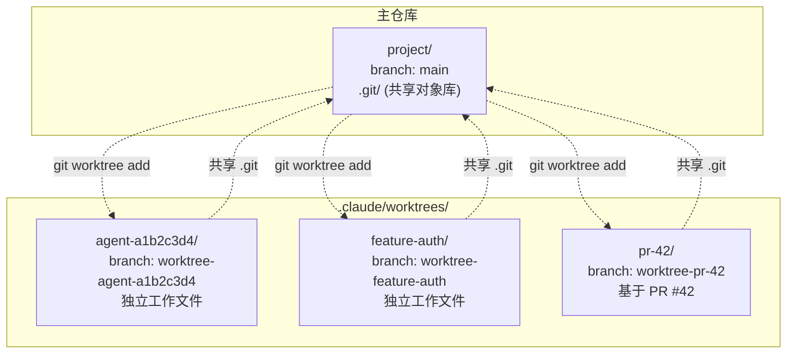
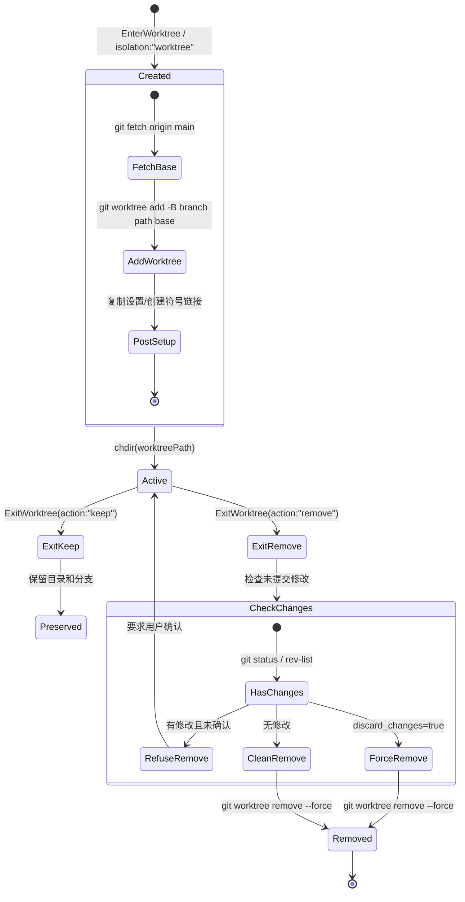
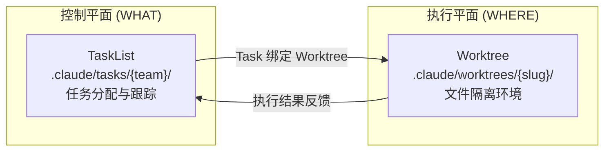

# s14 — Worktree：文件隔离与并行开发

> "Tasks manage WHAT, worktrees manage WHERE"

::: info Key Takeaways
- **任务管 WHAT，Worktree 管 WHERE** — Task 定义"做什么"，Worktree 提供"在哪做"的隔离目录
- **Git worktree 原语** — 基于 `git worktree add` 创建轻量级工作副本
- **两层隔离** — 会话级 (EnterWorktree/ExitWorktree) + Agent 级 (isolation: "worktree")
- **Context Engineering = Isolate** — 文件系统级隔离，防止并行 Agent 互相覆盖文件
:::

## 问题

多个 agent 同时修改文件怎么避免冲突？

在 s12-s13 中，我们看到了子 agent 和团队协作。但有一个根本性问题被掩盖了：**文件系统是共享的**。

当两个 agent 同时修改同一个文件时：
- Agent A 读取了 `config.ts` 的第 10 行
- Agent B 在第 5 行插入了新代码
- Agent A 基于旧内容在第 10 行修改——但原来的第 10 行现在变成了第 11 行
- 修改冲突，代码损坏

更隐蔽的问题是**运行时冲突**：Agent A 在运行测试，Agent B 修改了测试依赖的代码，导致 A 的测试结果不可信。

解决方案是**文件隔离**——每个 agent 在自己独立的目录副本中工作。Git worktree 是完美的工具：同一个仓库可以有多个工作目录，每个目录关联不同的分支，共享 `.git` 对象数据库（不重复存储提交历史），但工作文件完全独立。

Claude Code 围绕 Git worktree 构建了两层机制：
1. **会话级 worktree**：用户通过 `EnterWorktreeTool` 进入隔离环境
2. **Agent 级 worktree**：子 agent 通过 `isolation: "worktree"` 获得独立工作副本

## 架构图







## 核心机制

### Git Worktree 基础

Git worktree 是 Git 的内置功能：一个仓库可以有多个工作目录（working tree），每个关联一个独立的分支。关键特性：

- **共享对象库**：所有 worktree 共享同一个 `.git` 目录，不重复存储提交历史
- **独立分支**：每个 worktree 必须在不同分支上（不能两个 worktree 检出同一分支）
- **独立索引**：每个 worktree 有自己的暂存区（staging area）

Claude Code 将所有 worktree 放在 `.claude/worktrees/` 目录下，分支名统一命名为 `worktree-{slug}`。

### 创建与管理

Worktree 的创建在 `worktree.ts` 的 `getOrCreateWorktree` 中实现：

```typescript
// worktree.ts — 创建或恢复 worktree
async function getOrCreateWorktree(repoRoot, slug, options?) {
  const worktreePath = join(worktreesDir(repoRoot), flattenSlug(slug))
  const worktreeBranch = `worktree-${flattenSlug(slug)}`

  // 快速恢复路径：直接读 .git 文件检查 HEAD SHA
  // 不启动子进程，避免 ~15ms 的 spawn 开销
  const existingHead = await readWorktreeHeadSha(worktreePath)
  if (existingHead) {
    return { worktreePath, worktreeBranch, headCommit: existingHead, existed: true }
  }

  // 新建 worktree
  await mkdir(worktreesDir(repoRoot), { recursive: true })

  // 获取基准分支（支持 PR 模式）
  let baseBranch: string
  if (options?.prNumber) {
    // git fetch origin pull/{prNumber}/head
    await execFileNoThrow(gitExe(), ['fetch', 'origin', `pull/${options.prNumber}/head`])
    baseBranch = 'FETCH_HEAD'
  } else {
    // 优先使用本地已有的 origin/main，避免 fetch 延迟
    const originSha = await resolveRef(gitDir, 'refs/remotes/origin/main')
    if (originSha) {
      baseBranch = 'origin/main'
    } else {
      await execFileNoThrow(gitExe(), ['fetch', 'origin', defaultBranch])
      baseBranch = 'origin/' + defaultBranch
    }
  }

  // git worktree add -B worktree-{slug} {path} {baseBranch}
  // -B 而非 -b：如果分支已存在就重置（处理被删除目录但分支残留的情况）
  await execFileNoThrow(gitExe(), [
    'worktree', 'add', '-B', worktreeBranch, worktreePath, baseBranch
  ])

  return { worktreePath, worktreeBranch, headCommit: baseSha, existed: false }
}
```

**关键优化**：
- **快速恢复路径**：直接读取 `.git` 指针文件获取 HEAD SHA，不启动子进程（节省 ~15ms）
- **跳过 fetch**：如果 `origin/main` 本地已有，不执行 `git fetch`（大仓库 fetch 可能耗时 6-8 秒）
- **使用 `-B` 而非 `-b`**：自动重置已存在的分支，避免额外的 `git branch -D` 子进程
- **凭据不阻塞**：设置 `GIT_TERMINAL_PROMPT=0` 防止 git 弹出凭据输入

真实路径：`src/utils/worktree.ts`

### 创建后设置（Post-Creation Setup）

新建 worktree 后，`performPostCreationSetup` 执行一系列初始化：

1. **复制 settings.local.json**：本地设置可能包含密钥，需要传递到 worktree
2. **配置 git hooks 路径**：设置 `core.hooksPath` 指向主仓库的 `.husky/` 或 `.git/hooks/`
3. **创建符号链接**：`settings.worktree.symlinkDirectories` 配置的目录（如 `node_modules`）使用符号链接避免磁盘膨胀
4. **复制 .worktreeinclude 文件**：gitignored 但需要在 worktree 中使用的文件
5. **安装 commit attribution hook**：确保 worktree 中的提交也有归属标记

```typescript
// worktree.ts — 符号链接避免磁盘膨胀
async function symlinkDirectories(repoRootPath, worktreePath, dirsToSymlink) {
  for (const dir of dirsToSymlink) {
    if (containsPathTraversal(dir)) continue  // 安全检查
    const sourcePath = join(repoRootPath, dir)
    const destPath = join(worktreePath, dir)
    await symlink(sourcePath, destPath, 'dir')
  }
}
```

真实路径：`src/utils/worktree.ts`（`performPostCreationSetup`）

### EnterWorktree：会话级隔离

`EnterWorktreeTool` 让用户在对话中切换到隔离环境：

```typescript
// EnterWorktreeTool.ts — 进入 worktree
async call(input) {
  // 1. 检查不在 worktree 中
  if (getCurrentWorktreeSession()) {
    throw new Error('Already in a worktree session')
  }

  // 2. 解析到主仓库根目录
  const mainRepoRoot = findCanonicalGitRoot(getCwd())
  if (mainRepoRoot && mainRepoRoot !== getCwd()) {
    process.chdir(mainRepoRoot)
    setCwd(mainRepoRoot)
  }

  // 3. 创建 worktree（包含完整的创建+设置流程）
  const worktreeSession = await createWorktreeForSession(getSessionId(), slug)

  // 4. 切换工作目录
  process.chdir(worktreeSession.worktreePath)
  setCwd(worktreeSession.worktreePath)
  setOriginalCwd(getCwd())
  saveWorktreeState(worktreeSession)

  // 5. 清除缓存（CWD 变了，缓存失效）
  clearSystemPromptSections()
  clearMemoryFileCaches()
  getPlansDirectory.cache.clear?.()
}
```

核心状态结构 `WorktreeSession`：

```typescript
type WorktreeSession = {
  originalCwd: string        // 进入前的工作目录
  worktreePath: string       // worktree 路径
  worktreeName: string       // slug 名称
  worktreeBranch?: string    // 分支名
  originalBranch?: string    // 原始分支
  originalHeadCommit?: string // 创建时的 HEAD commit（用于检测新提交）
  sessionId: string
  tmuxSessionName?: string
  hookBased?: boolean        // 是否通过 hook 创建（非 git）
  creationDurationMs?: number
  usedSparsePaths?: boolean  // 是否使用了 sparse-checkout
}
```

真实路径：`src/tools/EnterWorktreeTool/EnterWorktreeTool.ts`

### ExitWorktree：Keep vs Remove

退出 worktree 有两种模式：

**Keep**——保留 worktree 目录和分支在磁盘上。用户稍后可以 `cd` 到该目录继续工作，或通过 `git merge` 合并分支。恢复原始工作目录和所有缓存。

**Remove**——删除 worktree 目录和临时分支。但有安全机制：

```typescript
// ExitWorktreeTool.ts — 安全检查
async validateInput(input) {
  if (input.action === 'remove' && !input.discard_changes) {
    const summary = await countWorktreeChanges(
      session.worktreePath,
      session.originalHeadCommit,
    )
    // null = 无法确定状态 → fail-closed（拒绝删除）
    if (summary === null) {
      return { result: false, message: 'Could not verify worktree state...' }
    }
    // 有未提交修改或新提交 → 要求确认
    if (summary.changedFiles > 0 || summary.commits > 0) {
      return {
        result: false,
        message: `Worktree has ${changedFiles} uncommitted files and ${commits} commits...`,
      }
    }
  }
}
```

**Fail-closed 原则**：如果 git 命令失败（无法确定 worktree 状态），默认拒绝删除。宁可保留不需要的 worktree，也不能意外删除有价值的工作。

`countWorktreeChanges` 检查两个维度：
- `git status --porcelain`：未提交的文件修改
- `git rev-list --count {headCommit}..HEAD`：创建后新增的提交

真实路径：`src/tools/ExitWorktreeTool/ExitWorktreeTool.ts`

### Agent Worktree：子 Agent 的文件隔离

除了会话级的 `EnterWorktree`，子 agent 可以通过 `isolation: "worktree"` 获得独立的文件系统：

```typescript
// worktree.ts — Agent worktree（轻量版）
export async function createAgentWorktree(slug: string) {
  validateWorktreeSlug(slug)

  // findCanonicalGitRoot 而非 findGitRoot
  // 确保 agent worktree 总是在主仓库的 .claude/worktrees/ 下
  // 而非嵌套在当前 worktree 的 .claude/worktrees/ 下
  const gitRoot = findCanonicalGitRoot(getCwd())

  const { worktreePath, worktreeBranch, headCommit, existed } =
    await getOrCreateWorktree(gitRoot, slug)

  if (!existed) {
    await performPostCreationSetup(gitRoot, worktreePath)
  } else {
    // 更新 mtime 防止定期清理误删
    await utimes(worktreePath, new Date(), new Date())
  }

  return { worktreePath, worktreeBranch, headCommit, gitRoot }
}
```

与会话级 worktree 的关键区别：
- **不修改全局状态**：不调用 `process.chdir`，不设置 `currentWorktreeSession`
- **不修改项目配置**：不写入 `projectConfig`
- **使用 `findCanonicalGitRoot`**：即使从 worktree 内部调用，也回溯到真正的主仓库根目录
- **自动清理**：如果 agent 完成后 worktree 没有修改，自动删除

真实路径：`src/utils/worktree.ts`（`createAgentWorktree` / `removeAgentWorktree`）

### Slug 验证与安全

Worktree slug 通过 `validateWorktreeSlug` 严格验证：

```typescript
// worktree.ts — slug 安全验证
export function validateWorktreeSlug(slug: string): void {
  // 长度限制
  if (slug.length > 64) throw new Error('...')
  // 每段必须匹配 [a-zA-Z0-9._-]
  for (const segment of slug.split('/')) {
    if (segment === '.' || segment === '..') throw new Error('...')
    if (!VALID_WORKTREE_SLUG_SEGMENT.test(segment)) throw new Error('...')
  }
}
```

这防止了路径穿越攻击——slug 通过 `path.join` 拼接到 `.claude/worktrees/` 下，恶意的 `../../../target` 会被 `path.join` 标准化导致目录逃逸。

嵌套 slug（如 `user/feature`）会被 `flattenSlug` 转换为 `user+feature`，避免两个问题：
- Git ref 冲突：`worktree-user` 作为文件和 `worktree-user/feature` 作为目录会冲突
- 目录嵌套：父 worktree 删除时可能连带删除子 worktree

### 陈旧 Worktree 清理

Agent worktree 可能因为进程被杀死而泄漏。`cleanupStaleAgentWorktrees` 定期清理：

```typescript
// worktree.ts — 清理策略
const EPHEMERAL_WORKTREE_PATTERNS = [
  /^agent-a[0-9a-f]{7}$/,         // Agent 子进程
  /^wf_[0-9a-f]{8}-[0-9a-f]{3}-\d+$/,  // Workflow
  /^bridge-[A-Za-z0-9_]+(-[A-Za-z0-9_]+)*$/,  // Bridge
]

export async function cleanupStaleAgentWorktrees(cutoffDate: Date) {
  for (const slug of entries) {
    // 1. 只清理临时性 worktree（精确匹配模式）
    if (!EPHEMERAL_WORKTREE_PATTERNS.some(p => p.test(slug))) continue

    // 2. 跳过当前会话的 worktree
    if (currentPath === worktreePath) continue

    // 3. 检查修改时间是否过期
    if (mtimeMs >= cutoffMs) continue

    // 4. 安全检查：无未提交修改 AND 无未推送提交
    const [status, unpushed] = await Promise.all([
      exec('git status --porcelain -uno'),   // -uno: 忽略 untracked
      exec('git rev-list --max-count=1 HEAD --not --remotes'),
    ])
    if (status.stdout.trim().length > 0) continue  // 有修改，跳过
    if (unpushed.stdout.trim().length > 0) continue // 有未推送提交，跳过

    // 5. 安全删除
    await removeAgentWorktree(worktreePath, worktreeBranch, gitRoot)
  }
}
```

**安全原则**：
- 只清理匹配临时模式的 worktree（用户命名的永远不清理）
- Fail-closed：git 命令失败就跳过
- 忽略 untracked 文件（`-uno`）：30 天前的 agent worktree 中的 untracked 文件几乎肯定是构建产物

真实路径：`src/utils/worktree.ts`（`cleanupStaleAgentWorktrees`）

### 两个状态机：Task FSM + Worktree FSM

Claude Code 的多 agent 并发依赖两个正交的状态机：

**Task FSM（控制平面）**管理"做什么"：
- TaskList 存储在 `.claude/tasks/{team}/`
- 任务有创建、分配、进行中、完成等状态
- 团队成员通过 TodoWrite/TodoRead 协作

**Worktree FSM（执行平面）**管理"在哪做"：
- Worktree 存储在 `.claude/worktrees/{slug}/`
- 有创建、活跃、保留、删除等状态
- 每个 worktree 是一个独立的文件系统沙箱

**任务绑定 Worktree**：当子 agent 设置 `isolation: "worktree"` 时，系统创建一个 worktree 并将 agent 的 `cwd` 指向它。agent 的所有文件操作都在 worktree 中进行，不影响主仓库。

这种分离的好处是：
- 任务可以在不同 worktree 间迁移
- 同一个 worktree 可以被不同任务复用
- 两个 FSM 可以独立演进

## Python 伪代码

```python
"""
Worktree 管理系统 —— 文件隔离与并行开发
"""
from dataclasses import dataclass, field
from typing import Optional
import os
import re
import shutil
import subprocess
import time
import uuid


# ──────── Slug 验证 ────────

VALID_SEGMENT = re.compile(r'^[a-zA-Z0-9._-]+$')
MAX_SLUG_LENGTH = 64


def validate_worktree_slug(slug: str):
    """验证 slug 防止路径穿越"""
    if len(slug) > MAX_SLUG_LENGTH:
        raise ValueError(f"Slug too long: {len(slug)} > {MAX_SLUG_LENGTH}")
    for segment in slug.split('/'):
        if segment in ('.', '..'):
            raise ValueError(f"Invalid segment: {segment}")
        if not VALID_SEGMENT.match(segment):
            raise ValueError(f"Invalid segment: {segment}")


def flatten_slug(slug: str) -> str:
    """将嵌套 slug 扁平化：user/feature → user+feature"""
    return slug.replace('/', '+')


# ──────── Worktree Session ────────

@dataclass
class WorktreeSession:
    """会话级 worktree 状态"""
    original_cwd: str
    worktree_path: str
    worktree_name: str
    worktree_branch: str | None = None
    original_branch: str | None = None
    original_head_commit: str | None = None
    session_id: str = ""
    hook_based: bool = False
    creation_duration_ms: int | None = None


# 全局会话状态（模块级，进程内唯一）
_current_session: WorktreeSession | None = None


# ──────── Worktree Manager ────────

class WorktreeManager:
    """
    Worktree 管理器：创建、恢复、删除、清理
    """

    GIT_NO_PROMPT_ENV = {
        'GIT_TERMINAL_PROMPT': '0',
        'GIT_ASKPASS': '',
    }

    # 临时 worktree 的 slug 模式（用于自动清理）
    EPHEMERAL_PATTERNS = [
        re.compile(r'^agent-a[0-9a-f]{7}$'),
        re.compile(r'^wf_[0-9a-f]{8}-[0-9a-f]{3}-\d+$'),
        re.compile(r'^bridge-[A-Za-z0-9_]+(-[A-Za-z0-9_]+)*$'),
    ]

    def __init__(self, repo_root: str):
        self.repo_root = repo_root
        self.worktrees_dir = os.path.join(repo_root, '.claude', 'worktrees')

    # ──── 创建 ────

    def create(
        self,
        slug: str,
        pr_number: int | None = None,
    ) -> dict:
        """
        创建或恢复 worktree：
        1. 验证 slug
        2. 检查是否已存在（快速恢复）
        3. fetch 基准分支
        4. git worktree add
        5. 创建后设置
        """
        validate_worktree_slug(slug)

        flat = flatten_slug(slug)
        worktree_path = os.path.join(self.worktrees_dir, flat)
        worktree_branch = f"worktree-{flat}"

        # ── 快速恢复：直接读 .git 文件 ──
        git_pointer = os.path.join(worktree_path, '.git')
        if os.path.exists(git_pointer):
            head_sha = self._read_head_sha(worktree_path)
            if head_sha:
                return {
                    "worktree_path": worktree_path,
                    "worktree_branch": worktree_branch,
                    "head_commit": head_sha,
                    "existed": True,
                }

        # ── 新建 ──
        os.makedirs(self.worktrees_dir, exist_ok=True)

        # 确定基准分支
        if pr_number:
            self._git(['fetch', 'origin', f'pull/{pr_number}/head'])
            base_branch = 'FETCH_HEAD'
        else:
            # 优先使用本地已有的 origin/main
            result = self._git(['rev-parse', '--verify', 'origin/main'],
                              check=False)
            if result.returncode == 0:
                base_branch = 'origin/main'
            else:
                self._git(['fetch', 'origin', 'main'])
                base_branch = 'origin/main'

        # 获取基准 SHA
        base_sha = self._git(
            ['rev-parse', base_branch]
        ).stdout.strip()

        # git worktree add -B {branch} {path} {base}
        self._git([
            'worktree', 'add',
            '-B', worktree_branch,
            worktree_path,
            base_branch,
        ])

        # 创建后设置
        self._post_creation_setup(worktree_path)

        return {
            "worktree_path": worktree_path,
            "worktree_branch": worktree_branch,
            "head_commit": base_sha,
            "base_branch": base_branch,
            "existed": False,
        }

    # ──── 创建后设置 ────

    def _post_creation_setup(self, worktree_path: str):
        """
        新 worktree 的初始化：
        1. 复制 settings.local.json
        2. 配置 git hooks
        3. 创建符号链接（node_modules 等）
        4. 复制 .worktreeinclude 文件
        """
        # 1. 复制本地设置
        local_settings = os.path.join(
            self.repo_root, '.claude', 'settings.local.json'
        )
        if os.path.exists(local_settings):
            dest = os.path.join(worktree_path, '.claude', 'settings.local.json')
            os.makedirs(os.path.dirname(dest), exist_ok=True)
            shutil.copy2(local_settings, dest)

        # 2. 配置 git hooks
        husky_path = os.path.join(self.repo_root, '.husky')
        if os.path.isdir(husky_path):
            self._git(
                ['config', 'core.hooksPath', husky_path],
                cwd=worktree_path,
            )

        # 3. 符号链接（根据 settings 配置）
        symlink_dirs = self._get_symlink_dirs()
        for dir_name in symlink_dirs:
            source = os.path.join(self.repo_root, dir_name)
            dest = os.path.join(worktree_path, dir_name)
            if os.path.exists(source) and not os.path.exists(dest):
                os.symlink(source, dest)

        # 4. 复制 .worktreeinclude 文件
        self._copy_worktree_include_files(worktree_path)

    def _copy_worktree_include_files(self, worktree_path: str):
        """复制 .worktreeinclude 指定的 gitignored 文件"""
        include_file = os.path.join(self.repo_root, '.worktreeinclude')
        if not os.path.exists(include_file):
            return
        with open(include_file) as f:
            patterns = [
                line.strip() for line in f
                if line.strip() and not line.startswith('#')
            ]
        if not patterns:
            return
        # 获取 gitignored 文件列表，使用 --directory 优化性能
        result = self._git([
            'ls-files', '--others', '--ignored',
            '--exclude-standard', '--directory',
        ])
        # ... 过滤匹配 patterns 的文件并复制

    # ──── 删除 ────

    def remove(
        self,
        worktree_path: str,
        worktree_branch: str | None = None,
    ) -> bool:
        """
        删除 worktree 和临时分支
        """
        result = self._git([
            'worktree', 'remove', '--force', worktree_path
        ], check=False)

        if result.returncode != 0:
            return False

        # 删除临时分支
        if worktree_branch:
            self._git(['branch', '-D', worktree_branch], check=False)

        return True

    # ──── 变更检测 ────

    def has_changes(
        self,
        worktree_path: str,
        head_commit: str,
    ) -> bool:
        """
        检查 worktree 是否有修改（fail-closed）
        """
        # 检查未提交文件
        status = self._git(
            ['status', '--porcelain'],
            cwd=worktree_path,
            check=False,
        )
        if status.returncode != 0:
            return True  # fail-closed
        if status.stdout.strip():
            return True  # 有未提交修改

        # 检查新提交
        rev_list = self._git(
            ['rev-list', '--count', f'{head_commit}..HEAD'],
            cwd=worktree_path,
            check=False,
        )
        if rev_list.returncode != 0:
            return True  # fail-closed
        if int(rev_list.stdout.strip()) > 0:
            return True  # 有新提交

        return False

    # ──── Agent Worktree（轻量版）────

    def create_for_agent(self, agent_type: str) -> dict:
        """
        为子 agent 创建 worktree —— 不修改全局状态
        """
        slug = f"agent-{uuid.uuid4().hex[:8]}"
        return self.create(slug)

    def remove_if_clean(
        self,
        worktree_path: str,
        worktree_branch: str | None,
        head_commit: str,
    ):
        """
        如果 worktree 没有修改则删除，有修改则保留
        """
        if not self.has_changes(worktree_path, head_commit):
            self.remove(worktree_path, worktree_branch)

    # ──── 陈旧清理 ────

    def cleanup_stale(self, cutoff_days: int = 30) -> int:
        """
        清理过期的临时 worktree
        - 只清理匹配临时模式的 slug
        - 跳过有未提交修改或未推送提交的
        - fail-closed：任何检查失败都跳过
        """
        if not os.path.exists(self.worktrees_dir):
            return 0

        cutoff_time = time.time() - (cutoff_days * 86400)
        removed = 0

        for slug in os.listdir(self.worktrees_dir):
            # 1. 只处理临时 worktree
            if not any(p.match(slug) for p in self.EPHEMERAL_PATTERNS):
                continue

            wt_path = os.path.join(self.worktrees_dir, slug)

            # 2. 检查修改时间
            mtime = os.path.getmtime(wt_path)
            if mtime >= cutoff_time:
                continue

            # 3. 安全检查
            status = self._git(
                ['status', '--porcelain', '-uno'],
                cwd=wt_path, check=False,
            )
            if status.returncode != 0 or status.stdout.strip():
                continue

            unpushed = self._git(
                ['rev-list', '--max-count=1', 'HEAD', '--not', '--remotes'],
                cwd=wt_path, check=False,
            )
            if unpushed.returncode != 0 or unpushed.stdout.strip():
                continue

            # 4. 删除
            branch = f"worktree-{slug}"
            if self.remove(wt_path, branch):
                removed += 1

        if removed > 0:
            self._git(['worktree', 'prune'])

        return removed

    # ──── 任务绑定 ────

    def bind_to_task(
        self,
        worktree_path: str,
        task_id: str,
        task_list_id: str,
    ):
        """
        将 worktree 绑定到任务（控制平面↔执行平面）
        Agent 的 cwd 指向 worktree_path
        任务结果写入 .claude/tasks/{task_list_id}/
        """
        # 这是概念性绑定 —— 实际通过 agent 的 cwd override 实现
        pass

    # ──── 私有辅助 ────

    def _git(
        self,
        args: list[str],
        cwd: str | None = None,
        check: bool = True,
    ) -> subprocess.CompletedProcess:
        env = {**os.environ, **self.GIT_NO_PROMPT_ENV}
        return subprocess.run(
            ['git'] + args,
            cwd=cwd or self.repo_root,
            capture_output=True,
            text=True,
            check=check,
            env=env,
            stdin=subprocess.DEVNULL,
        )

    def _read_head_sha(self, worktree_path: str) -> str | None:
        """直接读 .git 文件获取 HEAD SHA（不启动子进程）"""
        try:
            git_file = os.path.join(worktree_path, '.git')
            with open(git_file) as f:
                content = f.read().strip()
            # .git 文件内容: "gitdir: /path/to/main/.git/worktrees/{name}"
            if content.startswith('gitdir:'):
                git_dir = content.split(':', 1)[1].strip()
                head_file = os.path.join(git_dir, 'HEAD')
                with open(head_file) as f:
                    ref = f.read().strip()
                if ref.startswith('ref:'):
                    ref_path = ref.split(':', 1)[1].strip()
                    # 在共享的 .git 目录中查找 ref
                    common_dir = os.path.join(git_dir, '..', '..')
                    ref_file = os.path.join(common_dir, ref_path)
                    with open(ref_file) as f:
                        return f.read().strip()
                return ref  # detached HEAD: 直接是 SHA
        except (FileNotFoundError, IOError):
            return None

    def _get_symlink_dirs(self) -> list[str]:
        """从 settings 读取需要符号链接的目录"""
        return []  # 简化：实际从 settings.worktree.symlinkDirectories 读取


# ──────── 使用示例 ────────

def example_worktree_workflow():
    """
    示例：会话级 worktree 使用流程
    """
    manager = WorktreeManager("/project")

    # 1. 创建 worktree
    result = manager.create("feature-auth")
    print(f"Worktree: {result['worktree_path']}")
    print(f"Branch: {result['worktree_branch']}")

    # 2. 切换工作目录
    os.chdir(result['worktree_path'])

    # 3. 在 worktree 中工作...
    # (文件修改都在隔离环境中)

    # 4. 退出：检查是否有修改
    if manager.has_changes(result['worktree_path'], result['head_commit']):
        print("Worktree has changes — keeping it")
        # Keep: 保留目录和分支
        os.chdir("/project")
    else:
        print("No changes — removing worktree")
        manager.remove(result['worktree_path'], result['worktree_branch'])
        os.chdir("/project")


def example_agent_worktree():
    """
    示例：Agent 级 worktree（并行开发）
    """
    manager = WorktreeManager("/project")

    # Agent A: 在 worktree 中修改前端
    wt_a = manager.create_for_agent("frontender")
    # Agent A 的所有文件操作指向 wt_a['worktree_path']

    # Agent B: 在另一个 worktree 中修改后端
    wt_b = manager.create_for_agent("backend-dev")
    # Agent B 的所有文件操作指向 wt_b['worktree_path']

    # 两个 agent 并行工作，文件互不干扰

    # 完成后清理无修改的 worktree
    manager.remove_if_clean(
        wt_a['worktree_path'],
        wt_a['worktree_branch'],
        wt_a['head_commit'],
    )
    manager.remove_if_clean(
        wt_b['worktree_path'],
        wt_b['worktree_branch'],
        wt_b['head_commit'],
    )
```

## 源码映射

| 概念 | 真实源码路径 | 说明 |
|------|-------------|------|
| Worktree 核心管理 | `src/utils/worktree.ts` | 创建/删除/恢复/清理/验证 |
| EnterWorktree 工具 | `src/tools/EnterWorktreeTool/EnterWorktreeTool.ts` | 会话级进入 worktree |
| ExitWorktree 工具 | `src/tools/ExitWorktreeTool/ExitWorktreeTool.ts` | 会话级退出（keep/remove） |
| EnterWorktree prompt | `src/tools/EnterWorktreeTool/prompt.ts` | 工具描述 |
| ExitWorktree prompt | `src/tools/ExitWorktreeTool/prompt.ts` | 工具描述 |
| Agent worktree 调用 | `src/tools/AgentTool/AgentTool.tsx` | createAgentWorktree/removeAgentWorktree 调用 |
| Worktree 通知 | `src/tools/AgentTool/forkSubagent.ts` | buildWorktreeNotice 告知 agent 隔离上下文 |
| Git 文件系统操作 | `src/utils/git/gitFilesystem.ts` | readWorktreeHeadSha/resolveRef |
| 规范 Git 根查找 | `src/utils/git.ts` | findCanonicalGitRoot（穿透 worktree） |

## 设计决策

### 为什么选择 Git worktree 而不是 Docker 容器？

**Trade-off**：启动速度/存储效率 vs 隔离彻底性。

Git worktree 的创建是毫秒级操作（本质只是创建目录和几个 git 引用文件），共享对象库不额外占用磁盘。Docker 容器需要秒级启动、GB 级镜像空间、复杂的网络和文件映射配置。

| 维度 | Git worktree | Docker 容器 |
|------|-------------|------------|
| 创建速度 | ~100ms | ~2-10s |
| 磁盘开销 | 仅工作文件 | 完整镜像 |
| 进程隔离 | 无（共享主机进程） | 完整（独立 PID namespace） |
| 网络隔离 | 无 | 完整 |
| 适用场景 | 文件隔离 | 环境隔离 |

对于 Claude Code 的场景——防止多 agent 文件冲突——文件级隔离就够了。进程和网络隔离是过度工程。

### 为什么 fail-closed 而不是 fail-open？

`ExitWorktreeTool` 在无法确定 worktree 状态时拒绝删除。这是因为误删的代价远大于多保留一个 worktree：
- 误删可能丢失用户数小时的工作
- 多保留的 worktree 只占少量磁盘空间
- 陈旧 worktree 会被定期清理机制回收

### 为什么 Agent worktree 使用 `findCanonicalGitRoot`？

当主会话已经在一个 worktree 中运行时，子 agent 创建的 worktree 应该放在哪里？

如果使用 `findGitRoot`（返回当前 worktree 的 `.git` 指针目录），新 worktree 会嵌套在 `<worktree>/.claude/worktrees/` 下。这导致：
- 定期清理扫描主仓库的 `.claude/worktrees/`，找不到嵌套的
- 删除父 worktree 时可能连带删除子 worktree

`findCanonicalGitRoot` 回溯到真正的主仓库根目录，确保所有 worktree 平铺在同一个目录下。

### 竞品对比

| 系统 | 文件隔离方案 |
|------|-----------|
| Claude Code | Git worktree（同仓库不同目录） |
| Devin | Docker 容器（完整环境隔离） |
| Cursor | 无隔离（单用户场景） |
| Codex | 沙箱文件系统 |

## 变化表

| 维度 | s13（团队） | s14 新增（Worktree） |
|------|----------|----------------|
| 协作维度 | 任务分配（WHAT） | 文件隔离（WHERE） |
| 文件系统 | 共享（可能冲突） | 独立副本（无冲突） |
| 分支管理 | 无 | 每个 worktree 独立分支 |
| 创建开销 | 纯内存/文件状态 | git worktree add + post-setup |
| 清理机制 | TeamDelete 手动清理 | 自动检测修改 + 定期清理 |
| 安全性 | 无 | slug 验证 + fail-closed 删除 |

## 动手试试

1. **体验 Worktree 创建流程**：在一个 git 仓库中运行 `git worktree add .claude/worktrees/test-feature -b worktree-test-feature`，然后 `cd .claude/worktrees/test-feature`，观察它是一个完整的工作目录但只有一个 `.git` 文件（指向主仓库）。修改一些文件，回到主仓库目录，确认主仓库的工作目录不受影响。最后用 `git worktree remove .claude/worktrees/test-feature` 清理。

2. **阅读安全验证**：在 `src/utils/worktree.ts` 中找到 `validateWorktreeSlug` 函数，尝试构造会导致路径穿越的 slug（如 `../../etc`），验证它会被拒绝。然后看 `flattenSlug` 如何处理 `user/feature` 这样的嵌套 slug。

3. **分析清理策略**：阅读 `cleanupStaleAgentWorktrees` 函数，理解它的四层安全检查（模式匹配 → 当前会话 → 修改时间 → git 状态）。思考一个问题：如果 agent 在 worktree 中创建了一个新文件但没有 `git add`，这个文件在清理时会怎么处理？（提示：`-uno` 标志的作用。）

## 推荐阅读

- [VS Code: Home for Multi-Agent Development](https://code.visualstudio.com/) — VS Code 如何支持多 Agent 并行开发
