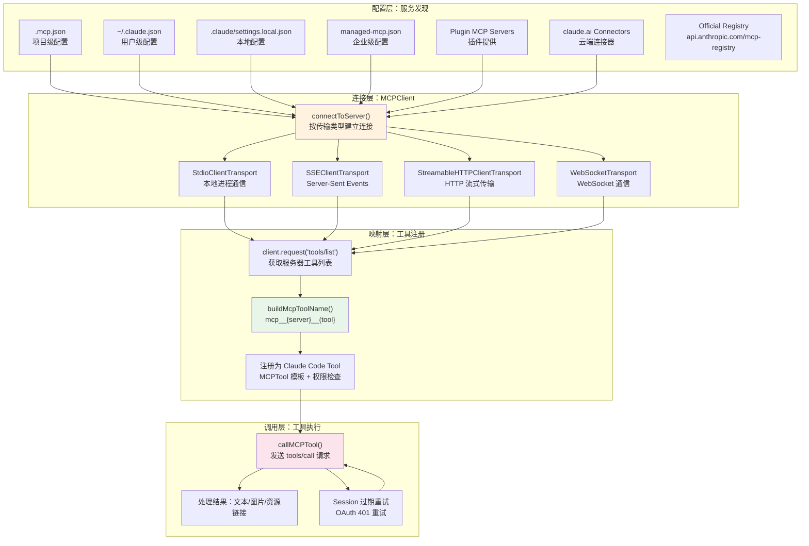

# s15 — MCP 集成：连接外部世界

> "The agent is only as powerful as the tools it can reach" · 预计阅读 15 分钟

**核心洞察：MCP 是 AI 的 USB 接口——一个协议统一连接数据库、API、文件系统等所有外部工具。**

::: info Key Takeaways
- **六种传输协议** — stdio / sse / http / ws / sse-ide / sdk，覆盖从本地到远程的所有场景
- **工具命名规范** — `mcp__{server}__{tool}`，命名空间隔离避免冲突
- **OAuth + XAA 认证** — 支持 OAuth 2.0 流程和跨应用访问 (SEP-990)
- **MCP 累计 9700 万下载** — 已成为 Agent 工具集成的行业标准
:::

::: tip MCP vs A2A
MCP 解决 Agent → 工具的 **垂直集成**；Google 的 A2A 协议解决 Agent → Agent 的 **水平协作**。两者互补，被类比为"AI 的 OSI 模型层"。2026 企业栈正在向 MCP + A2A + ACP 多协议生态演进。
:::

**MCP 三大能力**：
- **Tools**（执行操作）：最核心的能力，允许 agent 调用外部服务
- **Resources**（读取数据）：通过 `resources/list` 和 `resources/read` 将外部数据注入上下文
- **Prompts**（模板化指令）：提供可参数化的提示模板

教程重点讲解 Tools，但 Resources 是 Context Engineering 的重要手段。

## 问题

如何让 agent 连接数据库、API、第三方服务？

Claude Code 内置了文件读写、Bash 执行、搜索等工具，但现实世界的开发场景远不止于此。你可能需要查询 Jira 任务、操作 Slack 消息、访问 PostgreSQL 数据库、调用公司内部 API。如果每个需求都要修改 Claude Code 源码来添加工具，这个系统将不可维护。

MCP（Model Context Protocol）解决了这个问题：它定义了一个**标准化的工具协议**，任何人都可以写一个 MCP 服务器来暴露工具，Claude Code 自动发现并注册这些工具，就像 USB 设备的即插即用。agent 的能力边界，从此由生态决定，而非由源码决定。

## 架构图



## 核心机制

### 1. MCP 协议基础：标准化工具协议

MCP 是 Anthropic 推出的开放协议，它定义了 LLM 应用与外部工具之间的通信标准。核心思想很简单：

- **Client**（Claude Code）发起连接，发送 `tools/list` 获取可用工具，发送 `tools/call` 调用工具
- **Server**（第三方服务）暴露工具定义（名称、描述、JSON Schema 参数），执行调用并返回结果
- **Transport** 是通信管道，支持多种传输方式

Claude Code 支持六种传输类型，定义在 `TransportSchema` 中：

| 传输类型 | 适用场景 | 特点 |
|---------|---------|------|
| `stdio` | 本地工具，如 npx 启动的服务 | 最常用，通过子进程 stdin/stdout 通信 |
| `sse` | 远程服务，旧版协议 | Server-Sent Events，支持 OAuth |
| `http` | 远程服务，新版 Streamable HTTP | 推荐的远程传输方式 |
| `ws` | WebSocket 连接 | 适合需要双向通信的场景 |
| `sse-ide` / `ws-ide` | IDE 集成专用 | VSCode 等编辑器内部使用 |
| `sdk` | SDK 内部传输 | Agent SDK 管理的占位类型 |

每种传输类型对应不同的配置 Schema。以最常用的 `stdio` 为例：

```json
{
  "mcpServers": {
    "github": {
      "command": "npx",
      "args": ["-y", "@modelcontextprotocol/server-github"],
      "env": { "GITHUB_TOKEN": "ghp_xxx" }
    }
  }
}
```

源码路径：`src/services/mcp/types.ts` — `McpStdioServerConfigSchema`, `TransportSchema`

### 2. 服务发现：多层配置合并

Claude Code 从六个来源发现 MCP 服务器，按优先级从低到高合并：

1. **Plugin 提供**（`scope: 'dynamic'`）— 插件自动注册的 MCP 服务器
2. **用户级**（`scope: 'user'`）— `~/.claude.json` 中的 `mcpServers`
3. **项目级**（`scope: 'project'`）— 项目根目录的 `.mcp.json`，向上遍历到根目录
4. **本地级**（`scope: 'local'`）— `.claude/settings.local.json` 中的配置
5. **企业级**（`scope: 'enterprise'`）— `managed-mcp.json`，**互斥控制**——存在即屏蔽所有其他来源
6. **claude.ai 连接器**（`scope: 'claudeai'`）— 从 claude.ai 获取的云端 MCP 配置

关键设计：**企业配置具有排他性**。`doesEnterpriseMcpConfigExist()` 返回 `true` 时，其他所有来源被忽略。这让企业管理员可以完全控制员工能使用哪些 MCP 服务器。

另一个关键设计是**去重**。Plugin 服务器的 key 是 `plugin:name:server` 格式，不会与手动配置的 key 冲突。但内容可能重复——同一个 GitHub MCP 服务器可能同时出现在 plugin 和手动配置中。`dedupPluginMcpServers()` 通过**签名匹配**解决这个问题：

```typescript
// 计算服务器签名：stdio 用命令数组，远程用 URL
export function getMcpServerSignature(config: McpServerConfig): string | null {
  const cmd = getServerCommandArray(config)
  if (cmd) return `stdio:${jsonStringify(cmd)}`
  const url = getServerUrl(config)
  if (url) return `url:${unwrapCcrProxyUrl(url)}`
  return null
}
```

同样的逻辑也用于 `dedupClaudeAiMcpServers()`——当 claude.ai 连接器和手动配置指向同一个 URL 时，手动配置优先。

项目级 `.mcp.json` 还有一个安全机制：首次使用需要用户审批（`getProjectMcpServerStatus(name) === 'approved'`），防止恶意仓库通过 `.mcp.json` 注入工具。

源码路径：`src/services/mcp/config.ts` — `getClaudeCodeMcpConfigs()`, `getAllMcpConfigs()`

### 3. 官方注册表：信任标记

Claude Code 在启动时异步预取官方 MCP 注册表：

```typescript
export async function prefetchOfficialMcpUrls(): Promise<void> {
  const response = await axios.get(
    'https://api.anthropic.com/mcp-registry/v0/servers?version=latest&visibility=commercial',
    { timeout: 5000 }
  )
  // 收集所有 remote URL，归一化后存入 Set
  for (const entry of response.data.servers) {
    for (const remote of entry.server.remotes ?? []) {
      const normalized = normalizeUrl(remote.url)
      if (normalized) urls.add(normalized)
    }
  }
}
```

这个注册表不影响功能，但提供了**信任信号**：`isOfficialMcpUrl()` 让 UI 可以标记哪些服务器来自官方认证的生态。Fire-and-forget 模式确保不阻塞启动。

源码路径：`src/services/mcp/officialRegistry.ts`

### 4. 工具映射：MCP 工具变 Claude Code 工具

连接建立后，`getMcpToolsCommandsAndResources()` 负责将 MCP 工具映射为 Claude Code 的内部 Tool 格式。核心流程：

1. **获取工具列表**：`client.request({ method: 'tools/list' })` 获取服务器暴露的所有工具
2. **构建完全限定名**：`buildMcpToolName(serverName, toolName)` 生成 `mcp__{server}__{tool}` 格式
3. **包装为 Tool 对象**：基于 `MCPTool` 模板，填充描述、参数 Schema、权限检查、调用逻辑

名称归一化由 `normalizeNameForMCP()` 处理——将特殊字符替换为下划线，确保工具名是合法的标识符。双下划线 `__` 用作分隔符，这意味着服务器名本身不能包含 `__`（已知限制，但实践中极少遇到）。

描述长度上限是 2048 字符（`MAX_MCP_DESCRIPTION_LENGTH`）。这是因为 OpenAPI 生成的 MCP 服务器经常把 15-60KB 的端点文档塞进工具描述，会浪费大量 token。

工具的元信息也被利用：
- `annotations.readOnlyHint` → 标记为可并发安全的只读工具
- `annotations.destructiveHint` → 标记为破坏性工具
- `_meta['anthropic/searchHint']` → 延迟加载时的搜索提示
- `_meta['anthropic/alwaysLoad']` → 始终加载而非延迟加载

源码路径：`src/services/mcp/client.ts` — `getMcpToolsCommandsAndResources()`，`src/services/mcp/mcpStringUtils.ts` — `buildMcpToolName()`

### 工具加载策略：Always-Load vs Lazy-Load

大型 MCP 服务器可能暴露 50-200 个工具。不做延迟加载，tool schema 占满上下文窗口。`_meta['anthropic/alwaysLoad']` 标记关键工具立即加载，其余通过 ToolSearch 按需发现。`_meta['anthropic/searchHint']` 提供搜索提示，帮助 agent 找到需要的工具。

### 5. 连接管理：持久连接与重连

`connectToServer()` 是连接建立的核心函数，使用 `memoize` 缓存连接结果。连接管理有几个关键设计：

**批量连接与并发控制**：本地服务器（stdio/sdk）的并发上限默认是 3，因为每个都需要 spawn 子进程；远程服务器默认并发 20。

**超时机制**：连接超时默认 30 秒（`getConnectionTimeoutMs()`），工具调用超时约 27.8 小时（`DEFAULT_MCP_TOOL_TIMEOUT_MS = 100_000_000`）——本质上无限超时，让长时间运行的工具能完成。

**重连策略**：当连接断开时（`client.onerror`），系统检测错误类型（ECONNRESET、ETIMEDOUT、EPIPE 等）。连续 3 次终端错误后，自动关闭传输并触发重连。`MCPConnectionManager` 作为 React Context 提供 `reconnectMcpServer()` 和 `toggleMcpServer()` 方法。

**OAuth 认证**：远程服务器可能需要 OAuth 认证。`ClaudeAuthProvider` 处理 token 获取和刷新。401 响应触发 `handleRemoteAuthFailure()`，服务器状态变为 `needs-auth`，并缓存 15 分钟（`MCP_AUTH_CACHE_TTL_MS`）避免反复探测。

**Session 过期处理**：MCP 服务器可能返回 404 + JSON-RPC code -32001 表示 session 过期。`isMcpSessionExpiredError()` 检测这种情况，触发清除缓存并重连。

```typescript
// 连接状态的五种类型
type MCPServerConnection =
  | ConnectedMCPServer   // 连接成功
  | FailedMCPServer      // 连接失败
  | NeedsAuthMCPServer   // 需要认证
  | PendingMCPServer     // 连接中
  | DisabledMCPServer    // 已禁用
```

源码路径：`src/services/mcp/client.ts` — `connectToServer()`，`src/services/mcp/MCPConnectionManager.tsx`

### 6. 企业策略：允许列表与拒绝列表

MCP 服务器受到双重策略过滤：

- **allowedMcpServers**：白名单，支持按服务器名、命令数组、URL 模式匹配
- **deniedMcpServers**：黑名单，绝对优先——即使在白名单中，被拒绝也无法使用

URL 模式支持通配符：`https://*.example.com/*` 匹配所有子域名的所有路径。

`filterMcpServersByPolicy()` 在多个入口点调用：`getClaudeCodeMcpConfigs()`、`--mcp-config` 命令行参数、SDK 的 `setMcpServers()` 控制消息。SDK 类型的服务器（`type: 'sdk'`）豁免策略检查——它们只是传输占位符，实际由 SDK 管理。

源码路径：`src/services/mcp/config.ts` — `isMcpServerAllowedByPolicy()`, `filterMcpServersByPolicy()`

::: warning 环境变量展开的安全风险
`expandEnvVars()`（`src/services/mcp/envExpansion.ts`）支持配置中的 `${VAR}` 替换。恶意 `.mcp.json` 可通过 `${SECRET_KEY}` 读取环境变量并传递给远程服务器。项目级 `.mcp.json` 的审批机制（`getProjectMcpServerStatus === 'approved'`）是关键防线——克隆不信任的仓库时务必审查其 MCP 配置。
:::

## Python 伪代码

<details>
<summary>展开查看完整 Python 伪代码（330 行）</summary>

```python
"""
MCP 集成伪代码：从配置发现到工具调用的完整流程
"""
from dataclasses import dataclass, field
from typing import Optional, Callable
from enum import Enum
import json
import subprocess
import asyncio

# ── 类型定义 ──

class TransportType(Enum):
    STDIO = "stdio"
    SSE = "sse"
    HTTP = "http"
    WS = "ws"

class ConnectionStatus(Enum):
    CONNECTED = "connected"
    FAILED = "failed"
    NEEDS_AUTH = "needs-auth"
    PENDING = "pending"
    DISABLED = "disabled"

class ConfigScope(Enum):
    USER = "user"
    PROJECT = "project"
    LOCAL = "local"
    ENTERPRISE = "enterprise"
    PLUGIN = "plugin"
    CLAUDEAI = "claudeai"

@dataclass
class McpServerConfig:
    transport: TransportType = TransportType.STDIO
    command: str = ""          # stdio 专用
    args: list[str] = field(default_factory=list)
    env: dict[str, str] = field(default_factory=dict)
    url: str = ""              # 远程专用
    scope: ConfigScope = ConfigScope.USER

@dataclass
class McpTool:
    name: str
    description: str
    input_schema: dict
    server_name: str

@dataclass
class McpConnection:
    name: str
    status: ConnectionStatus
    config: McpServerConfig
    client: Optional[object] = None  # MCP SDK Client
    tools: list[McpTool] = field(default_factory=list)


# ── 配置发现 ──

def get_server_signature(config: McpServerConfig) -> Optional[str]:
    """计算服务器签名，用于去重"""
    if config.transport == TransportType.STDIO:
        cmd_array = [config.command] + config.args
        return f"stdio:{json.dumps(cmd_array)}"
    elif config.url:
        return f"url:{config.url}"
    return None

def dedup_plugin_servers(
    plugin_servers: dict[str, McpServerConfig],
    manual_servers: dict[str, McpServerConfig],
) -> dict[str, McpServerConfig]:
    """插件服务器与手动配置去重：手动优先"""
    manual_sigs = {}
    for name, config in manual_servers.items():
        sig = get_server_signature(config)
        if sig and sig not in manual_sigs:
            manual_sigs[sig] = name

    result = {}
    for name, config in plugin_servers.items():
        sig = get_server_signature(config)
        if sig and sig in manual_sigs:
            print(f"Suppressing plugin '{name}': duplicates '{manual_sigs[sig]}'")
            continue
        result[name] = config
    return result

def discover_mcp_servers() -> dict[str, McpServerConfig]:
    """
    多层配置合并：plugin < user < project < local
    企业配置存在时，排他控制
    """
    # 1. 企业配置：排他模式
    enterprise = load_enterprise_config()  # managed-mcp.json
    if enterprise:
        return apply_policy_filter(enterprise)

    # 2. 加载各层配置
    plugin_servers = load_plugin_mcp_servers()
    user_servers = load_user_config()        # ~/.claude.json
    project_servers = load_project_config()  # .mcp.json（仅 approved）
    local_servers = load_local_config()      # settings.local.json

    # 3. 插件去重
    all_manual = {**user_servers, **project_servers, **local_servers}
    deduped_plugins = dedup_plugin_servers(plugin_servers, all_manual)

    # 4. 按优先级合并
    merged = {**deduped_plugins, **user_servers, **project_servers, **local_servers}

    # 5. 策略过滤
    return apply_policy_filter(merged)

def apply_policy_filter(
    servers: dict[str, McpServerConfig],
) -> dict[str, McpServerConfig]:
    """允许列表 + 拒绝列表双重过滤"""
    result = {}
    for name, config in servers.items():
        # 拒绝列表绝对优先
        if is_server_denied(name, config):
            continue
        # 允许列表检查
        if not is_server_allowed(name, config):
            continue
        result[name] = config
    return result


# ── 连接管理 ──

class MCPClient:
    """MCP 客户端：管理与单个 MCP 服务器的连接"""

    def __init__(self, name: str, config: McpServerConfig):
        self.name = name
        self.config = config
        self.status = ConnectionStatus.PENDING
        self._process: Optional[subprocess.Popen] = None
        self._client = None  # MCP SDK Client
        self.tools: list[McpTool] = []

    async def connect(self, timeout_ms: int = 30_000) -> ConnectionStatus:
        """建立连接，支持超时"""
        try:
            transport = self._create_transport()

            # 带超时的连接
            await asyncio.wait_for(
                self._client.connect(transport),
                timeout=timeout_ms / 1000,
            )

            self.status = ConnectionStatus.CONNECTED
            self._setup_error_handlers()
            return self.status

        except asyncio.TimeoutError:
            self.status = ConnectionStatus.FAILED
            return self.status
        except AuthenticationError:
            self.status = ConnectionStatus.NEEDS_AUTH
            return self.status

    def _create_transport(self):
        """根据传输类型创建对应的 Transport"""
        if self.config.transport == TransportType.STDIO:
            return StdioTransport(
                command=self.config.command,
                args=self.config.args,
                env=self.config.env,
            )
        elif self.config.transport == TransportType.HTTP:
            return HttpTransport(
                url=self.config.url,
                timeout_per_request_ms=60_000,
            )
        elif self.config.transport == TransportType.SSE:
            return SseTransport(url=self.config.url)
        else:
            raise ValueError(f"Unsupported transport: {self.config.transport}")

    def _setup_error_handlers(self):
        """连接断开检测与自动重连"""
        consecutive_errors = 0
        MAX_ERRORS = 3

        def on_error(error):
            nonlocal consecutive_errors
            if is_terminal_error(error):
                consecutive_errors += 1
                if consecutive_errors >= MAX_ERRORS:
                    self._trigger_reconnect()
            else:
                consecutive_errors = 0

        self._client.onerror = on_error

    async def list_tools(self) -> list[McpTool]:
        """获取服务器暴露的工具列表"""
        result = await self._client.request(
            {"method": "tools/list"},
        )
        self.tools = [
            McpTool(
                name=tool["name"],
                description=tool.get("description", "")[:2048],  # 截断
                input_schema=tool["inputSchema"],
                server_name=self.name,
            )
            for tool in result["tools"]
        ]
        return self.tools

    async def call_tool(
        self, tool_name: str, args: dict, max_retries: int = 1
    ) -> dict:
        """
        调用 MCP 工具，支持 session 过期重试
        """
        for attempt in range(max_retries + 1):
            try:
                result = await self._client.request({
                    "method": "tools/call",
                    "params": {
                        "name": tool_name,
                        "arguments": args,
                    },
                })
                if result.get("isError"):
                    raise McpToolCallError(result["content"])
                return result
            except SessionExpiredError:
                if attempt < max_retries:
                    await self.connect()  # 重连后重试
                    continue
                raise

    async def cleanup(self):
        """清理连接资源"""
        if self._process:
            self._process.terminate()
        if self._client:
            await self._client.close()


# ── 工具注册 ──

def normalize_name(name: str) -> str:
    """将名称归一化为合法标识符"""
    import re
    return re.sub(r'[^a-zA-Z0-9_]', '_', name)

def build_mcp_tool_name(server_name: str, tool_name: str) -> str:
    """构建完全限定名：mcp__{server}__{tool}"""
    return f"mcp__{normalize_name(server_name)}__{normalize_name(tool_name)}"

def register_as_claude_tools(
    client: MCPClient,
    mcp_tools: list[McpTool],
) -> list[dict]:
    """
    将 MCP 工具注册为 Claude Code 内部工具
    关键：保持 MCPTool 模板不变，只填充动态字段
    """
    registered = []
    for tool in mcp_tools:
        fq_name = build_mcp_tool_name(client.name, tool.name)
        claude_tool = {
            "name": fq_name,
            "is_mcp": True,
            "mcp_info": {
                "server_name": client.name,
                "tool_name": tool.name,
            },
            "description": tool.description,
            "input_schema": tool.input_schema,
            "is_read_only": tool.input_schema.get("readOnlyHint", False),
            "call": lambda args, t=tool: client.call_tool(t.name, args),
        }
        registered.append(claude_tool)
    return registered


# ── 完整启动流程 ──

async def initialize_mcp(
    on_connection: Callable,
) -> None:
    """
    MCP 初始化：发现 → 连接 → 注册
    本地服务器并发 3，远程服务器并发 20
    """
    configs = discover_mcp_servers()

    # 分离已禁用和活跃服务器
    disabled = {k: v for k, v in configs.items() if is_disabled(k)}
    active = {k: v for k, v in configs.items() if not is_disabled(k)}

    # 通知禁用状态
    for name, config in disabled.items():
        on_connection(McpConnection(name, ConnectionStatus.DISABLED, config))

    # 分离本地与远程
    local = {k: v for k, v in active.items()
             if v.transport in (TransportType.STDIO,)}
    remote = {k: v for k, v in active.items()
              if v.transport not in (TransportType.STDIO,)}

    # 批量连接
    async def process_server(name: str, config: McpServerConfig):
        client = MCPClient(name, config)
        status = await client.connect()

        if status == ConnectionStatus.CONNECTED:
            tools = await client.list_tools()
            claude_tools = register_as_claude_tools(client, tools)
            on_connection(McpConnection(
                name, status, config, client, tools
            ))
        else:
            on_connection(McpConnection(name, status, config))

    # 本地并发 3
    await batch_process(local.items(), concurrency=3, fn=process_server)
    # 远程并发 20
    await batch_process(remote.items(), concurrency=20, fn=process_server)
```

</details>

## 源码映射

| 概念 | 真实源码路径 | 说明 |
|------|-------------|------|
| 传输类型定义 | `src/services/mcp/types.ts` | `TransportSchema` 定义 stdio/sse/http/ws 等六种传输 |
| 服务器配置 Schema | `src/services/mcp/types.ts` | `McpStdioServerConfigSchema`, `McpHTTPServerConfigSchema` 等 |
| 连接状态类型 | `src/services/mcp/types.ts` | `ConnectedMCPServer`, `FailedMCPServer`, `NeedsAuthMCPServer` 等 |
| 多层配置合并 | `src/services/mcp/config.ts` | `getClaudeCodeMcpConfigs()` — 核心配置发现函数 |
| 企业排他控制 | `src/services/mcp/config.ts` | `doesEnterpriseMcpConfigExist()` 判断是否启用企业模式 |
| 插件去重 | `src/services/mcp/config.ts` | `dedupPluginMcpServers()` 基于签名的内容去重 |
| 策略过滤 | `src/services/mcp/config.ts` | `isMcpServerAllowedByPolicy()`, `filterMcpServersByPolicy()` |
| 配置增删 | `src/services/mcp/config.ts` | `addMcpConfig()`, `removeMcpConfig()` |
| 官方注册表 | `src/services/mcp/officialRegistry.ts` | `prefetchOfficialMcpUrls()` 异步预取 |
| 连接建立 | `src/services/mcp/client.ts` | `connectToServer()` — memoized 连接函数 |
| 工具发现与注册 | `src/services/mcp/client.ts` | `getMcpToolsCommandsAndResources()` |
| 工具名构建 | `src/services/mcp/mcpStringUtils.ts` | `buildMcpToolName()`, `mcpInfoFromString()` |
| 工具调用 | `src/services/mcp/client.ts` | `callMCPTool()`, `callMCPToolWithUrlElicitationRetry()` |
| 连接管理 React 层 | `src/services/mcp/MCPConnectionManager.tsx` | 提供 reconnect/toggle 的 React Context |
| OAuth 认证 | `src/services/mcp/auth.ts` | `ClaudeAuthProvider` |
| 环境变量展开 | `src/services/mcp/config.ts` | `expandEnvVars()` — 配置中的 `${VAR}` 替换 |

## 设计决策

### 为什么用标准化协议而非直接集成？

**去中心化扩展**是 MCP 的核心价值。对比几种方案：

| 方案 | 优点 | 缺点 |
|------|------|------|
| **直接写 Tool**（在 Claude Code 中） | 性能最优，深度集成 | 每增加一个工具要改源码、发版本 |
| **插件系统**（自定义协议） | 灵活 | 生态碎片化，每个 agent 协议不同 |
| **MCP 标准协议** | 生态共享，一次编写到处使用 | 协议开销，stdio 需要子进程 |
| **Function Calling 裸接口** | 简单 | 没有发现/注册机制，每次手写 |

Claude Code 选择 MCP 的理由：

1. **生态效应**：一个 MCP 服务器可以同时被 Claude Code、Cursor、Zed、Windsurf 使用，开发者只需写一次
2. **安全边界**：MCP 服务器在独立进程中运行，即使崩溃也不影响 Claude Code 主进程
3. **灵活部署**：同一个服务可以本地运行（stdio）或远程部署（http），用户按需选择

### 连接批量化与并发分级

本地 3、远程 20 的并发策略是实战经验：

- **本地 stdio**：每个连接都 spawn 一个子进程，3 个并发已经足够——大多数开发者配置 1-5 个本地 MCP 服务器
- **远程 http/sse**：只是 HTTP 请求，20 个并发很轻量——适配 claude.ai 连接器场景（可能有 30+ 个远程服务器）

### 描述截断的取舍

2048 字符的描述上限是 p95 长尾的折中。OpenAPI 生成的 MCP 服务器经常把整个 API 文档塞进工具描述（观测到 15-60KB）。不截断会浪费大量 token，截断太短会丢失关键信息。2048 保留了工具意图同时控制了 token 成本。

### 竞品对比

| 特性 | Claude Code MCP | Cursor MCP | Continue MCP |
|------|----------------|------------|--------------|
| 传输类型 | stdio/sse/http/ws | stdio/sse | stdio/sse |
| 多层配置 | 6 层（含企业） | 项目级 | 项目级 |
| 企业策略 | 允许/拒绝双列表 | 无 | 无 |
| 插件集成 | Plugin → MCP 自动桥接 | 无 | 无 |
| 去重机制 | 签名匹配去重 | 无 | 无 |
| 认证支持 | OAuth + Session 重试 | 基础 OAuth | Token 手动配置 |

## Why：设计决策与行业上下文

### Tool-as-Context 模式

MCP（Model Context Protocol）是 **Tool-as-Context** 模式的标准化实现 [R1-3][R1-11]：工具调用的结果本身就是上下文注入的手段。当 Agent 调用 MCP 工具获取数据库 schema 或 API 文档时，这些结果会自然地注入到对话上下文中，丰富 Agent 的信息基础。

工具的描述文本也是上下文的一部分——当你定义一个 MCP 工具时，它的 schema 和说明文字进入模型的上下文窗口，隐含了"应该怎么做"的指导信息。

### MCP vs A2A：垂直集成 vs 水平协作

行业形成了两个互补的协议 [R1 initial research]：
- **MCP**（Model Context Protocol）：Agent → 工具的**垂直集成**
- **A2A**（Agent-to-Agent Protocol）：Agent → Agent 的**水平协作**

两者不是竞争关系，而是互补：MCP 解决"Agent 如何连接外部能力"，A2A 解决"Agent 之间如何协作"。

**MCP vs A2A vs ACP**：三者定位不同：MCP 管 agent-tool 通信，A2A（Google）管 agent-agent 发现与协作，ACP（BeeAI/IBM）也管 agent-agent 但侧重企业互操作。MCP 解决"agent 如何使用工具"，A2A/ACP 解决"agent 如何找到并委托其他 agent"。

> **参考来源：** LangChain [R1-3]。完整引用见 `docs/research/05-harness-trends-deep-20260401.md`。

## 变化表

与上一课（s14 Worktree）相比，新增了什么？

| 新增机制 | 说明 |
|---------|------|
| MCP 协议层 | 标准化的工具通信协议：Client/Server/Transport 三层架构 |
| 多层服务发现 | 6 个配置来源按优先级合并，企业配置排他控制 |
| 工具名映射 | `mcp__{server}__{tool}` 命名约定，自动归一化 |
| 连接管理 | 持久连接 + 超时 + 重连 + OAuth 认证 |
| 官方注册表 | 异步预取信任标记 |
| 企业策略 | allowedMcpServers / deniedMcpServers 双重过滤 |
| 签名去重 | Plugin 和 claude.ai 连接器与手动配置的内容级去重 |

## 动手试试

### 练习 1：实现一个最小 MCP 服务器

用 Python 的 `mcp` 库（`pip install mcp`）写一个暴露单个工具的 MCP 服务器，然后在 Claude Code 中配置并使用它：

```python
# 目标：暴露一个 "get_weather" 工具
# 配置到 ~/.claude.json 的 mcpServers
# 观察 Claude Code 如何发现并调用它
```

重点关注：工具名变成了什么？描述如何传递？参数 Schema 如何映射？

### 练习 2：追踪 MCP 连接生命周期

在 Claude Code 中使用 `/mcp` 命令查看所有已配置的 MCP 服务器状态。配置一个故意连不上的服务器（比如 URL 指向不存在的地址），观察：

- 连接超时需要多久？
- 错误状态是什么？
- 重新 `/mcp` 后能否重连？

### 练习 3：设计你自己的工具扩展策略

思考你的 agent 项目：哪些工具应该内置，哪些应该通过 MCP 提供？制定一个分类标准：

- **内置**：调用频率极高、需要深度集成的（如文件读写）
- **MCP**：特定场景使用、可独立开发部署的（如数据库查询、API 调用）
- **延迟加载**：仅在特定条件下需要的工具

画出你的工具生态架构图，标注每个工具的加载策略。

## 推荐阅读

- [Code execution with MCP (Anthropic)](https://www.anthropic.com/) — MCP 官方最新进展
- [Guide to AI Agent Protocols (Google Developers)](https://developers.googleblog.com/) — Google 视角的 Agent 协议全景
- [MCP and A2A are AI's new OSI model layers](https://apigene.ai/) — MCP vs A2A 互补关系分析

---

## 模拟场景

<!--@include: ./_fragments/sim-s15.md-->

## 设计决策

<!--@include: ./_fragments/ann-s15.md-->
