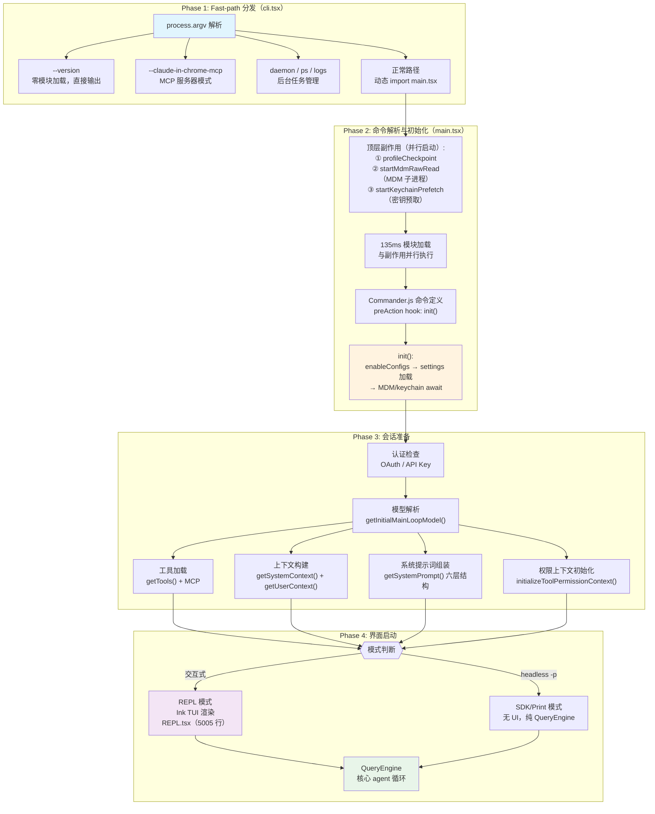
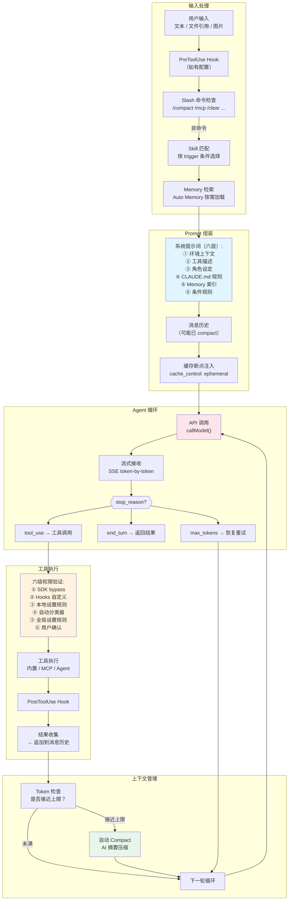

# s16 — 全景架构：从 CLI 启动到完整交互

> "See the forest, then the trees"

::: info Key Takeaways
- **启动四阶段** — parse CLI → init config → get tools → start REPL/SDK，并发副作用优化启动速度
- **查询完整生命周期** — input → prompt assembly → agent loop → tool execution → context management → output
- **七大 Harness 设计优势** — Claude Code 为何在同模型下表现优于竞品的工程原因
- **从源码到思想** — 16 课不是终点，而是构建你自己 Agent Harness 的起点
:::

## 问题

所有模块如何协同工作？端到端的完整流程是什么？

经过前 15 课的学习，我们拆解了 Claude Code 的每一个子系统：Agent Loop、工具系统、权限控制、Hooks、配置管理、上下文压缩、记忆系统、Prompt 工程、缓存优化、延迟加载、子 Agent、系统提示词、SDK 双模式、权限层级、MCP 集成。

但一个好的 agent 不是子系统的堆叠——它是子系统的**协奏**。

这节课我们站到最高处俯瞰全局：一个用户输入 `claude` 到看到回复，中间究竟经历了什么？所有我们学过的模块在哪个时刻、以什么顺序参与？然后我们回答最关键的问题：**为什么 Claude Code 选择了这样的架构？它比其他方案好在哪里？**

这是收官课。我们不再引入新机制，而是把 16 课学到的一切编织成一张完整的地图。

## 架构图

### 图一：端到端启动流程



### 图二：单次查询生命流



## 核心机制

### 1. 为什么 CLI 用 React（Ink）

这可能是 Claude Code 架构中最令人意外的选择：一个 CLI 工具，用 React 写 UI。

REPL.tsx 有 **5005 行**。它不是一个简单的 readline 界面——它是一个完整的终端应用程序，包含：消息列表虚拟滚动、多工具并发执行时的局部刷新、权限确认对话框、MCP elicitation 弹窗、搜索高亮、vim 模式、成本追踪仪表盘、分屏 Agent 面板...

传统做法是用 blessed 或 ncurses。React + Ink 的优势在：

**声明式 UI + 状态管理**。Agent 的 UI 状态极其复杂——多个工具可能同时执行（文件写入 + Bash 命令 + MCP 调用），每个都有进度条、结果展示、权限请求。命令式 UI 框架会导致大量 `if (isToolRunning && !isPermissionPending && hasNewOutput)` 式的状态意面。React 的声明式渲染 + Zustand 风格 store（`AppState`）让状态管理清晰：

```typescript
// AppState.tsx — 全局状态 store
export const AppStoreContext = React.createContext<AppStateStore | null>(null)

// 组件只订阅需要的状态切片
const verbose = useAppState(s => s.verbose)
const model = useAppState(s => s.mainLoopModel)
```

**流式输出 + 并发刷新**。LLM 输出是 token-by-token 流式到达的，同时可能有多个工具在并行执行。Ink 的 React 渲染模型天然支持这种场景——每个组件独立 re-render，不影响其他区域。用 blessed 实现同样效果需要手动管理脏区域刷新。

**组件复用**。权限对话框、Spinner、消息渲染器等组件在 REPL 和子 Agent 中复用。React 的组件模型让这一切自然发生。

源码路径：`src/screens/REPL.tsx`（5005 行），`src/state/AppState.tsx`，`src/state/AppStateStore.ts`

### 2. 启动优化：毫秒级苛求

Claude Code 对启动时间的优化达到了极致。从 `main.tsx` 的前几行就能看出设计意图：

```typescript
// 第 1 行：性能检查点
profileCheckpoint('main_tsx_entry')

// 第 2 行：启动 MDM 子进程（plutil/reg query）
startMdmRawRead()  // 并行！不等待结果

// 第 3 行：启动密钥预取
startKeychainPrefetch()  // 并行！不等待结果

// 然后才是 135ms 的模块 import...
// MDM 和 keychain 在 import 期间完成
```

三件事**同时进行**：MDM 设置读取、Keychain 密钥获取、模块加载。它们之间没有依赖关系，所以并行执行。等模块加载完（~135ms），前两个子进程大概率已经完成——如果没有，`ensureMdmSettingsLoaded()` 和 `ensureKeychainPrefetchCompleted()` 会等待它们。

`cli.tsx` 的 fast-path 设计同样极致：
- `--version`：零 import，直接输出编译时内联的版本号
- `--dump-system-prompt`：只 import 必要的 config 和 prompt 模块
- `daemon/ps/logs`：只 import 对应的子命令模块

每个路径都用 `profileCheckpoint()` 标记，开发者可以通过启动 profiler 精确看到每个阶段的耗时。

源码路径：`src/entrypoints/cli.tsx`，`src/main.tsx`（前 20 行）

### 3. 双模式再回顾：REPL vs SDK

贯穿整个教程的双模式架构在启动流程中汇合：

| 维度 | REPL 模式 | SDK/Print 模式 |
|------|----------|---------------|
| **入口** | `claude`（交互式） | `claude -p "prompt"` 或 Agent SDK |
| **UI** | Ink TUI（React 渲染） | 无 UI，stdout 输出 |
| **状态** | AppStateProvider + store | 直接创建 store |
| **权限** | 用户交互确认 | bypass 或预配置规则 |
| **MCP** | MCPConnectionManager 管理 | 可传入 `--mcp-config` |
| **核心引擎** | QueryEngine（共享） | QueryEngine（共享） |
| **工具** | 完整工具集 | 可定制子集 |

关键洞察：两种模式共享 `QueryEngine` 核心，但 UI 层完全分离。这让 Claude Code 既是一个强大的终端应用，又是一个可嵌入的 SDK。

源码路径：`src/main.tsx` — `run()` 函数中的模式分支

### 4. 全局状态的流转

AppState 是整个应用的中央状态仓库。理解它的结构就理解了 Claude Code 运行时的全部状态：

```typescript
// 简化的 AppState 关键字段
interface AppState {
  // 消息与对话
  messages: Message[]              // 完整对话历史
  isLoading: boolean               // 是否在等待模型回复

  // 模型与配置
  mainLoopModel: string            // 当前使用的模型
  verbose: boolean                 // 详细输出模式

  // 工具与权限
  tools: Tool[]                    // 已注册的所有工具
  toolPermissionContext: Context    // 权限规则上下文
  mcpClients: MCPServerConnection[] // MCP 连接状态

  // UI 状态
  promptSuggestion: Suggestion     // 输入建议
  isCompacting: boolean            // 是否在压缩中
}
```

状态更新通过 `store.setState()` 统一管理，组件通过 `useAppState(selector)` 订阅切片。这个设计避免了 React 的性能陷阱——只有依赖的切片变化时组件才 re-render：

```typescript
// 好：精确订阅
const verbose = useAppState(s => s.verbose)

// 坏：返回新对象，每次都触发 re-render
const { verbose, model } = useAppState(s => ({ verbose: s.verbose, model: s.mainLoopModel }))
```

源码路径：`src/state/AppStateStore.ts`，`src/state/AppState.tsx`

### 5. 端到端数据流追踪

让我们完整追踪一次用户输入的数据流，把所有模块串联起来：

**Step 1 — 用户输入 "请修复这个 bug"**

PromptInput 组件捕获输入，检查是否有 Slash 命令前缀。不是。检查是否有文件引用（`@file`）。没有。原始文本传入 `submitMessage()`。

**Step 2 — 预处理与上下文收集**

`processUserInput()` 触发：
- Skill 匹配：扫描已注册的 Skills，如果有匹配的 trigger（如 "fix" 关键词匹配到某个 skill），加载 skill 的 prompt
- Memory 检索：查看 Auto Memory 索引，判断是否有相关的记忆文件需要注入
- PreToolUse Hook：如果配置了 session 开始的 hook，执行

**Step 3 — Prompt 组装**

`getSystemPrompt()` 组装六层系统提示词。`cache_control` 断点插入。消息历史（可能已经 compact 过）附加在后面。

**Step 4 — API 调用**

`callModel()` 发起 Anthropic API 请求。Streaming 模式。token-by-token 到达，Ink 实时渲染。

**Step 5 — 工具调用**

模型返回 `stop_reason: "tool_use"`，要求调用 `Grep` 搜索错误信息。

权限瀑布启动：
1. SDK bypass？不是 SDK 模式，跳过
2. Hooks？没有配置 PreToolUse hook，跳过
3. 本地设置规则？`settings.local.json` 有 `"Grep": "allow"`，命中！

工具执行。结果追加到消息历史。token 检查——还没超限。

**Step 6 — 循环继续**

回到 Step 4。模型看到搜索结果，决定调用 `Read` 读取文件。再次权限检查。再次执行。

**Step 7 — 修复与完成**

模型决定调用 `Write` 修改文件。权限检查——Write 是破坏性操作，自动分类器判断路径安全，允许。

模型返回 `stop_reason: "end_turn"`。循环结束。PostToolUse Hook 执行（如果有）。Notification Hook 发送通知。

**Step 8 — 上下文管理**

本轮对话新增了约 5000 token。检查总量——如果接近 80% 上下文窗口，触发自动 Compact。AI 摘要压缩前 N 轮对话，释放空间。

这就是一次完整的交互。8 个步骤，涉及了 s01 到 s15 学到的所有机制。

## 源码映射

| 概念 | 真实源码路径 | 说明 |
|------|-------------|------|
| CLI 入口 | `src/entrypoints/cli.tsx` | fast-path 分发：--version / --daemon / normal |
| 主函数 | `src/main.tsx`（4683 行） | Commander 命令定义 + 模式分支 + 启动优化 |
| 初始化 | `src/entrypoints/init.ts` | `init()` — enableConfigs + settings 加载 |
| REPL 界面 | `src/screens/REPL.tsx`（5005 行） | Ink TUI 主屏幕，React 组件 |
| 全局状态 | `src/state/AppState.tsx` | AppStateProvider + useAppState |
| 状态定义 | `src/state/AppStateStore.ts` | AppState 类型 + 默认值 + store 工厂 |
| 查询引擎 | `src/QueryEngine.ts` | 核心 agent 循环（REPL 和 SDK 共享） |
| 上下文构建 | `src/context.ts` | getSystemContext() + getUserContext() |
| 系统提示词 | `src/constants/prompts.ts` | getSystemPrompt() 六层组装 |
| 工具注册 | `src/tools.ts` | getTools() — 所有内置工具 |
| MCP 连接 | `src/services/mcp/client.ts` | connectToServer() + getMcpToolsCommandsAndResources() |
| 权限上下文 | `src/utils/permissions/permissionSetup.ts` | initializeToolPermissionContext() |
| 启动 profiler | `src/utils/startupProfiler.ts` | profileCheckpoint() 毫秒级性能追踪 |
| MDM 预读 | `src/utils/settings/mdm/rawRead.ts` | startMdmRawRead() 并行子进程 |
| Keychain 预取 | `src/utils/secureStorage/keychainPrefetch.ts` | startKeychainPrefetch() 并行密钥读取 |
| REPL 启动器 | `src/replLauncher.ts` | launchRepl() — Ink 渲染入口 |

## 设计决策

### Harness Engineering 七大优势

这是全教程最重要的总结。Claude Code 的架构不是随机演化的结果——它是一套深思熟虑的 **Harness Engineering** 哲学的产物。以下是贯穿 16 课的七大设计优势：

### 1. Prompt Cache 层级设计——近 100% 缓存命中

Claude Code 的系统提示词不是一个静态字符串，而是一个精心设计的六层结构（s13）。最关键的设计是：**将稳定内容放在前面，动态内容放在后面**，配合 Anthropic API 的 `cache_control: ephemeral` 断点，实现接近 100% 的 prompt cache 命中率。

这意味着一个 10 万 token 的系统提示词，在多轮对话中只需要在第一轮发送一次。之后每轮的 input token 成本可以降低 90%。

对比：大多数 agent 框架完全不考虑 prompt cache——每轮都发送完整的系统提示词，成本线性增长。

以一个真实场景说明影响：假设系统提示词 80,000 token，用户进行 20 轮对话。

| 方案 | 总 input token | 成本（Sonnet 定价） |
|------|---------------|-------------------|
| 无缓存（每轮全发） | 80K x 20 = 1.6M | 100% |
| Claude Code 缓存 | 80K + 19 x 8K = 232K | ~15% |

差距接近 **7 倍**。对于高频使用的开发者，这是每月数十到数百美元的差异。

### 2. 主动推理 vs 被动检索——搜索决策留在模型推理链内

Claude Code 没有 RAG。没有向量数据库。没有 embedding 索引。

它把搜索能力做成了工具（Grep、Glob、Read），让模型自己决定什么时候搜索、搜什么、怎么组合搜索结果。这是"主动推理"而非"被动检索"：

- **被动检索（RAG）**：用户提问 → embedding 相似度搜索 → 拼接上下文 → 模型回答
- **主动推理（Claude Code）**：用户提问 → 模型思考 → 决定 grep 某个模式 → 看结果 → 决定再搜索或已足够

主动推理的优势：模型可以做多跳搜索、可以根据中间结果调整策略、可以放弃无效路径。代价是更多的 API 调用（工具调用循环），但结果质量远高于单次 RAG 检索。

一个具体例子：用户问"这个 bug 是什么时候引入的？"

- **RAG 方案**：embedding 搜索 "bug" 相关的代码片段，可能返回几段不相关的代码。模型基于这些上下文猜测
- **Claude Code 方案**：模型先 `grep -r "error_message"`，找到报错位置。然后 `bash git log -p file.ts`，追溯最近的修改。然后 `read` 相关 commit 的改动。最终精确定位引入 bug 的 commit

前者是一步到位的"检索-生成"，后者是多步的"推理-搜索-推理"。后者更慢但更准。

### 3. 上下文管理 + 子 Agent 隔离——多轮推理连贯性

Claude Code 的上下文管理是一个双保险系统：

- **Compact**（s07）：当对话变长时，AI 摘要压缩历史消息，保留关键信息
- **子 Agent**（s11）：复杂任务分派给独立的子对话，完成后只返回摘要结果

两者结合解决了 LLM 的根本瓶颈——有限的上下文窗口。Compact 是"纵向压缩"（时间轴上的历史压缩），子 Agent 是"横向隔离"（任务维度上的上下文隔离）。

对比：大多数 agent 在上下文满了之后要么报错，要么丢弃早期信息。Claude Code 的压缩是有损的但受控的——AI 摘要保留了语义，而非机械截断。

### 4. 最小工具集 + 延迟加载——少即是多

Claude Code 内置约 10 个核心工具，但通过延迟加载机制（s10），在系统提示词中只发送工具名和搜索提示，不发送完整描述。当模型需要某个工具时，才加载完整定义。

这是一个反直觉的设计：大多数 agent 框架鼓励"提供尽可能多的工具"。但工具数量增加会导致：
- 每个工具描述消耗 token（200-2000 字符/工具）
- 模型选择工具的准确率下降（选择困难）
- 缓存命中率下降（工具列表变化会打破 cache）

Claude Code 的哲学是"少即是多"：用最小的工具集覆盖最大的场景。Bash + Read + Write + Grep + Glob 已经能处理 95% 的编程任务。MCP 扩展的工具按需加载，不污染核心工具集。

数字说话：假设每个工具描述平均 500 token，核心 10 个工具消耗 5,000 token。如果像某些框架一样提供 50 个工具，就是 25,000 token——每轮对话多花 20,000 token 在工具描述上，而大部分工具永远不会被使用。延迟加载把这个成本从 O(n) 降到了 O(1) + O(k)（k = 实际使用的工具数）。

### 5. 六层动态系统提示词——项目感知 + 缓存稳定

系统提示词的六层结构（s13）不仅是内容组织——它是缓存优化和项目感知的统一方案：

1. **环境上下文**（稳定）：OS、shell、时间戳
2. **工具描述**（半稳定）：核心工具 + 延迟加载占位符
3. **角色设定**（稳定）：行为约束、安全规则
4. **CLAUDE.md**（项目级）：用户自定义规则
5. **Memory 索引**（会话级）：自动记忆的索引文件
6. **条件规则**（动态）：按文件路径匹配的规则

从 1 到 6，稳定性递减，变化频率递增。缓存断点设在第 3-4 层之后，确保前面的层级（占总 token 的 80%+）几乎永远命中缓存。

### 6. 六级权限验证——安全与自主的平衡

权限系统的六级瀑布（s04, s14）是安全与效率的精确平衡：

1. **SDK bypass**：受控环境下跳过所有检查
2. **Hooks 自定义**：企业可插入外部审批流程
3. **本地设置规则**：用户对特定项目的永久授权
4. **自动分类器**：AI 判断操作是否安全
5. **全局设置规则**：跨项目的通用规则
6. **用户确认**：最后的防线

大多数操作在前 4 级就决定了，用户很少需要手动确认。这就是"安全但不烦人"的设计目标。

对比：Cursor 只有"信任项目/不信任"两级；OpenCode 几乎没有权限控制。Claude Code 的六级系统在企业环境中尤其重要——IT 管理员可以通过 Hooks 和 managed settings 精确控制开发者能做什么。

### 7. "苦涩教训" 哲学——持续删除脚手架

Rich Sutton 的"苦涩教训"（The Bitter Lesson）认为：长期来看，利用计算（让模型自己学）总是胜过人类工程化的特征。Claude Code 的架构深刻体现了这一点：

- **没有 AST 解析器**——让模型自己读代码
- **没有 RAG 管道**——让模型自己搜索
- **没有语法检查器**——让模型自己验证（通过 Bash 运行编译器）
- **没有代码模板**——让模型自己写

每一次模型能力升级，Claude Code 都会**删除**一些之前为弥补模型不足而添加的脚手架代码。这与大多数 agent 框架的方向相反——它们不断添加更多工程化组件（更复杂的 RAG、更精细的 prompt chain、更多的 few-shot 示例）。

Claude Code 的赌注是：模型会越来越强，最终只需要一个干净的工具接口和一个优秀的 harness。

### 完整对比表：Claude Code vs OpenCode vs Cursor

| 维度 | Claude Code | OpenCode | Cursor |
|------|------------|----------|--------|
| **核心架构** | Agent Loop + QueryEngine | Agent Loop（Go） | IDE 内嵌 LLM |
| **UI 框架** | React/Ink（终端） | Bubble Tea（终端） | Electron（GUI） |
| **状态管理** | Zustand 风格 store | Go struct | Redux-like |
| **工具数量** | ~10 内置 + MCP 延迟加载 | ~8 内置 | ~15 内置 |
| **工具加载** | 延迟加载 + 搜索提示 | 全量加载 | 全量加载 |
| **搜索策略** | 主动推理（工具调用） | 主动推理（工具调用） | RAG + 主动推理混合 |
| **上下文压缩** | AI 摘要 Compact | 无（依赖窗口大小） | 滑动窗口 |
| **子 Agent** | 独立对话隔离 | 无 | 无 |
| **权限系统** | 六级瀑布 | 基础确认 | 两级（信任/不信任） |
| **缓存优化** | 层级 prompt + cache_control | 无 | 部分 |
| **记忆系统** | CLAUDE.md + Auto Memory | Rules 文件 | .cursorrules |
| **MCP 支持** | 六层配置 + 企业策略 | stdio/sse | stdio/sse |
| **Hooks** | PreToolUse/PostToolUse/Notification | 无 | 无 |
| **双模式** | REPL + SDK | CLI only | GUI only |
| **企业管理** | managed settings + 策略过滤 | 无 | 基础团队管理 |
| **启动优化** | 并行预取 + fast-path 分发 | 快（Go 编译） | 中（Electron 启动） |
| **开源状态** | 源码可读（编译产物） | 完全开源 | 闭源 |

**关键差异总结**：

- **Claude Code** 的优势在 harness 深度——缓存、权限、Hooks、MCP 企业策略、双模式都是其他工具没有或很浅的领域
- **OpenCode** 的优势在简洁和启动速度——Go 编译的二进制启动极快，但缺少上下文管理和高级权限
- **Cursor** 的优势在 IDE 集成——代码补全、内联编辑等 GUI 交互是终端工具无法复制的

## 变化表

本课没有新增机制。以下是全部 16 课的机制全景：

| 课程 | 核心机制 | 角色定位 |
|------|---------|---------|
| s01 Agent Loop | query() 循环 + stop_reason 分发 | 骨架：所有功能的承载循环 |
| s02 Tools | Tool 接口 + Bash/Read/Write/Search | 四肢：agent 与世界交互的能力 |
| s04 Permissions | 六级权限瀑布 | 免疫系统：安全防线 |
| s05 Hooks | PreToolUse / PostToolUse / Notification | 神经末梢：可编程扩展点 |
| s06 Settings | 四层配置合并 + managed settings | 基因：行为配置中心 |
| s07 Compact | AI 摘要压缩 + 自动触发 | 代谢：上下文窗口回收 |
| s08 Memory | CLAUDE.md + Auto Memory | 记忆：跨对话持久化 |
| s09 Prompt | 系统提示词六层结构 | 大脑皮层：行为指令中心 |
| s10 Lazy Loading | 延迟加载 + 搜索提示 | 节能：按需激活能力 |
| s11 Sub-Agent | 独立对话 + 上下文隔离 | 分身：并行任务处理 |
| s12 System Prompt | 动态组装 + 缓存优化 | 意识：项目感知能力 |
| s13 Cache | prompt cache + cache_control | 血液循环：成本优化 |
| s14 Permission Levels | 自动分类器 + 规则系统 | 高级免疫：智能判断 |
| s15 MCP | 标准协议 + 多层配置 | 外交：连接外部世界 |
| s16 Architecture | 全景整合 | 全身体检：系统协同 |

它们的**依赖关系**：

```
Agent Loop (s01) ← 一切的根基
├── Tools (s02) ← 能力层
│   ├── Permissions (s04) → Permission Levels (s14) ← 安全层
│   ├── Hooks (s05) ← 扩展层
│   └── MCP (s15) ← 生态层
├── Compact (s07) ← 存活层
├── Sub-Agent (s11) → 复用 Agent Loop ← 分治层
├── Prompt 组装 (s09, s12) ← 指令层
│   ├── Memory (s08) ← 记忆层
│   ├── Settings (s06) ← 配置层
│   └── Cache 优化 (s13) ← 成本层
└── Lazy Loading (s10) ← 效率层
```

从另一个角度看，这些机制可以分为三类：

**核心循环**（必须有，没有就不是 agent）：
- Agent Loop (s01) — 循环本身
- Tools (s02) — 与世界交互
- Prompt (s09) — 指导行为

**增强系统**（没有也能跑，但体验差很多）：
- Compact (s07) — 长对话不崩溃
- Memory (s08) — 跨对话记忆
- Permissions (s04) — 安全不裸奔
- Settings (s06) — 行为可配置

**高级能力**（差异化竞争力）：
- Cache (s13) — 成本优化 10x
- Lazy Loading (s10) — 工具生态可扩展
- Sub-Agent (s11) — 复杂任务分治
- MCP (s15) — 生态无限扩展
- Hooks (s05) — 企业级定制
- Permission Levels (s14) — 智能安全

### 为什么 main.tsx 有 4683 行？

这不是技术债——这是**刻意的单文件设计**。main.tsx 包含了所有 Commander 命令定义、所有启动路径分支、所有模式判断逻辑。好处是：

1. **启动路径一目了然**：新开发者看一个文件就能理解所有入口
2. **避免循环依赖**：Commander 的 action 回调直接在 main.tsx 中闭包引用上下文，不需要跨模块传递
3. **性能**：单文件意味着单次模块加载，减少 import 链

但它也有代价：IDE 渲染慢、diff 冲突频繁。这是一个务实的取舍——对于启动逻辑这种"读远多于写"的代码，可读性优先于可维护性。

### React 编译器优化

REPL.tsx 和 AppState.tsx 的源码中出现了 `_c()` 调用和 `$[0]` 式的缓存数组。这是 **React Compiler**（前身 React Forget）的编译产物——它自动将组件转换为最优的 memoization 模式，避免不必要的 re-render。

对于一个 5005 行的 REPL 组件，手动写 `useMemo` / `useCallback` 是不现实的。React Compiler 自动化了这个过程，确保流式输出和多工具并发时的渲染性能。

### 关于 "配置即代码" 的统一

回顾全教程，Claude Code 的配置体系是一个高度一致的"多层合并"模式。不同子系统的配置来源虽然不同，但合并策略高度统一：

| 子系统 | 项目级 | 用户级 | 本地级 | 企业级 |
|--------|--------|--------|--------|--------|
| Settings | `.claude/settings.json` | `~/.claude/settings.json` | `settings.local.json` | managed settings |
| CLAUDE.md | `.claude/CLAUDE.md` | `~/.claude/CLAUDE.md` | - | - |
| MCP | `.mcp.json` | `~/.claude.json` | `settings.local.json` | `managed-mcp.json` |
| Permissions | 项目规则 | 全局规则 | 本地规则 | Hooks + 策略 |

这种一致性降低了认知负担——理解一个子系统的配置模式后，其他子系统的行为可以类推。

### 关于运行时性能的全局观

Claude Code 的性能优化分布在每一层：

| 层级 | 优化手段 | 效果 |
|------|---------|------|
| 启动层 | 并行预取（MDM + Keychain + import） | 启动时间 < 500ms |
| 渲染层 | React Compiler 自动 memoization | 流式输出不卡顿 |
| API 层 | Prompt Cache + 层级断点 | token 成本降 ~90% |
| 工具层 | 延迟加载 + 搜索提示 | 工具描述 token 降 ~80% |
| 上下文层 | AI 摘要 Compact | 长对话不退化 |
| 连接层 | MCP 批量连接 + 并发分级 | 不阻塞用户输入 |

这些优化不是独立存在的——它们互相增强。比如，prompt cache 的高命中率依赖于系统提示词的层级设计（s13），而层级设计又受延迟加载（s10）影响——如果所有工具描述都在系统提示词中，每次工具集变化都会打破缓存。

## 动手试试

### 练习 1：画出你自己的 agent 架构图

参考本课的两张 Mermaid 图，为你当前的 agent 项目画出：
1. **启动流程图**：从入口到第一次 API 调用，中间经过了哪些步骤？
2. **单次查询生命流**：用户输入到模型回复，工具调用如何穿插？

对比 Claude Code 的架构图，找出你的 agent 缺少哪些环节（上下文压缩？权限控制？缓存优化？）。

### 练习 2：选择 3 个最有价值的设计思想

从 Harness Engineering 七大优势中，选择 3 个对你的 agent 项目最有价值的设计思想，制定实施计划：

| 设计思想 | 你的现状 | 改进方案 | 预期收益 |
|---------|---------|---------|---------|
| 例：Prompt Cache | 每轮全量发送 | 分层 + cache_control | 成本降 90% |
| ? | ? | ? | ? |
| ? | ? | ? | ? |

注意：不要试图一次性全部实现。按价值排序，先做投入产出比最高的。

### 练习 3：对比你的 agent 与 Claude Code 的架构差距

用本课的对比表作为检查清单，逐项评估你的 agent：

- [ ] Agent Loop 是否支持多轮工具调用？
- [ ] 是否有上下文压缩机制？
- [ ] 权限控制是否超过"全部允许/全部拒绝"？
- [ ] 是否利用了 prompt cache？
- [ ] 工具是否按需加载？
- [ ] 是否支持 MCP 扩展？
- [ ] 是否有记忆系统（跨对话持久化）？
- [ ] 是否有 Hooks（可编程扩展点）？

对于每个"否"，评估它在你的场景中是否真的需要。不是所有 Claude Code 的设计都适合你的项目——**选择性借鉴**比盲目复制更重要。Claude Code 是一个面向专业开发者的通用编程 agent，你的场景可能更垂直、更简单。

> **Harness Engineering 的本质**不是"复制 Claude Code 的架构"，而是**理解每个设计决策背后的 trade-off**，然后根据自己的约束做出最优选择。

---

## 结语

16 课走完，我们拆解了一个工业级 AI agent 的完整架构。回顾来看，Claude Code 的核心思想可以浓缩为三句话：

1. **模型为核心，harness 为辅助**——不做模型能做的事，专注做模型做不好的事（权限、缓存、持久化、安全）
2. **少即是多**——最小工具集、延迟加载、删除脚手架
3. **层级思维**——配置分层、提示词分层、权限分层、缓存分层

这不是唯一正确的 agent 架构。但它是一个经过大规模生产验证、持续迭代优化的参考实现。带着这些理解去看任何 agent 框架——无论是 LangChain、CrewAI、AutoGen 还是你自己从零构建的——你都会问出更好的问题：

- "它的上下文管理策略是什么？"
- "它如何平衡安全与自主？"
- "它的 token 成本如何随对话长度增长？"
- "它为模型能力升级留了多少空间？"

这些问题的答案，比任何具体的代码实现都更有价值。

祝你在 agent 开发之路上，走得更远。

## 推荐阅读

- [2026 Agentic Coding Trends Report (Anthropic)](https://resources.anthropic.com/) — Anthropic 官方 8 大趋势报告
- [Effective harnesses for long-running agents (Anthropic)](https://www.anthropic.com/engineering/) — Harness 设计的官方指导
- [claude-code-reverse: Prompt flow visualization (GitHub)](https://github.com/Yuyz0112/claude-code-reverse) — 可视化 Claude Code 的 prompt 流和 agent 工作流
